# LabFlow AI — hệ thống quản lý phòng lab & thiết bị

Đây là **đồ án tốt nghiệp** của mình: một hệ thống thật để sinh viên, giảng viên và kỹ thuật viên đặt phòng lab, mượn thiết bị, check-in bằng QR và báo hỏng — rồi ở giai đoạn hai, gắn cảm biến vào thiết bị thật và thêm một trợ lý AI trả lời có trích dẫn từ tài liệu của phòng lab.

Trang này là **bản đồ tổng quan** của dự án. Khi đang code mà không hiểu một phần nào đó nằm ở đâu, nối với cái gì, chạy theo luồng nào — mở trang này, tìm mục tương ứng. Mọi sơ đồ ở đây là sơ đồ của chính LabFlow, không phải ví dụ chung chung.

:::tip[Nguyên tắc của dự án]
**Code tự viết 100%.** Claude chỉ là mentor: giải thích khái niệm, review lỗi, đặt câu hỏi vặn. Không giả commit, không giả teamwork, không tuyên bố điều gì mà không có số liệu chứng minh. Các đoạn code trên trang này là *minh hoạ ngắn cho một quyết định*, không phải lời giải để chép.
:::

---

## Tóm tắt trong một phút

| | |
|---|---|
| **Bài toán** | Phòng lab bị đặt trùng lịch, thiết bị cho mượn không ai theo dõi, máy hỏng không ai biết, và không có số liệu để biết lab nào thật sự được dùng |
| **Người dùng** | Guest · Student · Lecturer · Lab Staff · Lab Manager · Admin |
| **Giai đoạn 1 — v1 (SWP391)** | Tuần 1–10 · 05/10 → 13/12/2026 · đặt lab không bao giờ trùng, waitlist, QR check-in, mượn/trả, bảo trì, báo cáo |
| **Giai đoạn 2 — v2 (SEP490)** | Tuần 11–20 · 14/12/2026 → 21/02/2027 · đo mức sử dụng bằng cảm biến dòng trên ESP32, trợ lý AI có trích dẫn, nhận diện linh kiện, cổng an toàn |
| **Stack** | Spring Boot 3 (Java 21) · React + TypeScript · PostgreSQL · Flyway · Docker Compose · MailTrap · (v2) MQTT, ESP32, pgvector |
| **Điều quan trọng nhất** | **Hai người bấm đặt cùng một slot cùng lúc → đúng một người thành công.** Database chặn điều đó, không phải một câu `if` trong code |
| **Quản lý dự án** | Dự án `LF` trên CT Work: 20 sprint, 46 màn hình (Req), 9 gate, epic "Chuẩn bị bảo vệ hội đồng" |

---

## Bài toán và người dùng

Một trường có nhiều toà, mỗi toà nhiều phòng lab, mỗi lab nhiều thiết bị (máy hiện sóng, máy in 3D, bộ kit IoT, máy hàn…). Hôm nay việc đặt lab diễn ra qua tin nhắn và một file Excel dùng chung. Hệ quả rất cụ thể:

- Hai nhóm cùng đến một lab vì cả hai đều "đã đặt"
- Thiết bị cho mượn không có hạn trả, mất thì không biết ai giữ lần cuối
- Máy hỏng được báo miệng, người sau lại đặt đúng cái máy hỏng đó
- Người quản lý không trả lời được câu "lab nào đang bị bỏ phí?"

| Actor | Làm được gì | Ví dụ màn hình |
|---|---|---|
| **Guest** | Xem giới thiệu, đăng ký tài khoản | Home, Register |
| **Student** | Tìm lab trống, đặt, vào waitlist, xem QR, mượn thiết bị, báo hỏng | Catalog, Create reservation, My loans |
| **Lecturer** | Như Student + đặt lab cả lớp, duyệt yêu cầu của nhóm mình | Approval queue |
| **Lab Staff** | Quét QR check-in, đánh dấu no-show, cho mượn/nhận trả, xử lý ticket | QR scanner, Loan desk, Maintenance board |
| **Lab Manager** | Quản lý lab/thiết bị/lịch mở cửa, duyệt, xem báo cáo | Lab detail, Utilization report |
| **Admin** | Người dùng, vai trò, cấu hình chính sách, audit | User list, Settings, Audit log |

**Phạm vi v1:** một campus; bốn workflow theo SWP391 — **WF0** xác thực, **WF1** danh mục (CRUD master data), **WF2** giao dịch lõi (đặt / huỷ / waitlist / check-in / mượn-trả / bảo trì), **WF3** dashboard & báo cáo.

**Ngoài phạm vi v1:** thanh toán, nhiều campus, IoT và AI (để dành cho v2 — hoặc chỉ làm nếu giảng viên duyệt).

---

## Kiến trúc tổng thể

Một ứng dụng React gọi REST tới **một** backend Spring Boot, chia module theo nghiệp vụ bên trong (modular monolith). PostgreSQL là nguồn sự thật duy nhất.

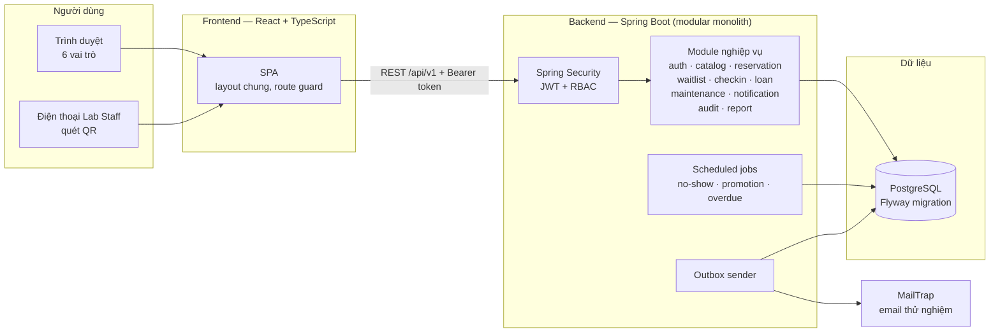

**Vì sao modular monolith, không phải microservice?** Một người (hoặc một nhóm năm người) không có lý do vận hành mười dịch vụ. Một khối triển khai duy nhất nghĩa là một transaction bao được cả "tạo reservation + ghi audit + ghi outbox" — thứ mà microservice phải trả giá bằng saga. Ranh giới module vẫn được giữ nghiêm (package-by-feature, module này không đọc thẳng bảng của module kia), nên nếu sau này thật sự cần tách, đường cắt đã có sẵn.

**Giai đoạn 2 (v2)** thêm vào bên cạnh, không đụng vào lõi:

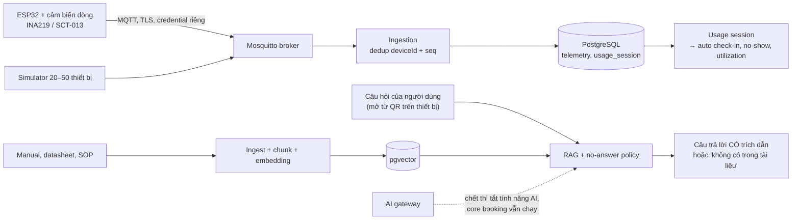

---

## Stack và lý do chọn

| Lớp | Công nghệ | Vì sao |
|---|---|---|
| Backend | **Java 21 + Spring Boot 3** | Transaction khai báo (`@Transactional`), Spring Security, JPA — đúng thứ SWP391/PRJ301 dạy và thị trường tuyển |
| Frontend | **React + TypeScript** (Vite) | Component tái dùng cho form Create/Update/View dùng chung; FER202 |
| Database | **PostgreSQL 16** | Có **exclusion constraint** trên khoảng thời gian — chặn đặt trùng ngay trong DB. MySQL không có thứ này |
| Migration | **Flyway** | Mỗi thay đổi schema là một file `V__*.sql` có thứ tự, chạy lại được trên DB sạch |
| Email | **MailTrap** | Luật SWP391; thấy email thật mà không gửi cho ai |
| Test | JUnit 5, Mockito, **Testcontainers**, Playwright | Testcontainers chạy PostgreSQL THẬT — test concurrency trên H2 là test vô nghĩa |
| Triển khai | Docker Compose, GitHub Actions | Một lệnh dựng cả hệ thống cho demo và cho giảng viên |
| v2 | MQTT (Mosquitto), ESP32, pgvector, AI gateway | Đo mức sử dụng thật; tìm kiếm ngữ nghĩa trong tài liệu |

:::warning[Stack phải được giảng viên duyệt]
Sheet Policies của SWP391 ghi "bắt buộc MySQL". Việc dùng PostgreSQL + Spring Boot + React phải được hỏi và duyệt ngay **tuần 1** (thẻ *Q&A 1* trên CT Work). Nếu bị bắt dùng MySQL: thay exclusion constraint bằng `UNIQUE (resource_id, slot_id)` + transaction, và ghi quyết định vào ADR.
:::

---

## Cấu trúc repo

Chia **theo nghiệp vụ** (package-by-feature), không chia theo tầng. Khi cần sửa "huỷ reservation", mọi thứ liên quan nằm trong một thư mục — không phải lục ở `controllers/`, `services/`, `repositories/` ba nơi khác nhau.

```text
labflow/
├── backend/                          # Spring Boot
│   ├── pom.xml
│   └── src/
│       ├── main/java/vn/labflow/
│       │   ├── LabflowApplication.java
│       │   ├── common/               # ApiResponse, lỗi chung, phân trang, audit helper
│       │   ├── security/             # SecurityConfig, JwtFilter, CurrentUser
│       │   ├── auth/                 # register, login, refresh, forgot/reset password
│       │   ├── user/                 # user, role, profile
│       │   ├── catalog/              # building, lab, equipment, operating calendar
│       │   ├── availability/         # truy vấn slot trống
│       │   ├── reservation/          # tạo / huỷ / đổi / duyệt — TRÁI TIM hệ thống
│       │   │   ├── ReservationController.java
│       │   │   ├── ReservationService.java
│       │   │   ├── ReservationRepository.java
│       │   │   ├── Reservation.java          # entity + state machine
│       │   │   └── dto/
│       │   ├── waitlist/             # join / leave / promotion job
│       │   ├── checkin/              # QR token, check-in, no-show job
│       │   ├── loan/                 # checkout / return / overdue job
│       │   ├── maintenance/          # ticket, board, khoá thiết bị
│       │   ├── notification/         # outbox + sender
│       │   ├── audit/                # append-only audit log
│       │   └── report/               # dashboard, utilization, export
│       ├── main/resources/
│       │   ├── application.yml
│       │   └── db/migration/         # V1__init.sql, V2__…  (Flyway)
│       └── test/java/vn/labflow/     # unit + integration (Testcontainers)
├── frontend/                         # React + Vite + TypeScript
│   └── src/
│       ├── app/                      # router, layout chung, route guard
│       ├── features/                 # auth/ catalog/ reservation/ loan/ …
│       ├── components/               # DataTable (search/filter/sort/paging), Form…
│       └── lib/api.ts                # một chỗ gọi API
├── database/
│   └── seed/                         # dữ liệu giả cho demo (không dữ liệu thật)
├── docs/                             # SRS, SDS, ADR, test plan, báo cáo tuần
├── docker-compose.yml                # postgres + backend + frontend (+ mosquitto ở v2)
└── .github/workflows/ci.yml          # build + test mỗi PR
```

**Luật một chiều giữa các module:** `reservation` được gọi `catalog` (hỏi thiết bị có tồn tại / đang bảo trì không), nhưng `catalog` không bao giờ gọi `reservation`. Vẽ mũi tên phụ thuộc ra giấy — thấy vòng tròn là thiết kế sai.

---

## Dựng môi trường từ số 0

Làm lần lượt; mỗi bước có một lệnh để **tự kiểm** trước khi sang bước sau.

**1. Công cụ**

| Công cụ | Phiên bản | Kiểm bằng |
|---|---|---|
| JDK | 21 (Temurin) | `java -version` |
| Maven | 3.9+ (hoặc dùng `./mvnw`) | `./mvnw -v` |
| Node.js | 22 LTS | `node -v` |
| Docker Desktop | mới nhất | `docker compose version` |
| IDE | IntelliJ IDEA Community + VS Code | — |
| Git | 2.4x | `git --version` |

**2. Database bằng Docker Compose**

```yaml
# docker-compose.yml (bản đầu — chỉ Postgres)
services:
  postgres:
    image: postgres:16
    environment:
      POSTGRES_DB: labflow
      POSTGRES_USER: labflow
      POSTGRES_PASSWORD: ${DB_PASSWORD}   # đặt trong .env, KHÔNG commit
    ports: ["5432:5432"]
    volumes: [pgdata:/var/lib/postgresql/data]
volumes:
  pgdata:
```

Tự kiểm: `docker compose up -d postgres` rồi `docker compose exec postgres psql -U labflow -c "select 1"`.

**3. Backend**

- Tạo project ở start.spring.io: Web, Validation, Data JPA, Security, PostgreSQL Driver, Flyway, Mail, Lombok (tuỳ chọn)
- `application.yml` đọc cấu hình từ biến môi trường (`${DB_URL}`, `${JWT_SECRET}`, `${MAILTRAP_USER}`…) — mật khẩu không bao giờ nằm trong file commit
- `spring.jpa.hibernate.ddl-auto=validate` — **Flyway** tạo bảng, Hibernate chỉ kiểm cho khớp. Để `update` là để Hibernate tự sửa schema sau lưng bạn

Tự kiểm: `./mvnw spring-boot:run`, mở `GET /actuator/health` thấy `UP`, và bảng `flyway_schema_history` có dòng `V1`.

**4. Frontend**

```bash
npm create vite@latest frontend -- --template react-ts
cd frontend && npm install && npm run dev
```

Tự kiểm: trang mở ở `localhost:5173`, gọi được `GET /api/v1/health` qua proxy của Vite (không bật CORS `*` để "cho chạy được").

**5. CI** — GitHub Actions chạy `./mvnw verify` (có Testcontainers) và `npm run build` cho mỗi PR. Main được bảo vệ: chỉ merge khi CI xanh.

---

## Mô hình dữ liệu (ERD)

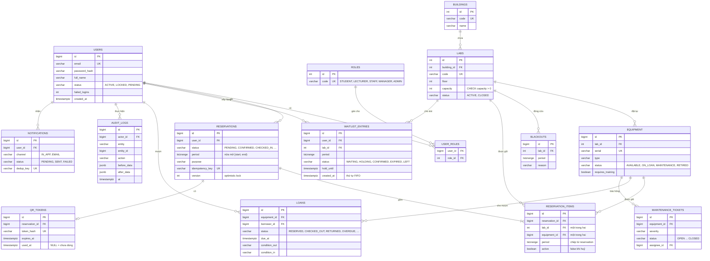

Ba quyết định trong sơ đồ này sẽ bị hỏi khi bảo vệ:

1. **Thời gian lưu bằng `tstzrange` nửa mở `[start, end)`** — ca 9:00–11:00 và 11:00–13:00 chạm nhau ở 11:00 nhưng *không* trùng. Lưu `timestamptz` (UTC), hiển thị theo giờ Việt Nam.
2. **`reservation_items` chép lại `period`** — để exclusion constraint nằm trên *một* bảng. Ràng buộc trong Postgres không nhìn được sang bảng khác.
3. **Không xoá cứng thiết bị đã có lịch sử** — chuyển `RETIRED`. Xoá thì lịch sử mượn và audit mất chỗ tham chiếu.

---

## Trái tim hệ thống: chống đặt trùng

Đây là câu hỏi số một của hội đồng, và là lý do chọn PostgreSQL.

**Cách sai — kiểm rồi mới ghi:**

```java
// SAI: giữa dòng 1 và dòng 2, request khác có thể chen vào.
if (repo.existsOverlap(labId, start, end)) throw new ConflictException();   // 1
repo.save(new Reservation(labId, start, end));                              // 2
```

Hai request đến cùng lúc: cả hai chạy dòng 1, cả hai thấy "còn trống", cả hai ghi. Test bằng tay bấm từng lần một sẽ không bao giờ thấy lỗi này — chỉ test đồng thời mới thấy.

**Cách đúng — để database từ chối:**

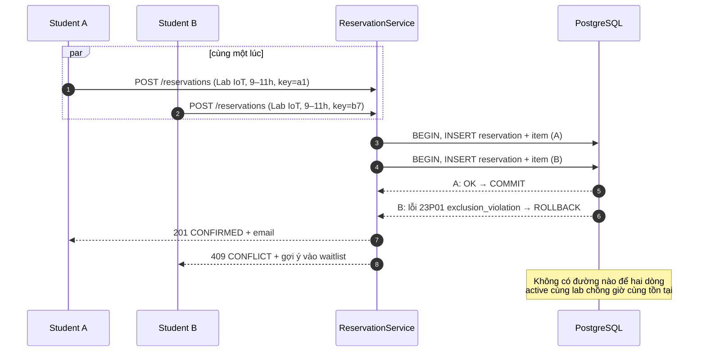

Và nếu B bấm "Đặt" hai lần vì mạng chậm? `idempotency_key` là `UNIQUE`: lần hai không tạo reservation mới mà trả lại kết quả của lần một.

**Kiểm chứng:** test tích hợp bắn 2, 10 rồi 50 request đồng thời vào cùng một slot trên PostgreSQL thật (Testcontainers) và đếm: đúng **một** `CONFIRMED`, còn lại `409`. Đây là con số đem ra trước hội đồng.

---

## Vòng đời các đối tượng (state machine)

Mọi chuyển trạng thái đều kiểm ở backend. Chuyển sai (ví dụ `COMPLETED → CANCELLED`) trả `409`, không phải chỉ ẩn nút trên giao diện.

**Reservation**

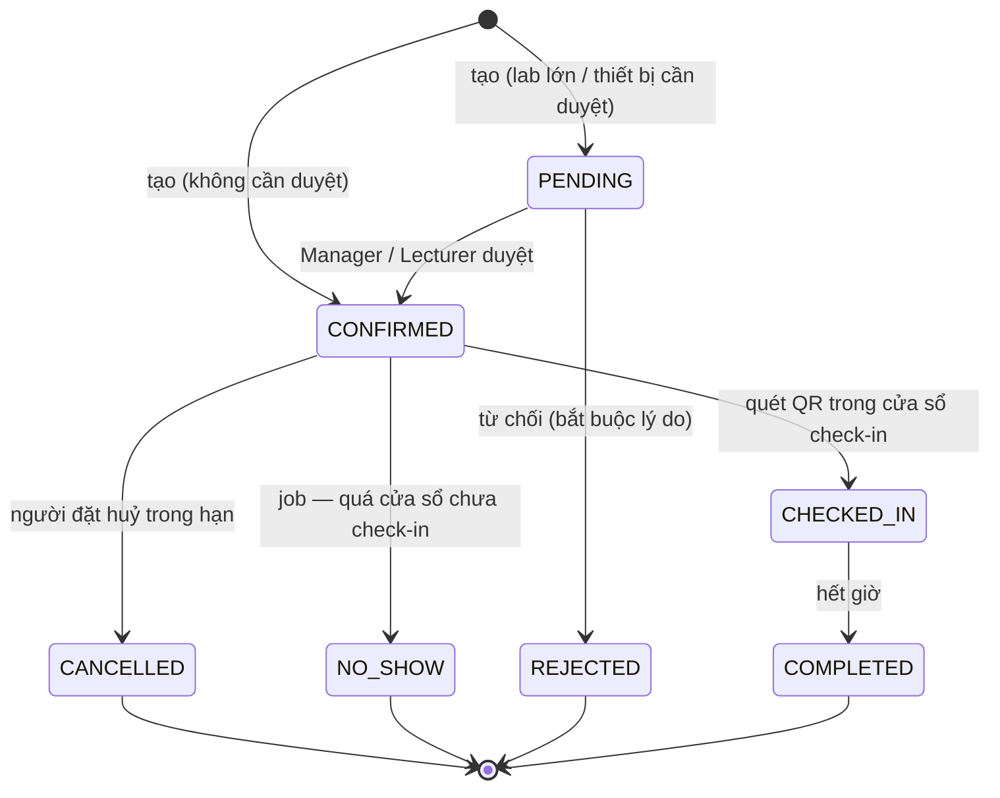

Khi vào `CANCELLED` hoặc `NO_SHOW`: slot được giải phóng (`reservation_items.active = false`) **trong cùng transaction**, rồi job promotion đôn người đầu waitlist.

**Waitlist entry**

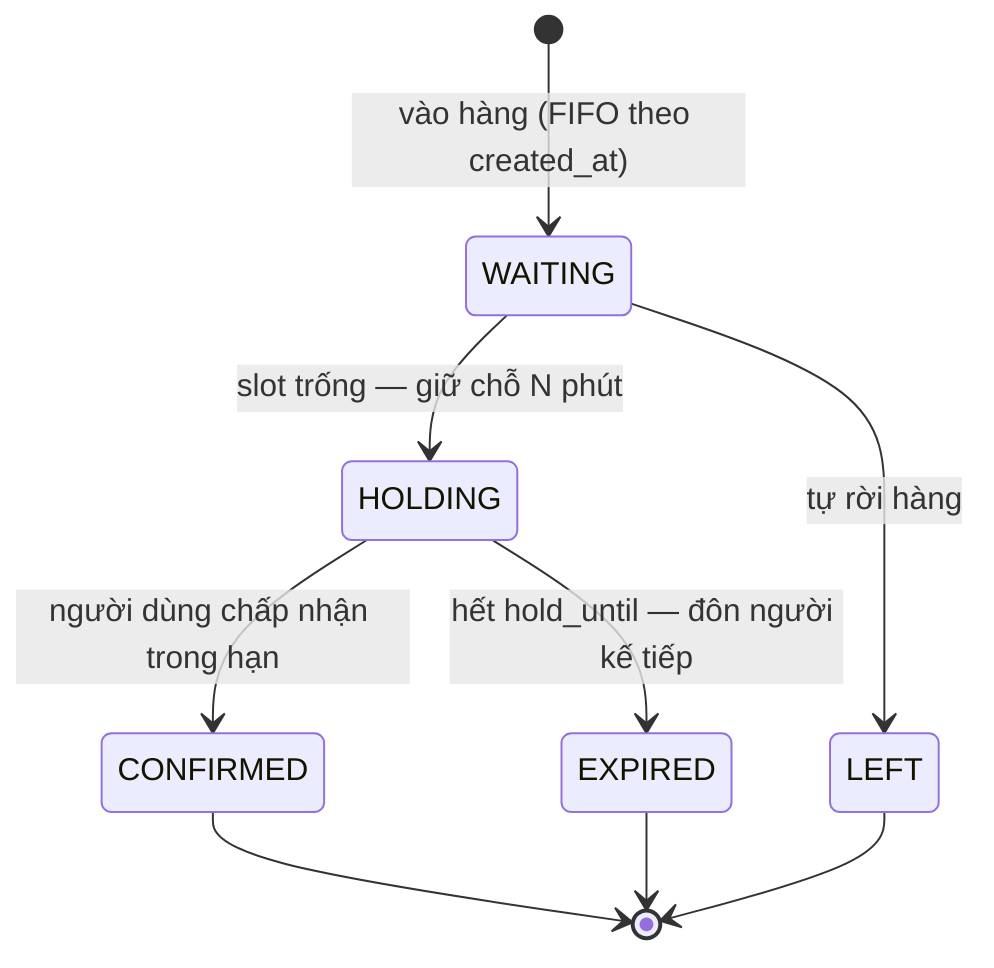

Job promotion chạy hai lần không được đôn hai người: cập nhật có điều kiện `UPDATE … SET status='HOLDING' WHERE id=? AND status='WAITING'` — lần hai cập nhật 0 dòng.

**Loan (mượn thiết bị)**

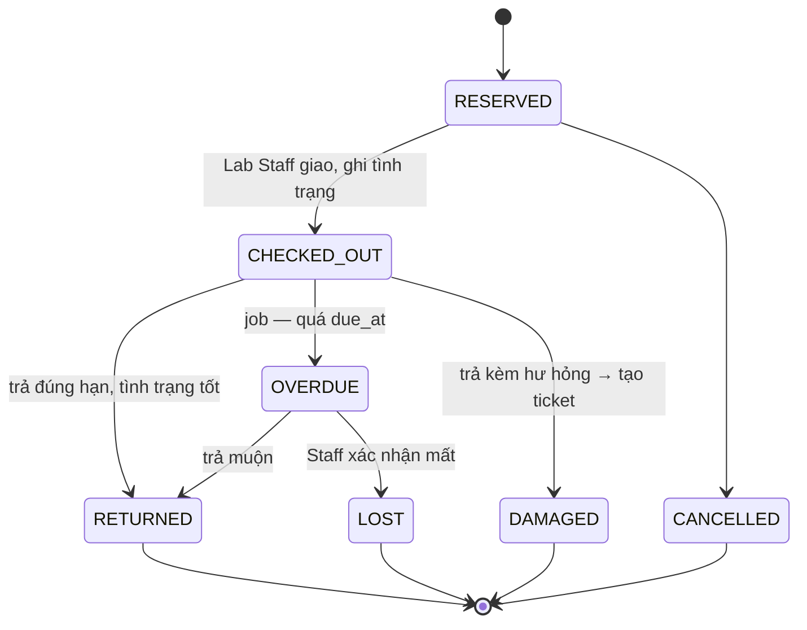

**Maintenance ticket**

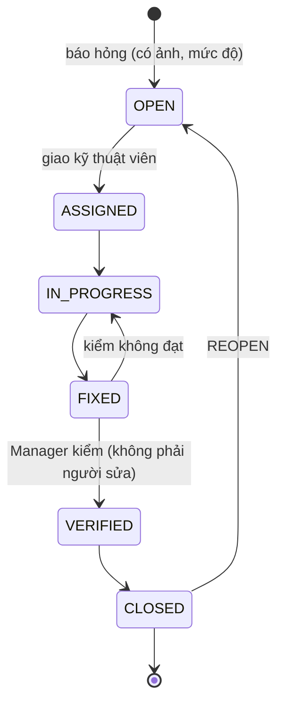

Từ `OPEN` tới trước `CLOSED`, thiết bị ở trạng thái `MAINTENANCE`: không xuất hiện trong kết quả tìm kiếm, và API tạo reservation/loan **kiểm lại trong transaction** — không tin dữ liệu màn hình đã tải từ năm phút trước.

**QR token:** sinh khi reservation `CONFIRMED` → hợp lệ trong cửa sổ check-in → `used_at` được ghi đúng một lần (`UPDATE … WHERE used_at IS NULL`). Quét lại: "QR đã sử dụng" + audit. Token ký HMAC nên sửa một ký tự là hỏng chữ ký.

---

## Luồng hoạt động chính

**Một request đi qua các tầng** (câu "đi một request qua các tầng" hội đồng rất hay hỏi):

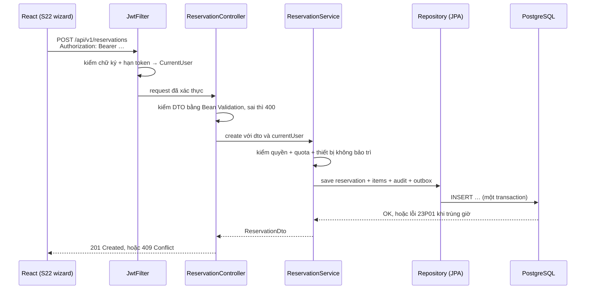

**Luồng nghiệp vụ lớn nhất — vòng đời một lượt đặt lab:**

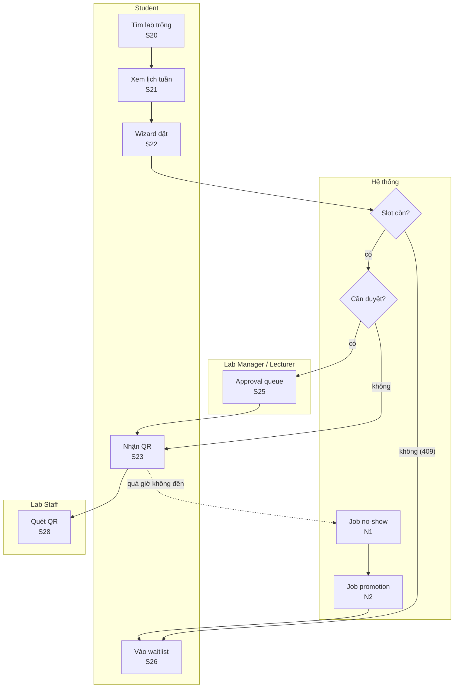

---

## API chính (hợp đồng v1)

Mọi response có cùng một vỏ: `{ "success": true, "data": … }` hoặc `{ "success": false, "error": { "code", "message", "fields" } }`. Danh sách luôn có `page`, `size`, `sort`, `q` — server-side.

| Method | Đường dẫn | Ai | Ghi chú |
|---|---|---|---|
| POST | `/api/v1/auth/register` | Guest | gửi email xác minh qua MailTrap |
| POST | `/api/v1/auth/login` · `/refresh` · `/logout` | All | khoá 15′ sau 5 lần sai |
| POST | `/api/v1/auth/forgot-password` · `/reset-password` | All | token một lần, lưu băm, hết hạn 30′ |
| GET | `/api/v1/labs?q=&buildingId=&status=&page=` | Manager | S13 |
| GET | `/api/v1/availability?from=&to=&capacity=&type=` | Student | S20 — nửa mở, trừ blackout + bảo trì |
| POST | `/api/v1/reservations` | Student, Lecturer | header `Idempotency-Key` bắt buộc |
| POST | `/api/v1/reservations/{id}/cancel` | chủ reservation | 403/404 nếu không phải chủ |
| POST | `/api/v1/reservations/{id}/approve` · `/reject` | Manager, Lecturer | reject bắt buộc lý do |
| POST | `/api/v1/waitlist` · `/api/v1/waitlist/{id}/accept` | Student | |
| POST | `/api/v1/checkin` | Lab Staff | body `{ token }` |
| POST | `/api/v1/loans` · `/api/v1/loans/{id}/return` | Lab Staff | |
| PATCH | `/api/v1/maintenance/{id}/status` | Staff, Manager | transition sai → 409 |
| GET | `/api/v1/reports/utilization?from=&to=&groupBy=` | Manager | có export CSV |
| GET | `/api/v1/audit?entity=&action=&actorId=` | Admin | chỉ đọc |

---

## Bảo mật

| Mối nguy | Cách chặn | Ở đâu |
|---|---|---|
| Lộ mật khẩu | BCrypt, không bao giờ log mật khẩu | `auth` |
| Dò email qua "quên mật khẩu" | Luôn trả thông báo chung "nếu email tồn tại…" | `auth` |
| Đoán ID xem reservation người khác | Kiểm quyền **sở hữu** trong service, trả 404/403 | mọi service |
| Gọi API admin bằng tài khoản Student | Route rule + `@PreAuthorize` ở backend — ẩn menu chỉ là UX | `security` |
| Chụp QR của người khác | Token ký HMAC, gắn reservation + user, có hạn, dùng một lần | `checkin` |
| SQL injection / XSS | JPA binding tham số; React escape mặc định; không dùng `dangerouslySetInnerHTML` | toàn bộ |
| Secret trong Git | `.env` + biến môi trường, `.gitignore`, CI không in secret | repo |

---

## Kiểm thử

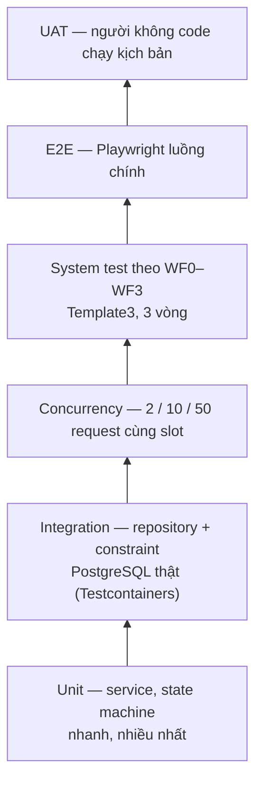

Mỗi màn hình có **1 happy case + ít nhất 3 unhappy case**: để trống / chỉ dấu cách · quá dài hoặc sai định dạng · trùng hoặc xung đột · sai quyền. Lỗi nhóm tự tìm gắn nhãn **Defect**; lỗi giảng viên tìm sau khi nộp gắn **Leakage** và phải sửa đầu tiên ở iteration sau.

---

## 46 màn hình và ai làm màn nào

Làm solo nhưng chia **5 vai** theo miền nghiệp vụ (vertical slice) — vì SWP391 chấm LOC theo màn hình của *từng người*. Khi có nhóm thật, mỗi bạn nhận trọn một vai: tự viết spec, design, code full-stack, test cho màn của mình.

| Vai | Miền sở hữu |
|---|---|
| **C1 Leader** | Đăng nhập, layout chung, tạo booking, audit writer, no-show job · kiến trúc, CI, merge, tag |
| **C2** | Lab/building/lịch mở cửa, availability, approval, email outbox, dashboard + báo cáo |
| **C3** | Register/quên mật khẩu, huỷ/đổi lịch, waitlist, QR check-in, promotion job |
| **C4** | Thiết bị, mượn/trả, quá hạn, báo cáo no-show/overdue |
| **C5** | User/role/settings, RBAC, bảo trì, audit viewer, admin dashboard |

| ID | Màn hình / chức năng | Actor | WF | Độ phức tạp | Vai | Iteration |
|---|---|---|---|---|---|---|
| `S01` | Register — đăng ký tài khoản, xác minh email qua MailTrap | Guest | WF0 | M | C3 | iter1 |
| `S03` | Login — khoá sau 5 lần sai, ghi audit | All | WF0 | M | C1 | iter1 |
| `S04` | Forgot / Reset password — token một lần, có hạn | All | WF0 | M | C3 | iter1 |
| `S05` | Change password + Logout | All | WF0 | S | C1 | iter1 |
| `S06` | My profile — xem / cập nhật, ảnh đại diện | All | WF0 | M | C1 | iter1 |
| `S07` | Common layout — header, menu theo role, route guard, 403/404 | All | WF0 | S | C1 | iter1 |
| `S08` | Home / landing — giới thiệu lab, tìm nhanh | Guest | WF0 | S | C3 | iter1 |
| `S10` | User list — search, lọc role/status, sort, paging, lock/unlock | Admin | WF1 | M | C5 | iter1 |
| `S11` | User detail — create / update, gán role | Admin | WF1 | M | C5 | iter1 |
| `S12` | Role assignment & permission view | Admin | WF1 | M | C5 | iter2 |
| `S13` | Building & Lab list | Lab Manager | WF1 | M | C2 | iter1 |
| `S14` | Lab detail — create / update (mã, tên, toà, tầng, sức chứa, trạng thái, quản lý, ảnh) | Lab Manager | WF1 | M | C2 | iter1 |
| `S16` | Equipment list — lọc loại/lab/trạng thái, đổi trạng thái hàng loạt | Lab Manager, Lab Staff | WF1 | M | C4 | iter1 |
| `S17` | Equipment detail — serial, loại, lab, số lượng, trạng thái, cờ training, ảnh, nhãn QR | Lab Manager | WF1 | C | C4 | iter1 |
| `S18` | Operating calendar & blackout — giờ mở cửa, ngày nghỉ, cửa sổ bảo trì | Lab Manager | WF1 | M | C2 | iter1 |
| `S19` | Settings / master data — resource type, booking policy | Admin | WF1 | M | C5 | iter1 |
| `S20` | Catalog search & availability — ngày / giờ / sức chứa / loại | Student, Lecturer | WF2 | M | C2 | iter2 |
| `S21` | Lab / equipment detail + lịch tuần còn trống | Student, Lecturer | WF2 | M | C2 | iter2 |
| `S22` | Create reservation wizard — lab/slot/thiết bị, mục đích, người tham gia, review, submit | Student, Lecturer | WF2 | C | C1 | iter2 |
| `S23` | My reservations — search/filter/sort/paging, huỷ nhanh, xem QR | Student, Lecturer | WF2 | M | C1 | iter2 |
| `S24` | Reservation detail / cancel / reschedule — timeline trạng thái | Student, Lecturer | WF2 | C | C3 | iter2 |
| `S25` | Approval queue — approve / reject + lý do | Lab Manager, Lecturer | WF2 | M | C2 | iter2 |
| `S26` | My waitlist + accept / decline promotion (countdown hold) | Student | WF2 | M | C3 | iter2 |
| `S27` | Waitlist management — hàng đợi theo slot, đôn tay / loại | Lab Manager | WF2 | M | C3 | iter3 |
| `S28` | QR check-in scanner — camera / nhập mã; token ký, single-use, TTL | Lab Staff | WF2 | M | C3 | iter2 |
| `S29` | Today's sessions board — check-in tay, đánh dấu no-show | Lab Staff | WF2 | M | C3 | iter3 |
| `S30` | Loan desk — checkout (tìm user/reservation, chọn unit, tình trạng, hạn trả) | Lab Staff | WF2 | C | C4 | iter2 |
| `S31` | Return equipment — tình trạng, ghi chú hỏng, ảnh | Lab Staff | WF2 | M | C4 | iter2 |
| `S32` | My loans — hạn trả, badge quá hạn | Student | WF2 | S | C4 | iter2 |
| `S33` | Overdue queue — nhắc, đánh dấu lost / damaged | Lab Staff | WF2 | M | C4 | iter3 |
| `S34` | Report equipment issue — mức độ, mô tả, ảnh | Student, Lab Staff | WF2 | M | C5 | iter2 |
| `S35` | Maintenance board — Kanban OPEN → … → CLOSED, lọc, kéo-thả | Lab Staff, Lab Manager | WF2 | C | C5 | iter2 |
| `S36` | Ticket detail — assign, comment, verify, reopen; khoá thiết bị | Lab Staff, Lab Manager | WF2 | C | C5 | iter3 |
| `S37` | Notification center — đọc/chưa đọc, lọc, tuỳ chọn | All | WF3 | M | C1 | iter3 |
| `S40` | Student / Lecturer dashboard — sắp tới, đang mượn, thông báo | Student, Lecturer | WF3 | M | C1 | iter3 |
| `S41` | Lab Manager dashboard — utilization, occupancy hôm nay, ticket mở, biểu đồ | Lab Manager | WF3 | C | C2 | iter3 |
| `S42` | Utilization report — lọc lab/loại/khoảng ngày, group by, chart + bảng, export CSV/Excel | Lab Manager | WF3 | C | C2 | iter3 |
| `S43` | No-show & overdue report — theo user/lab, export | Lab Manager | WF3 | M | C4 | iter3 |
| `S45` | Audit log viewer — lọc actor/entity/action/time, before/after, export | Admin | WF3 | M | C5 | iter3 |
| `S46` | Admin dashboard — user, reservation/ngày, lỗi | Admin | WF3 | M | C5 | iter3 |
| `S47` | Weekly timetable per lab — in / xuất PDF | Lab Manager, Lecturer | WF3 | M | C2 | iter3 |
| `N1` | No-show job — idempotent, giải phóng slot, kích hoạt promotion | System | WF2 | M | C1 | iter3 |
| `N2` | Waitlist promotion & hold-expiry job | System | WF2 | M | C3 | iter3 |
| `N3` | Overdue job — đánh dấu + nhắc | System | WF2 | S | C4 | iter3 |
| `N4` | Email outbox sender — MailTrap, không gửi trùng khi retry | System | WF3 | M | C2 | iter2 |
| `N6` | Audit event writer — append-only | System | WF2 | S | C1 | iter2 |

Độ phức tạp: **S** = 60 LOC · **M** = 120 · **C** = 240. Mọi màn phải tới **Quality L2** (có unhappy case) trước khi làm màn mới — dừng ở L1 thì chỉ được 50% số LOC.

---

## Lộ trình 20 tuần

Mỗi tuần là một sprint: 6 ngày làm + ngày 7 review/nghỉ. Mỗi ngày là một thẻ trên CT Work có **Cần học trước → Các bước gợi ý → Tự kiểm tra → Bẫy thường gặp → Hỏi mentor khi**.

| Tuần | Ngày | Epic | Kết quả cuối tuần |
|---|---|---|---|
| 1 | 05/10–11/10 | Nền tảng & spike concurrency | Chạy được skeleton backend, PostgreSQL và một API có test; hiểu dependency injection, cấu hình và vòng đời request. |
| 2 | 12/10–18/10 | Nền tảng & spike concurrency | Có domain model, SRS v0.1, ERD v0.1 và spike chứng minh transaction chống double-booking. |
| 3 | 19/10–25/10 | Identity, RBAC & campus hierarchy | Đăng nhập được, backend kiểm tra quyền, quản lý campus/building/lab trong phạm vi một cơ sở. |
| 4 | 26/10–01/11 | Resource catalog & availability | Quản lý phòng, thiết bị, lịch hoạt động, số lượng và truy vấn availability chính xác. |
| 5 | 02/11–08/11 | Reservation engine | Đặt, hủy và đổi lịch an toàn; database là nguồn sự thật cho conflict detection. |
| 6 | 09/11–15/11 | Waitlist & promotion | Waitlist tự động, có thứ tự, timeout xác nhận và không tạo xung đột mới. |
| 7 | 16/11–22/11 | QR check-in & no-show | QR có hạn, dùng một lần, check-in đúng cửa sổ thời gian và tự xử lý no-show. |
| 8 | 23/11–29/11 | Loan/return & maintenance | Quản lý vòng đời mượn thiết bị và ticket bảo trì bằng state machine có kiểm soát. |
| 9 | 30/11–06/12 | Notification, audit & analytics | Người dùng nhận thông báo đúng; admin có báo cáo sử dụng và truy vết đầy đủ. |
| 10 | 07/12–13/12 | Hardening & SWP391 release | LabFlow Core v1 ổn định, triển khai staging, có hồ sơ kỹ thuật và kịch bản bảo vệ. |
| 11 | 14/12–20/12 | IoT usage metering | Thiết bị đăng ký, xác thực, gửi heartbeat/telemetry qua MQTT và ánh xạ đúng resource trong LabFlow. |
| 12 | 21/12–27/12 | IoT usage metering | Cảm biến dòng điện trên ESP32 tạo ra phiên sử dụng thật; hệ thống tự check-in, phát hiện no-show và tính utilization; simulator 20–50 thiết bị tái lập được. |
| 13 | 28/12–03/01 | Knowledge base & RAG | Kho tri thức phòng lab (manual thiết bị, datasheet, SOP) được ingest, chunk, gắn metadata, versioning, embedding bằng pgvector và lọc theo quyền. |
| 14 | 04/01–10/01 | Knowledge base & RAG | Trợ lý "Ask the lab" trả lời dựa trên tài liệu có trích dẫn, biết nói "không có trong tài liệu", và quét QR trên thiết bị mở trợ lý cho đúng thiết bị đó. |
| 15 | 11/01–17/01 | Vision linh kiện | Chụp ảnh linh kiện (IC, sensor, module, điện trở) → gợi ý tên kèm độ tin cậy; máy tính điện tử tất định và tra pinout từ datasheet chạy được; có eval set ảnh có nhãn. |
| 16 | 18/01–24/01 | Safety training & competency gating | Người dùng học SOP micro-lesson, làm quiz đạt mới được đặt thiết bị nguy hiểm; chứng nhận có hạn, gia hạn và audit đầy đủ; câu hỏi AI soạn phải qua người duyệt. |
| 17 | 25/01–31/01 | IoT usage metering | Assistant tra được trạng thái thiết bị, usage session, availability và ticket bằng tool chỉ đọc theo quyền; có rule baseline và một model đơn giản phát hiện bất thường dòng điện, gợi ý ticket bảo trì có người xác nhận. |
| 18 | 01/02–07/02 | AI evaluation, reliability & SEP490 release | Có eval harness tái lập đo groundedness, citation, tool, vision accuracy và safety gating; red-team prompt injection/permission leakage; ngân sách latency/cost và fallback để core booking vẫn chạy khi AI chết. |
| 19 | 08/02–14/02 | AI evaluation, reliability & SEP490 release | Hệ thống có bằng chứng chịu tải, quan sát được và phục hồi được trong các failure scenario chính. |
| 20 | 15/02–21/02 | AI evaluation, reliability & SEP490 release | v2 có báo cáo nghiên cứu, hồ sơ kiến trúc, demo và kế hoạch xây lại với nhóm thật. |

**Các gate:**

| Gate | Ngày | Loại | Phải đạt |
|---|---|---|---|
| G0 Foundation | 17/10 | nội bộ | Spike: hai request cùng slot → đúng một CONFIRMED; CI xanh |
| **SWP-M1** (15%) | 25/10 | chấm điểm | SRS §1 + SDS §1–2, wireframe được duyệt, WF0 + layout chung chạy, tag `iter1` |
| G1 Booking core | 07/11 | nội bộ | Concurrency suite 2/10/50 xanh |
| **SWP-M2** (20%) | 29/11 | chấm điểm | WF1 CRUD + WF2 success/exception tích hợp, tag `iter2` |
| **SWP-M3** (25%) | 12/12 | chấm điểm | WF3, deploy, UAT, ST26 đủ 3 vòng, Final Release Document, tag `iter3` |
| **SWP-Final** (40%) | ~19/12 | hội đồng | Slide Template7, demo 3 luồng có failure path, Q&A từng người |
| SEP-M4 | 26/12 | v2 | IoT metering end-to-end, số liệu tải công bố |
| SEP-M5 | 23/01 | v2 | RAG có trích dẫn + vision + safety gating |
| SEP-M6 | 20/02 | v2 | Evidence pack, demo lặp lại được, tag `v2.0-sep490-reference` |

---

## Giai đoạn 2 — hướng SEP490

Hai trụ nghiên cứu, mỗi trụ đều **tắt được** mà lõi đặt lab vẫn chạy:

1. **Đo mức sử dụng bằng IoT.** ESP32 + cảm biến dòng (INA219 cho DC, SCT-013 kẹp cho AC) gửi telemetry qua MQTT. Ngưỡng + hysteresis + thời lượng tối thiểu → *phiên sử dụng thật* → tự check-in, phát hiện no-show dựa trên việc máy có bật hay không, và utilization không còn là ước đoán. Simulator 20–50 thiết bị để test tái lập; mất mạng rồi kết nối lại không được sinh dữ liệu trùng (dedup theo `deviceId + seq`).
2. **Trợ lý "Ask the lab".** Manual, datasheet, SOP được chia đoạn và nhúng vector (pgvector). Quét QR dán trên thiết bị → trợ lý mở đúng ngữ cảnh thiết bị đó. Câu trả lời **bắt buộc có trích dẫn**; không có trong tài liệu thì nói "không có trong tài liệu". Thêm nhận diện linh kiện từ ảnh (kèm độ tin cậy), máy tính điện tử **tất định** có unit test, và cổng an toàn: chưa qua quiz SOP thì không đặt được thiết bị nguy hiểm.

Mọi con số của v2 (độ chính xác, recall@k, tỉ lệ trả lời đúng "không biết") đo trên eval set có version — không tuyên bố điều không đo được.

---

## Những cái bẫy đã được ghi lại

| Bẫy | Hậu quả | Cách tránh |
|---|---|---|
| Kiểm "còn trống" rồi mới insert | Đặt trùng khi hai request đồng thời | Exclusion constraint + bắt lỗi `23P01` → 409 |
| Test concurrency bằng H2 / bằng tay | Test xanh, production vẫn đặt trùng | Testcontainers + PostgreSQL thật, bắn song song |
| Khoảng thời gian đóng `[start, end]` | Ca 9–11 và 11–13 bị coi là trùng | Luôn nửa mở `[start, end)` |
| Lưu giờ địa phương không múi giờ | Lệch 7 tiếng khi server chạy UTC | `timestamptz` + hiển thị `Asia/Ho_Chi_Minh` |
| `ddl-auto=update` | Schema bị sửa ngầm, migration mất tác dụng | `validate` + Flyway |
| Chỉ ẩn nút ở frontend | Gọi API thẳng vẫn làm được | Kiểm quyền ở backend, có test truy cập trái phép |
| Job chạy lại xử lý trùng | Đôn hai người vào một slot, gửi email hai lần | Cập nhật có điều kiện theo trạng thái; `dedup_key` UNIQUE |
| Xoá cứng dữ liệu có lịch sử | Audit và lịch sử mượn mất tham chiếu | Xoá mềm / `RETIRED` |
| Bảng không phân trang | Chậm, và bị trừ điểm theo Policies | Search + filter + sort + paging server-side (`Pageable`) |
| Code mà wireframe chưa được duyệt | Làm lại khi giảng viên đổi ý | Wireframe được xác nhận trước, link vào từng Req |
| Dùng AI mà không khai báo | Vi phạm CLO5, không giải thích được khi demo | Ghi AI Usage Report mỗi tuần; tự viết code |

---

## Khi nào coi như xong v1

- [ ] 50 request đồng thời vào một slot → đúng 1 `CONFIRMED`, đo bằng test trong CI
- [ ] Mọi chuyển trạng thái sai của 4 state machine trả 409, có test
- [ ] Không role nào gọi được API ngoài quyền (bộ test truy cập trái phép xanh)
- [ ] Mọi bảng có search/filter/sort/paging; mọi input validate ở cả hai phía
- [ ] `docker compose up` trên máy sạch + seed → demo được trọn 3 luồng
- [ ] Backup rồi restore DB thử thành công
- [ ] 46 Req ở Quality ≥ L2; SRS/SDS khớp code; tag `iter3` có DB script

---

## Tra cứu nhanh — không hiểu thì xem đâu

| Đang bí ở… | Xem mục |
|---|---|
| Module này được gọi module kia không | Cấu trúc repo → luật một chiều |
| Vì sao request bị 409 | Trái tim hệ thống: chống đặt trùng |
| Trạng thái này chuyển sang trạng thái kia được không | Vòng đời các đối tượng |
| Bảng nào nối với bảng nào | Mô hình dữ liệu (ERD) |
| Màn này của vai nào, iteration nào | 46 màn hình |
| Tuần này phải xong gì | Lộ trình 20 tuần + dự án `LF` trên CT Work |
| Hội đồng sẽ hỏi gì | Epic "Chuẩn bị bảo vệ hội đồng" trên CT Work (36 câu có đáp án mẫu) |
