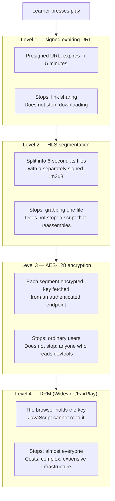
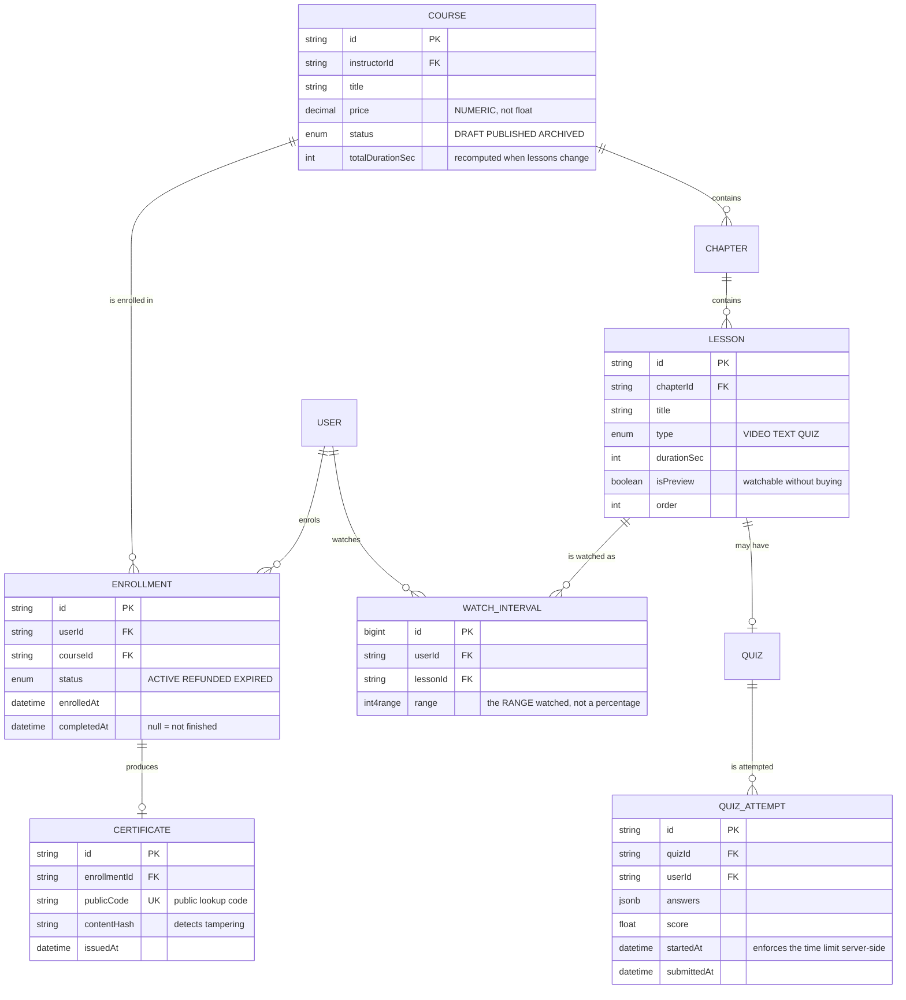

# Learning Management System (LMS)

An online course platform looks like a blog with a paywall: publish lessons, sell access, let buyers watch. But three seemingly small requirements change the architecture completely:

1. **Video must not be pirated.** People who paid can watch; people who copied a link cannot.
2. **Progress must be accurate.** A learner watches 70% of a lecture, closes the laptop, reopens on a phone — and must resume exactly there.
3. **Certificates.** Which means the system has to prove someone *actually* studied, not merely clicked "complete".

Each requirement is its own problem, and none of them is solved by adding a column to the database.

---

## What you are going to build

- Courses with chapters, each with lessons (video, text, quiz)
- Paid enrolment, discount codes, 7-day refunds
- Protected video playback with resume-where-you-stopped
- Auto-graded quizzes with time limits and retry limits
- Auto-generated certificates, verifiable through a public code
- Per-lesson Q&A with instructor notifications
- Revenue and completion-rate dashboards

---

## Video protection: four levels, pick by seriousness



Which level you pick is a business decision, not a technical one. For a course priced in the tens of dollars, **level 2 is enough**: it stops casual link sharing — the largest source of leakage — without paying for a DRM stack.

```ts
// Issue a signed playlist, only when the user genuinely has access.
router.get('/lessons/:id/manifest.m3u8', authenticate, async (req, res) => {
  const lesson = await prisma.lesson.findUnique({
    where: { id: req.params.id },
    select: { id: true, chapter: { select: { courseId: true } }, isPreview: true },
  });
  if (!lesson) throw new AppError('Lesson not found', 404);

  // Preview lessons are open to everyone; the rest need an enrolment that
  // is still VALID. Check the status too: someone who was refunded no
  // longer has access.
  if (!lesson.isPreview) {
    const enrolled = await prisma.enrollment.findFirst({
      where: {
        userId: req.user.id,
        courseId: lesson.chapter.courseId,
        status: 'ACTIVE',
      },
      select: { id: true },
    });
    if (!enrolled) throw new AppError('You are not enrolled in this course', 403);
  }

  // Each segment is signed individually with a short expiry. The playlist
  // lives 5 minutes — long enough to start watching; the player requests a
  // fresh one when it needs to.
  const playlist = await buildSignedPlaylist(lesson.id, {
    userId: req.user.id,
    ttlSeconds: 300,
  });

  res.type('application/vnd.apple.mpegurl').send(playlist);
});
```

A detail worth noticing: the signature embeds `userId`. If a link leaks, the access log tells you **which account** leaked it — so you can address the source rather than just patch the hole.

---

## Progress tracking: never trust the number the client sends

The naive approach: the client posts `progress: 100` when the video ends. The problem: anyone can call `fetch('/api/progress', { body: '{"progress":100}' })` and collect a certificate without watching anything.

```ts
// Record watched INTERVALS, not a client-declared percentage.
router.post('/lessons/:id/heartbeat', authenticate, async (req, res) => {
  const { fromSec, toSec } = req.body;

  // Each heartbeat may report at most 30 seconds. An honest client sends
  // one every 15 seconds; a cheating client trying to claim "just watched
  // 3600 seconds" is rejected.
  const delta = toSec - fromSec;
  if (delta <= 0 || delta > 30) {
    throw new AppError('Invalid time range', 400);
  }

  // Storing intervals rather than a percentage means rewatching merges
  // overlapping ranges, and genuine watch time is the total length of the
  // NON-overlapping union.
  await prisma.$executeRaw`
    INSERT INTO watch_intervals (user_id, lesson_id, range)
    VALUES (${req.user.id}, ${req.params.id}, int4range(${fromSec}, ${toSec}))
  `;

  res.json({ ok: true });
});
```

Postgres has an `int4range` type and range-merging operators built in, so "how many seconds were really watched" is one query rather than a loop in application code:

```sql
-- Total watched time, with rewatched sections counted once.
SELECT SUM(upper(r) - lower(r))
FROM (
  SELECT unnest(range_agg(range)) AS r
  FROM watch_intervals
  WHERE user_id = $1 AND lesson_id = $2
) merged;
```

A 600-second lesson counts as complete when the merged union reaches about 540 seconds (90%). Someone who scrubs through does not qualify; someone who genuinely watched does, even if they replayed parts.

---

## The data model



---

## Timed quizzes

The trap: counting time on the client. Users change their system clock, or simply reload the page to restart the timer.

```ts
// Starting an attempt: the server records the timestamp, the client only
// DISPLAYS a countdown.
const attempt = await prisma.quizAttempt.create({
  data: { quizId, userId, startedAt: new Date() },
});

// Submitting: the server decides whether time ran out.
const attempt = await prisma.quizAttempt.findUnique({ where: { id } });
const elapsed = (Date.now() - attempt.startedAt.getTime()) / 1000;

// A 10-second grace margin for network latency — without it, someone who
// submits on the final second fails unfairly because the packet took 300ms.
if (elapsed > quiz.timeLimitSec + 10) {
  throw new AppError('Time is up', 400);
}
```

And correct answers are **never** sent to the client alongside the questions. Plenty of hand-rolled LMS products ship the answers and hide them with CSS — one look at the Network tab reveals everything.

---

## Verifiable certificates

A certificate only has value if a third party can check it. A PNG with the learner's name proves nothing — anyone can edit it in an image editor.

```ts
// Issue a certificate with a public code and a content signature.
const payload = {
  learner: user.fullName,
  course: course.title,
  completedAt: enrollment.completedAt.toISOString(),
  hours: Math.round(course.totalDurationSec / 3600),
};

// HMAC the content with a system secret. Edit the name on the image and
// the hash no longer matches, so the verification page says "this
// certificate has been altered" instead of silently accepting it.
const contentHash = crypto
  .createHmac('sha256', process.env.CERT_SECRET!)
  .update(JSON.stringify(payload))
  .digest('hex');

await prisma.certificate.create({
  data: { enrollmentId, publicCode: nanoid(12), contentHash },
});
```

A public `/verify/:code` page displays exactly what was signed. An employer types the code and sees the original data — that is the entire value of the certificate.

---

## Traps, written down

| Symptom | Actual cause | Fix |
|---|---|---|
| Videos shared widely | Static URLs that never expire | Short-lived presigned URLs embedding userId |
| Certificates issued without study | Trusting client-reported `progress` | Record intervals, cap each heartbeat at 30s |
| Progress jumps around when scrubbing | Storing one percentage number | Store ranges, merge with `range_agg` |
| Quizzes effectively untimed | Timer counted on the client | `startedAt` on the server, checked at submit |
| Answers visible in the Network tab | Answers sent with the questions | Send answers only after submission |
| Refunded users still watching | Only checking "is enrolled" | Also check `status: ACTIVE` |
| Forged certificates undetectable | No content signature | HMAC the content + a public verify page |
| Course page loads slowly | Loading every lesson of every chapter | Load chapters on demand, precompute totals |

---

## When it counts as finished

- [ ] Copy a video URL from the Network tab and open it in a private window 6 minutes later: it fails
- [ ] Call the progress API directly with `toSec - fromSec = 3600`: rejected with 400
- [ ] Scrub straight to the end of a video: progress does **not** reach completion
- [ ] Reload the page mid-quiz: the timer continues from where it was, it does not reset
- [ ] Refund an enrolment: that course's videos stop playing immediately
- [ ] Change one character in the certificate data: the verify page reports it as invalid

---

## Where to go next

1. **Live classes.** Real-time video classrooms with WebRTC — the new problems are bandwidth and mixing several participants.
2. **Personalised recommendations.** "Learners who finished this course usually take that one" — your first collaborative-filtering problem.
3. **Serious streaming.** Multiple resolutions, bitrate adaptation, multi-region CDN — which is exactly [Video Streaming Platform](/projects/video-streaming-platform-netflix-like).
