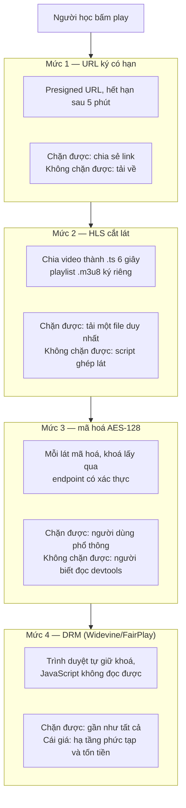
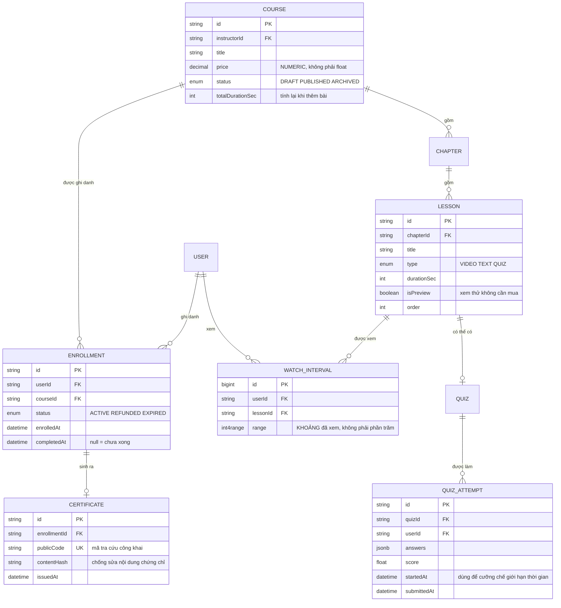

# Learning Management System (LMS)

Một hệ thống học trực tuyến trông giống blog có tính phí: đăng bài, bán khoá học, người mua xem được. Nhưng ba yêu cầu tưởng chừng nhỏ đã đổi hoàn toàn kiến trúc:

1. **Video không được tải lậu.** Người trả tiền xem được; người copy link không xem được.
2. **Tiến độ học phải chính xác.** Người dùng xem 70% bài giảng, đóng máy, mở lại trên điện thoại — phải tiếp đúng chỗ.
3. **Cấp chứng chỉ.** Nghĩa là hệ thống phải chứng minh được người đó *thật sự* đã học, không chỉ bấm "hoàn thành".

Mỗi yêu cầu là một bài toán riêng, và không cái nào giải được bằng cách "thêm một cột vào database".

---

## Bạn sẽ dựng ra cái gì

- Khoá học nhiều chương, mỗi chương nhiều bài (video, văn bản, bài kiểm tra)
- Ghi danh có phí, mã giảm giá, hoàn tiền trong 7 ngày
- Phát video có bảo vệ, tiếp tục đúng chỗ đã dừng
- Bài kiểm tra tự chấm, có giới hạn thời gian và số lần làm lại
- Chứng chỉ sinh tự động, xác minh được bằng mã công khai
- Hỏi đáp theo từng bài, thông báo cho giảng viên
- Bảng điều khiển doanh thu và tỉ lệ hoàn thành

---

## Bảo vệ video: bốn mức, chọn theo mức độ nghiêm túc



Chọn mức nào là quyết định kinh doanh, không phải kỹ thuật. Với khoá học vài trăm nghìn, **mức 2 là đủ**: nó chặn việc chia sẻ link vô tình — nguồn thất thoát lớn nhất — mà không cần trả tiền cho hệ thống DRM.

```ts
// Cấp playlist đã ký, chỉ khi người dùng thực sự có quyền học.
router.get('/lessons/:id/manifest.m3u8', authenticate, async (req, res) => {
  const lesson = await prisma.lesson.findUnique({
    where: { id: req.params.id },
    select: { id: true, chapter: { select: { courseId: true } }, isPreview: true },
  });
  if (!lesson) throw new AppError('Không tìm thấy bài học', 404);

  // Bài xem thử mở cho tất cả; còn lại phải có ghi danh ĐANG HIỆU LỰC.
  // Kiểm cả trạng thái: người đã hoàn tiền không còn quyền xem.
  if (!lesson.isPreview) {
    const enrolled = await prisma.enrollment.findFirst({
      where: {
        userId: req.user.id,
        courseId: lesson.chapter.courseId,
        status: 'ACTIVE',
      },
      select: { id: true },
    });
    if (!enrolled) throw new AppError('Bạn chưa ghi danh khoá học này', 403);
  }

  // Mỗi lát được ký riêng với hạn ngắn. Playlist sống 5 phút,
  // đủ để bắt đầu xem; player tự xin playlist mới khi cần.
  const playlist = await buildSignedPlaylist(lesson.id, {
    userId: req.user.id,
    ttlSeconds: 300,
  });

  res.type('application/vnd.apple.mpegurl').send(playlist);
});
```

Chi tiết đáng chú ý: chữ ký nhúng `userId`. Nếu một link bị chia sẻ, log truy cập cho biết **tài khoản nào** đã rò rỉ nó — và bạn xử lý được nguồn thay vì chỉ vá lỗ.

---

## Tiến độ học: đừng tin con số client gửi lên

Cách ngây thơ: client gửi `progress: 100` khi video kết thúc. Vấn đề: bất kỳ ai cũng gọi `fetch('/api/progress', { body: '{"progress":100}' })` và nhận chứng chỉ mà không xem gì.

```ts
// Ghi nhận theo KHOẢNG đã xem, không phải theo phần trăm client tự khai.
router.post('/lessons/:id/heartbeat', authenticate, async (req, res) => {
  const { fromSec, toSec } = req.body;

  // Mỗi nhịp chỉ được báo tối đa 30 giây. Client trung thực gửi
  // mỗi 15 giây; client gian lận cố báo "vừa xem 3600 giây" bị chặn.
  const delta = toSec - fromSec;
  if (delta <= 0 || delta > 30) {
    throw new AppError('Khoảng thời gian không hợp lệ', 400);
  }

  // Lưu các khoảng đã xem thay vì một con số phần trăm. Người học tua
  // qua tua lại thì các khoảng chồng nhau được gộp, và tổng thời lượng
  // thật sự đã xem là tổng độ dài các khoảng KHÔNG chồng nhau.
  await prisma.$executeRaw`
    INSERT INTO watch_intervals (user_id, lesson_id, range)
    VALUES (${req.user.id}, ${req.params.id}, int4range(${fromSec}, ${toSec}))
  `;

  res.json({ ok: true });
});
```

Postgres có kiểu `int4range` và toán tử gộp khoảng sẵn, nên việc tính "đã xem thật bao nhiêu giây" là một truy vấn chứ không phải một vòng lặp trong ứng dụng:

```sql
-- Tổng thời lượng đã xem, đã trừ phần xem lại.
SELECT SUM(upper(r) - lower(r))
FROM (
  SELECT unnest(range_agg(range)) AS r
  FROM watch_intervals
  WHERE user_id = $1 AND lesson_id = $2
) merged;
```

Một bài học 600 giây được coi là hoàn thành khi tổng khoảng không chồng nhau đạt khoảng 540 giây (90%). Người tua nhanh qua không đạt; người xem thật thì đạt kể cả khi họ tua lại vài đoạn.

---

## Lược đồ dữ liệu



---

## Bài kiểm tra có giới hạn thời gian

Bẫy: đếm giờ ở client. Người dùng chỉnh đồng hồ máy, hoặc đơn giản là tải lại trang để đếm lại từ đầu.

```ts
// Bắt đầu làm bài: server ghi mốc thời gian, client chỉ HIỂN THỊ.
const attempt = await prisma.quizAttempt.create({
  data: { quizId, userId, startedAt: new Date() },
});

// Nộp bài: server tự tính đã hết giờ chưa.
const attempt = await prisma.quizAttempt.findUnique({ where: { id } });
const elapsed = (Date.now() - attempt.startedAt.getTime()) / 1000;

// Cộng thêm 10 giây khoan dung cho độ trễ mạng — không có nó, người
// bấm nộp đúng giây cuối sẽ bị đánh trượt oan vì gói tin đi mất 300ms.
if (elapsed > quiz.timeLimitSec + 10) {
  throw new AppError('Đã hết thời gian làm bài', 400);
}
```

Và đáp án đúng **không bao giờ** được gửi xuống client cùng với đề. Rất nhiều LMS tự viết gửi cả đáp án rồi ẩn bằng CSS — mở tab Network là thấy hết.

---

## Chứng chỉ xác minh được

Một chứng chỉ chỉ có giá trị nếu người thứ ba kiểm tra được. Ảnh PNG có tên người học không chứng minh gì cả — ai cũng sửa được bằng trình chỉnh ảnh.

```ts
// Sinh chứng chỉ kèm mã công khai và chữ ký nội dung.
const payload = {
  learner: user.fullName,
  course: course.title,
  completedAt: enrollment.completedAt.toISOString(),
  hours: Math.round(course.totalDurationSec / 3600),
};

// Băm nội dung với một khoá bí mật của hệ thống. Ai sửa tên trên
// ảnh chứng chỉ thì mã băm không khớp nữa, và trang xác minh nói
// rõ "chứng chỉ này đã bị chỉnh sửa" thay vì im lặng chấp nhận.
const contentHash = crypto
  .createHmac('sha256', process.env.CERT_SECRET!)
  .update(JSON.stringify(payload))
  .digest('hex');

await prisma.certificate.create({
  data: { enrollmentId, publicCode: nanoid(12), contentHash },
});
```

Trang `/verify/:code` công khai hiển thị đúng những gì đã ký. Nhà tuyển dụng nhập mã và thấy thông tin gốc — đó là toàn bộ giá trị của chứng chỉ.

---

## Những cái bẫy đã được ghi lại

| Triệu chứng | Nguyên nhân thật | Cách sửa |
|---|---|---|
| Video bị chia sẻ tràn lan | Link tĩnh không hết hạn | Presigned URL ngắn hạn, nhúng userId |
| Có người nhận chứng chỉ mà không học | Tin `progress` client gửi | Ghi khoảng đã xem, giới hạn 30s mỗi nhịp |
| Tiến độ nhảy lung tung khi tua | Lưu một con số phần trăm | Lưu khoảng, gộp bằng `range_agg` |
| Làm bài kiểm tra không giới hạn giờ | Đếm giờ ở client | `startedAt` ở server, kiểm lúc nộp |
| Đáp án lộ trong tab Network | Gửi đáp án cùng đề bài | Chỉ gửi đáp án sau khi đã nộp |
| Người hoàn tiền vẫn xem được | Chỉ kiểm "có ghi danh không" | Kiểm cả `status: ACTIVE` |
| Chứng chỉ giả không phát hiện được | Không có chữ ký nội dung | HMAC nội dung + trang xác minh công khai |
| Trang khoá học tải chậm | Tải hết mọi bài của mọi chương | Tải chương theo nhu cầu, đếm sẵn tổng |

---

## Khi nào coi như xong

- [ ] Chép link video từ tab Network, mở ở cửa sổ ẩn danh sau 6 phút: không xem được
- [ ] Gọi thẳng API tiến độ với `toSec - fromSec = 3600`: bị từ chối 400
- [ ] Tua nhanh hết video: tiến độ **không** đạt mức hoàn thành
- [ ] Tải lại trang giữa lúc làm bài kiểm tra: đồng hồ tiếp tục từ chỗ cũ, không reset
- [ ] Hoàn tiền một ghi danh: video của khoá đó lập tức không xem được
- [ ] Sửa một ký tự trong dữ liệu chứng chỉ: trang xác minh báo không hợp lệ

---

## Bước tiếp theo

1. **Học trực tiếp.** Lớp học video thời gian thực với WebRTC — bài toán mới là băng thông và trộn luồng nhiều người.
2. **Gợi ý cá nhân hoá.** "Học viên học xong khoá này thường học tiếp khoá kia" — bài toán lọc cộng tác đầu tiên.
3. **Truyền phát nghiêm túc.** Nhiều độ phân giải, chuyển chất lượng theo băng thông, CDN nhiều vùng — chính là [Video Streaming Platform](/projects/video-streaming-platform-netflix-like).
