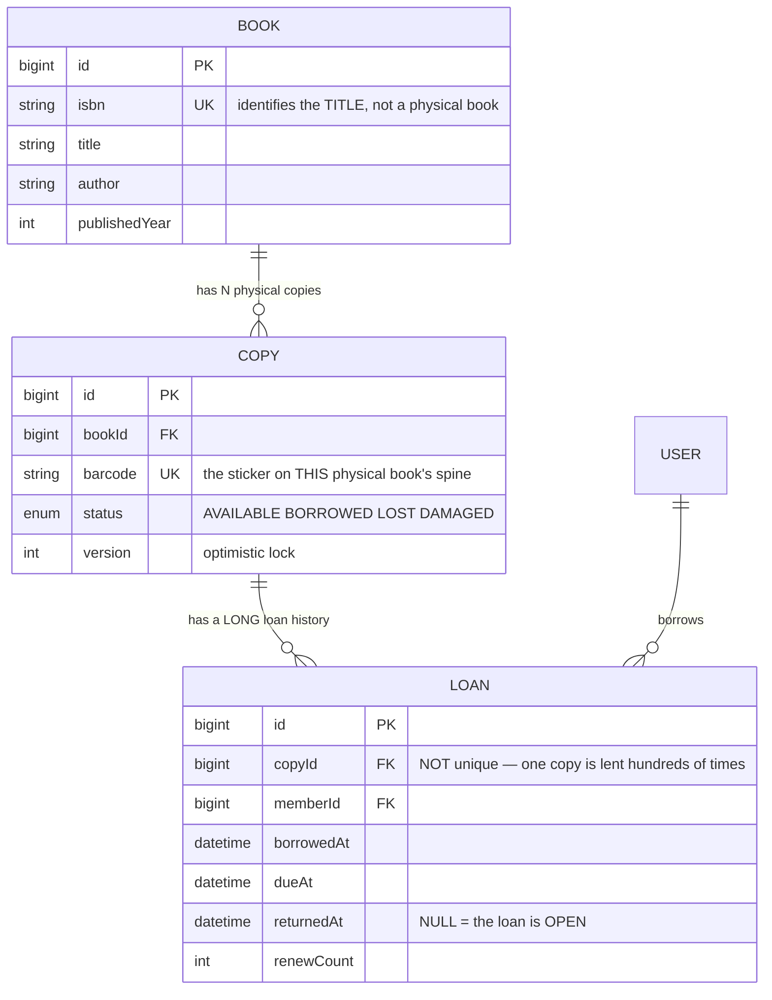
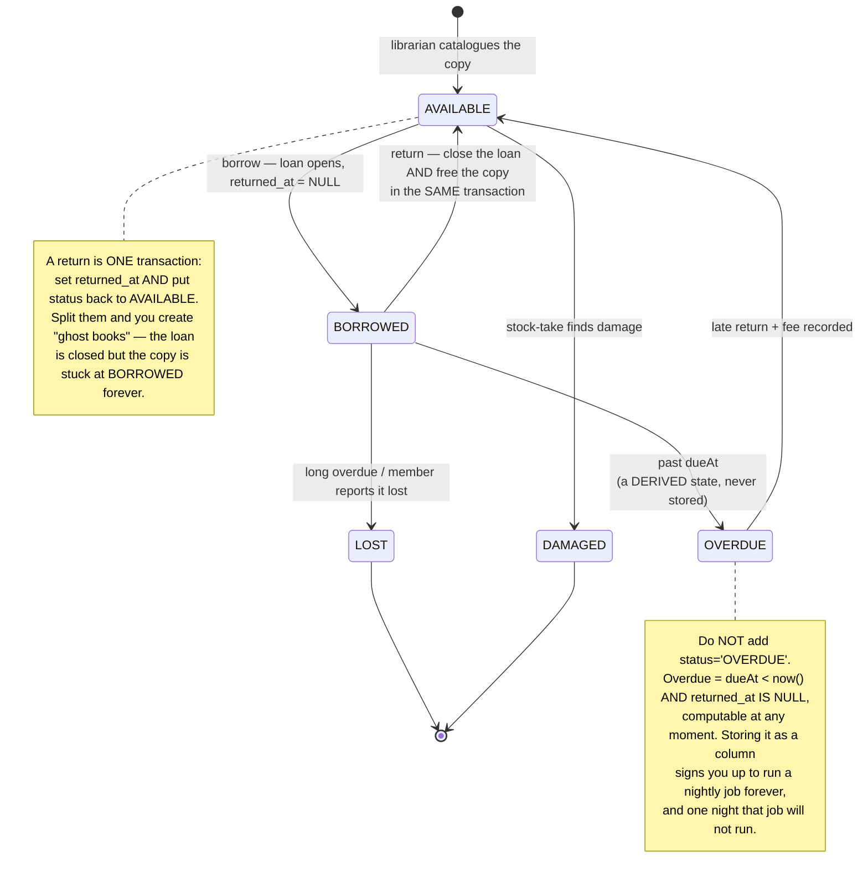

# Library Management System

The second **Semester 6 — Internship** project looks identical to the first: one resource, two people who want it, and you must guarantee only one gets it. [Clinic Appointment Booking](/projects/clinic-appointment-booking-system) solved it with `UNIQUE(slot_id)`.

Here, that same move **breaks**.

The reason is easy to miss: an appointment slot is booked **once in its life**, while a physical book is borrowed and returned **hundreds of times**. Put `UNIQUE(copy_id)` on the loans table and you have banned lending that copy a second time.

The invariant you actually need is not *"one loan per copy"* but *"at most one **open** loan per copy"* — and Postgres has exactly the tool for that sentence: a **partial unique index**.

---

## What you will build

- A **Spring Boot 3 + Java 17** REST API on **PostgreSQL**, with a **React (Vite)** front end
- Two roles: **Member** (search, borrow, see their own loans) and **Librarian** (catalogue books, manage copies, take returns, chase overdues)
- The **title ↔ physical copy** model — the most important modelling decision in this project
- A lending core that **cannot double-lend a copy**, proven by a concurrency test
- Due dates, renewals, overdue fees, and a full per-copy loan history
- A **Docker Compose** deployment

> 📚 The step-by-step course: [**INT602 — Library Management System**](/courses/library-management-system) on the Academy (10 sections, 24 lessons).

---

## A title is not a copy

This is where most submissions go wrong, and the mistake only surfaces when the library owns **two of the same book**.

The broken model collapses both concepts into one table:

```
book(id, title, author, isbn, status)   ❌  the status of which physical book?
```

The library buys 5 copies of *Clean Code*. Three are out on loan, two sit on the shelf. That schema cannot express it — you end up creating 5 identical `book` rows, so the ISBN, author and description are duplicated five times, and fixing one leaves four wrong.

Split them:



`LOAN.returnedAt` being nullable is not merely an empty cell — it is **the definition of "currently on loan"**. Everything else in this project rests on that column.

It is also why you should not add an `isReturned BOOLEAN` next to it: two sources of truth for one fact always drift apart within months. `returned_at IS NULL` answers both "has it come back?" and "when did it come back?".

---

## Partial unique index: the right invariant, over the right rows

The sentence you need to state:

> For each `copy_id`, at most **one** row has `returned_at IS NULL`.

Postgres lets you index **only the rows that satisfy a predicate**:

```sql
-- Only rows with returned_at IS NULL participate in the uniqueness.
-- Returned loans drop out of the index, so history is unbounded.
CREATE UNIQUE INDEX uq_active_loan
  ON loans (copy_id)
  WHERE returned_at IS NULL;
```

Three questions people always ask about that line:

| Question | Answer |
|---|---|
| Is a partial index smaller? | Yes, and **dramatically so**. 50,000 loans with 900 currently open → the index holds 900 entries |
| Will the planner use it for "which copies are out?" | Yes, provided the query carries the same `WHERE returned_at IS NULL` predicate |
| Could a `CHECK` constraint do this? | No. `CHECK` sees **one row**; uniqueness is a relationship **between rows** |

This is an idea you will meet for the rest of your career: **put the invariant in the schema, not in application code**. Application code has many entrances — the API, an import script, a cleanup job someone wrote in a hurry. The index stands in front of all of them.

---

## The race, and how two layers stop it

```mermaid
sequenceDiagram
    autonumber
    participant An as Member An
    participant API as Spring Boot
    participant DB as PostgreSQL
    participant Binh as Member Binh

    rect rgb(60, 20, 20)
    Note over An,Binh: No guard
    An->>API: POST /loans {copyId: 42}
    API->>DB: SELECT status FROM copies WHERE id=42
    DB-->>API: AVAILABLE ✅
    Binh->>API: POST /loans {copyId: 42}
    API->>DB: SELECT status FROM copies WHERE id=42
    DB-->>API: AVAILABLE ✅ (An has not committed)
    API->>DB: INSERT loans (copy 42, An)
    API->>DB: INSERT loans (copy 42, Binh)
    Note over DB: TWO open loans for ONE physical book ✗
    end

    rect rgb(20, 50, 30)
    Note over An,Binh: With @Version + uq_active_loan
    An->>DB: UPDATE copies SET status='BORROWED', version=1<br/>WHERE id=42 AND version=0 → 1 row ✅
    Binh->>DB: UPDATE copies SET status='BORROWED', version=1<br/>WHERE id=42 AND version=0 → 0 rows ✗
    DB-->>Binh: OptimisticLockException → 409
    Note over DB: Even with @Version removed,<br/>the second INSERT hits uq_active_loan → 409
    end
```



The corrected service:

```java
@Transactional
public Loan borrow(Long copyId, Long memberId) {
  Copy copy = copies.findById(copyId).orElseThrow(NotFoundException::new);

  if (copy.getStatus() != CopyStatus.AVAILABLE)     // layer 1: cheap, friendly
    throw new ConflictException("That copy is already on loan");

  copy.setStatus(CopyStatus.BORROWED);              // layer 2: @Version guards it

  Loan loan = new Loan();
  loan.setCopy(copy);
  loan.setMember(users.getReference(memberId));
  loan.setBorrowedAt(Instant.now());
  loan.setDueAt(Instant.now().plus(14, ChronoUnit.DAYS));

  try {
    return loans.saveAndFlush(loan);                // layer 3: uq_active_loan
  } catch (DataIntegrityViolationException | OptimisticLockException e) {
    throw new ConflictException("That copy is already on loan");  // → 409
  }
}
```

**The same shape as project #1, with only layer 3 swapped.** That is the lesson: the structure of the solution is stable; what changes is *which constraint correctly states this domain's invariant*.

---

## Borrowing is trivial; returning is where the design shows

Most students write `borrow()` carefully and then write `return()` carelessly. But returning is where two rows must change **together**:



The rule generalises to every system with a lifecycle: **if a state is computable from data you already store, do not store it as a column.** Every stored status column is a promise that you will always keep it correct — and that promise breaks during the first rushed deploy.

---

## Search: where `LIKE` stops being enough

Twenty thousand titles, a user types "clean cod". `LIKE '%clean cod%'` matches nothing, and even when it matches it scans the whole table.

Postgres ships full-text search:

```sql
-- A generated column combining title and author with different weights
ALTER TABLE books ADD COLUMN search_vector tsvector
  GENERATED ALWAYS AS (
    setweight(to_tsvector('simple', coalesce(title, '')),  'A') ||
    setweight(to_tsvector('simple', coalesce(author, '')), 'B')
  ) STORED;

CREATE INDEX idx_books_search ON books USING GIN (search_vector);

-- Query: match by WORD, rank by relevance
SELECT b.*, ts_rank(b.search_vector, q) AS rank
  FROM books b, websearch_to_tsquery('simple', :keyword) q
 WHERE b.search_vector @@ q
 ORDER BY rank DESC, b.title
 LIMIT 20;
```

Choosing `'simple'` over `'english'` is deliberate for a Vietnamese library: the `english` analyser stems words in English and mangles proper nouns and Vietnamese alike. `websearch_to_tsquery` lets users type `"clean code" -javascript` the way they type into Google, and does not blow up when they leave a quote unclosed.

The same technique is pushed much further in [Job Board Platform](/projects/job-board-platform-linkedin-like), where relevance ranking is the headline feature rather than a convenience.

---

## Traps worth writing down

| Symptom | Actual cause | Fix |
|---|---|---|
| Cannot re-borrow a returned book | Used `UNIQUE(copy_id)` instead of a partial index | `UNIQUE (copy_id) WHERE returned_at IS NULL` |
| Two members holding one physical copy | Read-then-write with only `@Transactional` | `@Version` + the partial index |
| Library owns 5 copies, system tracks 1 | Titles and copies collapsed into one table | Split `BOOK` and `COPY` |
| "Ghost books": loan closed, copy stuck at `BORROWED` | Closing the loan and freeing the copy in two transactions | One transaction, two writes |
| Overdue list sometimes right, sometimes wrong | Stored `status='OVERDUE'`, refreshed by a nightly job | Derive it: `due_at < now() AND returned_at IS NULL` |
| Searching "clean cod" misses *Clean Code* | `LIKE '%...%'` matches substrings, not words | `tsvector` + GIN + `websearch_to_tsquery` |
| Search slows down as the catalogue grows | No GIN index, sequential scan | A GIN index on the `tsvector` column |
| Unlimited renewals | No cap on `renewCount` | Enforce in the service: e.g. max 2, and only while not overdue |
| Overdue fees wrong across weekends | Raw `Duration.between` day arithmetic | Fee rules are **business logic** — isolate them and test them alone |
| A member can read someone else's loans | `memberId` taken from the body | Take it from the signed JWT; non-owners get `404` |
| Librarian deletes a copy that is out on loan | No check for an open loan before delete | Block deletion while a `returned_at IS NULL` row exists |

---

## Done means

- [ ] Borrow → return → **borrow again** on the same copy: all three succeed
- [ ] A 20-thread concurrency test on one copy: **1** success, **19** clean `409`s
- [ ] Temporarily remove `@Version` and re-run: still exactly **1** open loan (the partial index really carries weight)
- [ ] `SELECT COUNT(*) FROM loans WHERE copy_id=42` after 50 borrow/return cycles: returns **50**, with no constraint errors
- [ ] Catalogue 5 copies of one ISBN: the UI shows "3 on loan / 2 on the shelf"
- [ ] After a return, `copies.status` is `AVAILABLE` **within the same transaction**
- [ ] Disable any overdue-refresh job: the overdue list is **still correct**
- [ ] Search `"clean code"` with quotes and a `-` operator: no crash, correct results
- [ ] `EXPLAIN` the search query: a `Bitmap Index Scan` on the GIN index, not a `Seq Scan`
- [ ] Member A requests `GET /loans/{id}` belonging to B: gets `404`
- [ ] Librarian deletes a copy that is on loan: blocked with a clear message

---

## Where to go next

1. **When the thing held is an interval.** [Homestay Booking API](/projects/homestay-booking-api) moves from "current status" to "date ranges that must not overlap" — neither `UNIQUE` nor a partial index can express it; you need `EXCLUDE`.
2. **When a record has a multi-step lifecycle.** [Helpdesk Ticketing API](/projects/helpdesk-ticketing-api) turns the state diagram above into an actually enforced state machine.
3. **Reserving a book that is currently out.** That queue is exactly the waitlist problem in [Gym Membership App](/projects/gym-membership-app).
4. **Search, taken seriously.** [Distributed Search Engine](/projects/distributed-search-engine) goes from `tsvector` all the way down to a hand-built inverted index.
