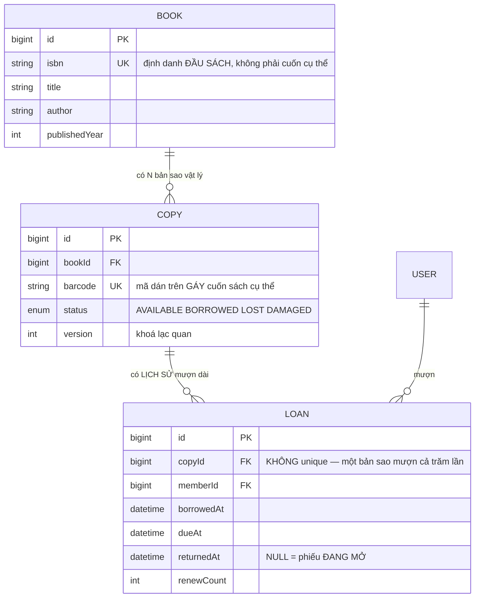
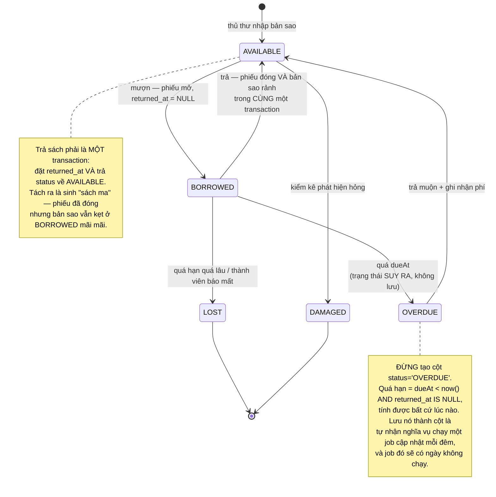

# Library Management System

Đồ án thứ hai của **Kỳ 6 — Thực tập** trông giống hệt đồ án thứ nhất: một tài nguyên, hai người muốn nó, và bạn phải đảm bảo chỉ một người lấy được. [Clinic Appointment Booking](/projects/clinic-appointment-booking-system) giải bằng `UNIQUE(slot_id)`.

Ở đây, cùng cách làm đó **hỏng**.

Lý do đơn giản đến mức dễ bỏ qua: một khung giờ khám chỉ được đặt **một lần trong đời**, còn một cuốn sách được mượn và trả **hàng trăm lần**. Đặt `UNIQUE(copy_id)` lên bảng phiếu mượn là bạn cấm luôn việc mượn lại cuốn sách đó lần thứ hai.

Bất biến cần phát biểu không phải *"một phiếu mượn mỗi bản sao"* mà là *"tối đa một phiếu mượn **đang mở** mỗi bản sao"* — và Postgres có đúng công cụ cho câu đó: **chỉ mục UNIQUE bộ phận**.

---

## Bạn sẽ dựng ra cái gì

- REST API **Spring Boot 3 + Java 17** trên **PostgreSQL**, giao diện **React (Vite)**
- Hai vai trò: **Thành viên** (tìm sách, mượn, xem phiếu của mình) và **Thủ thư** (nhập sách, quản lý bản sao, nhận trả, xử lý quá hạn)
- Mô hình **đầu sách ↔ bản sao vật lý** — phần mô hình hoá quan trọng nhất của bài
- Lõi cho mượn **không mượn trùng bản sao**, chứng minh bằng test đồng thời
- Hạn trả, gia hạn, tính phí quá hạn, và lịch sử mượn đầy đủ theo từng bản sao
- Đóng gói **Docker Compose**

> 📚 Bản dạy từng bước: [**INT602 — Library Management System**](/courses/library-management-system) trên Academy (10 mục, 24 bài).

---

## Đầu sách không phải là bản sao

Đây là chỗ hầu hết bài nộp sai, và cái sai chỉ lộ ra khi thư viện có **hai cuốn cùng tên**.

Mô hình sai gộp cả hai khái niệm vào một bảng:

```
book(id, title, author, isbn, status)   ❌  status của cuốn nào?
```

Thư viện mua 5 cuốn *Clean Code*. Ba cuốn đang được mượn, hai cuốn còn trên kệ. Với schema trên bạn không biểu diễn được trạng thái đó — bạn phải tạo 5 hàng `book` giống hệt nhau, và thế là ISBN, tác giả, mô tả bị lặp 5 lần, sửa một chỗ thì lệch bốn chỗ.

Tách đôi:



`LOAN.returnedAt` có thể `NULL` không chỉ là một ô trống — nó là **định nghĩa của "đang mượn"**. Toàn bộ phần còn lại của bài dựa vào cột đó.

Đây cũng là lý do đừng thêm cột `isReturned BOOLEAN` bên cạnh: hai nguồn sự thật cho cùng một thông tin luôn lệch nhau sau vài tháng. `returnedAt IS NULL` vừa trả lời "đã trả chưa" vừa trả lời "trả lúc nào".

---

## Chỉ mục UNIQUE bộ phận: bất biến đúng, phạm vi đúng

Câu cần phát biểu:

> Với mỗi `copy_id`, tối đa **một** hàng có `returned_at IS NULL`.

Postgres cho phép đánh chỉ mục **chỉ những hàng thoả điều kiện**:

```sql
-- Chỉ các hàng returned_at IS NULL tham gia vào tính duy nhất.
-- Sách trả rồi rơi khỏi chỉ mục, nên lịch sử mượn không giới hạn.
CREATE UNIQUE INDEX uq_active_loan
  ON loans (copy_id)
  WHERE returned_at IS NULL;
```

Ba câu hỏi thường gặp về dòng này:

| Câu hỏi | Trả lời |
|---|---|
| Chỉ mục bộ phận có nhỏ hơn không? | Có, và nhỏ **rất nhiều**. Thư viện 50.000 phiếu mượn, 900 phiếu đang mở → chỉ mục chỉ chứa 900 mục |
| Nó có tự dùng khi truy vấn "sách nào đang mượn" không? | Có, nếu câu truy vấn có đúng vị từ `WHERE returned_at IS NULL` |
| Có thể làm bằng `CHECK` không? | Không. `CHECK` chỉ nhìn được **một hàng**; tính duy nhất là quan hệ **giữa các hàng** |

Đây là ý tưởng sẽ quay lại nhiều lần trong nghề: **đặt bất biến vào schema, không phải vào mã ứng dụng**. Mã ứng dụng có nhiều đường vào — API, script nhập liệu, một job dọn dữ liệu ai đó viết vội. Chỉ mục thì đứng chắn tất cả.

---

## Cuộc đua, và cách hai lớp cùng chặn nó

```mermaid
sequenceDiagram
    autonumber
    participant An as Thành viên An
    participant API as Spring Boot
    participant DB as PostgreSQL
    participant Binh as Thành viên Bình

    rect rgb(60, 20, 20)
    Note over An,Binh: Không có bảo vệ
    An->>API: POST /loans {copyId: 42}
    API->>DB: SELECT status FROM copies WHERE id=42
    DB-->>API: AVAILABLE ✅
    Binh->>API: POST /loans {copyId: 42}
    API->>DB: SELECT status FROM copies WHERE id=42
    DB-->>API: AVAILABLE ✅ (An chưa commit)
    API->>DB: INSERT loans (copy 42, An)
    API->>DB: INSERT loans (copy 42, Bình)
    Note over DB: HAI phiếu đang mở cho MỘT cuốn sách vật lý ✗
    end

    rect rgb(20, 50, 30)
    Note over An,Binh: Có @Version + uq_active_loan
    An->>DB: UPDATE copies SET status='BORROWED', version=1<br/>WHERE id=42 AND version=0 → 1 dòng ✅
    Binh->>DB: UPDATE copies SET status='BORROWED', version=1<br/>WHERE id=42 AND version=0 → 0 dòng ✗
    DB-->>Binh: OptimisticLockException → 409
    Note over DB: Kể cả nếu @Version bị xoá,<br/>INSERT thứ hai đụng uq_active_loan → 409
    end
```



Bản sửa ở tầng service:

```java
@Transactional
public Loan borrow(Long copyId, Long memberId) {
  Copy copy = copies.findById(copyId).orElseThrow(NotFoundException::new);

  if (copy.getStatus() != CopyStatus.AVAILABLE)     // lớp 1: rẻ, thân thiện
    throw new ConflictException("Bản sao này đang có người mượn");

  copy.setStatus(CopyStatus.BORROWED);              // lớp 2: @Version canh UPDATE

  Loan loan = new Loan();
  loan.setCopy(copy);
  loan.setMember(users.getReference(memberId));
  loan.setBorrowedAt(Instant.now());
  loan.setDueAt(Instant.now().plus(14, ChronoUnit.DAYS));

  try {
    return loans.saveAndFlush(loan);                // lớp 3: uq_active_loan
  } catch (DataIntegrityViolationException | OptimisticLockException e) {
    throw new ConflictException("Bản sao này đang có người mượn");  // → 409
  }
}
```

**Cùng một khuôn với đồ án #1, chỉ đổi lớp 3.** Đó chính là bài học: hình dạng của giải pháp giữ nguyên, thứ thay đổi là *ràng buộc nào phát biểu đúng bất biến của nghiệp vụ này*.

---

## Mượn thì tầm thường, trả mới lộ ra thiết kế

Phần lớn sinh viên viết `borrow()` cẩn thận rồi viết `return()` cẩu thả. Nhưng trả sách là nơi hai hàng phải đổi trạng thái **cùng nhau**:



Quy tắc rút ra, đúng cho mọi hệ thống có vòng đời: **trạng thái tính được từ dữ liệu sẵn có thì đừng lưu thành cột.** Mỗi cột trạng thái lưu sẵn là một lời hứa rằng bạn sẽ luôn cập nhật nó đúng — và lời hứa đó bị phá trong lần deploy vội đầu tiên.

---

## Tìm sách: chỗ `LIKE` bắt đầu không đủ

Thư viện 20.000 đầu sách, người dùng gõ "clean cod". `LIKE '%clean cod%'` không khớp gì, và kể cả khi khớp thì nó quét toàn bảng.

Postgres có sẵn tìm kiếm toàn văn:

```sql
-- Cột sinh tự động, gộp tiêu đề và tác giả, có trọng số khác nhau
ALTER TABLE books ADD COLUMN search_vector tsvector
  GENERATED ALWAYS AS (
    setweight(to_tsvector('simple', coalesce(title, '')),  'A') ||
    setweight(to_tsvector('simple', coalesce(author, '')), 'B')
  ) STORED;

CREATE INDEX idx_books_search ON books USING GIN (search_vector);

-- Truy vấn: khớp theo TỪ, xếp hạng theo độ liên quan
SELECT b.*, ts_rank(b.search_vector, q) AS rank
  FROM books b, websearch_to_tsquery('simple', :keyword) q
 WHERE b.search_vector @@ q
 ORDER BY rank DESC, b.title
 LIMIT 20;
```

Dùng `'simple'` thay vì `'english'` là quyết định có chủ ý cho thư viện Việt Nam: bộ phân tích `english` cắt gốc từ theo tiếng Anh và làm hỏng tên riêng lẫn tiếng Việt. `websearch_to_tsquery` cho phép người dùng gõ `"clean code" -javascript` như trên Google mà không làm sập truy vấn khi họ gõ dấu ngoặc lẻ.

Cùng kỹ thuật này được đẩy xa hơn ở [Job Board Platform](/projects/job-board-platform-linkedin-like), nơi xếp hạng liên quan là tính năng chính chứ không phải phụ.

---

## Những cái bẫy đã được ghi lại

| Triệu chứng | Nguyên nhân thật | Cách sửa |
|---|---|---|
| Không mượn lại được cuốn sách đã trả | Dùng `UNIQUE(copy_id)` thay vì chỉ mục bộ phận | `UNIQUE (copy_id) WHERE returned_at IS NULL` |
| Hai người mượn cùng một bản sao | Đọc-rồi-ghi, chỉ có `@Transactional` | `@Version` + chỉ mục bộ phận |
| Thư viện có 5 cuốn *Clean Code* mà hệ thống chỉ quản được 1 | Gộp đầu sách và bản sao vào một bảng | Tách `BOOK` và `COPY` |
| "Sách ma": phiếu đã trả nhưng bản sao kẹt ở `BORROWED` | Đóng phiếu và trả trạng thái ở hai transaction | Một transaction, hai câu ghi |
| Danh sách quá hạn lúc đúng lúc sai | Lưu `status='OVERDUE'` rồi cập nhật bằng job đêm | Suy ra: `due_at < now() AND returned_at IS NULL` |
| Tìm "clean cod" không ra *Clean Code* | `LIKE '%...%'` khớp chuỗi con, không khớp từ | `tsvector` + GIN + `websearch_to_tsquery` |
| Tìm kiếm chậm dần khi thêm sách | Không có chỉ mục GIN, quét toàn bảng | Chỉ mục GIN trên cột `tsvector` |
| Gia hạn vô hạn lần | Không giới hạn `renewCount` | Chặn ở service, ví dụ tối đa 2 lần và chỉ khi chưa quá hạn |
| Phí quá hạn tính sai vào cuối tuần | Trừ ngày thô bằng `Duration.between` | Quy tắc phí là **nghiệp vụ**, viết riêng và test riêng |
| Thành viên xem được phiếu mượn của người khác | `memberId` lấy từ body | Lấy từ JWT đã ký, không sở hữu thì `404` |
| Thủ thư xoá bản sao đang có người mượn | Không kiểm phiếu mở trước khi xoá | Chặn xoá khi còn phiếu `returned_at IS NULL` |

---

## Khi nào coi như xong

- [ ] Mượn → trả → **mượn lại** cùng một bản sao: cả ba lần đều thành công
- [ ] Test đồng thời 20 luồng mượn cùng một bản sao: **1** thành công, **19** nhận `409`
- [ ] Xoá tạm `@Version`, chạy lại test: vẫn đúng **1** phiếu mở (chỉ mục bộ phận thật sự gánh)
- [ ] `SELECT COUNT(*) FROM loans WHERE copy_id=42` sau 50 lần mượn/trả: trả về **50**, không lỗi ràng buộc
- [ ] Nhập 5 bản sao cho cùng một ISBN: hệ thống hiện "3 đang mượn / 2 còn trên kệ"
- [ ] Trả sách xong, `copies.status` về `AVAILABLE` **ngay trong cùng transaction**
- [ ] Tắt job cập nhật quá hạn (nếu có): danh sách quá hạn **vẫn đúng**
- [ ] Tìm `"clean code"` với dấu ngoặc kép và toán tử `-`: không sập, ra đúng kết quả
- [ ] `EXPLAIN` truy vấn tìm kiếm: thấy `Bitmap Index Scan` trên chỉ mục GIN, không phải `Seq Scan`
- [ ] Thành viên A gọi `GET /loans/{id}` của B: nhận `404`
- [ ] Thủ thư xoá bản sao đang được mượn: bị chặn với thông báo rõ ràng

---

## Bước tiếp theo

1. **Khi thứ được giữ là một khoảng thời gian.** [Homestay Booking API](/projects/homestay-booking-api) đổi từ "trạng thái hiện tại" sang "khoảng ngày không được chồng" — `UNIQUE` và chỉ mục bộ phận đều bó tay, phải dùng `EXCLUDE`.
2. **Khi bản ghi có vòng đời nhiều bước.** [Helpdesk Ticketing API](/projects/helpdesk-ticketing-api) biến biểu đồ trạng thái ở trên thành một máy trạng thái được thực thi thật sự.
3. **Đặt trước sách đang được mượn.** Hàng chờ này chính là bài toán waitlist ở [Gym Membership App](/projects/gym-membership-app).
4. **Tìm kiếm nghiêm túc hơn.** [Distributed Search Engine](/projects/distributed-search-engine) đi từ `tsvector` xuống tận chỉ mục ngược tự dựng.
