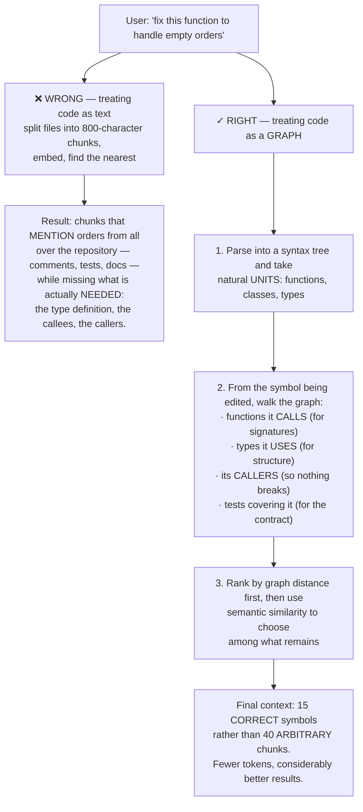
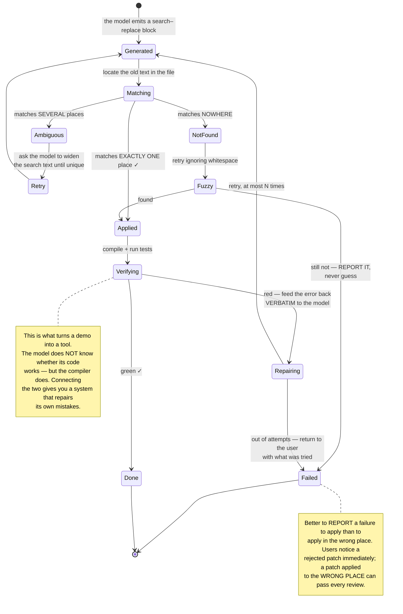
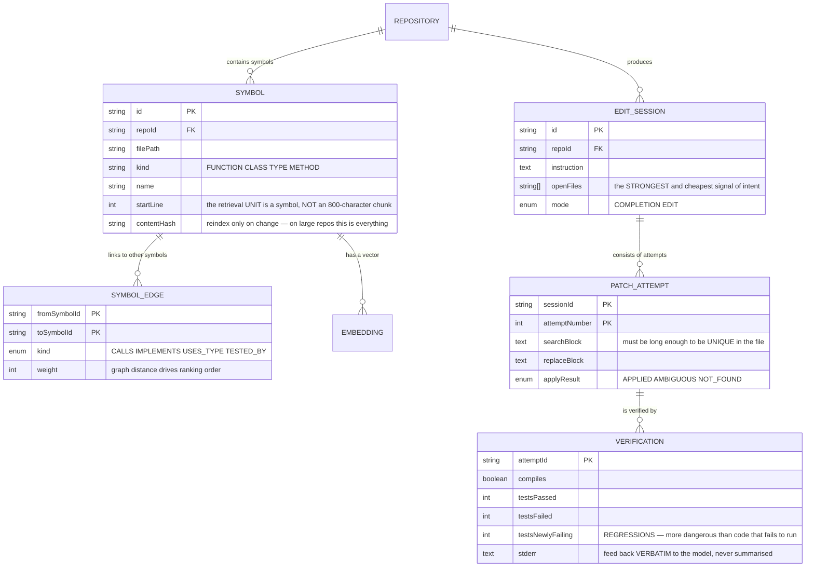

# LLM-Powered Code Generation Platform (Cursor-like)

In [AI Chatbot Platform](/projects/ai-chatbot-platform-multi-tenant) you built semantic retrieval for documents: chunk, embed, find the nearest. Apply exactly that to source code and it runs — and produces poor results.

The reason is something obvious that is easy to miss: **code is not text. It is a graph.**

The function you are editing calls three others, implements an interface, is called from five places, and depends on a type defined in another file. None of that is nearby in **textual similarity** terms, yet all of it is required to make a correct change.

And there is a second thing that separates this project from every other AI application in the roadmap: **code is verifiable**. You do not have to guess whether the answer is right — you compile it and run the tests.

---

## What you will build

- Repository indexing by structure rather than by text chunk
- Retrieval along the dependency graph, not just by similarity
- Inline completions within a sub-300ms latency budget
- Multi-file edits as patches, with preview
- A verification loop: generate → compile → test → self-repair
- Evaluation driven by executable tests rather than impressions

---

## Code retrieval: the right unit is a symbol, not a chunk



Three more signals every real system uses, all far cheaper than embeddings:

- **Open files and recent history.** What the developer is looking at is the strongest available signal of intent, and it costs no computation at all.
- **Git history.** Files repeatedly changed **together** in one commit are almost certainly related, even when the code does not reference them directly.
- **Existing compiler errors.** A type error in another file is extremely relevant context.

---

## Two modes, two entirely different budgets

This is where many designs go wrong by treating them as one feature:

| | Inline completion | Requested edit |
|---|---|---|
| Latency budget | **Under 300ms** | Seconds to minutes |
| Context | A few hundred lines around the cursor | The whole dependency graph |
| Model | Small, optimised for speed | The strongest available |
| Cost of being wrong | The user ignores it, costing nothing | The user spends time reviewing |
| Metric | Acceptance rate | Test pass rate |

The 300ms budget is not arbitrary: past it, the developer has already finished the line and the suggestion becomes an annoyance. It rules out large models entirely and drags a chain of techniques with it: prefix caching, cancelling stale requests as the user keeps typing, and **speculative prefetching** based on cursor position.

---

## Applying patches: where every tool struggles

A model can produce two things: **the whole file after editing**, or **a patch**. Both have their own problems:

| Approach | Problem |
|---|---|
| Regenerate the whole file | A 2,000-line file costs enormous tokens, is slow, and models routinely **silently drop** parts they were not thinking about |
| Line-number patches | Line numbers drift slightly and the patch applies in the wrong place, or refuses to apply |
| **Search–replace blocks** | The approach that works: quote enough of the old text to be unique, plus the new text |

Search–replace still has three failure cases, and all three need handling:



---

## The verification loop: the biggest difference from every other AI application

With a chatbot there is no automatic way to know whether an answer is right. Here **there is**: code either compiles or it does not, tests are either green or red.

That enables a loop no other domain gets:

```python
# This loop is the essence of the tool, not an added feature.
for attempt in range(MAX_ATTEMPTS):        # typically 3
    patch = model.generate(context, task, previous_errors)
    apply(patch)

    result = run_in_sandbox(["compile", "test"])   # isolated as in Code Collaboration
    if result.ok:
        return patch

    # Feed the error back VERBATIM. Summarising it removes exactly what the
    # model needs — the lesson from AI Operating System.
    previous_errors = result.stderr[:4000]

# Out of attempts: RETURN to the user with what was tried.
# Do not return code that never ran and call it a result.
raise CouldNotVerify(attempts=MAX_ATTEMPTS, last_error=previous_errors)
```

Two mandatory constraints around this loop:

- **Run it in a sandbox.** This is machine-generated code executed automatically with nobody reading it first. Every defence layer from [Code Collaboration Platform](/projects/code-collaboration-platform) applies unchanged — and the risk here is **no smaller**, because there is no human in between.
- **Cap the attempts.** Without a cap, one error the model cannot fix consumes the entire budget. This is the hard-limit principle from [AI Operating System](/projects/ai-operating-system-multi-agent).

---

## Evaluation: a rare domain where scoring is automatic

For chatbots, scoring needs a judge model or a human reader. For code, **tests are the measure**, and that makes everything easier:

- **Pass rate at k attempts.** Generate k solutions and compute the probability that at least one passes all tests. This is the field's standard metric.
- **Suggestion acceptance rate.** For completions: what fraction survive 30 seconds after acceptance (not merely how many were tabbed).
- **Average repair rounds.** Rising means retrieval quality is degrading.
- **Regression rate.** Patches that turn **passing tests into failing ones** — considerably more dangerous than code that does not run, because they look like success.

That last metric deserves the closest watch. A patch that does not compile is obvious to everyone; a patch that fixes one thing and quietly breaks another is what slips through.

---

## Two non-technical problems you must handle anyway

**Generated code contains vulnerabilities.** Models learn from public code, much of which is insecure. They will produce string-concatenated SQL, non-constant-time password comparison, authorisation checked in the rendering layer. Run a security scanner **inside the verification loop**, alongside compilation and tests — catching it there is far cheaper than catching it at review.

**Licensing.** Generated code can substantially match code under restrictive licences. For a personal project that is fine; for a commercial product it is a real legal exposure. At minimum: compare long passages against known corpora and warn on matches.

---

## The data model



Separating `VERIFICATION.testsNewlyFailing` from `testsFailed` is deliberate: tests already red before the edit are not the patch's fault. Only tests moving **from green to red** are regressions, and that is the number to block on.

---

## Traps worth recording

| Symptom | Actual cause | Fix |
|---|---|---|
| Irrelevant suggestions despite semantic search | Treating code as text, chunking by characters | Chunk by symbol, retrieve along the graph |
| Type definitions missing from context | Similarity only, no dependency walk | Follow call and type edges |
| Completions arriving too late | A large model in a sub-300ms mode | Small model, prefix caching, cancel stale requests |
| Patches applied in the wrong place | Search text too short, matching several places | Require widening until unique |
| The model silently dropped part of a file | Regenerating the whole file | Emit search–replace blocks |
| Generated code does not compile | No verification loop | generate → compile → test → self-repair |
| The repair loop running forever | No attempt cap | At most N, then return to the user |
| The model never fixing one particular error | Summarising errors instead of passing them through | Feed `stderr` back verbatim |
| A patch fixing one thing and breaking another | Counting only total failing tests | Measure tests moving **green to red** specifically |
| Generated code containing vulnerabilities | No scanner in the loop | Put the scanner alongside the tests |
| Running generated code damaging the host | Executing without isolation | Sandbox as in Code Collaboration Platform |
| Reindexing the whole repository on every edit | Not tracking changes per symbol | Incremental indexing by content hash |
| Cost per request too high | Stuffing 40 chunks into context | Graph retrieval gives fewer tokens and better results |

---

## When it is genuinely done

- [ ] A 100,000-file repository: reindexing after one edit completes in under **2 seconds**
- [ ] Ask to fix a function: the context contains **the type definition and the callers**, not arbitrary text chunks
- [ ] Inline completions: p95 under **300ms**
- [ ] Keep typing while a request is in flight: the stale request is **cancelled**, no outdated suggestion arrives
- [ ] A patch whose search text matches several places: the system **refuses to apply** and asks for clarification
- [ ] Request a change spanning 5 files: all 5 patches apply, or **none** do
- [ ] All generated code **compiles** before being shown to the user
- [ ] Deliberately request a change that breaks tests: the system **detects the regression** and reports it
- [ ] Request something impossible: it stops after N attempts, **with what it tried**
- [ ] Generate deliberately SQL-injectable code: the scanner **catches it** inside the loop
- [ ] Run generated code in the sandbox: `curl` to the internal metadata address is **blocked**
- [ ] Run a standard benchmark: you have pass-rate numbers comparable across system versions

---

## Where to go next

1. **Large-scale multi-file edits.** Renaming an interface used in 200 places needs syntax-tree transformation tooling, not a model generating each site.
2. **Learn from the repository itself.** This project's conventions matter more than general ones. Extract them from existing code and put them in the context.
3. **Autonomous coding agents.** Take an issue, make the fix, open a pull request — combining this with [AI Operating System](/projects/ai-operating-system-multi-agent), where every reversibility constraint applies.
4. **Train a domain model.** Fine-tune on your organisation's own repository — which needs [Distributed ML Training Platform](/projects/distributed-ml-training-platform).
