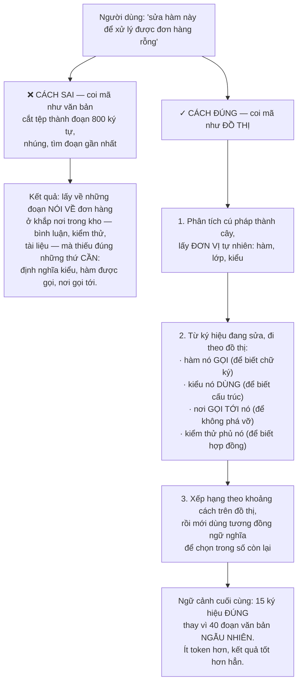
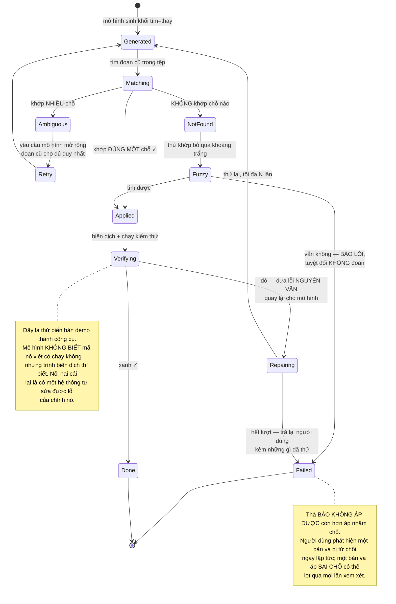
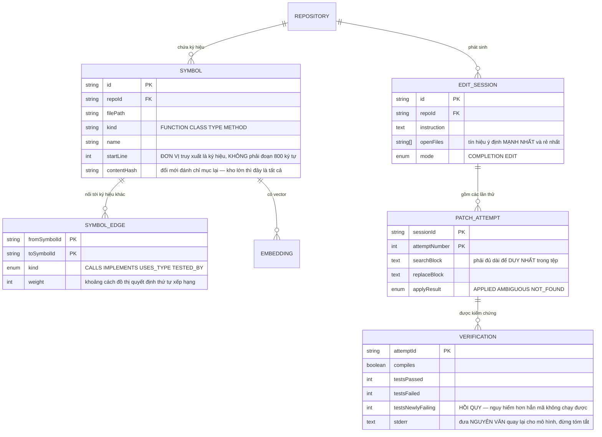

# LLM-Powered Code Generation Platform (Cursor-like)

Ở [AI Chatbot Platform](/projects/ai-chatbot-platform-multi-tenant) bạn đã dựng truy xuất ngữ nghĩa cho tài liệu: cắt đoạn, nhúng, tìm đoạn gần nhất. Nếu đem đúng cách đó áp cho mã nguồn, nó chạy — và cho ra kết quả tệ.

Lý do nằm ở một điều hiển nhiên mà dễ bỏ qua: **mã nguồn không phải văn bản. Nó là một đồ thị.**

Hàm bạn đang sửa gọi ba hàm khác, cài đặt một giao diện, được năm nơi khác gọi tới, và phụ thuộc vào một kiểu dữ liệu định nghĩa ở tệp khác. Không phần nào trong số đó nằm gần nó về mặt **ngữ nghĩa văn bản**, nhưng tất cả đều cần thiết để sửa đúng.

Và có một điều thứ hai làm dự án này khác mọi ứng dụng AI khác trong lộ trình: **mã nguồn kiểm chứng được**. Bạn không phải đoán xem câu trả lời đúng hay sai — bạn biên dịch nó và chạy kiểm thử.

---

## Bạn sẽ dựng ra cái gì

- Đánh chỉ mục kho mã theo cấu trúc, không theo đoạn văn bản
- Truy xuất theo đồ thị phụ thuộc, không chỉ theo tương đồng
- Gợi ý khi gõ với ngân sách độ trễ dưới 300ms
- Sửa nhiều tệp bằng bản vá, có xem trước
- Vòng lặp kiểm chứng: sinh → biên dịch → chạy kiểm thử → tự sửa
- Bộ đo dựa trên kiểm thử chạy được, không dựa trên cảm nhận

---

## Truy xuất mã: đơn vị đúng là ký hiệu, không phải đoạn



Ba nguồn tín hiệu nữa mà một hệ thống thật đều dùng, và chúng rẻ hơn nhúng rất nhiều:

- **Tệp đang mở và lịch sử gần đây.** Người viết đang nhìn cái gì là tín hiệu mạnh nhất về ý định, và nó không tốn phép tính nào.
- **Lịch sử git.** Các tệp thường được sửa **cùng nhau** trong một commit gần như chắc chắn liên quan tới nhau, kể cả khi mã không tham chiếu trực tiếp.
- **Lỗi biên dịch hiện có.** Nếu đang có lỗi kiểu ở tệp khác, đó là ngữ cảnh cực kỳ liên quan.

---

## Hai chế độ, hai ngân sách hoàn toàn khác nhau

Đây là chỗ nhiều người thiết kế sai vì coi chúng là một tính năng:

| | Gợi ý khi gõ | Sửa theo yêu cầu |
|---|---|---|
| Ngân sách độ trễ | **Dưới 300ms** | Vài giây tới vài phút |
| Ngữ cảnh | Vài trăm dòng quanh con trỏ | Cả đồ thị phụ thuộc |
| Mô hình | Nhỏ, tối ưu tốc độ | Mạnh nhất có thể |
| Sai thì sao | Người dùng bỏ qua, tốn 0 | Người dùng mất thời gian xem xét |
| Chỉ số | Tỉ lệ chấp nhận | Tỉ lệ kiểm thử qua |

Ngân sách 300ms không phải con số tuỳ tiện: quá ngưỡng đó thì người viết đã gõ xong câu và gợi ý trở thành thứ gây phiền. Nó loại bỏ hoàn toàn khả năng dùng mô hình lớn, và kéo theo cả một chuỗi kỹ thuật: nhớ đệm theo tiền tố, huỷ yêu cầu cũ khi người dùng gõ tiếp, và **suy đoán trước** dựa trên vị trí con trỏ.

---

## Áp bản vá: chỗ mọi công cụ đều gặp khó

Mô hình có thể sinh ra hai thứ: **cả tệp sau khi sửa**, hoặc **một bản vá**. Cả hai đều có vấn đề riêng:

| Cách | Vấn đề |
|---|---|
| Sinh cả tệp | Tệp 2.000 dòng tốn rất nhiều token, chậm, và mô hình hay **âm thầm bỏ mất** những phần nó không quan tâm |
| Sinh bản vá theo số dòng | Số dòng lệch một chút là áp sai chỗ, hoặc từ chối áp |
| **Sinh khối tìm–thay** | Cách dùng được: nêu đoạn cũ đủ dài để duy nhất, và đoạn mới |

Khối tìm–thay vẫn có ba tình huống hỏng, và cả ba đều phải xử lý:



---

## Vòng lặp kiểm chứng: khác biệt lớn nhất so với mọi ứng dụng AI khác

Ở chatbot, bạn không có cách nào tự động biết câu trả lời đúng hay sai. Ở đây **bạn có**: mã hoặc biên dịch được hoặc không, kiểm thử hoặc xanh hoặc đỏ.

Điều đó cho phép một vòng lặp mà các miền khác không có:

```python
# Vòng lặp này là bản chất của công cụ, không phải một tính năng thêm.
for attempt in range(MAX_ATTEMPTS):        # thường 3
    patch = model.generate(context, task, previous_errors)
    apply(patch)

    result = run_in_sandbox(["compile", "test"])   # cách ly như Code Collaboration
    if result.ok:
        return patch

    # Đưa lỗi NGUYÊN VĂN quay lại. Tóm tắt lỗi là lấy đi thông tin
    # mô hình cần — đúng bài học từ AI Operating System.
    previous_errors = result.stderr[:4000]

# Hết lượt: TRẢ LẠI cho người dùng kèm những gì đã thử.
# Đừng trả về mã chưa từng chạy được và gọi nó là kết quả.
raise CouldNotVerify(attempts=MAX_ATTEMPTS, last_error=previous_errors)
```

Hai ràng buộc bắt buộc quanh vòng lặp này:

- **Chạy trong môi trường cách ly.** Đây là mã do máy sinh, chạy tự động, không ai đọc trước. Toàn bộ các lớp phòng thủ của [Code Collaboration Platform](/projects/code-collaboration-platform) áp dụng nguyên vẹn — và ở đây rủi ro **không nhỏ hơn**, vì không có người nào ở giữa.
- **Giới hạn số lần thử.** Không có nó, một lỗi mô hình không sửa nổi sẽ đốt sạch ngân sách. Đây là nguyên tắc giới hạn cứng từ [AI Operating System](/projects/ai-operating-system-multi-agent).

---

## Đánh giá: đây là miền hiếm hoi chấm được tự động

Với chatbot, chấm điểm cần mô hình phán xử hoặc người đọc. Với mã, **kiểm thử là thước đo**, và điều đó làm mọi thứ dễ hơn hẳn:

- **Tỉ lệ qua với k lần thử.** Sinh k lời giải, tính xác suất ít nhất một cái qua toàn bộ kiểm thử. Đây là chỉ số chuẩn của lĩnh vực.
- **Tỉ lệ chấp nhận gợi ý.** Với chế độ gõ: bao nhiêu phần trăm gợi ý được giữ lại sau 30 giây (chứ không phải chỉ được nhấn Tab).
- **Số vòng sửa trung bình.** Tăng lên nghĩa là chất lượng truy xuất ngữ cảnh đang xấu đi.
- **Tỉ lệ hồi quy.** Bản vá làm **kiểm thử đang xanh chuyển đỏ** — nguy hiểm hơn hẳn bản vá không chạy được, vì nó trông như đã thành công.

Chỉ số cuối là chỉ số cần canh nhất. Một bản vá không biên dịch được thì ai cũng thấy; một bản vá sửa được lỗi này và lặng lẽ phá vỡ chỗ khác là thứ lọt qua được.

---

## Hai vấn đề không kỹ thuật mà bắt buộc phải xử lý

**Mã sinh ra có lỗ hổng.** Mô hình học từ mã công khai, trong đó có rất nhiều mã không an toàn. Nó sẽ sinh ra chuỗi SQL nối trực tiếp, so sánh mật khẩu không chống tấn công thời gian, kiểm quyền ở tầng hiển thị. Chạy công cụ quét bảo mật **trong chính vòng lặp kiểm chứng**, cùng chỗ với biên dịch và kiểm thử — bắt ở đó rẻ hơn nhiều so với bắt lúc xem xét mã.

**Giấy phép.** Mã sinh ra có thể trùng khớp đáng kể với mã có giấy phép ràng buộc. Với dự án cá nhân thì không sao; với sản phẩm thương mại thì đó là rủi ro pháp lý thật. Tối thiểu: đối chiếu các đoạn dài với kho mã đã biết và cảnh báo khi trùng.

---

## Dữ liệu



`VERIFICATION.testsNewlyFailing` tách riêng khỏi `testsFailed` là có chủ ý: kiểm thử vốn đã đỏ trước khi sửa thì không phải lỗi của bản vá. Chỉ những kiểm thử **chuyển từ xanh sang đỏ** mới là hồi quy, và đó là con số cần chặn.

---

## Những cái bẫy đã được ghi lại

| Triệu chứng | Nguyên nhân thật | Cách sửa |
|---|---|---|
| Gợi ý không liên quan dù đã tìm ngữ nghĩa | Coi mã như văn bản, cắt theo ký tự | Cắt theo ký hiệu, truy xuất theo đồ thị |
| Thiếu định nghĩa kiểu trong ngữ cảnh | Chỉ dùng tương đồng, không đi theo phụ thuộc | Đi theo cạnh gọi và cạnh kiểu |
| Gợi ý khi gõ đến quá muộn | Dùng mô hình mạnh cho chế độ cần dưới 300ms | Mô hình nhỏ, đệm theo tiền tố, huỷ yêu cầu cũ |
| Bản vá áp vào sai chỗ | Đoạn tìm quá ngắn, khớp nhiều nơi | Yêu cầu mở rộng cho đủ duy nhất |
| Mô hình bỏ mất một phần tệp | Sinh lại cả tệp | Sinh khối tìm–thay |
| Mã sinh ra không biên dịch được | Không có vòng lặp kiểm chứng | Sinh → biên dịch → kiểm thử → tự sửa |
| Vòng lặp sửa chạy mãi | Không giới hạn số lần thử | Tối đa N lần, hết thì trả lại người dùng |
| Mô hình sửa mãi không xong một lỗi | Tóm tắt lỗi thay vì đưa nguyên văn | Đưa `stderr` nguyên văn quay lại |
| Bản vá sửa lỗi này phá chỗ khác | Chỉ đếm tổng kiểm thử đỏ | Đo riêng kiểm thử **chuyển từ xanh sang đỏ** |
| Mã sinh ra có lỗ hổng bảo mật | Không quét trong vòng lặp | Đưa công cụ quét vào cùng chỗ với kiểm thử |
| Chạy mã sinh ra làm hỏng máy chủ | Chạy thẳng, không cách ly | Cách ly như Code Collaboration Platform |
| Đánh chỉ mục lại cả kho mỗi lần sửa | Không theo dõi thay đổi theo ký hiệu | Đánh chỉ mục tăng dần theo mã băm nội dung |
| Chi phí mỗi yêu cầu quá cao | Nhồi 40 đoạn vào ngữ cảnh | Truy xuất theo đồ thị cho ít token hơn mà tốt hơn |

---

## Khi nào coi như xong

- [ ] Kho 100.000 tệp: đánh chỉ mục lại sau một lần sửa xong trong dưới **2 giây**
- [ ] Yêu cầu sửa một hàm: ngữ cảnh có **định nghĩa kiểu và các nơi gọi tới**, không phải đoạn văn bản ngẫu nhiên
- [ ] Gợi ý khi gõ: phân vị 95 dưới **300ms**
- [ ] Gõ tiếp trong lúc đang chờ: yêu cầu cũ **bị huỷ**, không trả về gợi ý lỗi thời
- [ ] Bản vá có đoạn tìm khớp nhiều chỗ: hệ thống **từ chối áp** và yêu cầu làm rõ
- [ ] Yêu cầu một thay đổi cần sửa 5 tệp: cả 5 bản vá áp đúng, hoặc **không cái nào** được áp
- [ ] Mọi mã sinh ra đều **biên dịch được** trước khi hiện cho người dùng
- [ ] Cố tình yêu cầu một thay đổi phá vỡ kiểm thử: hệ thống **phát hiện hồi quy** và báo
- [ ] Yêu cầu một thay đổi bất khả thi: dừng sau N lần, **kèm những gì đã thử**
- [ ] Sinh mã có lỗ hổng SQL cố ý: công cụ quét **bắt được** trong vòng lặp
- [ ] Chạy mã sinh ra trong sandbox: `curl` tới địa chỉ siêu dữ liệu nội bộ **bị chặn**
- [ ] Chạy bộ đo chuẩn: có số tỉ lệ qua, và so được giữa hai phiên bản hệ thống

---

## Bước tiếp theo

1. **Sửa nhiều tệp ở quy mô lớn.** Đổi tên một giao diện dùng ở 200 chỗ — cần công cụ biến đổi cây cú pháp, không phải mô hình sinh từng chỗ.
2. **Học từ chính kho mã.** Quy ước của dự án này quan trọng hơn quy ước chung. Rút ra từ mã hiện có và đưa vào ngữ cảnh.
3. **Tác nhân viết mã tự chủ.** Nhận một issue, tự sửa, tự mở pull request — kết hợp bài này với [AI Operating System](/projects/ai-operating-system-multi-agent), và mọi ràng buộc về mức đảo ngược ở đó đều áp dụng.
4. **Tự nuôi mô hình cho miền hẹp.** Tinh chỉnh trên chính kho mã của tổ chức — cần [Distributed ML Training Platform](/projects/distributed-ml-training-platform).
