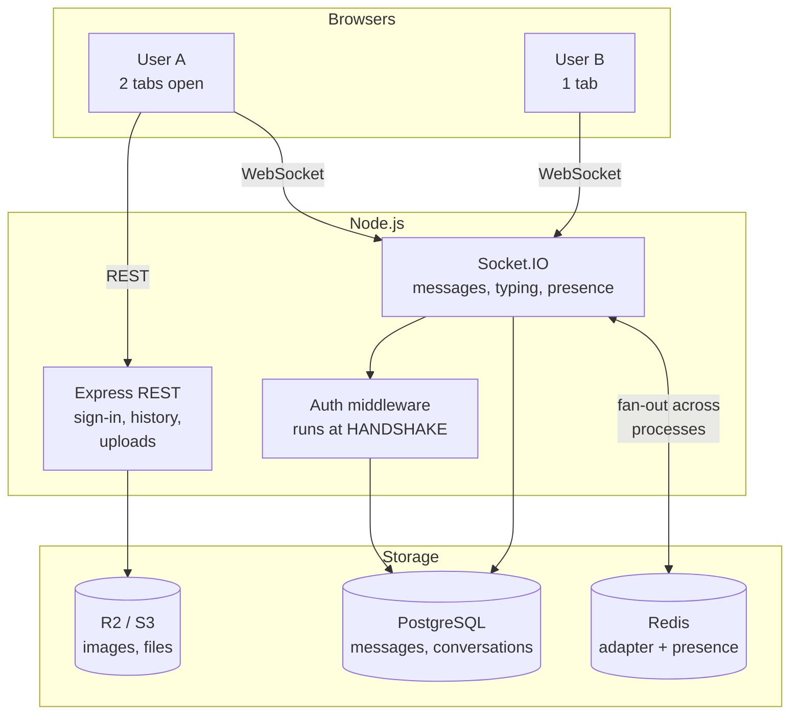
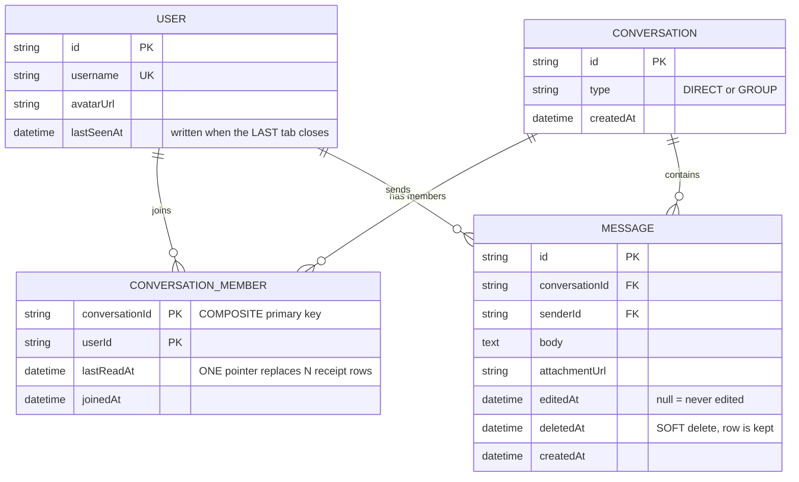
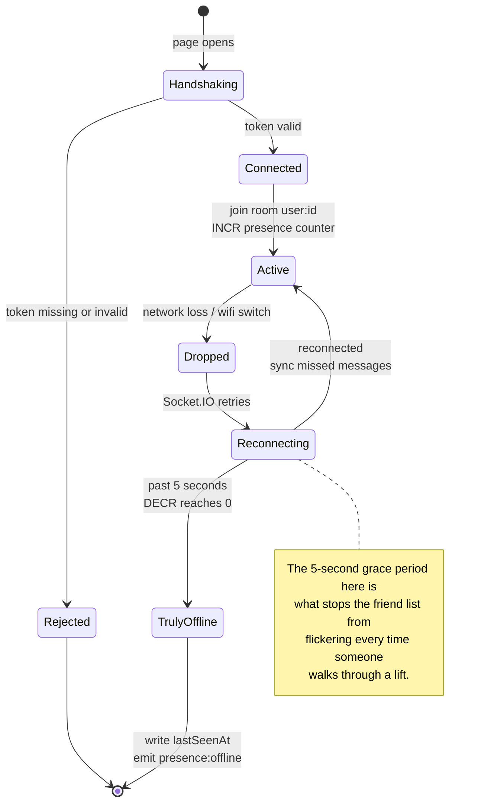

# Real-Time Chat App (1-1)

In the previous two projects, everything started with the browser asking and the server answering. This one breaks that model: **the server has to push data to a browser that did not ask for it**. That is the whole difference between HTTP and WebSocket, and it drags in a set of problems REST never had: long-lived connections, state held in memory, message ordering, and the question of what happens when the recipient is offline.

Chat is the classic exercise because it is small in features and complete in concepts. If you understand why `socket.id` cannot be used as a user identifier, you have understood the hardest part of every real-time system.

---

## What you are going to build

- Conversation list, 1-to-1 messages in real time
- Typing indicators, online / offline presence
- Read receipts, accurate down to the individual message
- Image and file attachments
- Search through history, edit and delete messages
- No lost messages when the recipient is offline

---

## HTTP is not enough, and the three things people tried

| Approach | How it works | Why not for chat |
|---|---|---|
| **Polling** | Client asks every 2 seconds | 30 requests/minute/person even with no traffic. 1,000 users = 30,000 requests/minute to say "nothing new" |
| **Long polling** | Server holds the request until data arrives | Better, but each message still costs a fresh connection setup |
| **Server-Sent Events** | Server pushes one-way over HTTP | One-way only. Sending still needs a separate POST, and there is nothing for typing indicators |
| **WebSocket** | Two-way channel, held open | The right fit. Trade-off: stateful connections, harder to scale horizontally |

Socket.IO wraps WebSocket and adds three things worth having: automatic reconnection when the network drops, automatic fallback to long-polling where WebSocket is blocked, and the concept of "rooms" for broadcasting to a group.

---

## Architecture



Note carefully: **Redis here is not a cache.** It is the adapter that lets several Node processes serve one chat room. Run two processes (or two containers) and user A may land on process 1 while B lands on process 2. Without the adapter, `io.to(room).emit(...)` from process 1 never reaches B. This is the classic failure: works perfectly on a single-process dev machine, dies the moment you deploy two replicas.

---

## Authentication: at the handshake, not afterwards

```ts
// src/socket/index.ts
import { Server } from 'socket.io';
import { createAdapter } from '@socket.io/redis-adapter';
import jwt from 'jsonwebtoken';
import { redis } from '../config/redis';
import { prisma } from '../config/database';

export function initSocket(httpServer: HttpServer) {
  const io = new Server(httpServer, {
    cors: { origin: process.env.CLIENT_ORIGIN, credentials: true },
  });

  // Two separate Redis connections: pub and sub. A Redis connection
  // in subscribe mode CANNOT run publish commands — that is a Redis
  // protocol constraint, not a Socket.IO one.
  io.adapter(createAdapter(redis.duplicate(), redis.duplicate()));

  // This middleware runs ONCE at the handshake, before the socket
  // counts as connected. Check here rather than inside each event
  // handler: check in the handler and an unauthenticated socket is
  // already in the connection list and already receiving broadcasts.
  io.use(async (socket, next) => {
    try {
      // The token comes from an httpOnly cookie, NOT a query string.
      // Query strings live in the URL and therefore land in the access
      // logs of every proxy along the way — tokens leaking into logs
      // happens far more often than people expect.
      const raw = socket.handshake.headers.cookie ?? '';
      const token = raw.match(/token=([^;]+)/)?.[1];
      if (!token) return next(new Error('unauthorized'));

      const payload = jwt.verify(token, process.env.JWT_SECRET!) as { sub: string };
      const user = await prisma.user.findUnique({
        where: { id: payload.sub },
        select: { id: true, username: true, avatarUrl: true },
      });
      if (!user) return next(new Error('unauthorized'));

      socket.data.user = user;
      next();
    } catch {
      next(new Error('unauthorized'));
    }
  });

  io.on('connection', (socket) => {
    const userId = socket.data.user.id as string;

    // A private room keyed by userId, NOT by socket.id.
    //
    // socket.id changes on every reconnect — a 3-second network drop
    // produces a new one. And one person can have several tabs, each
    // with its own socket.id. Sending by socket.id means: wrong target
    // after a reconnect, and only one tab receiving the message.
    socket.join(`user:${userId}`);

    registerPresence(io, socket, userId);
    registerMessaging(io, socket, userId);
    registerTyping(io, socket, userId);
  });

  return io;
}
```

The `user:${userId}` convention instead of `socket.id` is the first thing to internalise about Socket.IO. It solves three problems at once: multiple tabs, reconnection, and multiple server processes.

---

## Presence: count, do not toggle

The naive approach: set `online = true` on connect, `false` on disconnect. The trap: a user opens two tabs and closes one — the flag goes to `false` while they are still online in the other.

```ts
// src/socket/presence.ts
export function registerPresence(io: Server, socket: Socket, userId: string) {
  const key = `presence:${userId}`;

  socket.on('disconnect', async () => {
    // Decrement. Only zero means genuinely offline.
    const remaining = await redis.decr(key);
    if (remaining <= 0) {
      await redis.del(key);
      // Wait 5 seconds before announcing offline: a user switching
      // from wifi to 4G drops and reconnects within 1–3 seconds.
      // Announcing immediately makes everyone's friend list flicker.
      setTimeout(async () => {
        const stillGone = (await redis.get(key)) === null;
        if (stillGone) {
          await prisma.user.update({
            where: { id: userId },
            data: { lastSeenAt: new Date() },
          });
          io.emit('presence:offline', { userId });
        }
      }, 5_000);
    }
  });

  redis.incr(key).then((count) => {
    // Only the FIRST tab emits an online event. The second tab is not
    // a new event — the user was already online.
    if (count === 1) io.emit('presence:online', { userId });
  });
}
```

The 5-second grace period before announcing offline is a small detail with a large effect on how the product feels. Without it, everyone in the friend list blinks on and off every time they walk through a lift.

---

## Sending messages: persist first, broadcast second

```ts
// src/socket/messaging.ts
export function registerMessaging(io: Server, socket: Socket, userId: string) {
  socket.on('message:send', async (payload, ack) => {
    try {
      const { conversationId, body, clientId } = payload;

      // Authorisation: is the sender actually in this conversation?
      // Skip this and anyone can post into someone else's conversation
      // just by guessing a conversationId — the same IDOR bug as in the
      // Todo project, arriving over WebSocket instead of HTTP.
      const member = await prisma.conversationMember.findUnique({
        where: { conversationId_userId: { conversationId, userId } },
      });
      if (!member) return ack?.({ ok: false, error: 'forbidden' });

      // PERSIST FIRST, BROADCAST SECOND. Reverse the order and the
      // recipient sees a message on screen, then the database write
      // fails, and the message vanishes on refresh — the kind of bug
      // that destroys trust in the whole product.
      const message = await prisma.message.create({
        data: { conversationId, senderId: userId, body: body.slice(0, 4000) },
        include: { sender: { select: { id: true, username: true, avatarUrl: true } } },
      });

      // Broadcast to every member including the sender — so their own
      // other tabs also show the message they just sent.
      const members = await prisma.conversationMember.findMany({
        where: { conversationId },
        select: { userId: true },
      });
      for (const m of members) {
        io.to(`user:${m.userId}`).emit('message:new', message);
      }

      // clientId is echoed in the ack so the client can match its
      // optimistic bubble to the real record. Without it, the client
      // cannot tell which "sending" message was confirmed and shows
      // the message twice.
      ack?.({ ok: true, message, clientId });
    } catch (err) {
      console.error('[message:send]', err);
      ack?.({ ok: false, error: 'internal' });
    }
  });
}
```

Socket.IO's `ack` (acknowledgement callback) is underused and very much worth using: it gives an event a response, the way HTTP has one, so the client knows whether a send succeeded rather than guessing.

---

## The data model



The many-to-many between `USER` and `CONVERSATION` runs through the `CONVERSATION_MEMBER` join table — which is why group chat later needs no schema change, only extra rows.

And here is the lifecycle of a WebSocket connection, which drives most of how the product feels:



```prisma
model Conversation {
  id        String   @id @default(cuid())
  // The type field is here for group chat later. Model membership as
  // many-to-many from day one even though only 1-1 exists now:
  // migrating from userAId/userBId columns to a members table later is
  // painful, whereas an extra table costs nothing.
  type      String   @default("DIRECT")  // DIRECT | GROUP
  members   ConversationMember[]
  messages  Message[]
  createdAt DateTime @default(now())

  @@map("conversations")
}

model ConversationMember {
  conversationId String
  userId         String
  conversation   Conversation @relation(fields: [conversationId], references: [id], onDelete: Cascade)
  user           User         @relation(fields: [userId], references: [id], onDelete: Cascade)

  // A "read up to here" pointer. One pointer per person rather than a
  // read-receipt row per (message, reader) pair: with 10,000 messages
  // and 2 people, the other design produces 20,000 rows just to answer
  // "has this been seen".
  lastReadAt     DateTime?
  joinedAt       DateTime  @default(now())

  @@id([conversationId, userId])
  @@index([userId])
  @@map("conversation_members")
}

model Message {
  id             String   @id @default(cuid())
  conversationId String
  senderId       String
  body           String   @db.Text
  attachmentUrl  String?
  editedAt       DateTime?
  // Soft delete: keep the row so ordering and counts stay intact, just
  // mark it deleted. Hard deletes break the lastReadAt pointer and make
  // cursor pagination jump around.
  deletedAt      DateTime?
  createdAt      DateTime @default(now())

  conversation Conversation @relation(fields: [conversationId], references: [id], onDelete: Cascade)
  sender       User         @relation(fields: [senderId], references: [id], onDelete: Cascade)

  // The index matches the one query the chat screen ever runs:
  // "messages in conversation X, newest first, 50 of them".
  @@index([conversationId, createdAt])
  @@map("messages")
}
```

Choosing `lastReadAt` over a detailed read-receipt table is a deliberate trade-off: you cannot directly answer "who read message 47", but you can derive it (everyone whose `lastReadAt >= createdAt` of that message). In exchange, row count does not grow as messages × users.

---

## Pagination: do not use OFFSET

```ts
// The wrong way — looks right, breaks when new messages arrive.
const messages = await prisma.message.findMany({
  where: { conversationId },
  orderBy: { createdAt: 'desc' },
  skip: page * 50,     // <-- the problem is here
  take: 50,
});
```

The user scrolls up to read older messages. Meanwhile 3 new messages arrive. Everything shifts by 3, and the next page repeats 3 messages they just read. With a large `OFFSET`, Postgres also has to read and discard every skipped row — each scroll is slower than the last.

```ts
// The right way — cursor pagination.
const messages = await prisma.message.findMany({
  where: {
    conversationId,
    // Fetch messages OLDER than the last one displayed. The anchor is a
    // real value in the data, so newly arriving messages shift nothing.
    ...(cursor ? { createdAt: { lt: new Date(cursor) } } : {}),
  },
  orderBy: { createdAt: 'desc' },
  take: 50,
});
```

Cursor pagination is the standard pattern for any list that can change while the user is browsing it — feeds, notifications, logs. Learn it once, use it forever.

---

## Typing indicators: do not emit per keystroke

The naive approach: emit on every `keydown`. Someone typing 60 words per minute generates roughly 300 events per minute per conversation.

```ts
// Client side — throttle, not debounce.
let lastSent = 0;
input.addEventListener('input', () => {
  const now = Date.now();
  // Throttle: at most one event every 2 seconds while typing continues.
  // Debounce would only fire when the user STOPS typing — the exact
  // opposite of what "is typing" means.
  if (now - lastSent > 2000) {
    socket.emit('typing:start', { conversationId });
    lastSent = now;
  }
  clearTimeout(stopTimer);
  stopTimer = setTimeout(() => {
    socket.emit('typing:stop', { conversationId });
    lastSent = 0;
  }, 3000);
});
```

And on the server, **never persist typing state to the database.** It is data that lives for a few seconds; writing it to Postgres turns a decorative feature into a constant write load.

---

## Traps, written down

| Symptom | Actual cause | Fix |
|---|---|---|
| Works in dev, breaks with 2 containers | No Redis adapter | `createAdapter(pub, sub)` with two separate connections |
| Messages appear in only one tab | Sending by `socket.id` | Send to the `user:${userId}` room |
| Friend list flickers online/offline | No grace period on disconnect | Wait 5 seconds before confirming offline |
| Closing one tab drops online status | Boolean flag instead of a counter | `INCR`/`DECR` in Redis |
| Scrolling up repeats messages | OFFSET pagination | Switch to a `createdAt` cursor |
| Messages appear then vanish on refresh | Broadcast before persist | Always write to the database first |
| Tokens showing up in nginx logs | Token passed in the query string | Read the httpOnly cookie at handshake |
| Server slows down over time | Timers not cleaned up on disconnect | Socket.IO cleans its own listeners; your timers are yours |

---

## When it counts as finished

- [ ] Two server processes behind a load balancer, and messages still arrive correctly
- [ ] Three tabs on one account, close two, status is still online
- [ ] Kill wifi for 10 seconds and restore it: auto-reconnect with no lost messages
- [ ] Send 500 messages then scroll back with nothing repeated or missing
- [ ] A stranger calling `message:send` with someone else's conversationId is rejected
- [ ] Closing a tab mid-typing does not leave the other person stuck on "typing…"

---

## Where to go next

1. **Group chat.** The schema already allows it. New problem: one message to 200 people is 200 emits, and "who has read this" becomes expensive.
2. **End-to-end encryption.** The server cannot read message content. The new problem is key exchange (X3DH) and key storage across devices.
3. **Push notifications when offline.** Web Push for browsers, FCM/APNs for mobile — and the hard question: which of a user's five devices should get the notification.
