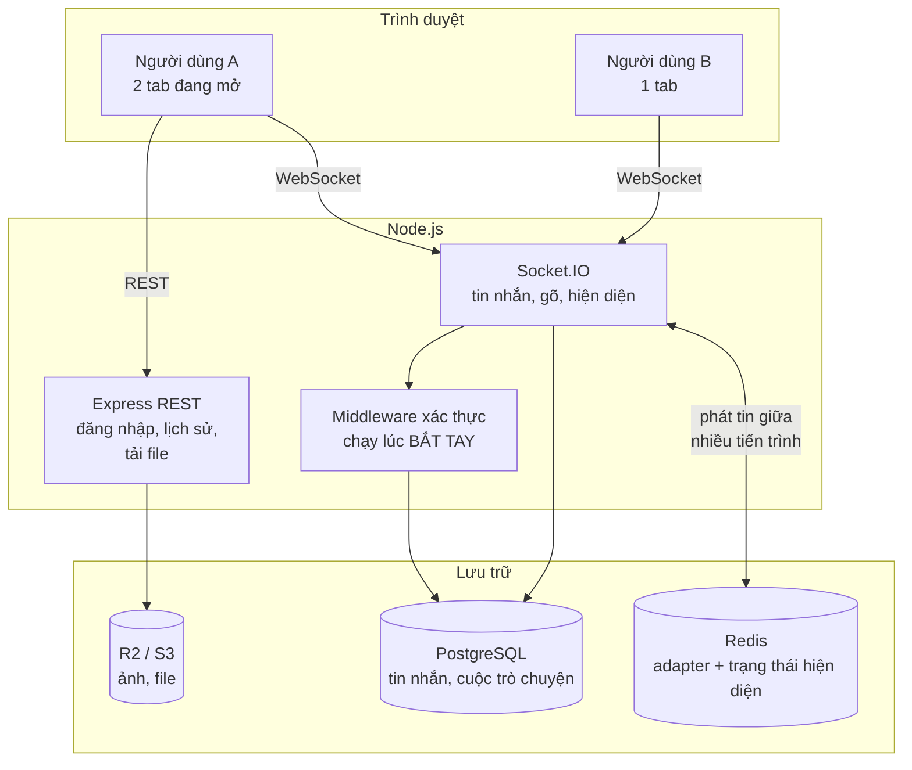
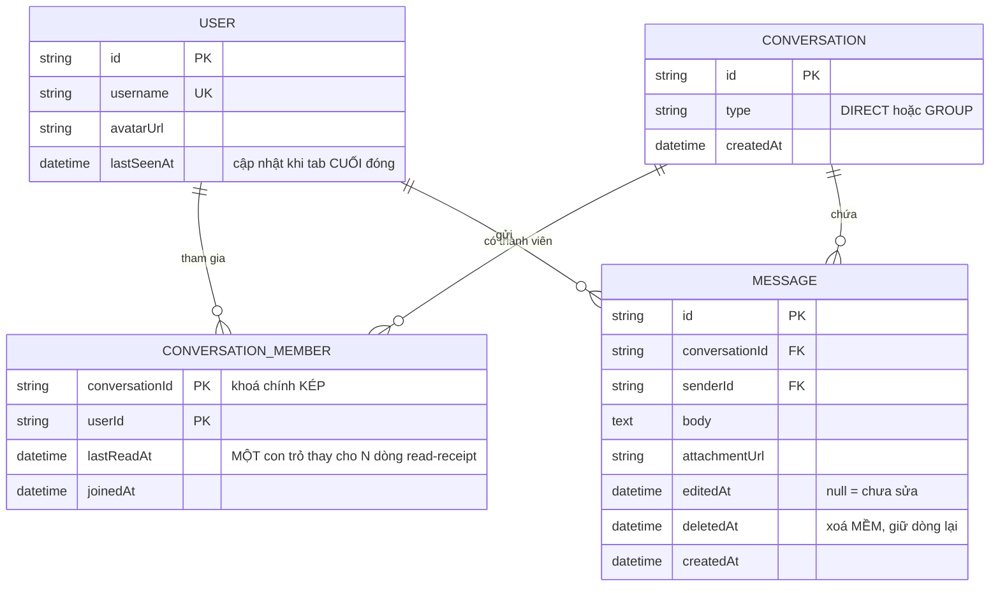
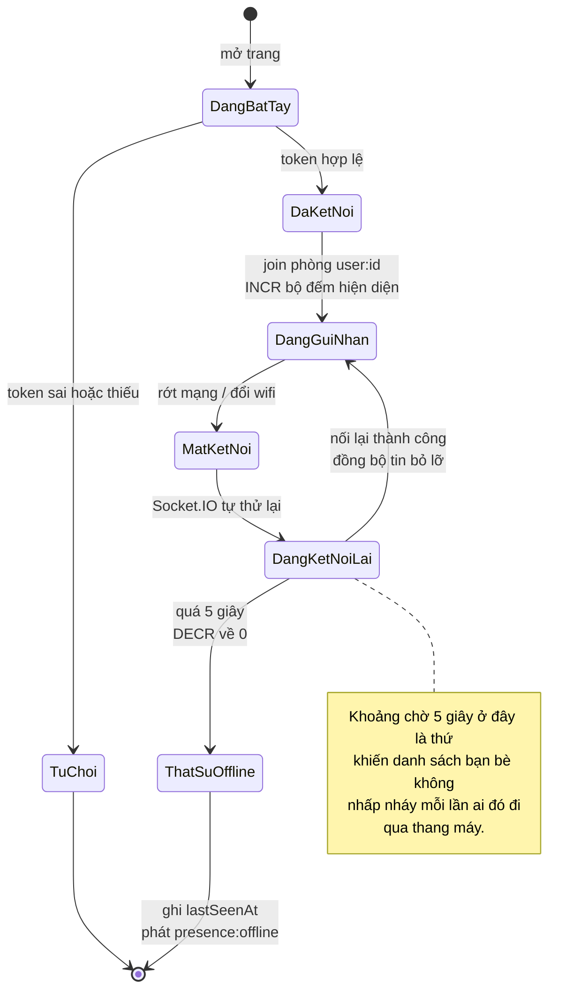

# Real-Time Chat App (1-1)

Ở hai dự án trước, mọi thứ bắt đầu bằng việc trình duyệt hỏi và server trả lời. Dự án này phá vỡ mô hình đó: **server phải chủ động gửi dữ liệu cho một trình duyệt mà không ai hỏi nó cả**. Đó là toàn bộ khác biệt giữa HTTP và WebSocket, và nó kéo theo một loạt vấn đề mới mà REST không có: kết nối sống lâu, trạng thái nằm trong bộ nhớ, thứ tự tin nhắn, và câu hỏi "chuyện gì xảy ra khi người nhận đang offline".

Chat là bài tập kinh điển vì nó nhỏ về tính năng nhưng đầy đủ về khái niệm. Nếu bạn hiểu vì sao `socket.id` không dùng làm định danh người dùng được, bạn đã hiểu phần khó nhất của mọi hệ thống realtime.

---

## Bạn sẽ dựng ra cái gì

- Danh sách cuộc trò chuyện, tin nhắn 1-1 thời gian thực
- Đang gõ (typing indicator), trực tuyến / ngoại tuyến
- Đã xem (read receipt) chính xác tới từng tin nhắn
- Gửi ảnh và file
- Tìm kiếm trong lịch sử, sửa và xoá tin nhắn
- Tin nhắn không mất khi người nhận đang offline

---

## HTTP không đủ, và ba cách người ta từng thử

| Cách | Nguyên lý | Vì sao không dùng cho chat |
|---|---|---|
| **Polling** | Client hỏi server mỗi 2 giây | 30 request/phút/người dù không có tin gì. 1.000 người = 30.000 request/phút để trả về "không có gì mới" |
| **Long polling** | Server giữ request đến khi có dữ liệu | Tốt hơn, nhưng mỗi tin nhắn vẫn tốn một vòng thiết lập kết nối mới |
| **Server-Sent Events** | Server đẩy một chiều qua HTTP | Chỉ một chiều. Gửi tin vẫn phải POST riêng, và không có gì cho typing indicator |
| **WebSocket** | Kênh hai chiều, giữ mở | Đúng bài toán. Đánh đổi: kết nối có trạng thái, khó mở rộng ngang hơn |

Socket.IO là một lớp bọc trên WebSocket, thêm ba thứ đáng giá: tự động kết nối lại khi rớt mạng, tự động lùi về long-polling ở môi trường chặn WebSocket, và khái niệm "phòng" (room) để gửi cho một nhóm người.

---

## Kiến trúc



Điểm cần chú ý: **Redis ở đây không phải cache.** Nó là adapter để nhiều tiến trình Node cùng phục vụ một phòng chat. Khi bạn chạy hai tiến trình (hoặc hai container), người dùng A có thể nối vào tiến trình 1 còn B nối vào tiến trình 2. Không có adapter, `io.to(room).emit(...)` từ tiến trình 1 sẽ không bao giờ tới B. Đây là lỗi kinh điển: chạy tốt trên máy dev một tiến trình, chết ngay khi deploy có hai bản sao.

---

## Xác thực: phải làm lúc bắt tay, không phải sau

```ts
// src/socket/index.ts
import { Server } from 'socket.io';
import { createAdapter } from '@socket.io/redis-adapter';
import jwt from 'jsonwebtoken';
import { redis } from '../config/redis';
import { prisma } from '../config/database';

export function initSocket(httpServer: HttpServer) {
  const io = new Server(httpServer, {
    cors: { origin: process.env.CLIENT_ORIGIN, credentials: true },
  });

  // Hai kết nối Redis riêng: pub và sub. Một kết nối Redis đang ở
  // chế độ subscribe KHÔNG chạy được lệnh publish — đây là ràng
  // buộc của giao thức Redis, không phải của Socket.IO.
  io.adapter(createAdapter(redis.duplicate(), redis.duplicate()));

  // Middleware chạy MỘT LẦN lúc bắt tay, trước khi socket được
  // coi là đã kết nối. Kiểm tra ở đây thay vì trong từng event
  // handler: nếu kiểm trong handler, một socket chưa xác thực vẫn
  // đã ở trong danh sách kết nối và vẫn nhận được broadcast.
  io.use(async (socket, next) => {
    try {
      // Token lấy từ cookie httpOnly, KHÔNG phải từ query string.
      // Query string nằm trong URL nên bị ghi vào log truy cập của
      // mọi proxy trên đường đi — token rò rỉ vào log là chuyện
      // xảy ra thường xuyên hơn người ta tưởng.
      const raw = socket.handshake.headers.cookie ?? '';
      const token = raw.match(/token=([^;]+)/)?.[1];
      if (!token) return next(new Error('unauthorized'));

      const payload = jwt.verify(token, process.env.JWT_SECRET!) as { sub: string };
      const user = await prisma.user.findUnique({
        where: { id: payload.sub },
        select: { id: true, username: true, avatarUrl: true },
      });
      if (!user) return next(new Error('unauthorized'));

      socket.data.user = user;
      next();
    } catch {
      next(new Error('unauthorized'));
    }
  });

  io.on('connection', (socket) => {
    const userId = socket.data.user.id as string;

    // Phòng riêng theo userId, KHÔNG dùng socket.id.
    //
    // socket.id đổi mỗi lần kết nối lại — mất mạng 3 giây là có id
    // mới. Và một người có thể mở nhiều tab, mỗi tab một socket.id.
    // Gửi tin theo socket.id nghĩa là: gửi nhầm sau khi rớt mạng,
    // và chỉ một tab nhận được.
    socket.join(`user:${userId}`);

    registerPresence(io, socket, userId);
    registerMessaging(io, socket, userId);
    registerTyping(io, socket, userId);
  });

  return io;
}
```

Quy tắc `user:${userId}` thay cho `socket.id` là thứ đầu tiên cần nhớ về Socket.IO. Nó giải quyết cùng lúc ba vấn đề: nhiều tab, kết nối lại, và nhiều tiến trình server.

---

## Hiện diện: đếm chứ không phải bật/tắt

Cách làm ngây thơ: kết nối thì đặt `online = true`, ngắt thì `online = false`. Bẫy: người dùng mở hai tab rồi đóng một tab — cờ về `false` trong khi họ vẫn đang online ở tab kia.

```ts
// src/socket/presence.ts
export function registerPresence(io: Server, socket: Socket, userId: string) {
  const key = `presence:${userId}`;

  socket.on('disconnect', async () => {
    // Giảm bộ đếm. Chỉ khi về 0 mới thực sự là offline.
    const remaining = await redis.decr(key);
    if (remaining <= 0) {
      await redis.del(key);
      // Chờ 5 giây trước khi báo offline: người dùng chuyển mạng
      // wifi sang 4G sẽ rớt rồi nối lại trong khoảng 1-3 giây.
      // Báo offline ngay khiến danh sách bạn bè nhấp nháy liên tục.
      setTimeout(async () => {
        const stillGone = (await redis.get(key)) === null;
        if (stillGone) {
          await prisma.user.update({
            where: { id: userId },
            data: { lastSeenAt: new Date() },
          });
          io.emit('presence:offline', { userId });
        }
      }, 5_000);
    }
  });

  redis.incr(key).then((count) => {
    // Chỉ phát sự kiện online ở tab ĐẦU TIÊN. Tab thứ hai không
    // tạo ra sự kiện mới — người dùng đã online từ trước rồi.
    if (count === 1) io.emit('presence:online', { userId });
  });
}
```

Khoảng chờ 5 giây trước khi báo offline là chi tiết nhỏ nhưng tạo khác biệt lớn về cảm nhận. Không có nó, mọi người trong danh sách bạn bè sẽ nhấp nháy online/offline mỗi khi họ đi qua thang máy.

---

## Gửi tin nhắn: lưu trước, phát sau

```ts
// src/socket/messaging.ts
export function registerMessaging(io: Server, socket: Socket, userId: string) {
  socket.on('message:send', async (payload, ack) => {
    try {
      const { conversationId, body, clientId } = payload;

      // Kiểm tra quyền: người gửi có thuộc cuộc trò chuyện này không.
      // Thiếu bước này, bất kỳ ai cũng gửi tin vào cuộc trò chuyện
      // của người khác chỉ bằng cách đoán conversationId — đúng
      // lỗi IDOR của dự án Todo, nhưng qua đường WebSocket.
      const member = await prisma.conversationMember.findUnique({
        where: { conversationId_userId: { conversationId, userId } },
      });
      if (!member) return ack?.({ ok: false, error: 'forbidden' });

      // LƯU TRƯỚC, PHÁT SAU. Làm ngược lại thì người nhận thấy tin
      // nhắn trên màn hình, rồi database ghi lỗi, và tin đó biến mất
      // khi tải lại trang — kiểu lỗi khiến người dùng mất niềm tin
      // vào cả sản phẩm.
      const message = await prisma.message.create({
        data: { conversationId, senderId: userId, body: body.slice(0, 4000) },
        include: { sender: { select: { id: true, username: true, avatarUrl: true } } },
      });

      // Phát cho mọi thành viên, kể cả người gửi — để các tab khác
      // của chính họ cũng thấy tin vừa gửi.
      const members = await prisma.conversationMember.findMany({
        where: { conversationId },
        select: { userId: true },
      });
      for (const m of members) {
        io.to(`user:${m.userId}`).emit('message:new', message);
      }

      // clientId trả về trong ack để client khớp tin nhắn lạc quan
      // của nó với bản ghi thật. Không có nó, client không biết tin
      // "đang gửi" nào vừa được xác nhận và sẽ hiện tin nhắn hai lần.
      ack?.({ ok: true, message, clientId });
    } catch (err) {
      console.error('[message:send]', err);
      ack?.({ ok: false, error: 'internal' });
    }
  });
}
```

Cơ chế `ack` (acknowledgement callback) của Socket.IO ít người dùng nhưng rất đáng dùng: nó cho phép một sự kiện có phản hồi giống như HTTP, nghĩa là client biết được tin đã gửi thành công hay chưa thay vì phải đoán.

---

## Lược đồ dữ liệu



Quan hệ nhiều-nhiều giữa `USER` và `CONVERSATION` đi qua bảng trung gian `CONVERSATION_MEMBER` — đó là lý do chat nhóm về sau không cần đổi schema, chỉ cần thêm dòng.

Và đây là vòng đời một kết nối WebSocket, thứ quyết định phần lớn cảm nhận của người dùng:



```prisma
model Conversation {
  id        String   @id @default(cuid())
  // Kiểu để sẵn cho nhóm chat sau này. Thiết kế bảng thành viên
  // theo dạng nhiều-nhiều ngay từ đầu, dù hiện tại chỉ dùng 1-1:
  // đổi từ hai cột userAId/userBId sang bảng thành viên về sau là
  // một cuộc di trú đau đớn, còn thừa một bảng thì không tốn gì.
  type      String   @default("DIRECT")  // DIRECT | GROUP
  members   ConversationMember[]
  messages  Message[]
  createdAt DateTime @default(now())

  @@map("conversations")
}

model ConversationMember {
  conversationId String
  userId         String
  conversation   Conversation @relation(fields: [conversationId], references: [id], onDelete: Cascade)
  user           User         @relation(fields: [userId], references: [id], onDelete: Cascade)

  // Con trỏ "đã đọc tới đâu". Lưu MỘT con trỏ cho mỗi người
  // thay vì một dòng read-receipt cho mỗi cặp (tin nhắn, người
  // đọc): với 10.000 tin nhắn và 2 người, cách kia sinh ra 20.000
  // dòng chỉ để trả lời "đã xem chưa".
  lastReadAt     DateTime?
  joinedAt       DateTime  @default(now())

  @@id([conversationId, userId])
  @@index([userId])
  @@map("conversation_members")
}

model Message {
  id             String   @id @default(cuid())
  conversationId String
  senderId       String
  body           String   @db.Text
  attachmentUrl  String?
  editedAt       DateTime?
  // Xoá mềm: giữ dòng lại để không phá vỡ thứ tự và số đếm,
  // chỉ đánh dấu đã xoá. Xoá cứng làm hỏng con trỏ lastReadAt
  // và khiến phân trang theo cursor nhảy lung tung.
  deletedAt      DateTime?
  createdAt      DateTime @default(now())

  conversation Conversation @relation(fields: [conversationId], references: [id], onDelete: Cascade)
  sender       User         @relation(fields: [senderId], references: [id], onDelete: Cascade)

  // Chỉ mục khớp đúng truy vấn duy nhất của màn hình chat:
  // "tin nhắn của cuộc trò chuyện X, mới nhất trước, 50 cái".
  @@index([conversationId, createdAt])
  @@map("messages")
}
```

Quyết định dùng `lastReadAt` thay vì bảng read-receipt chi tiết là một đánh đổi có ý thức: bạn không trả lời được câu "ai đã đọc tin nhắn số 47" một cách trực tiếp, nhưng bạn suy ra được (mọi người có `lastReadAt >= createdAt` của tin đó). Đổi lại, số dòng không tăng theo tích số tin nhắn × người dùng.

---

## Phân trang: đừng dùng OFFSET

```ts
// Cách sai — trông đúng, hỏng khi có tin nhắn mới.
const messages = await prisma.message.findMany({
  where: { conversationId },
  orderBy: { createdAt: 'desc' },
  skip: page * 50,     // <-- vấn đề nằm ở đây
  take: 50,
});
```

Người dùng cuộn lên xem tin cũ. Trong lúc đó có 3 tin nhắn mới tới. Mọi thứ dịch đi 3 vị trí, và trang tiếp theo lặp lại 3 tin họ vừa đọc. Với `OFFSET` lớn, Postgres còn phải đọc và bỏ đi tất cả các dòng bị skip — mỗi lần cuộn lại chậm hơn lần trước.

```ts
// Cách đúng — phân trang theo con trỏ.
const messages = await prisma.message.findMany({
  where: {
    conversationId,
    // Lấy những tin CŨ HƠN tin cuối cùng đã hiển thị. Điểm neo là
    // một giá trị thật trong dữ liệu, nên tin nhắn mới tới không
    // làm dịch chuyển gì cả.
    ...(cursor ? { createdAt: { lt: new Date(cursor) } } : {}),
  },
  orderBy: { createdAt: 'desc' },
  take: 50,
});
```

Phân trang theo cursor là mẫu chuẩn cho mọi danh sách có thể thay đổi trong lúc người dùng đang duyệt — bảng tin, thông báo, nhật ký. Học một lần, dùng mãi.

---

## Typing indicator: đừng phát mỗi phím

Cách ngây thơ: mỗi sự kiện `keydown` phát một event. Người gõ 60 từ/phút tạo ra khoảng 300 event/phút cho mỗi cuộc trò chuyện.

```ts
// Phía client — throttle, không phải debounce.
let lastSent = 0;
input.addEventListener('input', () => {
  const now = Date.now();
  // Throttle: gửi tối đa 1 lần mỗi 2 giây trong lúc đang gõ liên tục.
  // Debounce sẽ chỉ gửi khi người dùng NGỪNG gõ — ngược hoàn toàn
  // với ý nghĩa của "đang gõ".
  if (now - lastSent > 2000) {
    socket.emit('typing:start', { conversationId });
    lastSent = now;
  }
  clearTimeout(stopTimer);
  stopTimer = setTimeout(() => {
    socket.emit('typing:stop', { conversationId });
    lastSent = 0;
  }, 3000);
});
```

Và ở phía server, **không lưu trạng thái typing vào database.** Nó là dữ liệu sống vài giây; ghi vào Postgres là biến một tính năng trang trí thành một nguồn tải ghi liên tục.

---

## Những cái bẫy đã được ghi lại

| Triệu chứng | Nguyên nhân thật | Cách sửa |
|---|---|---|
| Chạy tốt trên máy dev, hỏng khi deploy 2 container | Thiếu Redis adapter | `createAdapter(pub, sub)` với hai kết nối riêng |
| Tin nhắn chỉ hiện ở một tab | Gửi theo `socket.id` | Gửi theo phòng `user:${userId}` |
| Bạn bè nhấp nháy online/offline | Không có khoảng chờ khi ngắt kết nối | Chờ 5 giây rồi mới xác nhận offline |
| Đóng một tab làm mất trạng thái online | Dùng cờ boolean thay vì bộ đếm | `INCR`/`DECR` trên Redis |
| Cuộn lên thấy tin nhắn lặp lại | Phân trang bằng OFFSET | Đổi sang cursor theo `createdAt` |
| Tin nhắn hiện rồi biến mất khi F5 | Phát trước khi lưu | Luôn lưu database trước |
| Token lộ trong log của nginx | Truyền token qua query string | Đọc từ cookie httpOnly lúc bắt tay |
| Server chậm dần theo thời gian | Không dọn listener khi ngắt kết nối | Socket.IO tự dọn, nhưng timer tự tạo thì không |

---

## Khi nào coi như xong

- [ ] Chạy 2 tiến trình server sau một load balancer, tin nhắn vẫn tới đúng
- [ ] Mở 3 tab cùng tài khoản, đóng 2 tab, trạng thái vẫn là online
- [ ] Ngắt wifi 10 giây rồi bật lại: tự kết nối lại và không mất tin nhắn nào
- [ ] Gửi 500 tin nhắn rồi cuộn ngược, không có tin nào lặp hoặc thiếu
- [ ] Người lạ gọi `message:send` với conversationId không thuộc về mình, bị từ chối
- [ ] Tắt tab khi đang gõ, người kia không bị kẹt ở trạng thái "đang gõ..."

---

## Bước tiếp theo

1. **Chat nhóm.** Bảng đã thiết kế sẵn cho việc này. Vấn đề mới: một tin nhắn cho 200 người là 200 lần emit, và câu hỏi "ai đã đọc" trở nên đắt.
2. **Mã hoá đầu cuối.** Server không đọc được nội dung. Bài toán mới là trao đổi khoá (X3DH) và lưu trữ khoá trên nhiều thiết bị.
3. **Thông báo đẩy khi offline.** Web Push cho trình duyệt, FCM/APNs cho di động — và câu hỏi khó: gửi thông báo cho thiết bị nào khi người dùng có năm thiết bị.
