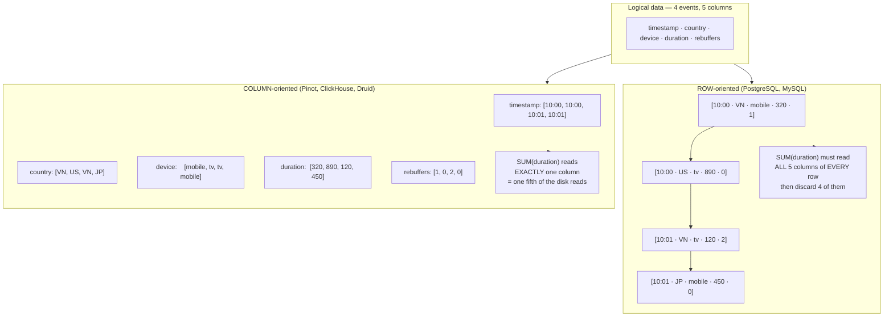
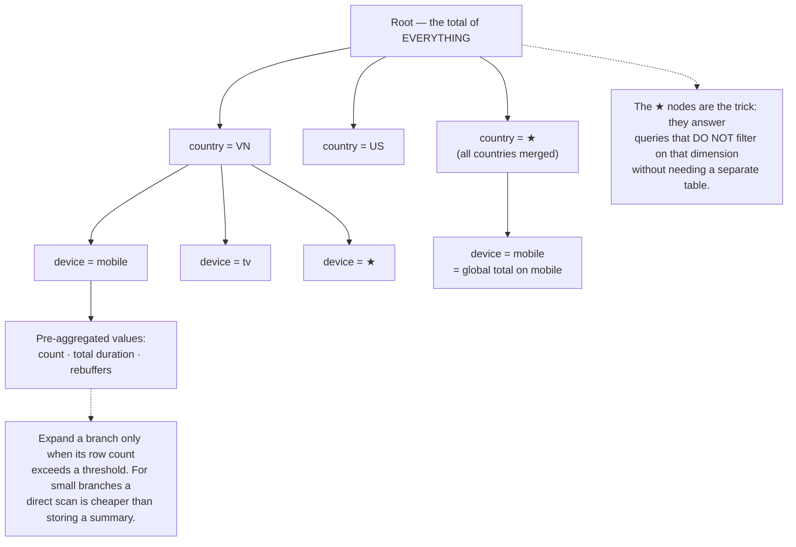
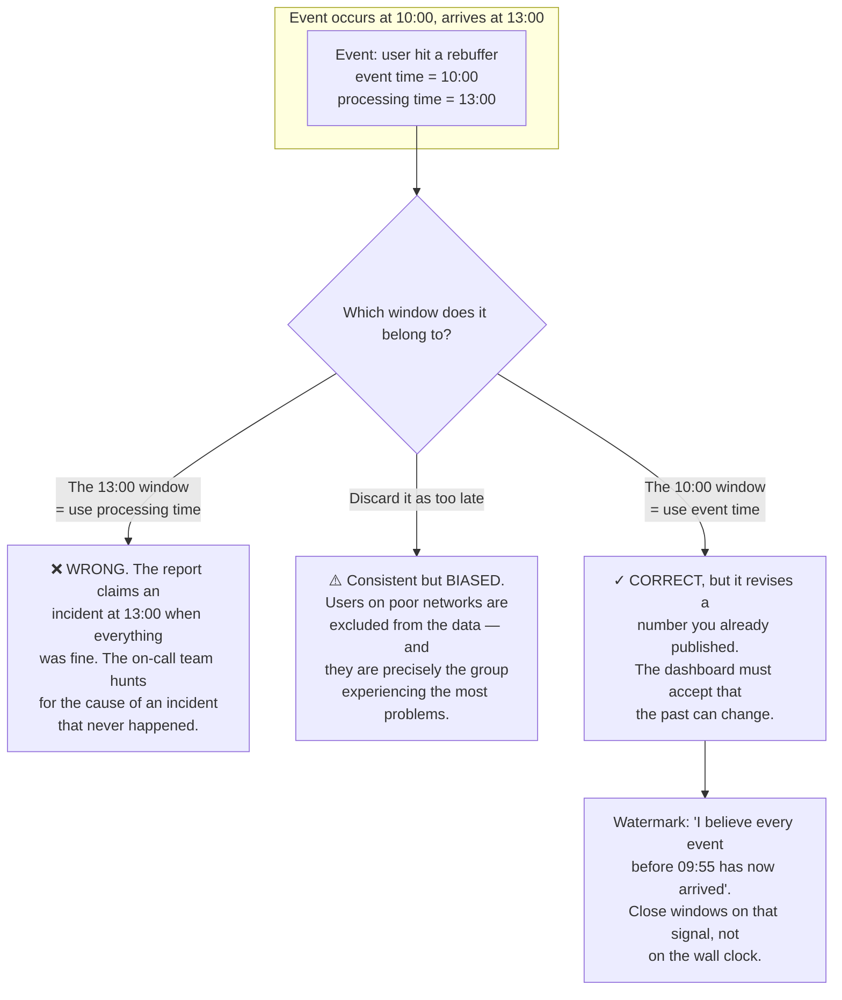
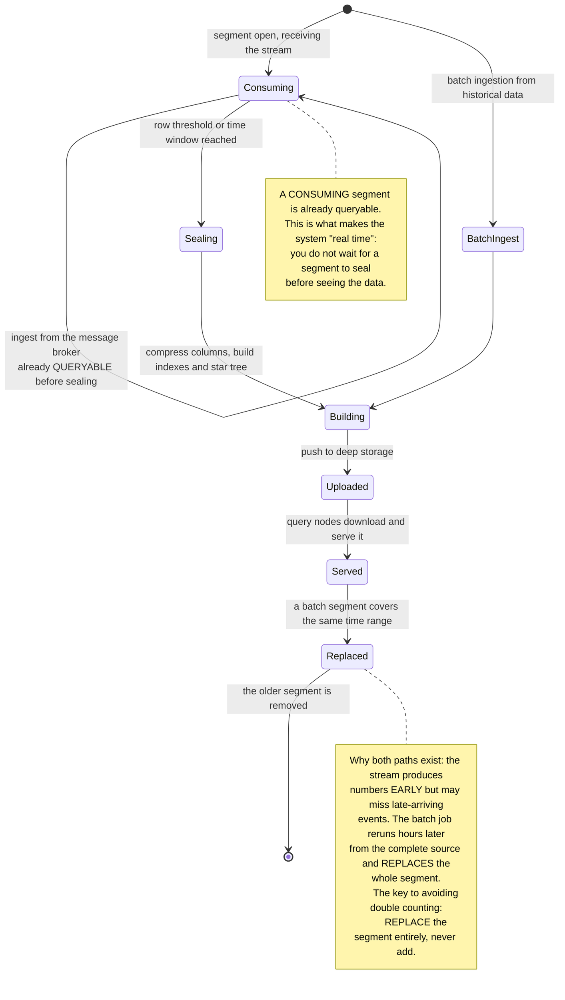
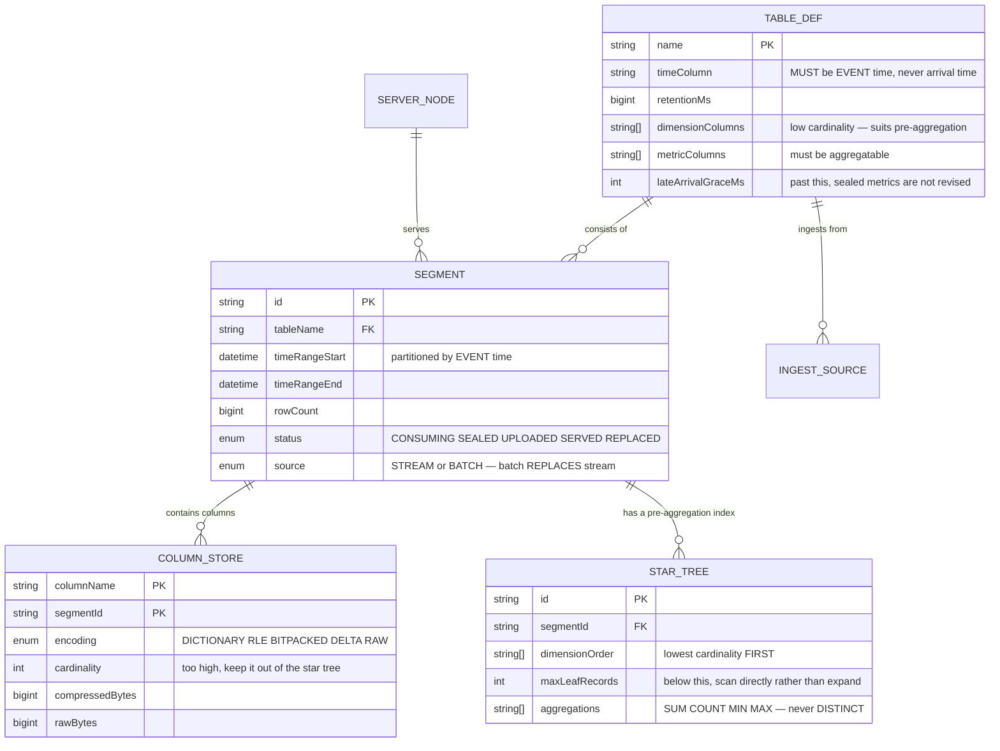

# Real-Time Analytics Platform (Apache Pinot-like)

In [Video Streaming Platform](/projects/video-streaming-platform-netflix-like) you created a `play_events` table, and I made a claim without explaining it: *"this table generates data faster than all the others combined — do not write each event into the primary database."*

This project is that explanation.

The problem is concrete. You have a million events per minute and a dashboard that must answer, in **under 100 milliseconds**, questions like: *"rebuffer ratio by country over the last 5 minutes"*. On PostgreSQL that query scans hundreds of millions of rows. No index saves you, because the problem is not finding one row but **reading and aggregating a great many**.

This is a different kind of database, and it differs from the very first decision: how bytes are laid out on disk.

---

## What you will build

- Real-time stream ingestion and historical batch ingestion in one system
- Columnar storage with several compression layers
- Pre-aggregation indexes for multi-dimensional group-by queries
- Controlled approximation: distinct counts and percentiles
- Late-arriving data handled without double counting
- A self-updating dashboard answering in under 100ms

---

## Row-oriented vs column-oriented: same data, two layouts

This is the root decision, and everything else follows from it.



A 5× saving is already worthwhile. But the real gain is much larger, and it comes from somewhere less obvious: **adjacent values in one column share a type and tend to look alike**, so they compress extremely well.

| Technique | Suits which columns | Result |
|---|---|---|
| Dictionary encoding | Few distinct values (country, device) | `VN, US, VN, JP` → `0, 1, 0, 2` plus a 3-entry lookup |
| Bit packing | After dictionary encoding | 200 countries need 8 bits, not 8 bytes of string |
| Run-length encoding | Sorted, highly repetitive (timestamp) | `10:00 ×2, 10:01 ×2` |
| Delta encoding | Monotonically increasing (timestamps, ids) | Store `0, 0, 60, 60` rather than full values |

Compression ratios of 10–30× are ordinary on real event data. Combined with reading only the needed columns, the total difference reaches **two orders of magnitude** against row storage.

And something more important than compression: **a dictionary-encoded column turns filtering into integer comparison**. `WHERE country = 'VN'` becomes `WHERE code = 0` — comparisons over a contiguous integer array, exactly the work a modern CPU processes many values at a time in a single instruction.

**The cost:** updating one row means touching every column separately, and deletion is worse. That is why these systems are almost always **append-only**. They do not replace a transactional database — they sit beside it.

---

## Pre-aggregation: trading space for latency

Compression and columnar reads get you to a few hundred milliseconds over hundreds of millions of rows. Getting under 100ms means no longer aggregating at query time — **aggregate at ingestion**.

The naive approach builds a summary table for every combination of dimensions. Five dimensions is 2⁵ = 32 tables; ten is 1,024. Combinatorial explosion.

A much tidier structure solves this: the **star tree** — a single tree where each level is a dimension, and **sparse branches are collapsed rather than fully expanded**:



The principle generalises well beyond this system: **precomputation only pays where the data is large enough.** Pre-aggregating a 20-row branch spends space to save a negligible computation.

Three limits to know before trusting pre-aggregation:

- **Only works for aggregations that combine.** Sum, count, min and max merge cleanly. Distinct counts do **not** — the next section handles that.
- **High-cardinality dimensions destroy the tree.** Never put `userId` in a pre-aggregated dimension; leave it to direct scanning.
- **It must be rebuilt when data changes.** So it only suits append-only data — another consequence of the root decision.

---

## Approximation: when an exact answer is not worth its price

`COUNT(DISTINCT userId)` over 500 million rows requires holding the whole id set in memory. It does not combine: the distinct count of two groups merged is **not** the sum of their distinct counts.

You met the answer in [Social Media Platform](/projects/social-media-platform-twitter-like) while computing trending topics: **HyperLogLog**. Here it stops being a trick and becomes a required component:

```sql
-- Store an HLL sketch per small group. The crucial property: two sketches
-- CAN BE MERGED, so aggregation at every level computes from them.
-- 12KB for millions of unique users, error around 0.8%.
SELECT country, hll_cardinality(hll_union_agg(users_sketch)) AS unique_users
  FROM hourly_rollup
 WHERE hour >= now() - interval '24 hours'
 GROUP BY country;
```

Percentiles behave the same way. "p99 latency" by definition requires sorting all the data. A **t-digest** keeps a few-kilobyte summary, merges cleanly, and is most accurate at the tails — exactly where p95 and p99 live.

The real question is not "exact or approximate" but: **what is this number for?** An operational dashboard off by 0.8% changes nobody's decision. A customer invoice off by 0.8% is unacceptable. Choose by purpose, and **label approximations in the interface** — readers deserve to know.

---

## Event time versus processing time: the hardest part

This is what makes real-time analytics far harder than it appears, and it has nothing to do with performance.

Every event has **two** timestamps: when it **happened** on the user's device, and when the system **received** it. Normally they differ by a few hundred milliseconds. But a phone loses signal in a tunnel, the app buffers events, and sends them when connectivity returns — three hours later.



The pragmatic handling, and it is a **product** decision rather than only a technical one:

1. **Always partition by event time.** Processing time is only for monitoring pipeline lag, never for grouping metrics.
2. **Set watermarks from measured percentiles, not guesses.** Measure the real lag of 99% of events and use that number, remeasuring periodically.
3. **Allow revisions within a bounded window.** Say 24 hours: events later than that go to a separate reconciliation table rather than revising sealed metrics.
4. **Tell the reader.** A label saying "the last 6 hours may still change" matters more than every technical optimisation above. Numbers that quietly change are the fastest way to lose trust in a dashboard.

---

## Segment lifecycle: one system, two ingestion paths



That last note answers a question many data architectures struggle with: **how do you get streaming's speed and batch's accuracy without counting anything twice?**

The answer: do not try to blend the two results. Let the batch **entirely replace** the segment the stream produced for the same time range. Replacement is atomic and idempotent; addition is neither.

---

## Metadata



The `source` column with its `STREAM` and `BATCH` values, plus the `REPLACED` status, is the entire double-counting defence expressed in three columns.

---

## Traps worth recording

| Symptom | Actual cause | Fix |
|---|---|---|
| Aggregation queries slow despite indexes | Row storage reads every column then discards | Columnar storage |
| Poor compression, heavy disk use | No dictionary encoding on low-cardinality columns | Dictionary plus bit packing, chosen by cardinality |
| Star tree grows absurdly large | A high-cardinality column used as a dimension | Low-cardinality dimensions only; scan the rest |
| Pre-aggregation does not help `COUNT(DISTINCT)` | Distinct counts do not combine | HyperLogLog sketches, which do |
| Percentiles very slow to compute | Requires sorting all the data | t-digest: mergeable and tail-accurate |
| Reports show an incident when nothing happened | Grouping by **processing** time | Group by **event** time |
| Metrics missing users on poor networks | Late events discarded | A grace window, with its limits stated |
| Yesterday's numbers changed and nobody knows why | Revising the past without saying so | A "may still change" label on recent windows |
| Double counting with both stream and batch | Adding batch results to stream results | Batch **replaces** the whole segment |
| New data never appears on the dashboard | Waiting for segments to seal before querying | Query consuming segments too |
| One node overloaded while others idle | Segments distributed unevenly over time | Rebalance by load, not just by count |
| Storage cost growing without limit | No tiered retention | Downsample old data before deleting it |

---

## When it is genuinely done

- [ ] 500 million rows, a multi-dimensional group-by over the last 5 minutes returns under 100ms
- [ ] Measure compression: better than 10× against raw JSON
- [ ] The same query with and without the star tree: at least a 10× difference
- [ ] Ingest an event with an event time three hours ago: it lands in the **three-hours-ago window**, not the current one
- [ ] That window's metrics are **revised**, and the interface labels it as such
- [ ] Run a batch job over a range already covered by stream data: totals do **not** double
- [ ] Compare approximate `COUNT(DISTINCT)` to the exact figure over 10 million rows: under 1% error
- [ ] A freshly ingested event is queryable within 2 seconds (consuming segments serve queries)
- [ ] Kill a query node: results still return from replicas, neither empty nor missing segments
- [ ] Data past its retention disappears automatically and disk usage falls accordingly

---

## Where to go next

1. **Federated queries.** Hot data here, cold data in object storage, one query spanning both — which is the architecture of [Cloud-native Data Platform](/projects/cloud-native-data-platform).
2. **Anomaly detection.** Alert when a metric departs from its usual pattern rather than when it crosses a fixed threshold. Fixed thresholds are always wrong at weekends and holidays.
3. **A more durable ingestion source.** You are reading from a message broker without knowing its internals — [Distributed Message Broker](/projects/distributed-message-broker-kafka-like) opens that box.
4. **Tiered storage.** Push old segments to object storage, and meet the durability problem of [Cloud Storage System](/projects/cloud-storage-system-s3-like).
