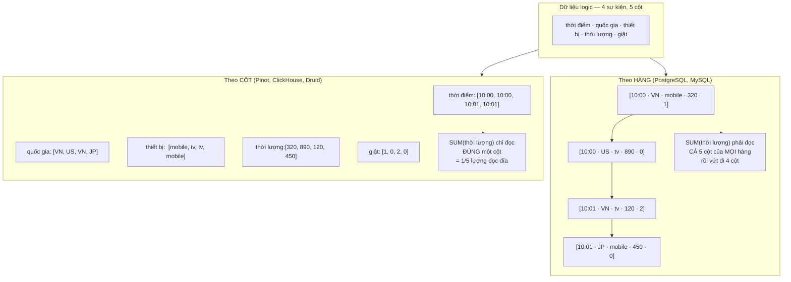
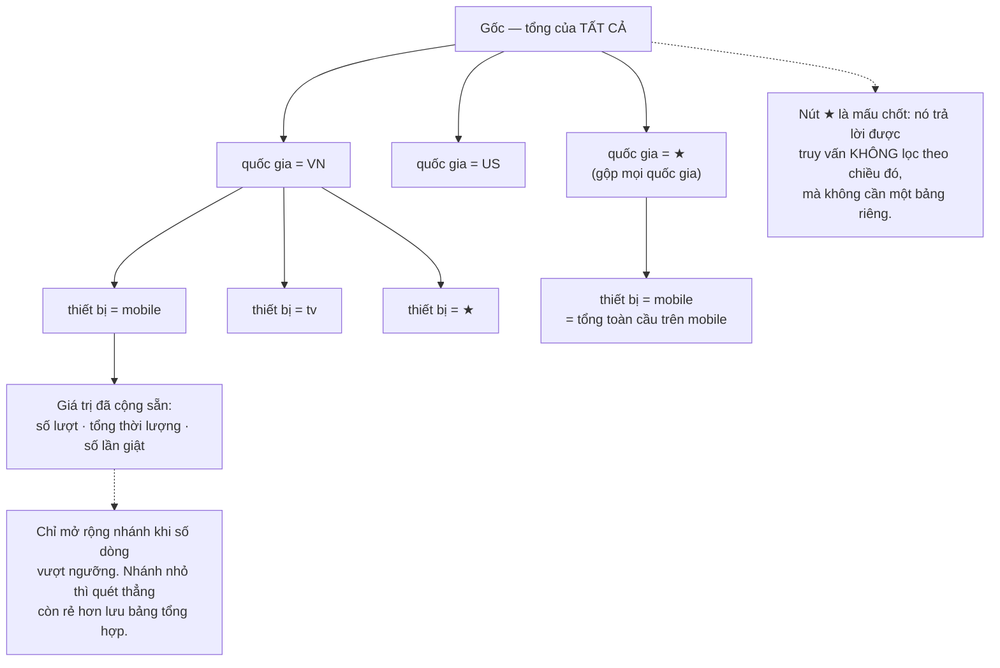
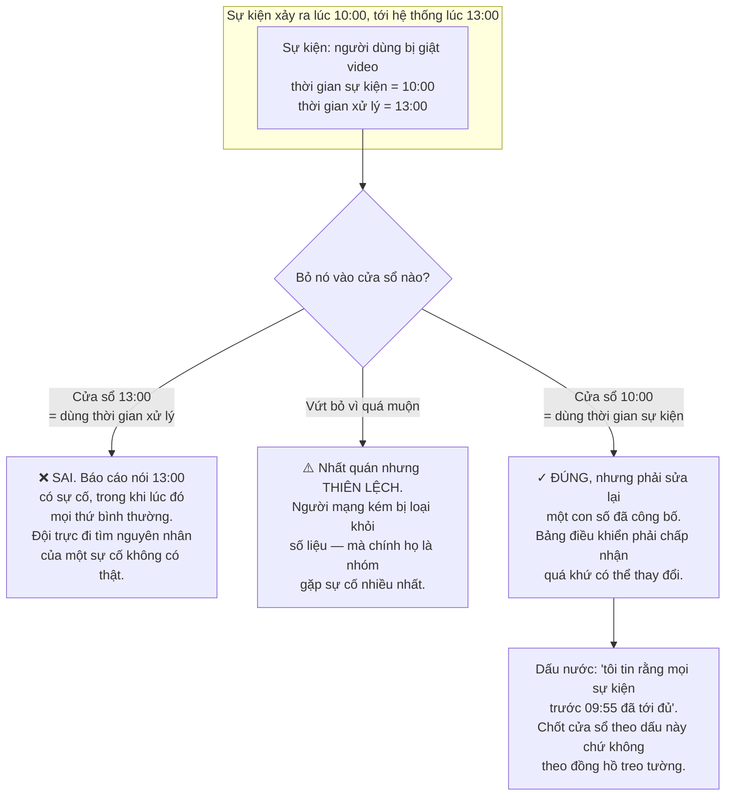
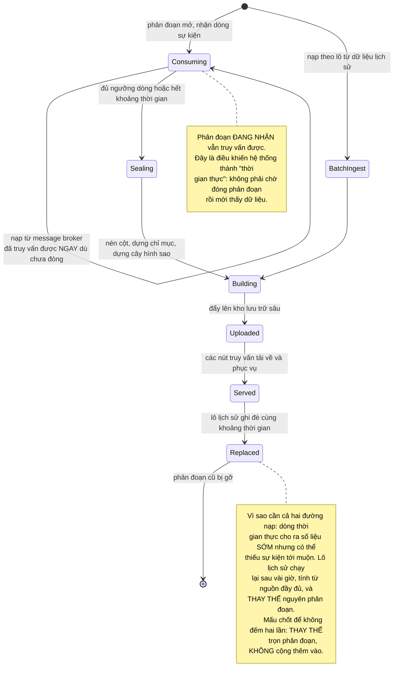
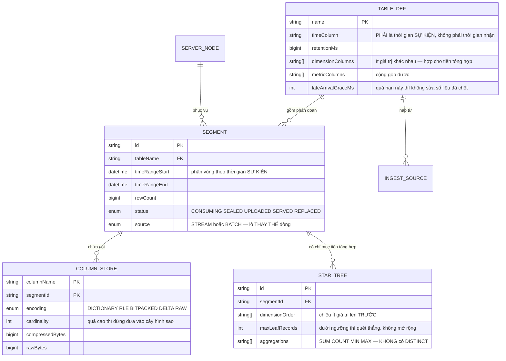

# Real-Time Analytics Platform (Apache Pinot-like)

Ở [Video Streaming Platform](/projects/video-streaming-platform-netflix-like) bạn đã tạo ra bảng `play_events` và tôi đã nói một câu chưa giải thích: *"bảng này sinh dữ liệu nhanh hơn mọi bảng khác cộng lại — đừng ghi từng sự kiện vào database chính."*

Bài này là lời giải thích đó.

Vấn đề rất cụ thể. Bạn có một triệu sự kiện mỗi phút và một bảng điều khiển cần trả lời trong **dưới 100 mili giây** những câu như: *"tỉ lệ giật theo từng quốc gia trong 5 phút qua"*. Trên PostgreSQL, câu đó quét hàng trăm triệu dòng. Không có chỉ mục nào cứu được, vì bài toán không phải tìm một dòng mà là **đọc và cộng gộp rất nhiều dòng**.

Đây là một loại database khác hẳn, và khác ngay từ cách nó đặt byte lên đĩa.

---

## Bạn sẽ dựng ra cái gì

- Nạp dữ liệu theo dòng thời gian thực và theo lô lịch sử, trong cùng một hệ thống
- Lưu trữ theo cột với nhiều tầng nén
- Chỉ mục tiền tổng hợp cho truy vấn nhóm nhiều chiều
- Ước lượng có kiểm soát: đếm số lượng duy nhất và phân vị
- Xử lý dữ liệu tới muộn mà không tính hai lần
- Bảng điều khiển tự cập nhật, truy vấn dưới 100ms

---

## Theo hàng và theo cột: cùng dữ liệu, hai cách đặt lên đĩa

Đây là quyết định gốc, và mọi thứ khác đều là hệ quả của nó.



Tiết kiệm 5 lần đã đáng kể. Nhưng cái lợi thật lớn hơn nhiều, và nó đến từ chỗ ít ai nghĩ tới: **các giá trị cạnh nhau trong một cột cùng kiểu và rất giống nhau**, nên chúng nén cực tốt.

| Kỹ thuật | Cột phù hợp | Kết quả |
|---|---|---|
| Mã hoá từ điển | Ít giá trị khác nhau (quốc gia, thiết bị) | `VN, US, VN, JP` → `0, 1, 0, 2` cộng một bảng tra 3 mục |
| Gói bit | Sau khi mã hoá từ điển | 200 quốc gia cần 8 bit, không phải 8 byte cho chuỗi |
| Mã hoá độ dài chạy | Đã sắp xếp, lặp nhiều (thời điểm) | `10:00 ×2, 10:01 ×2` |
| Mã hoá chênh lệch | Số tăng dần (mốc thời gian, id) | Lưu `0, 0, 60, 60` thay vì giá trị đầy đủ |

Tỉ lệ nén 10–30 lần là bình thường trên dữ liệu sự kiện thật. Cộng với việc chỉ đọc cột cần dùng, chênh lệch tổng có thể lên tới **hai bậc độ lớn** so với lưu theo hàng.

Và một điều còn quan trọng hơn nén: **cột đã mã hoá từ điển thì phép lọc trở thành so sánh số nguyên**. `WHERE quốc_gia = 'VN'` biến thành `WHERE mã = 0` — so sánh trên mảng số nguyên liên tục, đúng loại việc mà CPU hiện đại xử lý nhiều giá trị cùng lúc bằng một lệnh.

**Cái giá:** cập nhật một dòng nghĩa là chạm vào từng cột riêng biệt, và xoá còn tệ hơn. Đó là lý do các hệ thống này gần như luôn **chỉ ghi thêm**. Chúng không thay thế database giao dịch — chúng đứng cạnh nó.

---

## Tiền tổng hợp: đổi dung lượng lấy độ trễ

Nén và đọc theo cột đưa bạn tới khoảng vài trăm mili giây trên hàng trăm triệu dòng. Muốn xuống dưới 100ms thì phải thôi cộng lúc truy vấn — **cộng sẵn từ lúc nạp**.

Cách ngây thơ là dựng bảng tổng hợp cho mọi tổ hợp chiều. Với 5 chiều thì đó là 2⁵ = 32 bảng; với 10 chiều là 1.024. Bùng nổ tổ hợp.

Cấu trúc giải bài này gọn hơn nhiều là **cây hình sao**: một cây duy nhất trong đó mỗi tầng là một chiều, và **các nhánh có ít dữ liệu được gộp lại thay vì mở rộng hết**:



Nguyên tắc rút ra dùng được ở nhiều nơi khác: **tiền tính toán chỉ đáng giá ở nơi dữ liệu đủ lớn.** Cộng sẵn cho một nhánh 20 dòng là tốn chỗ để tiết kiệm một phép tính không đáng kể.

Ba giới hạn cần biết trước khi tin vào tiền tổng hợp:

- **Chỉ dùng được cho hàm cộng gộp được.** Tổng, số lượng, nhỏ nhất, lớn nhất thì gộp được. Số lượng **duy nhất** thì không — phần sau xử lý.
- **Chiều có quá nhiều giá trị thì phá cây.** Không đưa `userId` vào chiều tiền tổng hợp; để nó ở dạng quét thẳng.
- **Phải xây lại khi dữ liệu thay đổi.** Nên nó chỉ hợp với dữ liệu chỉ ghi thêm — lại một hệ quả của quyết định gốc.

---

## Ước lượng: khi câu trả lời chính xác không đáng giá

`COUNT(DISTINCT userId)` trên 500 triệu dòng cần giữ toàn bộ tập id trong bộ nhớ. Nó không cộng gộp được: số duy nhất của hai nhóm gộp lại **không phải** tổng hai số duy nhất.

Bạn đã gặp lời giải này ở [Social Media Platform](/projects/social-media-platform-twitter-like) khi tính chủ đề thịnh hành: **HyperLogLog**. Ở đây nó không còn là mẹo mà là thành phần bắt buộc:

```sql
-- Lưu phác thảo HLL cho mỗi nhóm nhỏ. Điều quan trọng: hai phác thảo
-- GỘP LẠI ĐƯỢC, nên tổng hợp theo mọi cấp đều tính từ chúng.
-- 12KB cho hàng triệu người duy nhất, sai số ~0,8%.
SELECT country, hll_cardinality(hll_union_agg(users_sketch)) AS unique_users
  FROM hourly_rollup
 WHERE hour >= now() - interval '24 hours'
 GROUP BY country;
```

Phân vị cũng vậy. "Độ trễ ở phân vị 99" theo định nghĩa cần sắp xếp toàn bộ dữ liệu. Cấu trúc **t-digest** giữ một bản tóm tắt vài KB, gộp được, và cho sai số rất nhỏ ở hai đuôi — đúng chỗ mà phân vị 95 và 99 quan tâm.

Câu hỏi thật không phải "chính xác hay xấp xỉ" mà là: **con số này dùng để làm gì?** Bảng theo dõi vận hành mà lệch 0,8% thì không ai ra quyết định khác đi. Hoá đơn tính tiền khách hàng thì lệch 0,8% là không chấp nhận được. Chọn theo mục đích, và **ghi rõ trên giao diện cái nào là ước lượng** — người đọc có quyền biết.

---

## Thời gian sự kiện và thời gian xử lý: phần khó nhất

Đây là phần khiến phân tích thời gian thực khó hơn nhiều so với vẻ ngoài, và nó không liên quan gì tới hiệu năng.

Một sự kiện có **hai** mốc thời gian: lúc nó **xảy ra** trên máy người dùng, và lúc hệ thống **nhận được** nó. Bình thường chênh nhau vài trăm mili giây. Nhưng điện thoại mất sóng trong đường hầm, ứng dụng lưu sự kiện lại và gửi khi có mạng — ba giờ sau.



Cách xử lý thực dụng, và nó là một quyết định **sản phẩm** chứ không chỉ kỹ thuật:

1. **Luôn phân vùng theo thời gian sự kiện.** Thời gian xử lý chỉ dùng để theo dõi độ trễ đường ống, không bao giờ dùng để nhóm số liệu.
2. **Đặt dấu nước theo phân vị thật, không theo phỏng đoán.** Đo độ trễ thật của 99% sự kiện rồi lấy con số đó, và đo lại định kỳ.
3. **Cho phép sửa trong một cửa sổ giới hạn.** Ví dụ 24 giờ: sự kiện tới muộn hơn thế thì vào một bảng riêng để đối chiếu, không sửa số liệu đã chốt.
4. **Nói rõ với người đọc.** Nhãn "số liệu 6 giờ gần nhất có thể còn thay đổi" quan trọng hơn mọi tối ưu kỹ thuật ở trên. Con số âm thầm đổi mà không báo là cách nhanh nhất để mất niềm tin vào bảng điều khiển.

---

## Vòng đời phân đoạn: một hệ thống, hai đường nạp



Ghi chú cuối là câu trả lời cho một câu hỏi mà nhiều kiến trúc dữ liệu loay hoay: **làm sao có cả tốc độ của xử lý dòng lẫn độ chính xác của xử lý lô mà không đếm hai lần?**

Trả lời: đừng cố hoà hai kết quả. Cho lô **thay thế trọn vẹn** phân đoạn mà dòng đã tạo, trên cùng một khoảng thời gian. Thay thế là thao tác nguyên tử và luỹ đẳng; cộng gộp thì không.

---

## Siêu dữ liệu



Cột `source` với hai giá trị `STREAM` và `BATCH` cộng trạng thái `REPLACED` chính là toàn bộ cơ chế chống đếm hai lần, gói gọn trong ba cột.

---

## Những cái bẫy đã được ghi lại

| Triệu chứng | Nguyên nhân thật | Cách sửa |
|---|---|---|
| Truy vấn tổng hợp chậm dù đã đánh chỉ mục | Lưu theo hàng, đọc mọi cột rồi vứt đi | Lưu theo cột |
| Nén kém, tốn đĩa | Không mã hoá từ điển cột ít giá trị | Từ điển + gói bit, chọn theo số giá trị khác nhau |
| Cây hình sao phình to vô lý | Đưa cột có quá nhiều giá trị vào chiều | Chỉ chiều ít giá trị; cột nhiều giá trị để quét |
| Tiền tổng hợp không giúp `COUNT(DISTINCT)` | Số duy nhất không cộng gộp được | Phác thảo HyperLogLog, gộp được |
| Phân vị tính rất chậm | Cần sắp xếp toàn bộ dữ liệu | t-digest, gộp được, chính xác ở đuôi |
| Báo cáo chỉ ra sự cố vào lúc không có sự cố | Nhóm theo thời gian **xử lý** | Nhóm theo thời gian **sự kiện** |
| Số liệu thiếu người dùng ở vùng mạng kém | Vứt bỏ sự kiện tới muộn | Cửa sổ khoan dung, và nói rõ giới hạn |
| Số liệu hôm qua tự đổi, không ai hiểu vì sao | Sửa lại quá khứ mà không báo | Nhãn "có thể còn thay đổi" cho cửa sổ gần |
| Đếm hai lần khi có cả dòng và lô | Cộng kết quả lô vào kết quả dòng | Lô **thay thế trọn** phân đoạn |
| Dữ liệu mới mãi không thấy trên bảng | Chờ đóng phân đoạn mới cho truy vấn | Cho truy vấn cả phân đoạn đang nhận |
| Một nút quá tải, các nút khác rảnh | Phân đoạn phân bố lệch theo thời gian | Cân bằng lại theo tải, không chỉ theo số lượng |
| Chi phí lưu trữ tăng không kiểm soát | Không có thời hạn lưu giữ theo tầng | Dữ liệu cũ hạ độ chi tiết rồi mới xoá |

---

## Khi nào coi như xong

- [ ] 500 triệu dòng, truy vấn nhóm nhiều chiều trong 5 phút gần nhất trả về dưới 100ms
- [ ] Đo tỉ lệ nén: trên 10 lần so với dữ liệu thô dạng JSON
- [ ] Cùng một truy vấn có và không có cây hình sao: chênh ít nhất 10 lần
- [ ] Nạp một sự kiện có thời gian sự kiện 3 giờ trước: nó vào **cửa sổ 3 giờ trước**, không vào cửa sổ hiện tại
- [ ] Số liệu cửa sổ đó được **cập nhật lại**, và giao diện có nhãn cho biết điều đó
- [ ] Chạy lô lịch sử đè lên một khoảng đã có dữ liệu dòng: tổng số **không** tăng gấp đôi
- [ ] So `COUNT(DISTINCT)` ước lượng với con số chính xác trên 10 triệu dòng: lệch dưới 1%
- [ ] Sự kiện vừa nạp truy vấn thấy trong dưới 2 giây (phân đoạn đang nhận vẫn phục vụ)
- [ ] Giết một nút truy vấn: kết quả vẫn trả về từ bản sao, không rỗng và không thiếu phân đoạn
- [ ] Dữ liệu quá hạn lưu giữ tự biến mất, và dung lượng đĩa giảm tương ứng

---

## Bước tiếp theo

1. **Truy vấn liên kho.** Dữ liệu nóng ở đây, dữ liệu lạnh ở kho đối tượng, một câu truy vấn chạy trên cả hai — chính là kiến trúc của [Cloud-native Data Platform](/projects/cloud-native-data-platform).
2. **Phát hiện bất thường.** Cảnh báo khi một chỉ số lệch khỏi mẫu hình thường ngày, thay vì khi nó vượt một ngưỡng cố định. Ngưỡng cố định luôn sai vào cuối tuần và ngày lễ.
3. **Nguồn nạp bền vững hơn.** Bạn đang đọc từ một message broker mà chưa biết bên trong nó ra sao — [Distributed Message Broker](/projects/distributed-message-broker-kafka-like) mở cái hộp đó.
4. **Lưu trữ phân tầng.** Đẩy phân đoạn cũ lên kho đối tượng, và đối mặt với bài toán độ bền của [Cloud Storage System](/projects/cloud-storage-system-s3-like).
