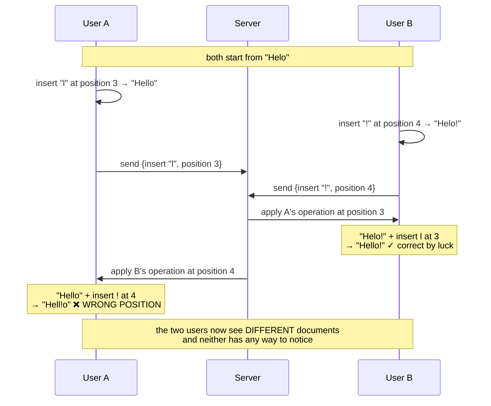
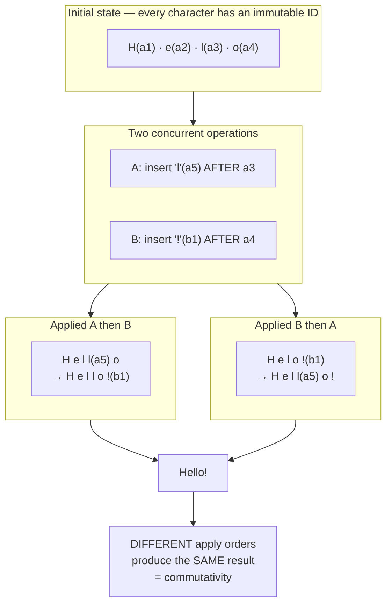
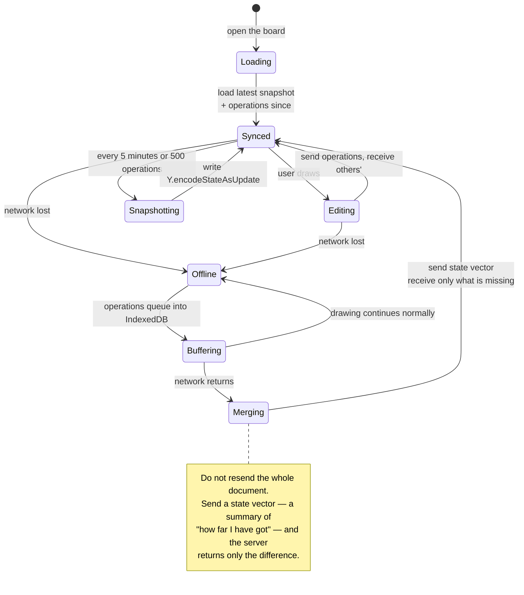
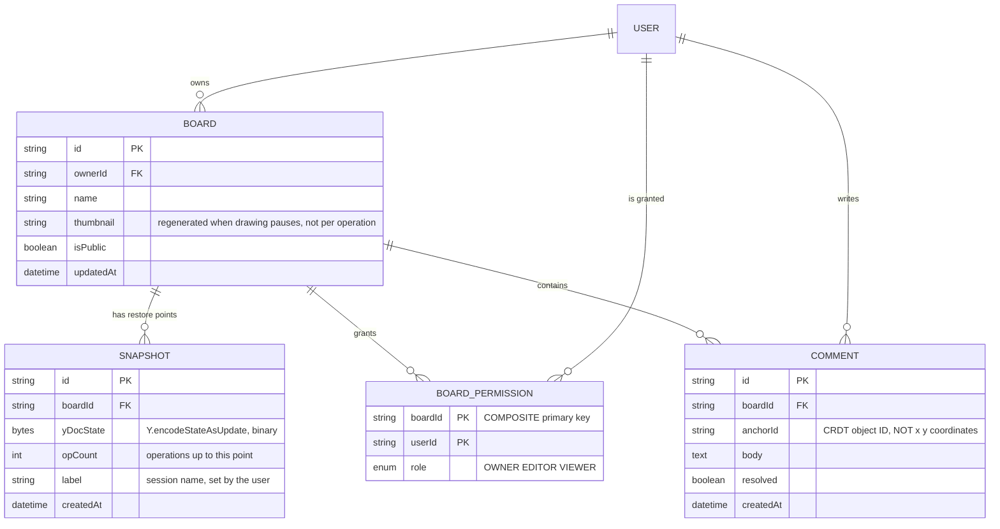

# Real-Time Collaboration Tool (Figma-like)

In [Trello Clone](/projects/saas-project-management-trello) you fixed *lost updates* by sending operations instead of state. That worked because those operations **touched different fields**: one person renamed a card, another moved it, and neither overwrote the other.

Now picture two people typing into **the same line of text**, at the same moment, three characters apart. There are no separate fields left to isolate. Both are editing one thing, and each edit changes what the other's position even means.

That is this project's problem, and it is one of the few in the roadmap where **the correct answer has been proved mathematically** rather than settled by experience.

---

## What you will build

- A multi-user canvas: shapes, lines, text, images
- Per-user cursors and selections, visible the moment they move
- Per-user undo / redo that never undoes someone else's work
- Comments anchored to individual objects
- Offline mode: keep drawing without a network, merge automatically on reconnect
- Version history with restore points
- View / edit permissions, PNG and SVG export

---

## Why "last write wins" fails

Take the smallest possible example. The document reads `"Helo"`. A fixes the typo by inserting `"l"` at position 3, producing `"Hello"`. At the same instant B appends `"!"` at the end, position 4, producing `"Helo!"`.

Both edits are valid. The expected result is `"Hello!"`. But if each side sends only a (content, position) pair:



The root cause: **position 4 as B meant it refers to B's older document**, not to A's current one. An index is a **relative reference into a state that has since changed**.

What makes it dangerous is that nothing reports an error. No exception, no detected conflict. Two people simply look at different documents and keep working.

---

## Two solutions, and why the industry settled on one

### Operational Transformation (OT)

The idea: before applying a late-arriving operation, **transform it** to account for the operations that happened while it was in flight.

B's operation is "insert `!` at position 4". The server knows A inserted one character at position 3, which is before 4, so it rewrites B's operation to "insert `!` at position 5". The result is `"Hello!"` — what both people intended.

Google Docs runs on this principle. But OT carries two heavy costs:

1. **It needs a central arbiter** to impose a global order. Without one, the number of operation pairs needing transformation functions explodes combinatorially.
2. **It is very hard to get right.** The number of transformation functions grows with the square of the operation types, and several published OT papers were later shown to be incorrect. This is a domain where "looks correct" and "is correct" sit far apart.

### CRDT — designed so no transformation is needed

A different idea entirely: instead of rewriting operations to fit their context, **design the data type so that apply order does not matter**.

The method: drop indices completely. Every character gets an **immutable identifier** — a (client id, counter) pair — and an insert does not say "at position 4" but "**after the character with id X**". Character X never changes its id, no matter how many characters appear around it.



Three properties make CRDTs work, and all three are required:

| Property | Meaning | Why it is needed |
|---|---|---|
| Commutative | Applying X then Y equals Y then X | Networks deliver packets out of order |
| Associative | Any grouping of merges gives one result | Clients merge partially before syncing on |
| Idempotent | Applying an operation twice equals once | Resending after a network error is routine |

In exchange, **no central arbiter is required**. The server becomes a relay and a store — it decides nothing. That is why CRDTs support genuine offline editing, peer-to-peer sync and multiple concurrent servers, and OT does not.

You will use an existing library (Yjs or Automerge) rather than writing your own. But understanding the mechanism is mandatory, because every trap below follows from it.

---

## The costs of CRDTs that the marketing pages skip

CRDTs are not free. Three bills come due, and you should know about them in advance:

**1. Tombstones.** Deleting a character cannot erase all trace of it — if it were erased, a late operation saying "insert after character X" would not find X and would have nowhere to go. So deleted characters remain as deletion markers. A document that has been typed and retyped many times can end up **several times larger than its visible content**. Yjs merges adjacent runs during garbage collection, but this bill never reaches zero.

**2. Character interleaving.** When two people type at exactly the same position, the result can be their characters woven together rather than two clean blocks. The system still *converges* — both see the same string — but that string may be meaningless to humans. Convergence and matching user intent are different things.

**3. Automatic merging is not correct merging.** A goes offline and turns a button blue; B goes offline and turns the same button red. The CRDT will pick one deterministically — but "deterministic" only means both people see the same thing, not that anyone got the result they wanted. For fields that matter, you still owe the user a conflict notice.

---

## Awareness: the thing that must **not** live in the document

This is the most common mistake when building collaborative tools, and it only surfaces after a few weeks of real use.

Mouse cursors, current selections, who is online — they look like shared state too, so putting them in the CRDT document feels natural. Do not.

A cursor changes position **60 times a second**. If it lives in the document:

- Every mouse movement becomes a permanent operation in history
- Version history fills with cursor data and stops being useful for seeing who changed what
- Document size grows with time spent staring at the screen, not with content
- Pressing undo can undo a mouse movement

Presence state is **ephemeral**: it only means anything while that person is connected, and it dies when they close the tab. It travels over a separate channel and is **never persisted**:

```ts
// Awareness has its own channel and never touches the Y.Doc.
provider.awareness.setLocalStateField('cursor', { x, y });
provider.awareness.setLocalStateField('user', { name, color });

// When someone disconnects, their state expires and disappears on its own.
provider.awareness.on('change', () => {
  render([...provider.awareness.getStates().entries()]);
});
```

Rate limiting still applies: sending cursor positions every 50ms (20 per second) looks perfectly smooth to human eyes while cutting traffic threefold compared to emitting on every mouse event.

---

## Persistence: you cannot replay a million operations on every load

A CRDT stores history as a sequence of operations. A board used for a few months holds hundreds of thousands to millions of them. Replaying from the beginning means a load time measured in tens of seconds.

The standard answer is **periodic state snapshots**:



```ts
// A state vector is far smaller than the document: it only records how many
// operations from each peer you have seen, carrying no content at all.
const stateVector = Y.encodeStateVector(localDoc);
const diff = Y.encodeStateAsUpdate(serverDoc, stateVector);  // ONLY the delta
Y.applyUpdate(localDoc, diff);
```

Worth noticing: someone who has been offline for three days downloads only what they are missing, not the entire document. This is where CRDTs pay back some of the tombstone cost above.

On version history: **do not snapshot per operation**. Group by session — one person's continuous run of changes, ending after five minutes of inactivity. That is the unit users actually have in mind when they say "go back to how it was".

---

## The data model



Note `anchorId`: a comment attaches to the **identity of an object inside the CRDT document**, not to screen coordinates. Anchor by coordinates and the moment someone moves that shape, the comment floats in empty space. This is precisely the "immutable reference instead of relative position" idea from the opening, applied to something entirely different.

---

## Permissions: where CRDTs help you not at all

CRDTs handle convergence, not authorisation. Someone with the `VIEWER` role can absolutely open DevTools and push update packets straight onto the WebSocket.

So permission must be checked **on the server, before rebroadcasting**:

```ts
socket.on('y:update', async (update: Uint8Array) => {
  // Check FIRST. A view-only user sending updates is blocked here, because
  // the CRDT itself has no concept of "not allowed".
  const role = await getRole(socket.userId, boardId);
  if (role !== 'OWNER' && role !== 'EDITOR') return;

  Y.applyUpdate(doc, update);
  socket.to(`board:${boardId}`).emit('y:update', update);
});
```

And cap the packet size: a normal CRDT update is a few dozen bytes. A 10MB packet means either someone probing your system or a client-side loop bug — one limit catches both.

---

## Rendering: React is the wrong tool for this part

A board holds 5,000 shapes. If each shape is a React component and every operation triggers a re-render, the frame rate collapses to unusable.

The rule: **React owns the surrounding UI (toolbars, property panels); the canvas owns the drawing.**

- Draw straight to canvas inside a `requestAnimationFrame` loop, outside React's lifecycle
- Redraw only what changed, or use layers: static background on one canvas, the object being dragged on another
- Skip objects outside the viewport — on a large board most content is off screen
- Batch CRDT updates arriving within the same frame and draw once, rather than drawing per packet

---

## Traps worth recording

| Symptom | Actual cause | Fix |
|---|---|---|
| Two people see different content | Operations carry positional indices | Immutable per-element identifiers (CRDT) |
| Document grows despite little content | Tombstone accumulation | Garbage collection, periodic snapshots, run merging |
| Version history full of noise | Cursors stored inside the CRDT document | Awareness on its own channel, never persisted |
| Undo reverses someone else's work | A shared undo stack | `UndoManager` scoped to that client's origin |
| Board takes 30 seconds to open | Replaying every operation from the start | Snapshot every 5 minutes or 500 operations |
| Reconnect after offline downloads a lot | Sending the whole document | Send a state vector, receive only the delta |
| View-only users can still edit | Permission checked in the UI | Check on the server before applying and rebroadcasting |
| Comments drift away from their object | Anchored to x, y coordinates | Anchor to the CRDT object id |
| Frame rate collapses at 5,000 shapes | One React component per shape | Draw to canvas directly, cull off-screen objects |
| Network saturated with tiny packets | Emitting on every mouse event | Throttle to 50ms and batch before sending |
| Two people's characters interleave | Inherent to CRDTs at the same position | Accept it, or soft-lock at the text-block level |

---

## When it is genuinely done

- [ ] Three browsers editing one board for 10 minutes: the final content is **byte-identical** in all three
- [ ] Disconnect one machine, draw 50 shapes, reconnect: all 50 appear elsewhere, none lost
- [ ] Two machines offline, both editing the same object, both reconnecting: they converge on one result
- [ ] Press undo 10 times while someone else is drawing: only your own work is undone
- [ ] A 5,000-shape board: dragging one shape stays above 50 frames per second
- [ ] Opening a board with 100,000 operations of history: under 2 seconds
- [ ] Log in as `VIEWER` and push a `y:update` packet by script: nothing changes
- [ ] Sit idle for 10 minutes with 5 people connected: document size does **not** grow
- [ ] Compare `Y.encodeStateAsUpdate` from any two clients after sync: identical bytes

---

## Where to go next

1. **Multiple concurrent servers.** Because CRDTs need no arbiter, two servers can both accept updates and reconcile with each other — but you need a channel between them. This is the entry point to genuinely distributed architecture.
2. **Peer-to-peer over WebRTC.** Remove the server from the data path entirely, keeping it only for signalling and storage. Latency drops noticeably once packets stop making a round trip.
3. **Voice and video in the board.** The same WebRTC infrastructure, and a natural next step once a peer channel exists.
4. **Heavy media handling.** Images and video on the canvas need their own upload and transcoding pipeline — [Video Streaming Platform](/projects/video-streaming-platform-netflix-like) walks that pipeline end to end.
5. **Splitting into services.** When the board, export and notification concerns become separate services, you need a reliable way for them to talk — the subject of [Event-Driven Microservices](/projects/event-driven-microservices-uber-like).
