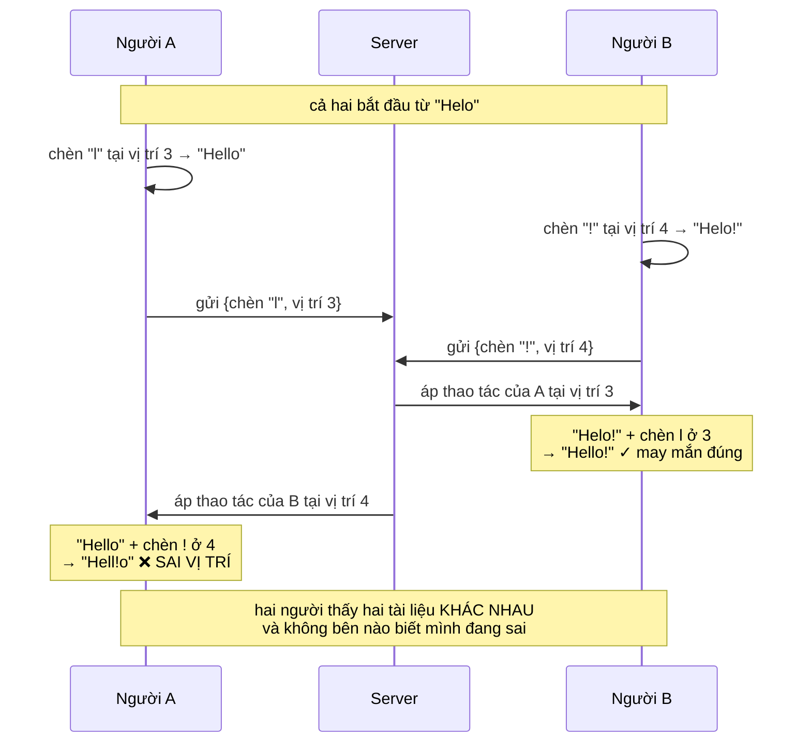
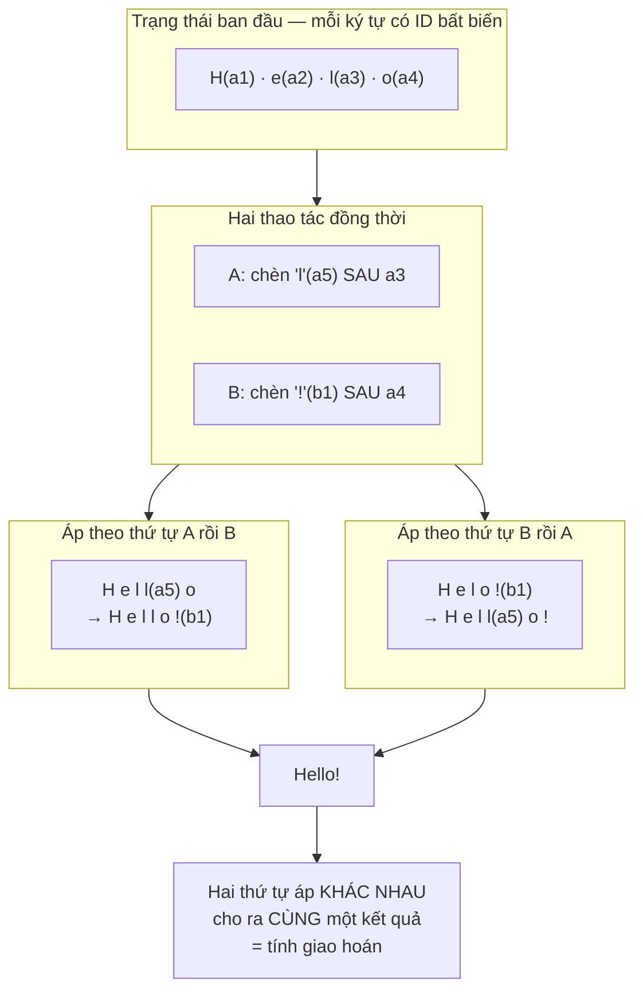
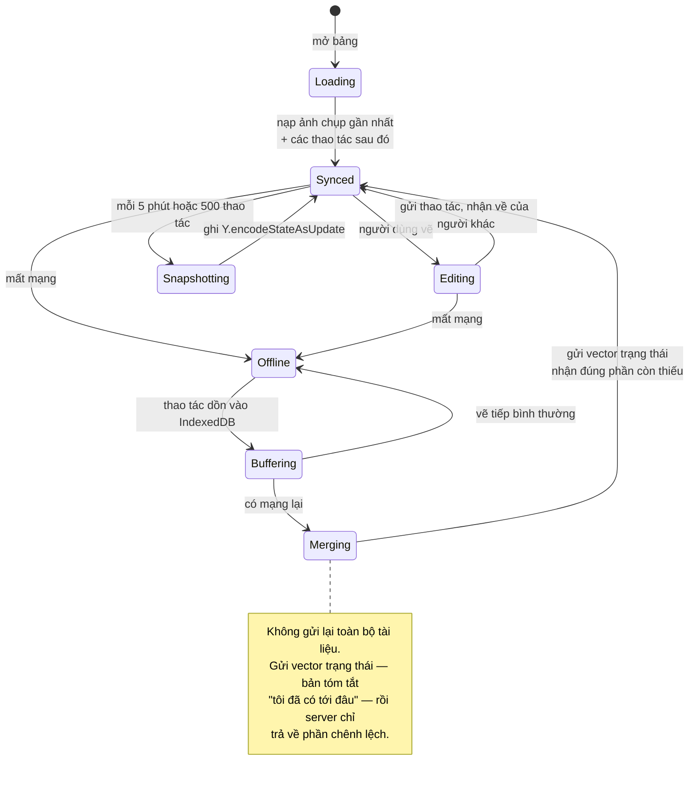
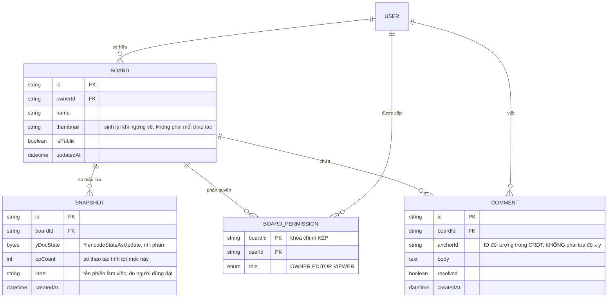

# Real-Time Collaboration Tool (Figma-like)

Ở [Trello Clone](/projects/saas-project-management-trello) bạn đã chữa được *lost update* bằng cách gửi thao tác thay vì gửi trạng thái. Cách đó chạy tốt vì các thao tác ở đó **chạm vào những trường khác nhau**: một người đổi tên, một người kéo thẻ, không ai đè lên ai.

Bây giờ hãy hình dung hai người cùng gõ vào **cùng một dòng chữ**, cùng lúc, ở hai vị trí cách nhau ba ký tự. Không có "trường khác nhau" để tách nữa. Cả hai đang sửa đúng một thứ, và mỗi thao tác lại làm thay đổi ý nghĩa vị trí của thao tác kia.

Đó là bài toán của dự án này, và nó là một trong số ít bài toán trong lộ trình mà **lời giải đúng đã được chứng minh bằng toán học** — chứ không phải bằng kinh nghiệm.

---

## Bạn sẽ dựng ra cái gì

- Bảng vẽ nhiều người cùng sửa: hình khối, đường, chữ, ảnh
- Con trỏ và vùng chọn của từng người, hiện ngay khi họ di chuyển
- Hoàn tác / làm lại đúng theo từng người, không hoàn tác nhầm việc của người khác
- Bình luận neo vào từng đối tượng
- Chế độ ngoại tuyến: vẽ tiếp khi mất mạng, tự hoà lại khi có mạng
- Lịch sử phiên bản, khôi phục về mốc cũ
- Phân quyền xem / sửa, xuất PNG và SVG

---

## Vì sao "ai ghi sau thì thắng" hỏng

Lấy một ví dụ nhỏ nhất có thể. Tài liệu đang là `"Helo"`. A sửa lỗi chính tả bằng cách chèn `"l"` vào vị trí 3, được `"Hello"`. Cùng lúc đó B chèn `"!"` vào cuối, tức vị trí 4, được `"Helo!"`.

Cả hai thao tác đều hợp lệ. Kết quả mong đợi là `"Hello!"`. Nhưng nếu mỗi bên chỉ gửi đi cặp (nội dung, vị trí) thì:



Vấn đề gốc: **vị trí 4 mà B nói tới là vị trí 4 trong tài liệu cũ của B**, không phải trong tài liệu hiện tại của A. Chỉ số là một cách tham chiếu **tương đối vào một trạng thái đã thay đổi**.

Điều làm nó nguy hiểm là hệ thống không hề báo lỗi. Không có ngoại lệ, không có xung đột được phát hiện. Hai người chỉ đơn giản là nhìn hai tài liệu khác nhau và tiếp tục làm việc.

---

## Hai lời giải, và vì sao ngành đã chọn một

### Operational Transformation (OT)

Ý tưởng: trước khi áp một thao tác đến muộn, **biến đổi nó** cho phù hợp với những thao tác đã xảy ra trong lúc nó đang trên đường.

Thao tác của B là "chèn `!` ở vị trí 4". Server biết A đã chèn 1 ký tự ở vị trí 3, tức trước vị trí 4, nên nó dịch thao tác của B thành "chèn `!` ở vị trí 5". Kết quả `"Hello!"` — đúng với ý cả hai.

Google Docs chạy trên nguyên lý này. Nhưng OT có hai cái giá nặng:

1. **Cần một server làm trọng tài** để sắp thứ tự toàn cục. Không có nó, số cặp thao tác cần xét biến đổi bùng nổ theo tổ hợp.
2. **Rất khó viết đúng.** Số hàm biến đổi cần định nghĩa tăng theo bình phương số loại thao tác, và nhiều bài báo về OT về sau bị chứng minh là có lỗi. Đây là lĩnh vực mà "trông có vẻ đúng" và "đúng" cách nhau rất xa.

### CRDT — thiết kế để không cần biến đổi

Ý tưởng khác hẳn: thay vì sửa thao tác cho khớp ngữ cảnh, hãy **thiết kế kiểu dữ liệu sao cho thứ tự áp không quan trọng**.

Cách làm: bỏ chỉ số hoàn toàn. Mỗi ký tự nhận một **định danh bất biến** gồm (id người dùng, số đếm), và thao tác chèn không nói "chèn ở vị trí 4" mà nói "chèn **sau ký tự có id X**". Ký tự X không bao giờ đổi id, kể cả khi có 100 ký tự khác chèn quanh nó.



Ba tính chất khiến CRDT hoạt động, và cả ba đều phải có:

| Tính chất | Nghĩa là | Vì sao cần |
|---|---|---|
| Giao hoán | Áp X rồi Y giống áp Y rồi X | Mạng giao gói tin không theo thứ tự |
| Kết hợp | Gộp theo cụm nào cũng ra một kết quả | Client hoà từng phần rồi mới đồng bộ tiếp |
| Luỹ đẳng | Áp cùng một thao tác hai lần giống một lần | Gửi lại sau lỗi mạng là chuyện thường ngày |

Đổi lại, **không cần server làm trọng tài**. Server chỉ còn là nơi chuyển tiếp gói tin và lưu trữ — nó không quyết định gì cả. Đó là lý do CRDT làm được chế độ ngoại tuyến thật, ngang hàng, và nhiều server cùng lúc, còn OT thì không.

Bạn sẽ dùng thư viện có sẵn (Yjs hoặc Automerge) chứ không tự viết. Nhưng hiểu cơ chế là bắt buộc, vì các cái bẫy phía dưới đều bắt nguồn từ nó.

---

## Cái giá của CRDT mà tài liệu quảng cáo ít nói

CRDT không miễn phí. Ba khoản phải trả, và bạn cần biết trước:

**1. Bia mộ.** Xoá một ký tự không thể xoá hẳn dấu vết của nó — nếu xoá sạch, một thao tác đến muộn nói "chèn sau ký tự X" sẽ không tìm thấy X và không biết đặt vào đâu. Nên ký tự đã xoá được giữ lại dưới dạng đánh dấu đã xoá. Một tài liệu bị gõ rồi xoá nhiều lần có thể **nặng hơn nội dung thật của nó nhiều lần**. Yjs có bước dọn dẹp gộp các đoạn liền kề lại, nhưng khoản phí này không bao giờ về 0.

**2. Xen kẽ ký tự.** Hai người cùng gõ vào đúng một vị trí, kết quả có thể là chữ của hai người đan xen nhau thay vì hai khối tách bạch. Hệ thống vẫn *hội tụ* — cả hai thấy cùng một chuỗi — nhưng chuỗi đó có thể vô nghĩa với con người. Hội tụ và đúng ý người dùng là hai chuyện khác nhau.

**3. Hoà tự động không có nghĩa là hoà đúng.** A ngoại tuyến sửa nút thành màu xanh, B ngoại tuyến sửa cùng nút thành màu đỏ. CRDT sẽ chọn một cách xác định — nhưng "xác định" chỉ nghĩa là hai người thấy giống nhau, không nghĩa là kết quả đúng ý ai. Với những trường quan trọng, bạn vẫn cần báo cho người dùng biết có xung đột.

---

## Awareness: thứ **không** được nằm trong tài liệu

Đây là lỗi phổ biến nhất khi dựng công cụ cộng tác, và nó chỉ lộ ra sau vài tuần dùng thật.

Con trỏ chuột, vùng đang chọn, tên người đang online — nhìn qua thì cũng là "trạng thái chung", nên rất tự nhiên khi nhét chúng vào tài liệu CRDT. Đừng.

Con trỏ đổi vị trí **60 lần mỗi giây**. Nếu nó nằm trong tài liệu:

- Mỗi cử động chuột thành một thao tác vĩnh viễn trong lịch sử
- Lịch sử phiên bản đầy dữ liệu con trỏ, không còn dùng để xem ai đã sửa gì
- Kích thước tài liệu phình theo thời gian ngồi nhìn màn hình, không theo nội dung
- Bấm hoàn tác có thể hoàn tác một cú di chuột

Trạng thái hiện diện là **phù du**: nó chỉ có nghĩa khi người đó đang online, và mất đi cùng lúc họ đóng tab. Nó đi qua một kênh riêng và **không bao giờ được lưu**:

```ts
// Awareness đi kênh riêng, không đụng vào Y.Doc.
provider.awareness.setLocalStateField('cursor', { x, y });
provider.awareness.setLocalStateField('user', { name, color });

// Người ngắt kết nối thì trạng thái của họ tự hết hạn và biến mất.
provider.awareness.on('change', () => {
  render([...provider.awareness.getStates().entries()]);
});
```

Và vẫn phải giới hạn tốc độ: gửi vị trí con trỏ mỗi 50ms (20 lần/giây) là quá đủ mượt với mắt người, trong khi giảm lưu lượng đi ba lần so với gửi theo mọi sự kiện chuột.

---

## Lưu trữ: không thể phát lại một triệu thao tác mỗi lần mở

CRDT lưu lịch sử dưới dạng chuỗi thao tác. Một bảng vẽ dùng vài tháng có hàng trăm nghìn tới hàng triệu thao tác. Mở bảng mà phải phát lại từ đầu là chờ vài chục giây.

Cách chuẩn là **ảnh chụp trạng thái theo mốc**:



```ts
// Vector trạng thái nhỏ hơn tài liệu rất nhiều: nó chỉ nói "tôi đã thấy
// tới thao tác thứ mấy của từng người", chứ không mang nội dung.
const stateVector = Y.encodeStateVector(localDoc);
const diff = Y.encodeStateAsUpdate(serverDoc, stateVector);  // CHỈ phần thiếu
Y.applyUpdate(localDoc, diff);
```

Điều đáng nói: người dùng ngoại tuyến ba ngày mở lại cũng chỉ tải đúng phần họ chưa có, không phải cả tài liệu. Đây là chỗ CRDT trả lại phần nào cái giá bia mộ ở trên.

Về lịch sử phiên bản: **đừng lưu ảnh chụp cho từng thao tác**. Gộp theo phiên làm việc — một chuỗi thay đổi liên tục của một người, kết thúc khi họ ngừng 5 phút. Đó mới là đơn vị mà người dùng nghĩ tới khi họ muốn "quay lại lúc trước".

---

## Cơ sở dữ liệu



Chú ý `anchorId`: bình luận neo vào **định danh của đối tượng trong tài liệu CRDT**, không neo vào toạ độ màn hình. Neo theo toạ độ thì người khác kéo hình đi một chỗ là bình luận nằm lơ lửng giữa khoảng trống. Đây chính là ý tưởng "tham chiếu bất biến thay cho vị trí tương đối" ở phần đầu bài, áp dụng lại cho một thứ hoàn toàn khác.

---

## Quyền xem/sửa: nơi CRDT không giúp được gì

CRDT lo chuyện hội tụ, không lo chuyện ai được phép làm gì. Một người có vai `VIEWER` vẫn hoàn toàn có thể mở DevTools và gửi thẳng gói tin cập nhật lên WebSocket.

Nên quyền phải được kiểm ở **server, trước khi phát lại cho người khác**:

```ts
socket.on('y:update', async (update: Uint8Array) => {
  // Kiểm quyền TRƯỚC. Người chỉ có quyền xem gửi cập nhật thì chặn ở đây,
  // vì bản thân CRDT không có khái niệm "không được phép".
  const role = await getRole(socket.userId, boardId);
  if (role !== 'OWNER' && role !== 'EDITOR') return;

  Y.applyUpdate(doc, update);
  socket.to(`board:${boardId}`).emit('y:update', update);
});
```

Và giới hạn kích thước gói tin: một cập nhật CRDT bình thường vài chục byte. Gói tin 10MB nghĩa là có người đang thử làm hỏng hệ thống hoặc có lỗi vòng lặp ở client — chặn cả hai bằng cùng một câu lệnh.

---

## Vẽ: React không phải công cụ cho việc này

Bảng có 5.000 hình. Nếu mỗi hình là một component React và mỗi thao tác gây một lần dựng lại, khung hình rớt xuống mức không dùng được.

Nguyên tắc: **React quản lý giao diện xung quanh (thanh công cụ, bảng thuộc tính), canvas tự quản lý nội dung vẽ.**

- Vẽ trực tiếp lên canvas trong vòng lặp `requestAnimationFrame`, không đi qua vòng đời React
- Chỉ vẽ lại phần thay đổi, hoặc chia lớp: nền tĩnh một canvas, đối tượng đang kéo một canvas riêng
- Bỏ qua đối tượng nằm ngoài khung nhìn — bảng lớn thì phần lớn nội dung không hiện trên màn hình
- Gộp nhiều cập nhật CRDT đến trong cùng một khung hình rồi vẽ một lần, thay vì vẽ theo từng gói tin

---

## Những cái bẫy đã được ghi lại

| Triệu chứng | Nguyên nhân thật | Cách sửa |
|---|---|---|
| Hai người thấy hai nội dung khác nhau | Thao tác dùng chỉ số vị trí | Định danh bất biến cho từng phần tử (CRDT) |
| Tài liệu phình to dù nội dung ít | Bia mộ tích luỹ | Bước dọn dẹp, ảnh chụp định kỳ, gộp đoạn |
| Lịch sử phiên bản đầy rác | Con trỏ nằm trong tài liệu CRDT | Awareness đi kênh riêng, không lưu |
| Bấm hoàn tác thì hoàn tác việc người khác | Ngăn xếp hoàn tác dùng chung | `UndoManager` giới hạn theo nguồn gốc của người đó |
| Mở bảng mất 30 giây | Phát lại toàn bộ thao tác từ đầu | Ảnh chụp mỗi 5 phút hoặc 500 thao tác |
| Đồng bộ lại sau ngoại tuyến tải rất nặng | Gửi cả tài liệu | Gửi vector trạng thái, nhận phần chênh lệch |
| Người chỉ có quyền xem vẫn sửa được | Kiểm quyền ở giao diện | Kiểm ở server trước khi áp và phát lại |
| Bình luận trôi khỏi đối tượng | Neo theo toạ độ x, y | Neo theo id đối tượng trong CRDT |
| Khung hình rớt khi có 5.000 hình | Mỗi hình một component React | Vẽ thẳng lên canvas, bỏ qua ngoài khung nhìn |
| Mạng đầy gói tin nhỏ | Gửi theo từng sự kiện chuột | Giới hạn 50ms, gộp trước khi gửi |
| Chữ hai người đan xen nhau | Bản chất của CRDT khi cùng vị trí | Chấp nhận, hoặc khoá mềm ở mức khối văn bản |

---

## Khi nào coi như xong

- [ ] Ba trình duyệt cùng sửa một bảng trong 10 phút: nội dung cuối cùng **giống hệt nhau** ở cả ba
- [ ] Ngắt mạng một máy, vẽ 50 hình, nối lại: cả 50 hình xuất hiện ở các máy khác, không mất cái nào
- [ ] Hai máy cùng ngoại tuyến, cùng sửa một đối tượng, cùng nối lại: cả hai hội tụ về một kết quả
- [ ] Bấm hoàn tác 10 lần khi có người khác đang vẽ: chỉ việc của mình bị hoàn tác
- [ ] Bảng 5.000 hình: kéo một hình vẫn giữ trên 50 khung hình mỗi giây
- [ ] Mở bảng có 100.000 thao tác lịch sử: dưới 2 giây
- [ ] Đăng nhập tài khoản chỉ có quyền `VIEWER`, gửi thẳng gói `y:update` bằng script: không có gì thay đổi
- [ ] Ngồi yên không làm gì 10 phút với 5 người cùng mở: kích thước tài liệu **không** tăng
- [ ] So `Y.encodeStateAsUpdate` của hai client bất kỳ sau khi đồng bộ: byte giống nhau

---

## Bước tiếp theo

1. **Nhiều server cùng lúc.** Vì CRDT không cần trọng tài, hai server có thể cùng nhận cập nhật rồi hoà cho nhau — nhưng bạn cần một kênh truyền giữa chúng. Đây là điểm bắt đầu của kiến trúc phân tán thật.
2. **Ngang hàng qua WebRTC.** Bỏ hẳn server khỏi đường truyền dữ liệu, chỉ giữ lại để bắt cặp và lưu trữ. Độ trễ giảm rõ rệt vì gói tin không đi vòng.
3. **Gọi thoại và video trong bảng.** Cùng hạ tầng WebRTC, và là bước tự nhiên sau khi đã có kênh ngang hàng.
4. **Xử lý nội dung nặng.** Ảnh và video trong bảng cần đường ống tải lên và chuyển mã riêng — [Video Streaming Platform](/projects/video-streaming-platform-netflix-like) đi hết đường ống đó.
5. **Đưa lên nhiều dịch vụ.** Khi bảng vẽ, xuất file, và thông báo tách thành các dịch vụ riêng, bạn cần cách để chúng nói chuyện đáng tin cậy — nội dung của [Event-Driven Microservices](/projects/event-driven-microservices-uber-like).
