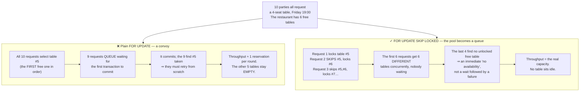
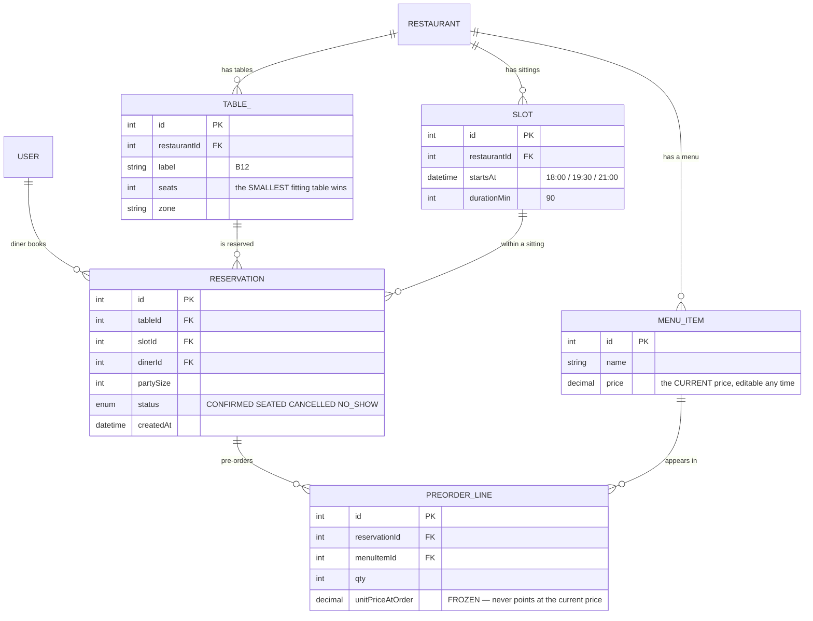

# Restaurant Reservation App

The seven previous **Semester 6** projects all shared one shape: the customer **names** the thing they want. Slot 42. Book 42. Seat A12. The system only has to answer yes or no.

A diner does not talk like that. They say:

> *"A table for four, 7pm on Friday."*

**Any table will do.** And that changes the problem from *"is this resource free?"* to *"hand me **some** free resource, and do not hand it to anyone else."*

It sounds easier and it is harder. Because now ten simultaneous requests **should not** be fighting — the restaurant has six free tables, so six people ought to be seated immediately. Write it naively and all ten look at *the same first table*, nine fail, and those nine retry — while five other tables sit empty.

---

## What you will build

- A **Flutter (Dart)** app for diners, running on iOS and Android
- A lean REST backend in **Node.js + Express + PostgreSQL** with **JWT** auth
- Tokens in **`flutter_secure_storage`** (Keychain / Keystore)
- Reservations by **party size and time slot**, with the system picking the smallest suitable table
- **Pre-ordering** attached to a reservation, with prices frozen at order time
- A reservation core built on **`FOR UPDATE SKIP LOCKED`**, with a compound `UNIQUE` as the backstop

> 📚 The step-by-step course: [**INT608 — Restaurant Reservation App**](/courses/restaurant-reservation-app) on the Academy (9 sections, 21 lessons).

---

## Pick-then-book: the race in a new shape

```js
// (A) find a free table that fits
const table = await prisma.table.findFirst({
  where: { seats: { gte: party }, reservations: { none: { slotId } } },
  orderBy: { seats: 'asc' },     // the smallest table that still fits
});
if (!table) throw new ConflictError('No table available');
// (B) reserve it — but two requests both picked table 5 in step (A)!
await prisma.reservation.create({ data: { tableId: table.id, slotId, dinerId } });
```

The race is identical to the previous seven projects, but the consequence differs in kind:

```
t1     An:   (A) free table = #5 ✅
t2     Binh: (A) free table = #5 ✅   ← An has not booked yet
t3     An:   (B) reserve #5
t4     Binh: (B) reserve #5
Result: table 5 double-booked while tables 6, 7 and 8 sit empty ✗
```

Look at that last line. In the earlier projects the loser **deserved to lose** — there was only one seat A12. Here the loser is turned away while the restaurant **still has tables**. That is not merely a correctness bug; it is **revenue thrown away**.

---

## `FOR UPDATE SKIP LOCKED`: turning a resource pool into a work queue

Postgres has a keyword pair built for exactly this. `FOR UPDATE` locks the row you selected; `SKIP LOCKED` tells other transactions to **ignore rows someone else already locked and take the next one**.

```js
// Each concurrent request locks a DIFFERENT table
const [table] = await prisma.$queryRaw`
  SELECT t.id FROM "Table" t
   WHERE t.seats >= ${party}
     AND NOT EXISTS (
       SELECT 1 FROM "Reservation" r
        WHERE r.table_id = t.id AND r.slot_id = ${slotId})
   ORDER BY t.seats ASC              -- smallest table that fits: less wasted capacity
   FOR UPDATE OF t SKIP LOCKED       -- lock this table; skip ones others locked
   LIMIT 1`;

if (!table) throw new ConflictError('No table available for that time');
await prisma.reservation.create({ data: { tableId: table.id, slotId, dinerId } });
```



This is Postgres's canonical pattern for *"hand me one of N available resources"*. The same two keywords power **every job queue** built on Postgres: many workers read one jobs table, each claims a different job, none blocks another. You just met it in [Gym Membership App](/projects/gym-membership-app) while promoting off a waitlist — here it plays the lead.

### The compound `UNIQUE` is still mandatory

```prisma
model Reservation {
  id      Int @id @default(autoincrement())
  tableId Int
  slotId  Int
  dinerId Int

  // The final backstop: a table cannot hold two reservations in one slot.
  // True even for an import script that never touches the API.
  @@unique([tableId, slotId], name: "uk_table_slot")
}
```

`SKIP LOCKED` makes the allocation **efficient**; `UNIQUE` makes it **correct**. Same division of labour you saw in [Event Ticketing System](/projects/event-ticketing-system): a fast layer in front, a durable layer behind.

---

## Time slots: why discretising time is the right call here

[Homestay Booking API](/projects/homestay-booking-api) modelled time as a **continuous interval** and needed `EXCLUDE USING gist`. A restaurant does not: dinner is divided into **sittings** — 18:00, 19:30, 21:00 — each exactly 90 minutes long.

That is a modelling decision, and it simplifies everything downstream:

| | Continuous interval (homestay) | Discrete slots (restaurant) |
|---|---|---|
| Invariant | No overlapping ranges | No duplicate `(table, slot)` |
| Tool | `EXCLUDE USING gist` + `btree_gist` | `UNIQUE(table_id, slot_id)` |
| Availability query | Range comparison, awkward to index | `NOT EXISTS` on a key, indexes directly |
| Right when | Guests stay any number of nights | The business already runs in sittings |

The general lesson: **the data model should follow how the business actually operates, not how time happens to flow.** Restaurants thought in sittings long before software existed; forcing them into continuous intervals buys you a harder constraint nobody asked for.

---

## The data model and pre-orders



`PREORDER_LINE.unitPriceAtOrder` is a small detail carrying a large lesson, and it is the **third** appearance this semester: after `totalPrice` in [Homestay](/projects/homestay-booking-api) and `dueAt` in [Helpdesk](/projects/helpdesk-ticketing-api).

The general rule: **every number that forms part of an agreement with a customer must be copied into the transaction record, not referenced from the source row.** The restaurant raising the price of pho next week must not change this week's bill. Same reason an order stores the shipping address instead of pointing at the user profile.

---

## Flutter: what differs from Expo

Project #7 used Expo React Native; this one uses Flutter — not to repeat it, but so you **experience two different philosophies** and can justify the choice in an interview:

| | Expo React Native | Flutter |
|---|---|---|
| Rendering | Maps to the OS's **native** widgets | **Draws every pixel itself** via Skia/Impeller |
| Consequence | Feels native per platform, differs a little | Identical everywhere, even when the OS changes |
| Bridge | JS on a VM, talking over a bridge/JSI | Dart **compiles to machine code**, no bridge |
| Choose it when | The team is strong in React, sharing code with web | You need deep UI customisation, smooth animation, exact parity |

Three technical details that matter when writing a Flutter client for a contended API:

- **`flutter_secure_storage`** for refresh tokens, for the same reason as `expo-secure-store` in project #7. `SharedPreferences` is Flutter's `AsyncStorage` — readable on a rooted device.
- **Async state has three branches, not two.** The booking screen has three real states: *submitting*, *confirmed*, *no availability* — and the third **is not an error**, it is a valid answer. Use `AsyncValue` (Riverpod) or a Dart `sealed class` so the compiler **forces** you to handle all three.
- **Buttons disable on the first tap.** Just like project #7, and for exactly the same reason: on a phone, tapping twice is routine.

---

## Traps worth writing down

| Symptom | Actual cause | Fix |
|---|---|---|
| Double-booked tables | Pick-then-book with no lock | `FOR UPDATE ... SKIP LOCKED` |
| Nine requests wait and then all fail | `FOR UPDATE` **without** `SKIP LOCKED` | Add `SKIP LOCKED` so each request takes another table |
| "Fully booked" while tables are free | All 10 requests picked the same first table | `SKIP LOCKED` allocates in parallel |
| A party of 2 seated at an 8-top | No ordering by capacity | `ORDER BY seats ASC` — smallest table that fits |
| Duplicates sneak in via an import script | Relying on application-level locking alone | `@@unique([tableId, slotId])` |
| Old bills change when the menu price rises | `PREORDER_LINE` points at the current price | Freeze `unitPriceAtOrder` at order time |
| Reservations accepted for past sittings | No `startsAt > now()` check | Enforce it in the service, not just the app |
| Cancelled reservation still blocks the table | Soft delete, but `NOT EXISTS` ignores status | Filter `status <> 'CANCELLED'` in the availability query |
| One tap creates two reservations | No disabled button, no idempotency key | Disable on tap + an idempotency key on the request |
| Tokens readable on a rooted device | Using `SharedPreferences` | `flutter_secure_storage` |
| The screen hangs on a spinner when full | Only success/error branches were handled | Three branches: submitting / confirmed / no availability |
| Lots of no-shows | `NO_SHOW` never recorded | A dedicated status plus stats; consider a deposit |

---

## Done means

- [ ] With **6** free tables, fire **10** simultaneous requests: exactly **6** succeed, **4** get "no availability"
- [ ] Those six reservations sit on **six different tables**, with no duplicates
- [ ] Remove `SKIP LOCKED` and re-run: watch throughput drop and wait time rise — and **understand why**
- [ ] A party of 2 gets a 2-top, **not** an 8-top, when both are free
- [ ] Insert a duplicate `(table, slot)` directly via `psql`: **rejected**
- [ ] Cancel a reservation: that table is **immediately bookable** again in the same slot
- [ ] Change a menu price after a pre-order: the bill **keeps** the old price
- [ ] Book a past sitting: `400` from the **API**, not merely a hidden button in the app
- [ ] Double-tap Book on a real device: exactly **one** reservation
- [ ] Inspect `SharedPreferences` with a debugging tool: **no** token
- [ ] The app runs on real iOS **and** Android devices, with a distinct UI for each of the three states

---

## Where to go next

1. **When time is a continuous interval rather than a sitting.** [Homestay Booking API](/projects/homestay-booking-api) shows the cost of dropping discrete slots.
2. **When contention outgrows Postgres.** [Event Ticketing System](/projects/event-ticketing-system) moves the check into Redis.
3. **When you want to compare Flutter with the alternatives.** [Flutter Cross-platform App](/projects/flutter-cross-platform-app) digs into cross-platform trade-offs, and [iOS Native (Swift)](/projects/ios-native-app-swift) shows the opposite pole.
4. **When `SKIP LOCKED` becomes a real job queue.** [Distributed Message Broker](/projects/distributed-message-broker-kafka-like) builds work distribution across many consumers from scratch.
