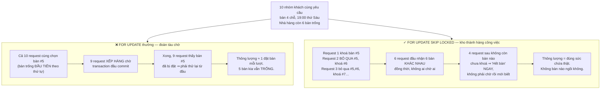
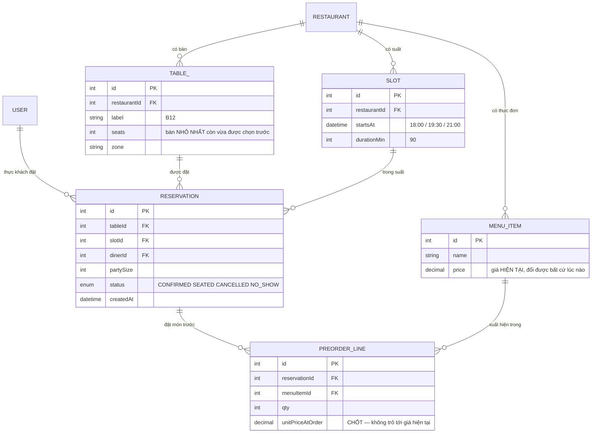

# Restaurant Reservation App

Bảy đồ án trước của **Kỳ 6** đều có chung một hình dạng: khách hàng **chỉ đích danh** thứ mình muốn. Khung giờ 42. Cuốn sách 42. Ghế A12. Hệ thống chỉ phải trả lời có hoặc không.

Thực khách không nói vậy. Họ nói:

> *"Cho tôi một bàn cho 4 người, 7 giờ tối thứ Sáu."*

**Bàn nào cũng được.** Và điều đó đổi bài toán từ *"tài nguyên này còn trống không?"* sang *"hãy giao cho tôi **một** tài nguyên trống bất kỳ, và đừng giao nó cho ai khác."*

Nghe nhẹ hơn, thực ra khó hơn. Vì bây giờ mười yêu cầu đồng thời **không nên** tranh nhau — nhà hàng có sáu bàn trống, đáng lẽ sáu người phải được nhận ngay. Nếu bạn viết ngây thơ, cả mười cùng nhìn thấy *cùng một bàn đầu tiên*, chín người thất bại, và chín người đó thử lại — trong khi năm chiếc bàn khác ngồi không.

---

## Bạn sẽ dựng ra cái gì

- Ứng dụng **Flutter (Dart)** cho thực khách, chạy trên iOS và Android
- Backend REST gọn nhẹ bằng **Node.js + Express + PostgreSQL**, xác thực **JWT**
- Token lưu trong **`flutter_secure_storage`** (Keychain / Keystore)
- Đặt bàn theo **sức chứa và khung giờ**, hệ thống tự chọn bàn phù hợp nhỏ nhất
- **Đặt món trước** kèm theo lượt đặt bàn, chốt giá tại thời điểm đặt
- Lõi đặt bàn dùng **`FOR UPDATE SKIP LOCKED`**, có `UNIQUE` ghép làm chốt chặn

> 📚 Bản dạy từng bước: [**INT608 — Restaurant Reservation App**](/courses/restaurant-reservation-app) trên Academy (9 mục, 21 bài).

---

## Chọn-rồi-đặt: cuộc đua ở một hình dạng mới

```js
// (A) tìm một bàn trống vừa đủ chỗ
const table = await prisma.table.findFirst({
  where: { seats: { gte: party }, reservations: { none: { slotId } } },
  orderBy: { seats: 'asc' },     // bàn nhỏ nhất còn đủ chỗ
});
if (!table) throw new ConflictError('Không còn bàn trống');
// (B) đặt bàn — nhưng hai request đều đã chọn bàn số 5 ở bước (A)!
await prisma.reservation.create({ data: { tableId: table.id, slotId, dinerId } });
```

Cuộc đua giống hệt bảy đồ án trước, nhưng hậu quả thì khác về chất:

```
t1     An:  (A) bàn trống = #5 ✅
t2     Bình: (A) bàn trống = #5 ✅   ← An chưa đặt xong
t3     An:  (B) đặt bàn #5
t4     Bình: (B) đặt bàn #5
Kết quả: bàn 5 bị đặt trùng, trong khi bàn 6, 7, 8 đang trống ✗
```

Chú ý câu cuối. Ở các đồ án trước, kẻ thua **đáng bị thua** — chỉ có một chiếc ghế A12. Ở đây kẻ thua bị từ chối trong lúc nhà hàng **vẫn còn bàn**. Đó không chỉ là lỗi đúng đắn mà còn là **doanh thu bị vứt đi**.

---

## `FOR UPDATE SKIP LOCKED`: biến kho tài nguyên thành hàng công việc

Postgres có một cặp từ khoá giải đúng bài toán này. `FOR UPDATE` khoá hàng bạn chọn; `SKIP LOCKED` bảo các transaction khác **bỏ qua những hàng đã bị người khác khoá và lấy hàng kế tiếp**.

```js
// Mỗi request đồng thời khoá một bàn KHÁC NHAU
const [table] = await prisma.$queryRaw`
  SELECT t.id FROM "Table" t
   WHERE t.seats >= ${party}
     AND NOT EXISTS (
       SELECT 1 FROM "Reservation" r
        WHERE r.table_id = t.id AND r.slot_id = ${slotId})
   ORDER BY t.seats ASC              -- bàn nhỏ nhất còn vừa: đỡ lãng phí chỗ
   FOR UPDATE OF t SKIP LOCKED       -- khoá bàn này; bỏ qua bàn người khác đã khoá
   LIMIT 1`;

if (!table) throw new ConflictError('Không còn bàn trống cho khung giờ đó');
await prisma.reservation.create({ data: { tableId: table.id, slotId, dinerId } });
```



Đây là mẫu hình chuẩn của Postgres cho câu *"giao cho tôi một trong N tài nguyên đang rảnh"*. Cùng hai từ khoá đó là thứ chạy **mọi hàng đợi công việc** viết trên Postgres: nhiều tiến trình xử lý cùng đọc một bảng job, mỗi tiến trình lấy một job khác nhau, không ai chặn ai. Bạn vừa gặp nó ở [Gym Membership App](/projects/gym-membership-app) trong lúc đôn người từ hàng chờ — ở đây nó là nhân vật chính.

### Ràng buộc `UNIQUE` ghép vẫn phải có

```prisma
model Reservation {
  id      Int @id @default(autoincrement())
  tableId Int
  slotId  Int
  dinerId Int

  // Chốt chặn cuối: một bàn không thể có hai lượt đặt trong cùng khung giờ.
  // Kể cả khi ai đó viết script nhập liệu không đi qua API.
  @@unique([tableId, slotId], name: "uk_table_slot")
}
```

`SKIP LOCKED` làm cho việc phân bổ **hiệu quả**; `UNIQUE` làm cho nó **đúng**. Đây là cùng một cách chia vai bạn đã thấy ở [Event Ticketing System](/projects/event-ticketing-system): lớp nhanh phía trước, lớp bền phía sau.

---

## Khung giờ: vì sao lại rời rạc hoá thời gian

Bài [Homestay Booking API](/projects/homestay-booking-api) mô hình hoá thời gian bằng **khoảng liên tục** và cần `EXCLUDE USING gist`. Nhà hàng thì không: bữa tối chia thành các **suất** — 18:00, 19:30, 21:00 — mỗi suất kéo dài đúng 90 phút.

Đó là một quyết định mô hình hoá, và nó đơn giản hoá mọi thứ phía sau:

| | Khoảng liên tục (homestay) | Khung giờ rời rạc (nhà hàng) |
|---|---|---|
| Bất biến | Không chồng khoảng | Không trùng `(bàn, khung giờ)` |
| Công cụ | `EXCLUDE USING gist` + `btree_gist` | `UNIQUE(table_id, slot_id)` |
| Truy vấn chỗ trống | So khoảng, khó đánh chỉ mục | `NOT EXISTS` trên khoá, chỉ mục thẳng |
| Phù hợp khi | Khách ở nhiều đêm tuỳ ý | Nghiệp vụ vốn đã theo suất |

Bài học tổng quát: **mô hình dữ liệu nên bám theo cách nghiệp vụ vận hành, không phải theo cách thời gian trôi.** Nhà hàng đã nghĩ theo suất từ trước khi có phần mềm; ép nó vào khoảng liên tục là tự chuốc thêm một ràng buộc phức tạp mà chẳng ai cần.

---

## Mô hình dữ liệu và món đặt trước



`PREORDER_LINE.unitPriceAtOrder` là chi tiết nhỏ mang bài học lớn, và là **lần thứ ba** nó xuất hiện trong kỳ: sau `totalPrice` ở [Homestay](/projects/homestay-booking-api) và `dueAt` ở [Helpdesk](/projects/helpdesk-ticketing-api).

Quy tắc chung: **mọi con số là một phần của thoả thuận với khách hàng đều phải được sao chép vào bản ghi giao dịch, không phải trỏ tới bản ghi gốc.** Nhà hàng tăng giá món phở tuần sau thì hoá đơn tuần này không được đổi. Cùng lý do mà đơn hàng lưu địa chỉ giao chứ không trỏ tới hồ sơ người dùng.

---

## Flutter: những chỗ khác biệt so với Expo

Đồ án #7 dùng Expo React Native, đồ án này dùng Flutter — không phải để lặp lại mà để bạn **thấy hai triết lý khác nhau** và giải thích được lựa chọn khi phỏng vấn:

| | Expo React Native | Flutter |
|---|---|---|
| Vẽ giao diện | Ánh xạ sang widget **gốc** của hệ điều hành | **Tự vẽ** mọi pixel bằng Skia/Impeller |
| Hệ quả | Trông đúng chất từng nền tảng, khác nhau ít nhiều | Giống hệt nhau ở mọi nơi, kể cả khi hệ điều hành đổi |
| Cầu nối | JS chạy trên máy ảo, giao tiếp qua cầu/JSI | Dart **biên dịch sang mã máy**, không có cầu |
| Chọn khi | Đội đã mạnh React, cần chia sẻ mã với web | Cần giao diện tuỳ biến sâu, hoạt hình mượt, đồng nhất tuyệt đối |

Ba chi tiết kỹ thuật đáng lưu ý khi viết client Flutter cho một API có tranh chấp:

- **`flutter_secure_storage`** cho refresh token, cùng lý do với `expo-secure-store` ở đồ án #7. `SharedPreferences` là bản Flutter của `AsyncStorage` — đọc được trên máy đã root.
- **Quản lý trạng thái bất đồng bộ ba nhánh.** Màn hình đặt bàn có ba trạng thái thật: *đang gửi*, *thành công*, *hết bàn* — và trạng thái thứ ba **không phải lỗi**, nó là câu trả lời hợp lệ. Dùng `AsyncValue` (Riverpod) hoặc `sealed class` của Dart để trình biên dịch **bắt bạn** xử lý đủ ba nhánh.
- **Nút phải khoá ở cú chạm đầu.** Giống đồ án #7 và vì đúng lý do đó: trên điện thoại, chạm hai lần là chuyện thường.

---

## Những cái bẫy đã được ghi lại

| Triệu chứng | Nguyên nhân thật | Cách sửa |
|---|---|---|
| Bàn bị đặt trùng | Chọn-rồi-đặt, không khoá gì cả | `FOR UPDATE ... SKIP LOCKED` |
| Chín người chờ rồi cùng thất bại | `FOR UPDATE` **không** có `SKIP LOCKED` | Thêm `SKIP LOCKED` để mỗi request lấy bàn khác |
| Báo hết bàn trong khi còn bàn trống | Cả 10 request cùng chọn bàn đầu tiên | `SKIP LOCKED` phân bổ song song |
| Nhóm 2 người ngồi bàn 8 chỗ | Không sắp theo sức chứa | `ORDER BY seats ASC` — bàn nhỏ nhất còn vừa |
| Đặt trùng lọt qua bằng script nhập liệu | Chỉ dựa vào khoá ở tầng ứng dụng | `@@unique([tableId, slotId])` |
| Hoá đơn cũ đổi khi nhà hàng tăng giá | `PREORDER_LINE` trỏ tới giá hiện tại | Chốt `unitPriceAtOrder` lúc đặt |
| Đặt được suất đã qua | Không kiểm `startsAt > now()` | Kiểm ở tầng service, không phải chỉ ở app |
| Huỷ rồi bàn vẫn kẹt | Xoá mềm nhưng `NOT EXISTS` không lọc trạng thái | Lọc `status <> 'CANCELLED'` trong truy vấn chỗ trống |
| Một cú chạm tạo hai lượt đặt | Không khoá nút, không khoá lặp lại | Vô hiệu hoá nút + khoá lặp lại trên request |
| Token đọc được trên máy đã root | Dùng `SharedPreferences` | `flutter_secure_storage` |
| Màn hình treo ở vòng quay khi hết bàn | Chỉ xử lý hai nhánh thành công/lỗi | Ba nhánh: đang gửi / thành công / hết bàn |
| Nhiều khách đặt rồi không đến | Không ghi nhận `NO_SHOW` | Trạng thái riêng + thống kê, cân nhắc giữ chỗ bằng cọc |

---

## Khi nào coi như xong

- [ ] Nhà hàng có **6** bàn trống, bắn **10** yêu cầu đồng thời: đúng **6** thành công, **4** báo hết bàn
- [ ] Sáu lượt đặt đó nằm ở **sáu bàn khác nhau**, không có bàn nào trùng
- [ ] Bỏ `SKIP LOCKED` rồi chạy lại: quan sát thông lượng tụt và thời gian chờ tăng — **hiểu vì sao**
- [ ] Nhóm 2 người: được xếp bàn 2 chỗ, **không** phải bàn 8 chỗ, khi cả hai còn trống
- [ ] Chèn thẳng bằng `psql` một lượt đặt trùng `(bàn, khung giờ)`: bị **từ chối**
- [ ] Huỷ một lượt đặt: bàn đó **đặt lại được ngay** trong cùng khung giờ
- [ ] Đổi giá món sau khi khách đặt trước: hoá đơn **giữ nguyên** giá cũ
- [ ] Đặt suất đã qua: nhận `400` từ **API**, không phải chỉ bị ẩn nút trên app
- [ ] Chạm nút Đặt hai lần trên máy thật: đúng **một** lượt đặt
- [ ] Đọc `SharedPreferences` bằng công cụ gỡ lỗi: **không** thấy token
- [ ] App chạy trên máy thật iOS **và** Android, ba trạng thái đặt bàn đều có giao diện riêng

---

## Bước tiếp theo

1. **Khi thời gian là khoảng liên tục chứ không phải suất.** [Homestay Booking API](/projects/homestay-booking-api) cho thấy cái giá của việc bỏ khung giờ rời rạc.
2. **Khi tranh chấp vượt sức Postgres.** [Event Ticketing System](/projects/event-ticketing-system) chuyển phép kiểm sang Redis.
3. **Khi cần so sánh Flutter với cách khác.** [Flutter Cross-platform App](/projects/flutter-cross-platform-app) đi sâu vào đánh đổi đa nền tảng, còn [iOS Native (Swift)](/projects/ios-native-app-swift) cho thấy phía đối lập.
4. **Khi `SKIP LOCKED` trở thành hàng đợi công việc thật.** [Distributed Message Broker](/projects/distributed-message-broker-kafka-like) xây hẳn cơ chế giao việc cho nhiều tiến trình xử lý.
