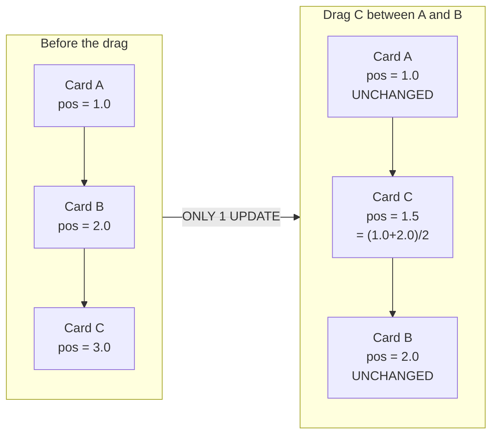
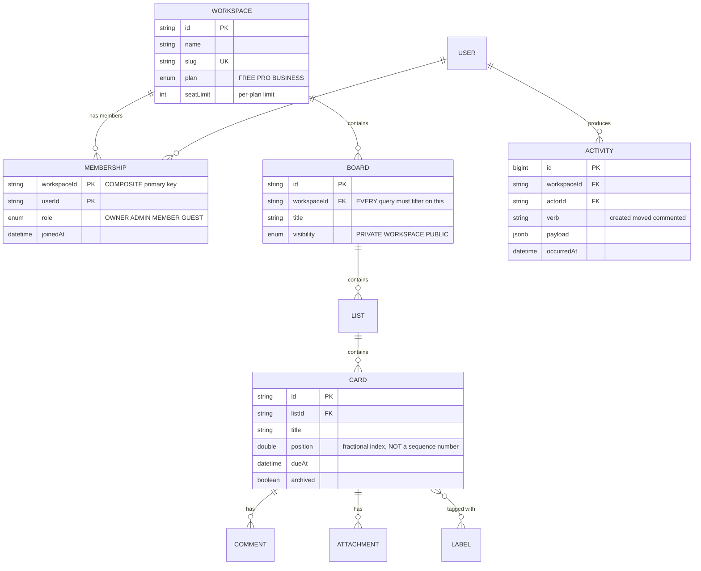
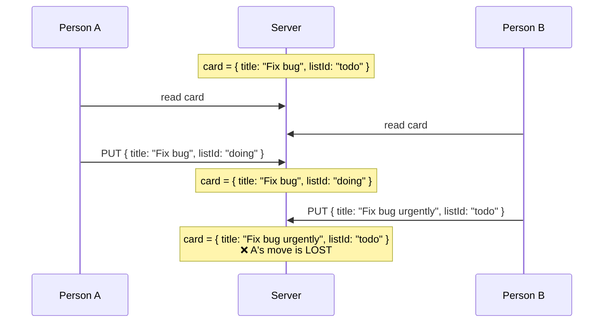

# SaaS Project Management Tool (Trello Clone)

The central problem here is not drag and drop. Drag and drop is a library. The real problem is: **two people drag a card into the same slot at the same moment, and the system must produce one result that both of them see identically.**

That is the concurrent ordering problem, and it has an elegant solution most beginners have not met — so they pick the obvious one (an integer `position` column) and pay for it in mass updates.

It is also the first project with **many organisations sharing one system** (multi-tenant), where "how do we stop company A's data reaching company B" becomes harder than a single `where` clause.

---

## What you are going to build

- Many workspaces, each with many boards, each with lists and cards
- Drag cards between lists, synced live to everyone who has the board open
- Roles: owner / admin / member / guest
- Comments, attachments, labels, due dates, checklists
- Activity log and a notification feed
- Monthly subscription plans with per-plan limits

---

## Ordering: the actual problem

### The obvious approach, and why it breaks

`position` is an integer: 1, 2, 3… Drag a card from the bottom to the top and you must add 1 to **every other card**. A board with 500 cards means 500 UPDATE statements for one drag.

Worse: two people drag simultaneously, both renumber, and the final order depends on who writes last — usually an order neither of them wanted.

### The right approach: fractional indexing

Make `position` a float (or a string), and when inserting between two cards, take the **midpoint**:



One drag = **one** UPDATE on **one** row, regardless of board size. And because only the dragged row changes, two people dragging different cards never collide.

```ts
// Compute the new position when dropping between prev and next.
function computePosition(prev?: number, next?: number): number {
  if (prev === undefined && next === undefined) return 1;      // empty board
  if (prev === undefined) return next! / 2;                    // drop at the top
  if (next === undefined) return prev + 1;                     // drop at the bottom
  return (prev + next) / 2;                                    // insert between
}
```

### The trap in fractional indexing

Repeatedly inserting in the same place halves the gap each time: 1.5 → 1.25 → 1.125 → … After about 50 insertions, a 64-bit float runs out of precision and two cards share a `position`.

Two remedies, and you should implement both:

1. **Detect and renumber.** When the gap between two positions falls under a threshold, renumber that one list. It happens rarely, and touches only a few dozen rows.
2. **Use string keys.** Replace floats with base-62 strings (`"a"`, `"b"`, and `"an"` between them), which in theory never run out. More complex, but it is what Figma and Notion actually use.

---

## Multi-tenant: leaking between companies

In [Todo App](/projects/todo-list-app-full-stack), isolation was one `userId` in a `where` clause. Here it is three steps harder: a person belongs to many workspaces with a different role in each, and resources nest four levels deep.



The problem: to check "may this person view card X", you must walk **four** levels up — card → list → board → workspace — and then consult the membership table. Hand-writing that chain in every endpoint guarantees it gets forgotten somewhere.

Two ways to prevent leaks, chosen by team size:

**Option 1 — one authorisation function.** Every endpoint goes through it, no exceptions:

```ts
async function assertCardAccess(userId: string, cardId: string, need: Role[]) {
  // One query that joins straight to membership, instead of four sequential ones.
  const row = await prisma.card.findFirst({
    where: {
      id: cardId,
      list: { board: { workspace: { memberships: { some: { userId, role: { in: need } } } } } },
    },
    select: { id: true },
  });
  if (!row) throw new ForbiddenError();   // does not exist OR no permission
}
```

Returning the same error for "does not exist" and "no permission" is deliberate — distinguishing them lets outsiders probe whether a card exists.

**Option 2 — Postgres Row-Level Security.** Put the policy in the database itself:

```sql
ALTER TABLE cards ENABLE ROW LEVEL SECURITY;

CREATE POLICY card_tenant_isolation ON cards
    USING (
        list_id IN (
            SELECT l.id FROM lists l
            JOIN boards b ON b.id = l.board_id
            JOIN memberships m ON m.workspace_id = b.workspace_id
            WHERE m.user_id = current_setting('app.user_id')::uuid
        )
    );
```

More expensive at runtime, but it is a safety net *below* the application: forgetting a `where` in one endpoint no longer leaks, because the database filters anyway. For sensitive data or larger teams, this is the right call.

---

## Real-time sync and the "who wins" problem

Two people have the same board open. A drags a card into "Doing" while B renames that same card. Both changes are valid and **do not conflict** — they touch different fields.

But if the client sends the whole card object (`PUT /cards/:id` with every field), the later write overwrites the earlier one even on fields it never touched. That is a *lost update*.



The fix: **send operations, not state.**

```ts
// Instead of PUTting the whole card, send exactly what changed:
socket.emit('card:move',   { cardId, toListId, position });
socket.emit('card:rename', { cardId, title });

// On the server, each operation writes only its own columns:
await prisma.card.update({
  where: { id: cardId },
  data: { listId: toListId, position },   // does NOT touch title
});
```

This principle holds for every collaborative system, and it is the primitive version of what [Real-Time Collaboration Tool](/projects/realtime-collaboration-figma-like) takes to its conclusion with CRDTs.

---

## Plan limits: where to enforce them

The FREE plan allows 3 boards. Where do you check?

```ts
// WRONG — checking in the UI. Open DevTools and it is bypassed.
if (workspace.plan === 'FREE' && boards.length >= 3) {
  setError('Upgrade to create more boards');
  return;
}

// STILL NOT ENOUGH — checked in the service, but there is a race:
// two concurrent requests both see "2 boards exist" and both create.
const count = await prisma.board.count({ where: { workspaceId } });
if (count >= limit) throw new PlanLimitError();
await prisma.board.create({ ... });

// RIGHT — push the constraint into the database, as every time before.
await prisma.$transaction(async (tx) => {
  // Lock the workspace row: two concurrent creates queue up instead of
  // both reading a number that is already out of date.
  const ws = await tx.$queryRaw`
    SELECT plan, board_count FROM workspaces WHERE id = ${workspaceId} FOR UPDATE
  `;
  if (ws.board_count >= PLAN_LIMITS[ws.plan].boards) throw new PlanLimitError();
  await tx.board.create({ data: { workspaceId, title } });
  await tx.workspace.update({
    where: { id: workspaceId },
    data: { boardCount: { increment: 1 } },
  });
});
```

This is the fourth time on the roadmap you meet the same pattern: **a business rule must be enforced where atomicity exists.** In Todo it was `where` with `userId`, in URL Shortener a unique constraint, in E-Commerce `UPDATE ... WHERE stock >= qty`, here `SELECT ... FOR UPDATE`.

---

## Traps, written down

| Symptom | Actual cause | Fix |
|---|---|---|
| One drag writes 500 rows | `position` is a sequential integer | Fractional indexing, one row written |
| Two cards overlap after many drags | Float precision exhausted | Renumber when the gap gets too small |
| A renames, B drags, one change disappears | Sending whole objects instead of operations | Operation events, column-scoped updates |
| Company A's member reads company B's board | Missing `workspaceId` filter in one endpoint | A shared authorisation function, or RLS |
| Plan limit exceeded by double-clicking | Count, then create | `SELECT ... FOR UPDATE` inside a transaction |
| Large boards get slower | Loading every card of every list | Paginate per list, load more on scroll |
| Notification flooding | One notification per change | Batch within a time window before sending |

---

## When it counts as finished

- [ ] Two browsers on the same board: dragging in one updates the other in under 300ms
- [ ] Dragging a card on a 1,000-card board issues exactly **1** UPDATE (enable query logging and count)
- [ ] Inserting 100 cards consecutively at the same slot leaves no two cards sharing a `position`
- [ ] Signed in as a non-member, calling the API directly with `curl` returns 403 on every endpoint
- [ ] Clicking "create board" ten times rapidly on FREE creates exactly 3
- [ ] Renaming and moving the same card from two machines preserves both changes

---

## Where to go next

1. **Offline mode.** Operations queue in IndexedDB and sync when connectivity returns. New problem: resolving conflicts when both sides edited offline.
2. **Automation.** "When a card moves to Done, apply a label and notify the owner" — a small rules engine, and the first step into event-driven architecture.
3. **Live co-editing inside a card.** Several people typing one description — this is where real CRDTs become necessary, and the bridge into [Real-Time Collaboration Tool](/projects/realtime-collaboration-figma-like).
