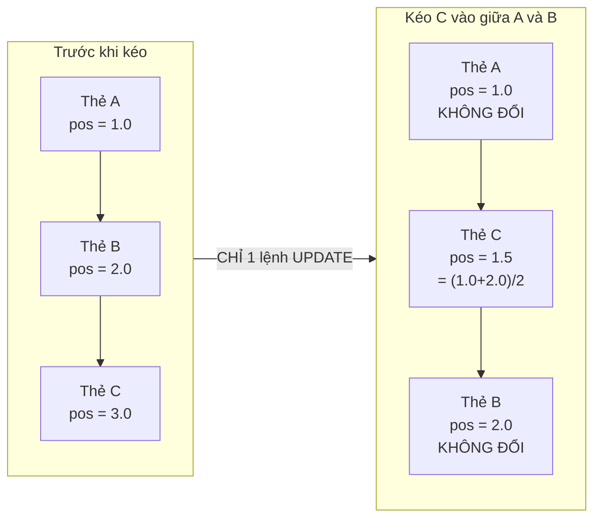
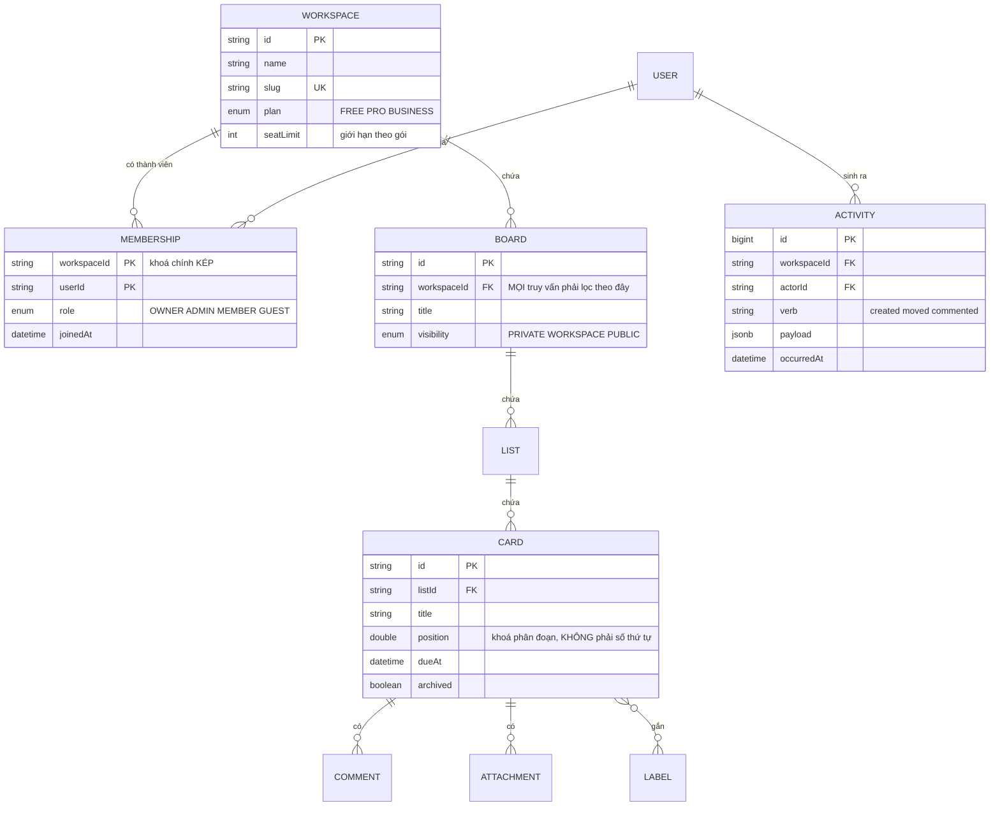
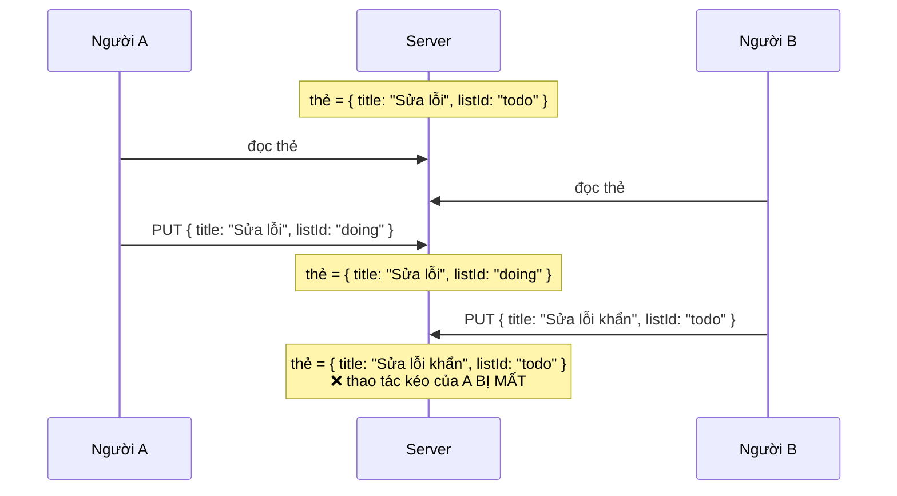

# SaaS Project Management Tool (Trello Clone)

Bài toán trung tâm của dự án này không phải là kéo thả. Kéo thả là một thư viện. Bài toán thật là: **hai người cùng kéo một thẻ vào cùng một vị trí, cùng lúc, và hệ thống phải cho ra một kết quả duy nhất mà cả hai đều thấy giống nhau.**

Đó là bài toán sắp thứ tự trong môi trường đồng thời, và nó có một lời giải đẹp mà phần lớn người mới không biết — nên họ chọn cách hiển nhiên (một cột `position` là số nguyên) rồi trả giá bằng những lần cập nhật hàng loạt.

Đây cũng là dự án đầu tiên có **nhiều tổ chức dùng chung một hệ thống** (multi-tenant), và câu hỏi "làm sao dữ liệu công ty A không rò sang công ty B" bắt đầu khó hơn một dòng `where`.

---

## Bạn sẽ dựng ra cái gì

- Nhiều không gian làm việc, mỗi cái nhiều bảng, mỗi bảng nhiều danh sách và thẻ
- Kéo thả thẻ giữa các danh sách, đồng bộ thời gian thực cho mọi người đang mở
- Vai trò: chủ sở hữu / quản trị / thành viên / khách xem
- Bình luận, đính kèm, nhãn, hạn chót, danh sách việc con
- Nhật ký hoạt động và bảng tin thông báo
- Gói thanh toán theo tháng, giới hạn theo gói

---

## Sắp thứ tự: bài toán thật sự

### Cách hiển nhiên, và vì sao nó hỏng

Cột `position` là số nguyên 1, 2, 3… Kéo một thẻ từ cuối lên đầu, bạn phải cộng 1 cho **mọi thẻ còn lại**. Bảng có 500 thẻ nghĩa là 500 lệnh UPDATE cho một thao tác kéo.

Tệ hơn: hai người cùng kéo, cả hai cùng đánh số lại, và kết quả cuối cùng phụ thuộc vào việc ai ghi sau — thường là một thứ tự mà không ai trong hai người muốn.

### Cách đúng: khoá phân đoạn (fractional indexing)

Dùng `position` kiểu số thực (hoặc chuỗi), và khi chèn giữa hai thẻ, lấy **trung bình** của hai vị trí:



Một thao tác kéo = **một** lệnh UPDATE trên **một** dòng, bất kể bảng có bao nhiêu thẻ. Và vì chỉ dòng bị kéo thay đổi, hai người kéo hai thẻ khác nhau không hề đụng nhau.

```ts
// Tính vị trí mới khi thả vào giữa prev và next.
function computePosition(prev?: number, next?: number): number {
  if (prev === undefined && next === undefined) return 1;      // bảng rỗng
  if (prev === undefined) return next! / 2;                    // thả lên đầu
  if (next === undefined) return prev + 1;                     // thả xuống cuối
  return (prev + next) / 2;                                    // chèn giữa
}
```

### Cái bẫy của khoá phân đoạn

Chèn liên tục vào cùng một chỗ làm khoảng cách nhỏ dần: 1.5 → 1.25 → 1.125 → … Sau khoảng 50 lần, số thực 64-bit hết độ chính xác và hai thẻ có cùng `position`.

Hai cách xử lý, và nên làm cả hai:

1. **Phát hiện và đánh số lại.** Khi khoảng cách giữa hai vị trí nhỏ hơn một ngưỡng, chạy một lần đánh số lại cho riêng danh sách đó. Hiếm khi xảy ra, và chỉ ảnh hưởng vài chục dòng.
2. **Dùng khoá dạng chuỗi.** Thay số thực bằng chuỗi base-62 (`"a"`, `"b"`, giữa hai cái là `"an"`), về lý thuyết không bao giờ hết chỗ. Phức tạp hơn nhưng là cách Figma và Notion thực sự dùng.

---

## Multi-tenant: rò rỉ dữ liệu giữa các công ty

Ở [Todo App](/projects/todo-list-app-full-stack), phân tách dữ liệu là một cột `userId` trong mệnh đề `where`. Ở đây nó phức tạp hơn ba bậc: một người thuộc nhiều không gian làm việc, mỗi nơi một vai trò khác nhau, và tài nguyên lồng nhau bốn tầng.



Vấn đề: để kiểm tra "người này có được xem thẻ X không", bạn phải đi ngược **bốn** cấp — thẻ → danh sách → bảng → không gian làm việc — rồi mới tra bảng thành viên. Viết tay chuỗi kiểm tra đó ở mọi endpoint là đảm bảo sẽ quên ở đâu đó.

Hai cách chống rò rỉ, và nên chọn theo quy mô đội:

**Cách 1 — một hàm kiểm quyền duy nhất.** Mọi endpoint đi qua nó, không có ngoại lệ:

```ts
async function assertCardAccess(userId: string, cardId: string, need: Role[]) {
  // Một truy vấn join thẳng tới membership, thay vì bốn truy vấn nối tiếp.
  const row = await prisma.card.findFirst({
    where: {
      id: cardId,
      list: { board: { workspace: { memberships: { some: { userId, role: { in: need } } } } } },
    },
    select: { id: true },
  });
  if (!row) throw new ForbiddenError();   // không tồn tại HOẶC không có quyền
}
```

Trả cùng một lỗi cho "không tồn tại" và "không có quyền" là có chủ đích — phân biệt hai cái đó cho phép người ngoài dò xem một thẻ có tồn tại hay không.

**Cách 2 — Row-Level Security của Postgres.** Đặt chính sách ngay trong database:

```sql
ALTER TABLE cards ENABLE ROW LEVEL SECURITY;

CREATE POLICY card_tenant_isolation ON cards
    USING (
        list_id IN (
            SELECT l.id FROM lists l
            JOIN boards b ON b.id = l.board_id
            JOIN memberships m ON m.workspace_id = b.workspace_id
            WHERE m.user_id = current_setting('app.user_id')::uuid
        )
    );
```

Đắt hơn về hiệu năng, nhưng nó là mạng lưới an toàn *dưới* tầng ứng dụng: quên `where` ở một endpoint không còn dẫn tới rò rỉ, vì database tự lọc. Với dữ liệu nhạy cảm hoặc đội đông người, đây là lựa chọn đúng.

---

## Đồng bộ thời gian thực và bài toán "ai thắng"

Hai người cùng mở một bảng. A kéo thẻ sang danh sách "Đang làm", B cùng lúc đổi tên thẻ đó. Cả hai thay đổi đều hợp lệ và **không xung đột** — chúng chạm vào hai trường khác nhau.

Nhưng nếu client gửi nguyên cả đối tượng thẻ (`PUT /cards/:id` với toàn bộ trường), thay đổi tới sau sẽ ghi đè thay đổi tới trước, kể cả ở trường nó không hề động tới. Đó là *lost update*.



Cách chữa: **gửi thao tác, không gửi trạng thái.**

```ts
// Thay vì PUT toàn bộ thẻ, gửi đúng thứ đã đổi:
socket.emit('card:move',   { cardId, toListId, position });
socket.emit('card:rename', { cardId, title });

// Ở server, mỗi thao tác chỉ ghi đúng cột của nó:
await prisma.card.update({
  where: { id: cardId },
  data: { listId: toListId, position },   // KHÔNG đụng tới title
});
```

Nguyên tắc này đúng cho mọi hệ thống cộng tác, và nó là phiên bản sơ khai của thứ mà [Real-Time Collaboration Tool](/projects/realtime-collaboration-figma-like) đẩy tới tận cùng bằng CRDT.

---

## Giới hạn theo gói: đặt ở đâu

Gói FREE cho 3 bảng. Kiểm tra ở đâu?

```ts
// SAI — kiểm ở giao diện. Người dùng mở DevTools là qua mặt.
if (workspace.plan === 'FREE' && boards.length >= 3) {
  setError('Nâng cấp để tạo thêm bảng');
  return;
}

// VẪN CHƯA ĐỦ — kiểm ở service, nhưng có race condition:
// hai request cùng lúc đều thấy "đang có 2 bảng" và cùng tạo.
const count = await prisma.board.count({ where: { workspaceId } });
if (count >= limit) throw new PlanLimitError();
await prisma.board.create({ ... });

// ĐÚNG — đưa ràng buộc xuống database, giống mọi lần trước.
await prisma.$transaction(async (tx) => {
  // Khoá dòng workspace: hai request tạo bảng cùng lúc sẽ xếp hàng
  // thay vì cùng đọc một con số đã lỗi thời.
  const ws = await tx.$queryRaw`
    SELECT plan, board_count FROM workspaces WHERE id = ${workspaceId} FOR UPDATE
  `;
  if (ws.board_count >= PLAN_LIMITS[ws.plan].boards) throw new PlanLimitError();
  await tx.board.create({ data: { workspaceId, title } });
  await tx.workspace.update({
    where: { id: workspaceId },
    data: { boardCount: { increment: 1 } },
  });
});
```

Đây là lần thứ tư trong lộ trình bạn gặp cùng một mẫu hình: **điều kiện nghiệp vụ phải được thực thi ở nơi có tính nguyên tử.** Ở Todo là `where` có `userId`, ở URL Shortener là ràng buộc unique, ở E-Commerce là `UPDATE ... WHERE stock >= qty`, ở đây là `SELECT ... FOR UPDATE`.

---

## Những cái bẫy đã được ghi lại

| Triệu chứng | Nguyên nhân thật | Cách sửa |
|---|---|---|
| Kéo một thẻ, database ghi 500 dòng | `position` là số thứ tự nguyên | Khoá phân đoạn, chỉ ghi 1 dòng |
| Hai thẻ chồng lên nhau sau nhiều lần kéo | Số thực hết độ chính xác | Đánh số lại khi khoảng cách quá nhỏ |
| Người A đổi tên, người B kéo, mất một thao tác | Gửi cả đối tượng thay vì thao tác | Sự kiện theo thao tác, cập nhật theo cột |
| Thành viên công ty A đọc được bảng công ty B | Quên lọc `workspaceId` ở một endpoint | Hàm kiểm quyền dùng chung, hoặc RLS |
| Vượt giới hạn gói khi bấm nhanh hai lần | Đếm rồi mới tạo | `SELECT ... FOR UPDATE` trong giao dịch |
| Bảng lớn tải chậm dần | Tải hết thẻ của mọi danh sách | Phân trang theo danh sách, tải thêm khi cuộn |
| Thông báo dội hàng loạt | Mỗi thay đổi một thông báo | Gộp theo cửa sổ thời gian trước khi gửi |

---

## Khi nào coi như xong

- [ ] Hai trình duyệt cùng mở một bảng, kéo thẻ ở cửa sổ này thì cửa sổ kia đổi trong dưới 300ms
- [ ] Kéo thẻ trong bảng 1.000 thẻ: đúng **1** lệnh UPDATE (bật log truy vấn để đếm)
- [ ] Chèn 100 thẻ liên tiếp vào cùng một vị trí: không có hai thẻ nào cùng `position`
- [ ] Đăng nhập bằng tài khoản không thuộc workspace, gọi thẳng API bằng `curl`: nhận 403 ở mọi endpoint
- [ ] Bấm "tạo bảng" mười lần thật nhanh ở gói FREE: đúng 3 bảng được tạo
- [ ] Đổi tên thẻ và kéo thẻ cùng lúc từ hai máy: cả hai thay đổi đều còn

---

## Bước tiếp theo

1. **Chế độ ngoại tuyến.** Thao tác lưu vào IndexedDB, đồng bộ khi có mạng lại. Bài toán mới: giải quyết xung đột khi hai bên cùng sửa lúc offline.
2. **Tự động hoá.** "Khi thẻ chuyển sang Xong thì gán nhãn và báo cho chủ sở hữu" — một cỗ máy quy tắc nhỏ, và là bước đầu vào kiến trúc hướng sự kiện.
3. **Cộng tác tức thời trong nội dung thẻ.** Nhiều người cùng gõ một mô tả — đây chính là lúc cần CRDT thật, và là cầu nối sang [Real-Time Collaboration Tool](/projects/realtime-collaboration-figma-like).
