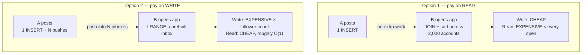
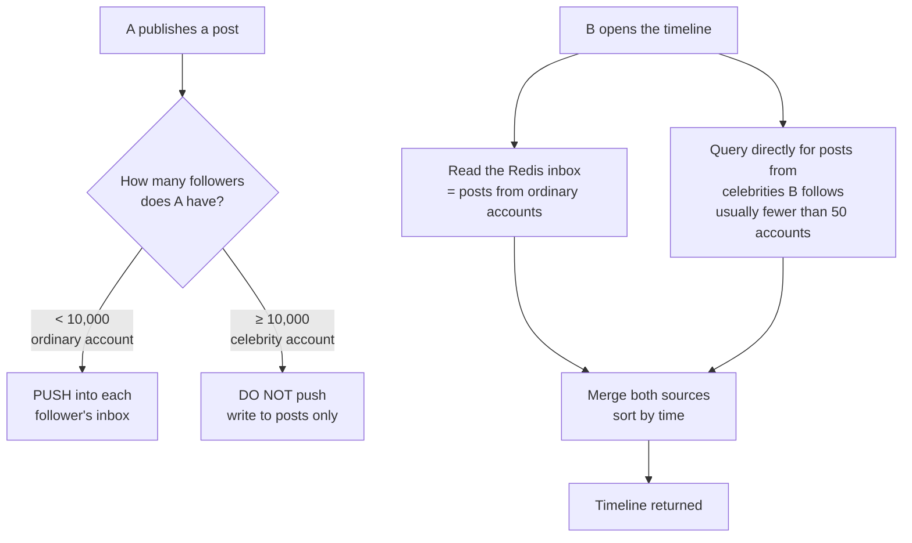
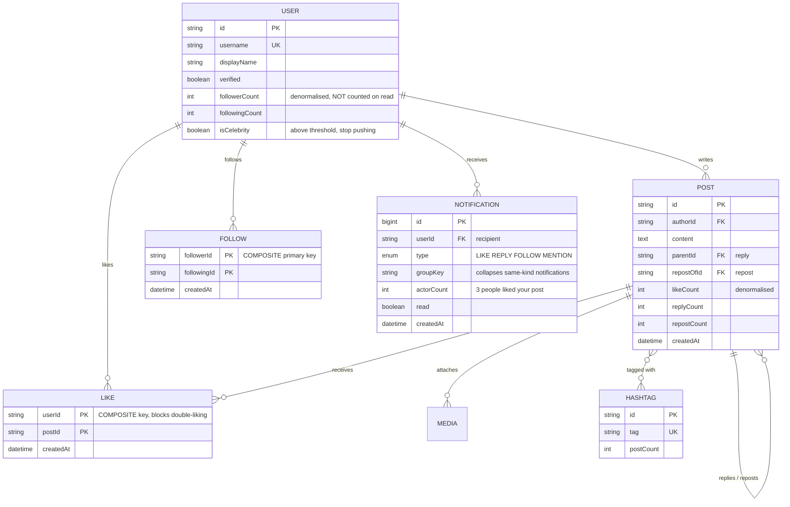
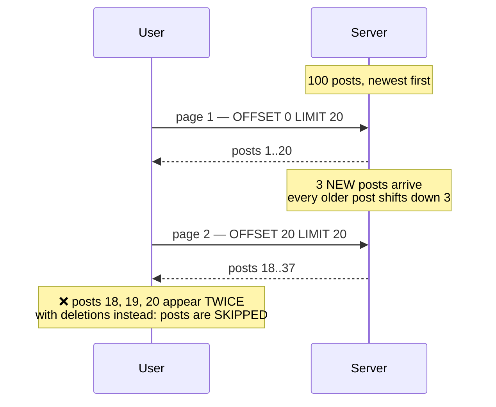

# Social Media Platform (Twitter-like)

Posting a line of text is easy. The hard part is the question that follows: **you have a million followers, you press Post — who does the work?**

That is not rhetorical. It has two opposing answers, each produces a completely different architecture, and choosing wrong means the system falls over at exactly the moment it starts succeeding.

Every earlier project in this roadmap shares one property: a write touches a fixed number of rows. This is the first one where **a single write can touch a million rows** — and that is what this case study is about.

---

## What you will build

- Text and image posts, threaded replies, reposts and quotes
- Follow / unfollow, home timeline and profile timeline
- Likes, bookmarks, hashtags, mentions
- Trending topics computed in near real time
- Search across users, posts and hashtags
- Live notifications, aggregated
- Infinite scroll with no duplicated and no skipped posts

---

## The central problem: who pays, the writer or the reader

Social platforms are read-heavy by a wide margin. Someone posts twice a day but opens the app thirty times. A 100:1 read/write ratio is unremarkable.

There is only one architectural question: when A posts, do we do the work now, or do we defer it until each follower opens the app?

### Option 1 — pay on read (fan-out on read)

Do nothing at post time. When B opens the app, go looking:

```sql
SELECT p.* FROM posts p
 WHERE p.author_id IN (SELECT following_id FROM follows WHERE follower_id = $1)
 ORDER BY p.created_at DESC
 LIMIT 20;
```

Posting is nearly free: one INSERT. But every app open runs a query that sweeps the posts of the entire following list. Someone following 2,000 accounts means an `IN` with 2,000 entries and a sort over potentially hundreds of thousands of rows — **on every pull-to-refresh**.

### Option 2 — pay on write (fan-out on write)

When A posts, push it straight into a prebuilt inbox for each follower:



Reads become `LRANGE timeline:B 0 19` against Redis — a few hundred microseconds, independent of how many accounts B follows. At 100:1, this is clearly the side worth optimising.

```ts
// Push the post into each follower's inbox. A pipeline sends N commands
// in ONE network round trip instead of N.
const pipeline = redis.pipeline();
for (const f of followers) {
  const key = `timeline:${f.followerId}`;
  pipeline.lpush(key, post.id);
  pipeline.ltrim(key, 0, 799);   // keep the newest 800; older reads hit the DB
}
await pipeline.exec();
```

Note what is pushed: the **post id**, not the content. Pushing content means one post is duplicated a million times in memory, and the moment the author edits it, all million copies are stale.

### And why both are wrong

Option 2 dies in one very specific place: **an account with ten million followers**. That person presses Post and the system owes ten million writes. Everything else queues behind it.

Option 1 dies on accounts that follow too many people.

The real answer is a **hybrid**, and the boundary is a number you choose:



What makes the hybrid work: a person may follow thousands of accounts, but **very few of them sit above the celebrity threshold**. Querying directly for 30–50 accounts is trivial; querying directly for 2,000 is not. The hybrid removes the expensive case from both strategies.

This is a shape of decision you will meet repeatedly for the rest of the roadmap: **there is no single strategy that is right for all data, only a strategy that is right for each segment of it.**

---

## A million writes: never inside the request

Even for an account with 9,000 followers — below the threshold — 9,000 pushes do not belong in an HTTP request lifecycle. A user pressing Post and waiting four seconds is a broken product.

The right shape: **write the post, respond immediately, hand the fan-out to a background queue in batches.**

```ts
// In the request: write and return. The user sees their own post right away
// because the client inserts it optimistically at the top of the list.
const post = await prisma.post.create({ data: { authorId, content } });
await fanoutQueue.add('fanout', { postId: post.id, authorId });
return post;

// In the worker: batch, so one popular author cannot monopolise the queue
// and stall everyone else's posts.
async function fanout({ postId, authorId }) {
  let cursor: string | undefined;
  do {
    const batch = await prisma.follow.findMany({
      where: { followingId: authorId, ...(cursor && { id: { gt: cursor } }) },
      orderBy: { id: 'asc' },
      take: 5_000,
      select: { id: true, followerId: true },
    });
    if (batch.length === 0) break;

    const pipeline = redis.pipeline();
    for (const f of batch) {
      pipeline.lpush(`timeline:${f.followerId}`, postId);
      pipeline.ltrim(`timeline:${f.followerId}`, 0, 799);
    }
    await pipeline.exec();

    cursor = batch[batch.length - 1].id;
  } while (true);
}
```

Two details that are easy to miss:

- **Paginate by `id` cursor, never `skip`.** `skip: 500000` makes Postgres count through half a million rows and discard them. With `id > cursor` the index does the work and every batch costs the same.
- **Fan-out must be safe to repeat.** A worker that retries after a failure may push the same post twice. Deduplicate at read time with a `Set`, or check with `LPOS` first — both are cheaper than forcing exactly-once delivery on the queue.

---

## The data model



Two decisions worth naming:

**`followerCount` is a stored column, not a `COUNT(*)`.** Every profile page shows it. Counting for real on each page view scans millions of rows for a number nobody verifies to the unit. It also decides whether an account crosses the celebrity threshold — that needs to be a fast read.

**`LIKE` uses the composite key `(userId, postId)`.** Not to save space, but so **the database rejects the second like** instead of the application layer trying to.

---

## Counters: the same pattern, a fifth time

A user double-taps Like, or a flaky network makes the client retry. The obvious code:

```ts
// WRONG — two concurrent requests both see "not liked yet", both write,
// and likeCount goes up by 2 for one person.
const existing = await prisma.like.findUnique({ where: { userId_postId: { userId, postId } } });
if (!existing) {
  await prisma.like.create({ data: { userId, postId } });
  await prisma.post.update({ where: { id: postId }, data: { likeCount: { increment: 1 } } });
}
```

The correct form lets the unique constraint decide, and **increments only when a row was genuinely inserted**:

```sql
-- ON CONFLICT DO NOTHING + RETURNING: if the like already existed, no row
-- comes back and the UPDATE below matches nothing.
WITH inserted AS (
    INSERT INTO likes (user_id, post_id)
    VALUES ($1, $2)
    ON CONFLICT (user_id, post_id) DO NOTHING
    RETURNING post_id
)
UPDATE posts
   SET like_count = like_count + 1
 WHERE id IN (SELECT post_id FROM inserted);
```

This is the fifth appearance of one principle in a new disguise: **business conditions must be enforced where atomicity lives.** In [Todo App](/projects/todo-list-app-full-stack) it was `where` with `userId`; in [URL Shortener](/projects/url-shortener-voi-analytics) it was catching a unique-constraint violation; in [E-Commerce](/projects/e-commerce-platform-multi-vendor) it was `UPDATE ... WHERE stock >= qty`; in [Trello](/projects/saas-project-management-trello) it was `SELECT ... FOR UPDATE`; here it is `ON CONFLICT ... RETURNING`.

Five projects, five syntaxes, one idea. Recognising that is the most valuable thing this roadmap has to offer.

---

## Infinite scroll: why posts duplicate and disappear

`LIMIT 20 OFFSET 40` fails on a timeline in a particularly irritating way: **rows get inserted at the top while the user is scrolling.**



The fix is cursor pagination: remember the last position instead of counting rows to skip.

But there is a smaller trap inside it: `created_at` **is not unique**. Several posts can share a millisecond, and a cursor based on time alone will duplicate or skip exactly those. The cursor needs a tiebreaker:

```sql
-- Compare the TUPLE (created_at, id) — Postgres supports row comparison
-- directly, and it uses the composite index (created_at DESC, id DESC).
SELECT * FROM posts
 WHERE (created_at, id) < ($1, $2)
 ORDER BY created_at DESC, id DESC
 LIMIT 20;
```

---

## Trending: a big count is not a trend

The obvious approach is `ORDER BY postCount DESC`. The result is a leaderboard that does not move for months, because permanently popular hashtags always win.

"Trending" means **a spike relative to itself**, not the largest total. A hashtag going from 5 mentions an hour to 500 is news; one sitting steadily at 10,000 an hour is not.

The compact way to do it is a sliding window in a Redis sorted set, comparing two windows:

```ts
// Every hashtagged post increments the current hour's bucket.
const bucket = `trend:${Math.floor(Date.now() / 3_600_000)}`;
await redis.zincrby(bucket, 1, tag);
await redis.expire(bucket, 86_400);      // keep 24 hours, then self-delete

// Trend score = this hour against the average of the previous six.
// The +1 keeps a brand-new hashtag from dividing by zero.
const score = countThisHour / (avgPrevious6Hours + 1);
```

Two guards every real system needs on top:

- **Count people, not posts.** One account posting the same hashtag 500 times must count as 1. Use `PFADD` (HyperLogLog) for unique-actor counts — roughly 0.8% error but 12KB for millions of users, and a trending list does not need exactness.
- **An absolute floor.** A hashtag going from 1 to 20 has a 20× growth rate and is not a trend. Discard anything below a fixed minimum.

---

## Notifications: the problem is not delivery, it is collapsing

A post with 200 likes means 200 notification rows, and the user's feed becomes a column of "liked your post" repeated until nobody reads it any more.

Collapse with a stable `groupKey`, written as an upsert:

```ts
// groupKey folds every like on the SAME post into ONE notification row.
const groupKey = `LIKE:${postId}`;

await prisma.notification.upsert({
  where: { userId_groupKey: { userId: post.authorId, groupKey } },
  create: { userId: post.authorId, type: 'LIKE', groupKey, postId, actorCount: 1, lastActorId: userId },
  update: {
    actorCount: { increment: 1 },
    lastActorId: userId,
    read: false,              // a new actor makes it unread again
    createdAt: new Date(),    // and floats it back to the top
  },
});
// Rendered as: "Minh and 199 others liked your post"
```

And **do not emit a socket event per like**. A viral post produces thousands of events per second aimed at one user, and their browser freezes because of the notifications themselves. Batch within a few-second window and emit once. The per-user socket room built in [Real-Time Chat App](/projects/real-time-chat-app-1-1) transfers here unchanged.

---

## Traps worth recording

| Symptom | Actual cause | Fix |
|---|---|---|
| Posting takes 4 seconds | Fan-out runs inside the request | Respond first, fan out in a batched worker |
| One account's post stalls the whole system | Fan-out to 10 million followers | Celebrity threshold, no push, merge on read |
| Edited post still shows old text in timelines | Content pushed into Redis | Push ids only, hydrate on read |
| Scrolling shows posts already seen | `OFFSET` while new posts arrive at the top | Cursor on the tuple `(created_at, id)` |
| Some posts never appear | Ties in `created_at`, time-only cursor | Add `id` to the cursor |
| Double-tapping Like counts 2 | Read-then-write | `ON CONFLICT DO NOTHING ... RETURNING` |
| Trending list unchanged for months | Ordering by lifetime totals | Growth rate over a sliding window, with a floor |
| Feed is nothing but "liked your post" | One row per interaction | Collapse by `groupKey`, count actors |
| Profile pages load slowly | `COUNT(*)` of followers on every view | Denormalised counter, updated on follow |
| Timeline issues hundreds of queries | Fetching each post's author separately | Fetch ids first, then hydrate authors in one batch |

---

## When it is genuinely done

- [ ] An account with 100,000 followers posts: the API responds in under 200ms (fan-out is async)
- [ ] Timeline for someone following 2,000 accounts: under 100ms at p95
- [ ] Scroll ten pages continuously while another account is posting: nothing duplicates, nothing is skipped
- [ ] Fire 50 concurrent like requests from one account: `likeCount` increases by exactly 1
- [ ] With query logging on, load a 20-post timeline: fewer than 5 queries, not 20+
- [ ] One account posts 500 times with the same hashtag: that hashtag does **not** trend
- [ ] 200 people like a post: exactly **1** notification row, reading "and 199 others"
- [ ] Kill Redis entirely: the timeline still returns (slower) via the DB fallback path

---

## Where to go next

1. **Relevance ranking.** Replace chronological order with a score combining engagement and recency. The new problem: judging whether users actually prefer the new ordering without asking them.
2. **Content moderation.** Automatic flagging, a moderator queue, appeals. This is where the engineering boundary meets policy.
3. **Search done properly.** Full text over posts, user suggestions, typo tolerance — the subject of [Job Board Platform](/projects/job-board-platform-linkedin-like) from the hiring angle, and taken to its limit in [Distributed Search Engine](/projects/distributed-search-engine).
4. **Video in posts.** Upload, transcode, adaptive playback — [Video Streaming Platform](/projects/video-streaming-platform-netflix-like) walks that whole pipeline.
