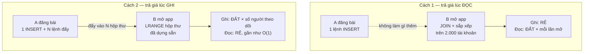
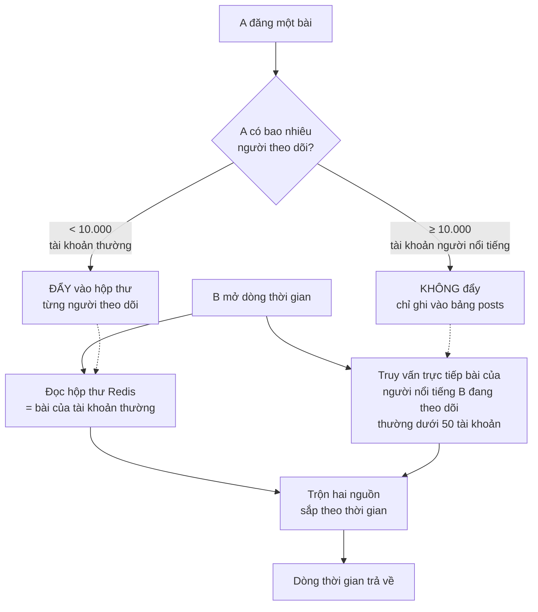
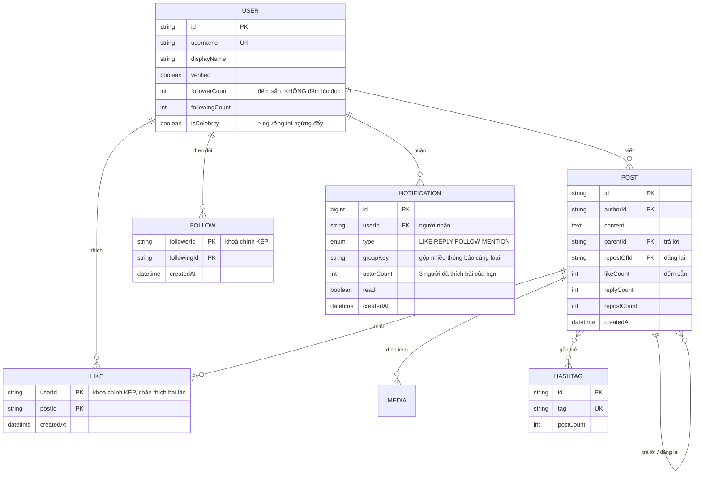
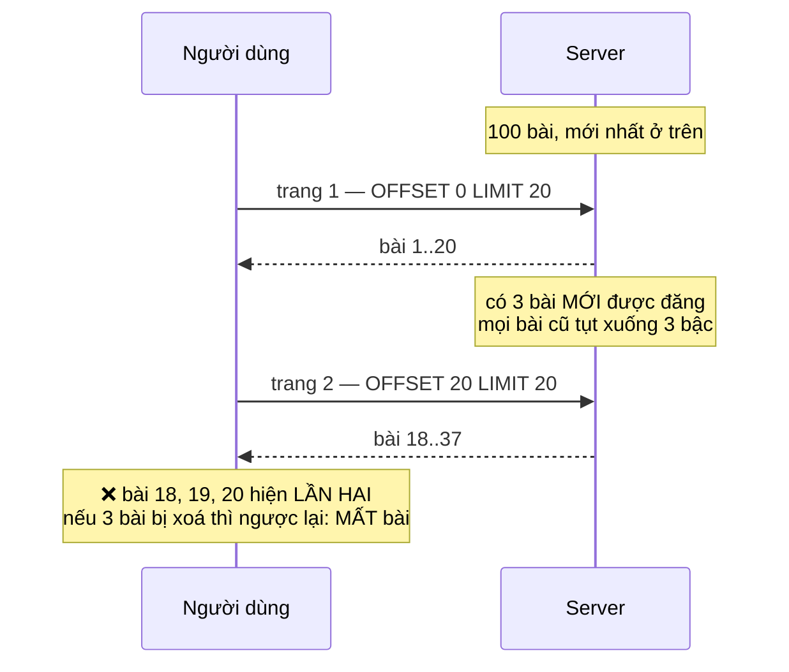

# Social Media Platform (Twitter-like)

Đăng một dòng chữ thì dễ. Cái khó nằm ở câu hỏi tiếp theo: **bạn có một triệu người theo dõi, bạn bấm Đăng — ai là người phải làm việc?**

Đó không phải câu hỏi tu từ. Nó có hai câu trả lời đối lập nhau, mỗi câu trả lời sinh ra một kiến trúc khác hẳn, và chọn sai thì hệ thống chết ở đúng thời điểm nó bắt đầu thành công.

Mọi dự án trước trong lộ trình đều có chung một đặc điểm: một thao tác ghi chạm vào một số dòng cố định. Đây là dự án đầu tiên mà **một thao tác ghi có thể chạm vào một triệu dòng** — và đó là toàn bộ nội dung bài này.

---

## Bạn sẽ dựng ra cái gì

- Đăng bài có chữ và ảnh, trả lời lồng nhau, đăng lại và trích dẫn
- Theo dõi / bỏ theo dõi, dòng thời gian trang chủ và dòng thời gian cá nhân
- Thích, đánh dấu, hashtag, nhắc tên
- Chủ đề thịnh hành tính theo thời gian thực
- Tìm kiếm người dùng, bài viết, hashtag
- Thông báo tức thời, có gộp
- Cuộn vô hạn không lặp bài, không nhảy bài

---

## Bài toán trung tâm: ai trả giá, người viết hay người đọc

Mạng xã hội là hệ thống **đọc nhiều hơn ghi rất nhiều lần**. Một người đăng 2 bài một ngày nhưng mở ứng dụng 30 lần. Tỉ lệ đọc/ghi tầm 100:1 là bình thường.

Câu hỏi kiến trúc chỉ có một: khi A đăng bài, ta làm việc ngay lúc đó, hay để dành đến lúc người theo dõi mở ứng dụng?

### Cách 1 — Trả giá lúc đọc (fan-out on read)

Không làm gì cả lúc đăng. Lúc B mở ứng dụng thì đi tìm:

```sql
SELECT p.* FROM posts p
 WHERE p.author_id IN (SELECT following_id FROM follows WHERE follower_id = $1)
 ORDER BY p.created_at DESC
 LIMIT 20;
```

Đăng bài rẻ như cho không: đúng một lệnh INSERT. Nhưng mỗi lần mở ứng dụng là một truy vấn quét qua bài của toàn bộ danh sách đang theo dõi. Người theo dõi 2.000 tài khoản thì đó là một `IN` với 2.000 phần tử, sắp xếp trên tập kết quả có thể tới hàng trăm nghìn dòng, **mỗi lần kéo để làm mới**.

### Cách 2 — Trả giá lúc ghi (fan-out on write)

Lúc A đăng, đẩy luôn bài đó vào hộp thư sẵn có của từng người theo dõi:



Đọc trở thành `LRANGE timeline:B 0 19` trên Redis — vài trăm micro giây, không phụ thuộc vào việc B theo dõi bao nhiêu người. Với tỉ lệ 100:1, đây rõ ràng là phía đáng tối ưu.

```ts
// Đẩy bài vào hộp thư của người theo dõi. Dùng pipeline để N lệnh
// đi trong MỘT vòng mạng thay vì N vòng.
const pipeline = redis.pipeline();
for (const f of followers) {
  const key = `timeline:${f.followerId}`;
  pipeline.lpush(key, post.id);
  pipeline.ltrim(key, 0, 799);   // giữ 800 bài gần nhất, phần cũ đọc từ DB
}
await pipeline.exec();
```

Chú ý: đẩy **id bài**, không đẩy cả nội dung. Đẩy nội dung nghĩa là một bài viết được nhân bản một triệu lần trong bộ nhớ, và khi tác giả sửa bài thì một triệu bản sao đó thành dữ liệu cũ.

### Và vì sao cả hai đều sai

Cách 2 chết ở một chỗ rất cụ thể: **tài khoản có mười triệu người theo dõi**. Người đó bấm Đăng, hệ thống phải thực hiện mười triệu lệnh ghi. Trong lúc đó mọi thao tác khác xếp hàng chờ.

Còn cách 1 chết ở tài khoản theo dõi quá nhiều người.

Lời giải thật là **lai cả hai**, và ranh giới là một con số bạn tự chọn:



Mấu chốt khiến phép lai này chạy được: một người theo dõi hàng nghìn tài khoản, nhưng trong đó **rất ít là tài khoản trên ngưỡng người nổi tiếng**. Truy vấn trực tiếp cho 30–50 tài khoản là chuyện nhỏ; truy vấn trực tiếp cho 2.000 tài khoản mới là chuyện lớn. Phép lai cắt đúng chỗ đắt của cả hai cách.

Đây là kiểu quyết định mà bạn sẽ gặp lại suốt phần còn lại của lộ trình: **không có một chiến lược đúng cho mọi dữ liệu, chỉ có chiến lược đúng cho từng phân khúc dữ liệu.**

---

## Đẩy một triệu lệnh ghi: không được làm trong request

Ngay cả với tài khoản 9.000 người theo dõi (dưới ngưỡng), 9.000 lệnh đẩy vẫn không thuộc về vòng đời một HTTP request. Người dùng bấm Đăng và chờ 4 giây là hỏng.

Việc đúng: **ghi bài xong trả lời ngay, phần đẩy giao cho hàng đợi nền, chia lô.**

```ts
// Trong request: chỉ ghi bài rồi trả về. Người dùng thấy bài của mình
// ngay lập tức vì client tự chèn vào đầu danh sách (cập nhật lạc quan).
const post = await prisma.post.create({ data: { authorId, content } });
await fanoutQueue.add('fanout', { postId: post.id, authorId });
return post;

// Trong worker: chia lô để một tác giả đông người theo dõi không
// chiếm trọn hàng đợi và làm nghẽn bài của mọi người khác.
async function fanout({ postId, authorId }) {
  let cursor: string | undefined;
  do {
    const batch = await prisma.follow.findMany({
      where: { followingId: authorId, ...(cursor && { id: { gt: cursor } }) },
      orderBy: { id: 'asc' },
      take: 5_000,
      select: { id: true, followerId: true },
    });
    if (batch.length === 0) break;

    const pipeline = redis.pipeline();
    for (const f of batch) {
      pipeline.lpush(`timeline:${f.followerId}`, postId);
      pipeline.ltrim(`timeline:${f.followerId}`, 0, 799);
    }
    await pipeline.exec();

    cursor = batch[batch.length - 1].id;
  } while (true);
}
```

Hai chi tiết dễ bỏ sót:

- **Phân trang theo con trỏ `id`, không dùng `skip`.** `skip: 500000` bắt Postgres đếm qua nửa triệu dòng rồi vứt đi. Với `id > cursor` thì chỉ mục làm việc và mỗi lô đều nhanh như nhau.
- **Đẩy là thao tác có thể lặp lại.** Worker chạy lại sau lỗi thì bài có thể vào hộp thư hai lần. Khử trùng lặp lúc đọc bằng `Set`, hoặc dùng `LPOS` kiểm tra trước — rẻ hơn là cố làm cho hàng đợi đảm bảo đúng-một-lần.

---

## Cơ sở dữ liệu



Hai quyết định đáng nói:

**`followerCount` là cột lưu sẵn, không phải `COUNT(*)`.** Trang cá nhân nào cũng hiện số người theo dõi. Đếm thật mỗi lần mở trang là quét hàng triệu dòng cho một con số mà không ai kiểm chứng từng đơn vị. Nó cũng là thứ quyết định tài khoản có vượt ngưỡng người nổi tiếng hay không — cần đọc nhanh.

**`LIKE` dùng khoá chính kép `(userId, postId)`.** Không phải để tiết kiệm chỗ, mà để **database từ chối lượt thích thứ hai** thay cho tầng ứng dụng.

---

## Bộ đếm: lần thứ năm gặp lại một mẫu hình

Người dùng bấm Thích hai lần thật nhanh, hoặc mạng chập chờn khiến client gửi lại. Cách viết hiển nhiên:

```ts
// SAI — hai request cùng lúc đều thấy "chưa thích", cả hai cùng ghi,
// likeCount cộng 2 cho một người.
const existing = await prisma.like.findUnique({ where: { userId_postId: { userId, postId } } });
if (!existing) {
  await prisma.like.create({ data: { userId, postId } });
  await prisma.post.update({ where: { id: postId }, data: { likeCount: { increment: 1 } } });
}
```

Cách đúng là để ràng buộc unique quyết định, và **chỉ tăng bộ đếm khi thật sự có dòng mới được chèn**:

```sql
-- ON CONFLICT DO NOTHING + RETURNING: nếu đã thích rồi thì không có
-- dòng nào trả về, và câu lệnh tăng bộ đếm phía dưới không chạy.
WITH inserted AS (
    INSERT INTO likes (user_id, post_id)
    VALUES ($1, $2)
    ON CONFLICT (user_id, post_id) DO NOTHING
    RETURNING post_id
)
UPDATE posts
   SET like_count = like_count + 1
 WHERE id IN (SELECT post_id FROM inserted);
```

Đây là lần thứ năm trong lộ trình cùng một nguyên tắc xuất hiện dưới một hình thức mới: **điều kiện nghiệp vụ phải được thực thi ở nơi có tính nguyên tử.** Ở [Todo App](/projects/todo-list-app-full-stack) là `where` kèm `userId`, ở [URL Shortener](/projects/url-shortener-voi-analytics) là bắt lỗi ràng buộc unique, ở [E-Commerce](/projects/e-commerce-platform-multi-vendor) là `UPDATE ... WHERE stock >= qty`, ở [Trello](/projects/saas-project-management-trello) là `SELECT ... FOR UPDATE`, ở đây là `ON CONFLICT ... RETURNING`.

Năm dự án, năm cú pháp, một ý tưởng. Nếu bạn nhận ra được điều đó thì bạn đã lấy được thứ giá trị nhất của lộ trình này.

---

## Cuộn vô hạn: vì sao bài bị lặp và bị mất

Phân trang bằng `LIMIT 20 OFFSET 40` hỏng theo một cách rất khó chịu trên dòng thời gian: **dữ liệu chèn thêm ở đầu trong lúc người dùng đang cuộn.**



Cách chữa là phân trang theo con trỏ: nhớ vị trí cuối cùng thay vì đếm số dòng đã bỏ qua.

Nhưng có một cái bẫy con: `created_at` **không duy nhất**. Nhiều bài có thể trùng mốc thời gian tới từng mili giây, và khi đó con trỏ chỉ dựa vào thời gian sẽ bỏ sót hoặc lặp đúng những bài trùng đó. Con trỏ phải gồm cả khoá phụ:

```sql
-- So sánh CẶP (created_at, id) — Postgres hỗ trợ so sánh bộ trực tiếp,
-- và nó dùng được chỉ mục kép (created_at DESC, id DESC).
SELECT * FROM posts
 WHERE (created_at, id) < ($1, $2)
 ORDER BY created_at DESC, id DESC
 LIMIT 20;
```

---

## Chủ đề thịnh hành: đếm nhiều không phải là thịnh hành

Cách hiển nhiên là `ORDER BY postCount DESC`. Kết quả: bảng xếp hạng đứng yên nhiều tháng, vì những hashtag phổ biến vĩnh viễn luôn thắng.

"Thịnh hành" nghĩa là **tăng đột biến so với chính nó**, không phải nhiều nhất. Một hashtag đi từ 5 lượt/giờ lên 500 lượt/giờ mới là tin tức; một hashtag đều đặn 10.000 lượt/giờ thì không.

Cách làm gọn nhất là đếm theo cửa sổ trượt bằng sorted set của Redis, rồi so hai cửa sổ:

```ts
// Mỗi bài có hashtag thì ghi vào ô thời gian của giờ hiện tại.
const bucket = `trend:${Math.floor(Date.now() / 3_600_000)}`;
await redis.zincrby(bucket, 1, tag);
await redis.expire(bucket, 86_400);      // giữ 24 giờ rồi tự xoá

// Điểm thịnh hành = giờ này so với trung bình 6 giờ trước.
// Cộng 1 ở mẫu số để hashtag hoàn toàn mới không chia cho 0.
const score = countThisHour / (avgPrevious6Hours + 1);
```

Thêm hai lớp bảo vệ mà mọi hệ thống thật đều cần:

- **Đếm theo người, không đếm theo bài.** Một tài khoản đăng 500 bài cùng hashtag phải tính là 1. Dùng `PFADD` (HyperLogLog) để đếm số người duy nhất — sai số khoảng 0,8% nhưng chỉ tốn 12KB cho hàng triệu người, và bảng xếp hạng thịnh hành không cần chính xác tuyệt đối.
- **Ngưỡng sàn.** Hashtag đi từ 1 lên 20 lượt có tỉ lệ tăng gấp 20 lần nhưng không phải chủ đề thịnh hành. Bỏ qua mọi thứ dưới một sàn tuyệt đối.

---

## Thông báo: vấn đề không phải gửi, mà là gộp

Bài viết được 200 lượt thích nghĩa là 200 dòng thông báo, và bảng tin của người dùng chỉ còn là một cột "đã thích bài của bạn" lặp lại. Không ai đọc nữa.

Gộp bằng một `groupKey` ổn định, và ghi bằng upsert:

```ts
// groupKey gom mọi lượt thích của CÙNG một bài vào MỘT dòng thông báo.
const groupKey = `LIKE:${postId}`;

await prisma.notification.upsert({
  where: { userId_groupKey: { userId: post.authorId, groupKey } },
  create: { userId: post.authorId, type: 'LIKE', groupKey, postId, actorCount: 1, lastActorId: userId },
  update: {
    actorCount: { increment: 1 },
    lastActorId: userId,
    read: false,              // có người mới thích thì bật lại chưa đọc
    createdAt: new Date(),    // đẩy lên đầu bảng tin
  },
});
// Hiển thị: "Minh và 199 người khác đã thích bài của bạn"
```

Và **đừng bắn socket cho từng lượt thích**. Bài viral tạo ra hàng nghìn sự kiện mỗi giây tới cùng một người dùng — trình duyệt của họ sẽ đứng hình vì chính thông báo. Gom trong một cửa sổ vài giây rồi bắn một lần. Cơ chế socket phòng theo người dùng đã dựng ở [Real-Time Chat App](/projects/real-time-chat-app-1-1) dùng lại được nguyên vẹn ở đây.

---

## Những cái bẫy đã được ghi lại

| Triệu chứng | Nguyên nhân thật | Cách sửa |
|---|---|---|
| Đăng bài mất 4 giây | Đẩy hộp thư ngay trong request | Trả lời trước, đẩy ở worker nền, chia lô |
| Một tài khoản đăng bài làm nghẽn cả hệ thống | Đẩy cho 10 triệu người theo dõi | Ngưỡng người nổi tiếng, không đẩy, trộn lúc đọc |
| Sửa bài rồi mà dòng thời gian vẫn nội dung cũ | Đẩy cả nội dung vào Redis | Chỉ đẩy id, lấy nội dung lúc đọc |
| Cuộn xuống thấy lại bài đã đọc | `OFFSET` trong lúc có bài mới chèn đầu | Con trỏ theo cặp `(created_at, id)` |
| Vài bài không bao giờ hiện | `created_at` trùng nhau, con trỏ chỉ theo thời gian | Thêm `id` vào con trỏ |
| Bấm thích nhanh hai lần, đếm thành 2 | Đọc rồi mới ghi | `ON CONFLICT DO NOTHING ... RETURNING` |
| Bảng thịnh hành nhiều tháng không đổi | Sắp theo tổng số lượt | Tỉ lệ tăng theo cửa sổ trượt, có ngưỡng sàn |
| Bảng tin toàn "đã thích bài của bạn" | Mỗi tương tác một dòng | Gộp theo `groupKey`, đếm số người |
| Trang cá nhân tải chậm | `COUNT(*)` số người theo dõi mỗi lần mở | Cột đếm sẵn, cập nhật lúc theo dõi |
| Dòng thời gian gọi hàng trăm truy vấn | Lấy tác giả cho từng bài riêng lẻ | Lấy id trước, nạp tác giả theo lô một lần |

---

## Khi nào coi như xong

- [ ] Tài khoản 100.000 người theo dõi đăng bài: API trả về dưới 200ms (đẩy chạy nền)
- [ ] Dòng thời gian của người theo dõi 2.000 tài khoản: dưới 100ms ở phân vị 95
- [ ] Cuộn liên tục 10 trang trong lúc một tài khoản khác đang đăng bài: không bài nào lặp, không bài nào mất
- [ ] Gửi 50 request thích cùng lúc từ một tài khoản: `likeCount` tăng đúng 1
- [ ] Bật log truy vấn, tải một trang dòng thời gian 20 bài: dưới 5 truy vấn, không phải 20+
- [ ] Một tài khoản đăng 500 bài cùng hashtag: hashtag đó **không** lên bảng thịnh hành
- [ ] 200 người thích một bài: đúng **1** dòng thông báo, đọc là "và 199 người khác"
- [ ] Tắt Redis hoàn toàn: dòng thời gian vẫn trả về (chậm hơn) nhờ đường lui truy vấn DB

---

## Bước tiếp theo

1. **Xếp hạng theo mức độ liên quan.** Thay thứ tự thời gian bằng điểm số có yếu tố tương tác và độ mới. Bài toán mới: đánh giá xem người dùng có thật sự thích dòng thời gian mới không, mà không hỏi họ.
2. **Kiểm duyệt nội dung.** Tự động gắn cờ, hàng đợi cho người kiểm duyệt, khiếu nại. Đây là chỗ ranh giới kỹ thuật và chính sách gặp nhau.
3. **Tìm kiếm nghiêm túc.** Toàn văn trên bài viết, gợi ý người dùng, sửa lỗi chính tả — chính là chủ đề của [Job Board Platform](/projects/job-board-platform-linkedin-like) ở góc nhìn tuyển dụng, và được đẩy tới tận cùng ở [Distributed Search Engine](/projects/distributed-search-engine).
4. **Video trong bài viết.** Tải lên, chuyển mã, phát thích ứng — [Video Streaming Platform](/projects/video-streaming-platform-netflix-like) làm rõ toàn bộ đường ống đó.
