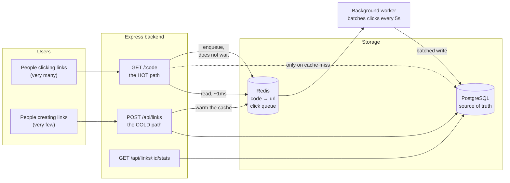
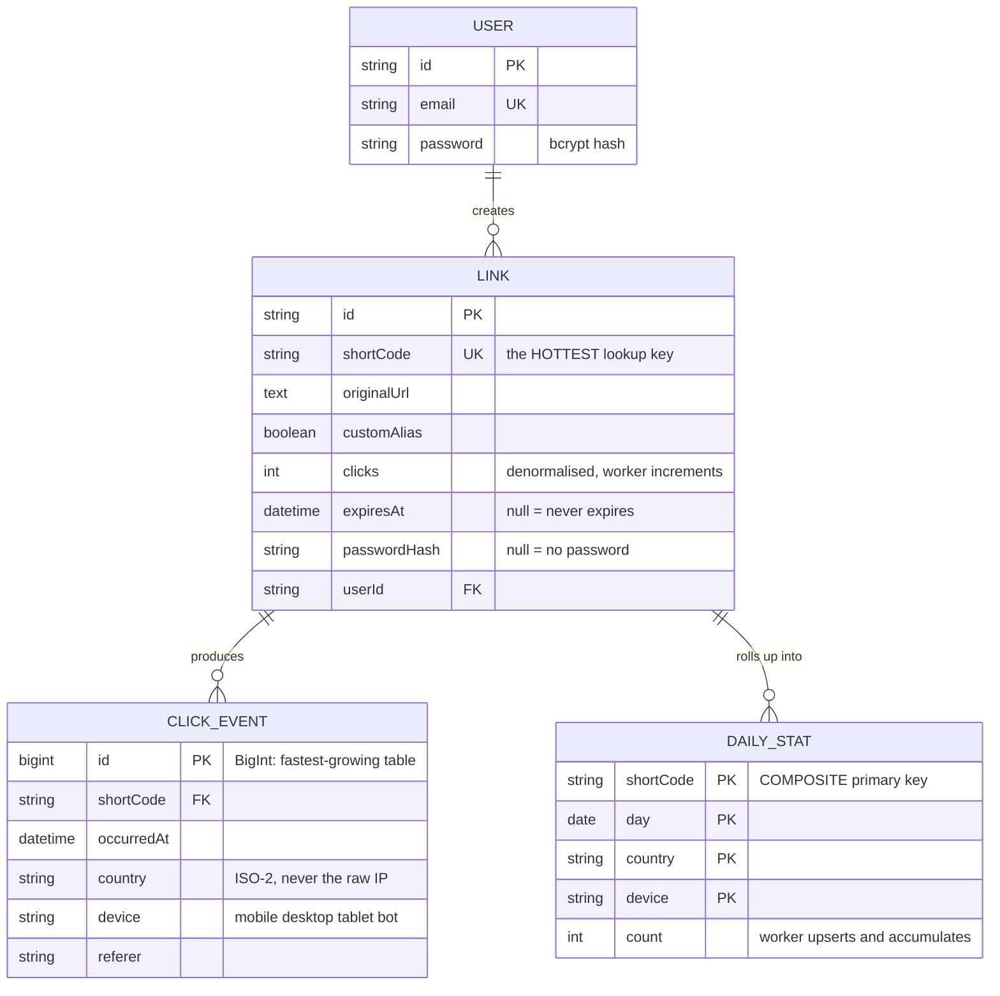
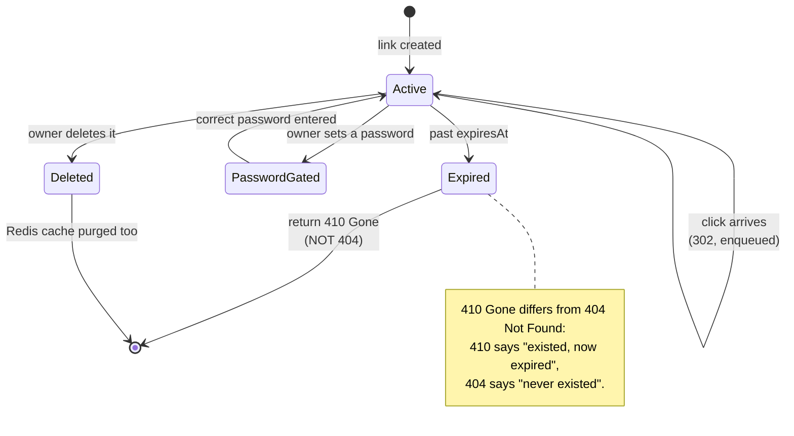

# URL Shortener (with Analytics)

Shortening URLs sounds like one evening's work: store a string, hand back a shorter one, redirect. But this is the first project on the roadmap where **performance is a functional requirement**, not something to optimise later. A shortened link pasted into a popular post can take a few thousand clicks a minute, and every one of those clicks is a person waiting for a page to open.

That changes the design completely. In the Todo project, hitting the database on every request was fine. Here, reading the database on the redirect path is **the wrong architecture** — and most of this article explains why, and what to do instead.

> **What makes this one different.** It is the first project that separates backend from frontend, and the first where Redis is not "cache for the sake of it" but the thing without which the system falls over under real load.

---

## What you are going to build

- Create short links: random code or a custom alias
- Redirect fast, measured in milliseconds rather than "feels quick"
- Generate a QR code per link
- Record clicks: time, country, device, referrer
- An analytics dashboard: clicks by day, by country, by device type
- Rate limiting, link expiry, password-protected links
- A public API other developers can call

---

## Architecture, and why reads are separated from writes



Three decisions in that diagram are worth stopping on:

**1. The redirect path reads Redis, not Postgres.** A Postgres query over a local network costs roughly 1–5ms. Redis costs roughly 0.1–0.5ms. That gap sounds small, but at 5,000 clicks per second Postgres would be serving 5,000 queries per second just to look up a key–value pair — exactly what Redis was built for and Postgres was not.

**2. Recording a click must not block the redirect.** If every click ran `UPDATE links SET clicks = clicks + 1`, you get two problems at once: the user waits for an extra database round trip, and every click on *the same link* contends for a lock on *the same row*. The more popular the link, the slower it gets — precisely backwards.

**3. A worker batches the writes.** Instead of 5,000 UPDATE statements, the worker drains the queue every 5 seconds and writes one row with the total. Postgres sees 1 statement instead of 5,000.

---

## Generating short codes: three approaches and the trap in each

### Approach 1 — auto-increment converted to base62

Take the auto-incrementing `id`, encode it in 62 characters (`a-zA-Z0-9`). Shortest possible, never collides.

The trap: codes are guessable. If `abc` exists, `abd` almost certainly does too. Anyone can write a loop and enumerate every link in the system — including private ones people assume are secret because "nobody knows the URL".

### Approach 2 — random, then check for collisions

Generate 7 random characters, ask the database whether it exists, regenerate on collision.

The trap: there is a window between the check and the write. Two concurrent requests can both see "does not exist" and both write. This is the classic race condition, and it only appears under real load — which is to say, never while you are testing it yourself.

### Approach 3 — random, and let the database be the referee

```ts
// src/services/shortcode.service.ts
import { customAlphabet } from 'nanoid';

// Drop characters that are easy to misread when copied by hand:
// 0/O, 1/l/I. Users WILL read these codes out over the phone.
const ALPHABET = '23456789abcdefghijkmnpqrstuvwxyzABCDEFGHJKLMNPQRSTUVWXYZ';
const nanoid = customAlphabet(ALPHABET, 7);

// 56^7 ≈ 1.7 trillion combinations. With 10 million live links, the
// chance of a collision on any single generation is about 1 in
// 170,000 — rare enough that the loop below almost never runs twice.
export async function createUniqueCode(
  tx: PrismaClient,
  originalUrl: string,
  userId: string,
): Promise<string> {
  for (let attempt = 0; attempt < 5; attempt++) {
    const code = nanoid();
    try {
      await tx.link.create({ data: { shortCode: code, originalUrl, userId } });
      return code;
    } catch (err: any) {
      // P2002 = unique constraint violation. Let the DATABASE detect
      // the collision rather than checking first: a unique constraint
      // is atomic, "check then write" is not — two concurrent requests
      // both see "free" and both write.
      if (err?.code === 'P2002') continue;
      throw err;
    }
  }
  throw new Error('Could not generate a unique code after 5 attempts');
}
```

The principle generalises to every later project: **when you need uniqueness, let the database constraint decide; do not check first and then write.** A unique constraint is atomic at the storage layer; two separate statements in application code are not.

---

## The redirect path: where everything must be fast

```ts
// src/routes/redirect.routes.ts
import { Router } from 'express';
import { redis } from '../config/redis';
import { prisma } from '../config/database';

const router = Router();

router.get('/:code', async (req, res, next) => {
  try {
    const { code } = req.params;

    // Step 1 — Redis. This is the path 99% of requests take.
    let target = await redis.get(`link:${code}`);

    // Step 2 — only a cache miss reaches the database.
    if (!target) {
      const link = await prisma.link.findUnique({
        where: { shortCode: code },
        select: { originalUrl: true, expiresAt: true, passwordHash: true },
      });

      if (!link) return res.status(404).render('not-found');
      if (link.expiresAt && link.expiresAt < new Date()) {
        return res.status(410).render('expired');   // 410 Gone, not 404
      }
      if (link.passwordHash) {
        return res.redirect(`/protected/${code}`);
      }

      target = link.originalUrl;
      // A 1-hour TTL: long enough to absorb a traffic spike, short
      // enough that a deleted link does not live forever in cache.
      await redis.setex(`link:${code}`, 3600, target);
    }

    // Step 3 — record the click WITHOUT waiting. Push onto a Redis
    // queue and move on; the worker batches it into Postgres later.
    // This is why a popular link does not get slower as it gets
    // more popular.
    redis
      .rpush(
        'clicks:queue',
        JSON.stringify({
          code,
          ts: Date.now(),
          ip: req.ip,
          ua: req.get('user-agent') ?? '',
          ref: req.get('referer') ?? '',
        }),
      )
      .catch((err) => console.error('[clicks] enqueue failed:', err));

    // 302, not 301.
    //
    // 301 means "moved permanently" — browsers CACHE IT FOREVER and
    // never ask the server again. Which means: you count no clicks
    // after the first, and if the user edits the destination, anyone
    // who clicked once goes to the old address forever. For a
    // shortener with analytics, 301 is a design error.
    res.redirect(302, target);
  } catch (error) {
    next(error);
  }
});

export default router;
```

The `301` vs `302` detail separates people who have operated one of these from people who just read the HTTP spec. Plenty of tutorials use `301` because "permanent sounds more correct", then six months later cannot work out why the analytics numbers stopped moving.

---

## The click-aggregation worker

```ts
// src/workers/click-aggregator.ts
import { redis } from '../config/redis';
import { prisma } from '../config/database';
import { lookupCountry } from '../lib/geoip';
import { parseDevice } from '../lib/ua';

const BATCH = 500;
const INTERVAL_MS = 5_000;

async function flush() {
  // Multi-element lpop (Redis 6.2+). Pull items off the queue BEFORE
  // processing: if the worker dies mid-batch we lose at most one
  // batch of statistics — acceptable. In exchange, we never
  // double-count, which would corrupt every report.
  const raw = await redis.lpop('clicks:queue', BATCH);
  if (!raw || raw.length === 0) return;

  const events = raw.map((s) => JSON.parse(s));

  // Group by link code. 500 clicks across 3 links become 3 UPDATE
  // statements instead of 500.
  const counts = new Map<string, number>();
  for (const e of events) {
    counts.set(e.code, (counts.get(e.code) ?? 0) + 1);
  }

  await prisma.$transaction([
    // Detail table — powers the by-country / by-device charts.
    prisma.clickEvent.createMany({
      data: events.map((e) => ({
        shortCode: e.code,
        occurredAt: new Date(e.ts),
        country: lookupCountry(e.ip),
        device: parseDevice(e.ua),
        referer: e.ref.slice(0, 500) || null,
        // Do NOT store the raw IP. An IP address is personal data
        // under GDPR; a country code is not. We only need the country
        // for the chart, so we convert here and drop the original.
      })),
    }),
    // Denormalised counter — for fast display without recounting.
    ...Array.from(counts.entries()).map(([code, n]) =>
      prisma.link.update({
        where: { shortCode: code },
        data: { clicks: { increment: n } },
      }),
    ),
  ]);
}

setInterval(() => {
  flush().catch((err) => console.error('[clicks] flush failed:', err));
}, INTERVAL_MS);
```

The decision not to store raw IPs deserves more than a comment. Many people store them "in case we need it later". But an IP address is personally identifying data in the EU, and a `click_events` table full of them turns your small side project into something covered by GDPR. Convert to a country code at the point of ingest and discard the original — you keep the chart, and you take on no legal obligation.

---

## The data model

Three tables, and the third exists purely so the dashboard never recounts:



And here is a link's lifecycle, from creation to the point it stops redirecting:



```prisma
model Link {
  id           String   @id @default(cuid())
  // The hottest lookup key in the entire system.
  // @unique creates the B-tree index for free, and is also what
  // makes duplicate code generation fail at the database layer.
  shortCode    String   @unique
  originalUrl  String   @db.Text
  customAlias  Boolean  @default(false)

  // Denormalised counter. Counting with COUNT(*) over click_events
  // is relationally correct but degrades over time — at 10 million
  // rows, opening the dashboard means an index scan every time.
  clicks       Int      @default(0)

  expiresAt    DateTime?
  passwordHash String?

  userId       String
  user         User     @relation(fields: [userId], references: [id], onDelete: Cascade)
  events       ClickEvent[]

  createdAt    DateTime @default(now())

  @@index([userId, createdAt])
  @@map("links")
}

model ClickEvent {
  id         BigInt   @id @default(autoincrement())
  shortCode  String
  link       Link     @relation(fields: [shortCode], references: [shortCode], onDelete: Cascade)

  occurredAt DateTime
  country    String?  @db.VarChar(2)   // ISO-3166 alpha-2, NOT an IP
  device     String?  @db.VarChar(20)  // mobile | desktop | tablet | bot
  referer    String?  @db.VarChar(500)

  // Indexed on (link, time) because every chart has the shape
  // "clicks for link X across time range Y".
  @@index([shortCode, occurredAt])
  @@map("click_events")
}
```

Note the `BigInt` id on `ClickEvent`. The events table grows faster than anything else in the system. A 32-bit `Int` runs out at about 2.1 billion rows — which sounds distant, but a service running a few years at a few million clicks a day gets there, and changing a column type at that point is a painful migration on your largest table. Choosing `BigInt` upfront costs 4 bytes per row and saves a sleepless night.

---

## Rate limiting

```ts
// src/middleware/rateLimit.ts
import { redis } from '../config/redis';
import type { Request, Response, NextFunction } from 'express';

export function rateLimit(max: number, windowSec: number) {
  return async (req: Request, res: Response, next: NextFunction) => {
    const userId = (req as any).user?.id;
    const key = `rl:${userId ?? req.ip}:${Math.floor(Date.now() / (windowSec * 1000))}`;

    try {
      // INCR then EXPIRE: atomic, no read-before-write needed. The key
      // embeds the window number so it expires on its own — nothing
      // to clean up.
      const count = await redis.incr(key);
      if (count === 1) await redis.expire(key, windowSec);

      if (count > max) {
        res.setHeader('Retry-After', String(windowSec));
        return res.status(429).json({ error: 'Too many requests, try again later.' });
      }
      next();
    } catch (err) {
      // FAIL OPEN. Redis being down is an infrastructure incident;
      // turning it into "the whole site stops accepting requests"
      // escalates a small incident into a large one. Log and continue.
      console.error('[rateLimit] redis error, allowing through:', err);
      next();
    }
  };
}
```

**Failing open** here is a trade-off, and it deserves to be stated plainly: when Redis dies, rate limiting disappears and an attacker could exploit that. For a link shortener the trade is correct — briefly losing rate limits hurts less than the whole service going down. For a money-transfer endpoint the opposite choice (fail closed) is correct. The point is to **know which one you are picking**, not to copy a snippet and move on.

---

## A security trap: SSRF through link preview

Plenty of shorteners offer "preview the destination's title". The naive implementation:

```ts
// Do NOT write this.
const html = await fetch(originalUrl).then((r) => r.text());
```

The problem: your server just became an HTTP client that strangers can point anywhere. An attacker submits `http://169.254.169.254/latest/meta-data/iam/security-credentials/` — AWS's internal metadata address — and your server dutifully fetches its own credentials. This is SSRF (Server-Side Request Forgery), and it caused one of the largest financial-sector data breaches of 2019.

```ts
// src/lib/safeFetch.ts
import dns from 'node:dns/promises';
import net from 'node:net';

const BLOCKED = [
  '127.0.0.0/8', '10.0.0.0/8', '172.16.0.0/12', '192.168.0.0/16',
  '169.254.0.0/16',   // link-local: AWS/GCP metadata lives here
  '::1/128', 'fc00::/7',
];

export async function assertPublicUrl(raw: string): Promise<URL> {
  const url = new URL(raw);

  // http/https only. Block file://, gopher://, ftp:// — protocols
  // historically abused to read local files through HTTP libraries.
  if (!['http:', 'https:'].includes(url.protocol)) {
    throw new Error('Only http and https are accepted');
  }

  // Resolve DNS, then check the ADDRESS, not the hostname. Checking
  // the hostname is useless: an attacker just points
  // evil.example.com at 127.0.0.1.
  const { address } = await dns.lookup(url.hostname);
  if (isPrivate(address)) {
    throw new Error('Internal addresses are not allowed');
  }
  return url;
}

function isPrivate(ip: string): boolean {
  if (net.isIPv4(ip)) {
    const [a, b] = ip.split('.').map(Number);
    if (a === 127 || a === 10) return true;
    if (a === 172 && b >= 16 && b <= 31) return true;
    if (a === 192 && b === 168) return true;
    if (a === 169 && b === 254) return true;   // cloud metadata
    if (a === 0) return true;
  }
  return ip === '::1' || ip.startsWith('fc') || ip.startsWith('fd');
}
```

One subtler hole remains: **DNS rebinding**. The attacker's domain returns a public IP while you check it, then returns `127.0.0.1` a second later when you actually fetch. The complete fix is to resolve once and connect directly to the verified IP, rather than letting the HTTP library resolve again. If you have not built that yet, at least *know* the hole is there and write it in the README.

---

## Analytics: do not recount from scratch

The obvious query for a daily chart:

```sql
SELECT DATE(occurred_at) AS day, COUNT(*)
FROM click_events
WHERE short_code = $1 AND occurred_at > NOW() - INTERVAL '30 days'
GROUP BY day ORDER BY day;
```

It is correct, and it works fine up to about a million rows. After that, every dashboard load is a long index scan.

The fix is a daily rollup table, maintained by the worker you already have:

```prisma
model DailyStat {
  shortCode String
  day       DateTime @db.Date
  country   String?  @db.VarChar(2)
  device    String?  @db.VarChar(20)
  count     Int      @default(0)

  // Composite primary key: exactly one row per
  // (link, day, country, device), and the worker upserts into it.
  @@id([shortCode, day, country, device])
  @@map("daily_stats")
}
```

The dashboard reads `daily_stats` — dozens of rows instead of hundreds of thousands. `click_events` stays for deep analysis, and rows older than 90 days can be deleted without losing the historical chart.

This is your first encounter with a **materialised aggregate** — precomputing the rollup instead of recomputing it on every read. It comes back in every data-heavy project later on.

---

## Traps, written down

| Symptom | Actual cause | Fix |
|---|---|---|
| Analytics freeze after a few hours | Used 301; browsers cached it permanently | Switch to 302 |
| Popular links get slower | One UPDATE per click on the same row | Queue + batching worker |
| Occasional 500 when creating a link | "Check then write" race condition | Catch P2002 and retry |
| Redis outage takes the whole site down | Rate limiter fails closed | Catch, log, continue |
| Falls over when crawled | Bots counted in analytics and share the rate limit | Detect bot user-agents, count separately |
| Server fetches its own cloud metadata | No SSRF check on the preview feature | Resolve DNS, then block private ranges |
| The `clicks` column drifts | Worker died after lpop but before write | Accept it, or move to Redis Streams with ACK |

---

## When it counts as finished

- [ ] `ab -n 10000 -c 100 http://localhost:3000/abc123` shows p95 under 20ms
- [ ] With Redis stopped, redirects still work (slower) rather than returning 500
- [ ] Creating 200 links concurrently produces no duplicate codes and no 500s
- [ ] Submitting a link to `http://169.254.169.254` is rejected
- [ ] Deleting a link also clears the Redis cache (no more redirect)
- [ ] The 30-day dashboard renders in under 300ms against a million seeded events
- [ ] No column anywhere in the database holds a raw IP address

---

## Where to go next

Three directions, in order of difficulty:

1. **Custom domains.** Let users point `link.company.com` at your service. New problem: automatic TLS certificates for someone else's domain (ACME + `tls-alpn-01`).
2. **Malicious link screening.** Integrate Google Safe Browsing so you do not become a phishing delivery service. It is also where you learn to handle a slow, unreliable third-party API.
3. **Go distributed.** When one server is not enough, the problem becomes generating unique codes across many machines without coordinating. That is the Snowflake ID problem, and it leads directly into [Event-Driven Microservices](/projects/event-driven-microservices-uber-like).
