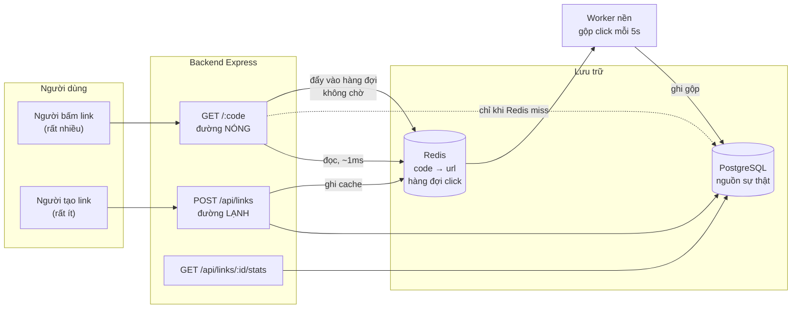
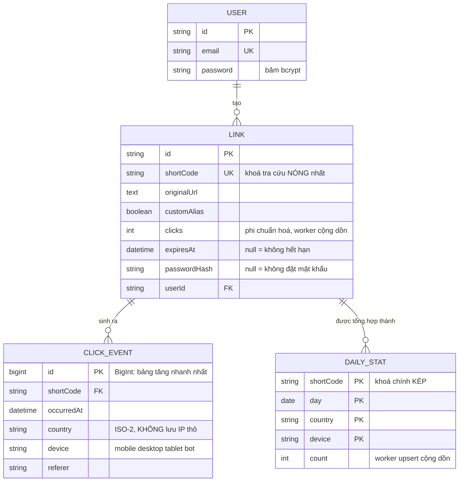
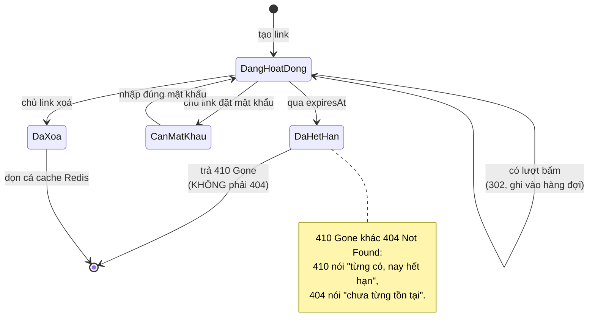

# URL Shortener (với Analytics)

Rút gọn URL nghe như bài tập một buổi tối: lưu một chuỗi, trả về một chuỗi ngắn hơn, chuyển hướng. Nhưng đây là dự án đầu tiên trong lộ trình mà **hiệu năng là một yêu cầu chức năng**, không phải thứ tối ưu sau. Một link rút gọn được dán vào bài đăng có thể nhận vài nghìn lượt bấm trong một phút, và mỗi lượt bấm là một người đang chờ trang đích mở ra.

Điều đó đổi hoàn toàn cách bạn thiết kế. Ở dự án Todo, mỗi request đọc database là chuyện bình thường. Ở đây, đọc database trên đường chuyển hướng là **sai kiến trúc** — và bài viết này dành phần lớn thời lượng để giải thích vì sao, cùng cách sửa.

> **Điểm khác biệt của bài này.** Đây là dự án đầu tiên tách backend ra khỏi frontend, và cũng là dự án đầu tiên dùng Redis không phải để "cho có cache" mà vì thiếu nó thì hệ thống sập dưới tải thật.

---

## Bạn sẽ dựng ra cái gì

- Tạo link rút gọn: mã ngẫu nhiên hoặc alias tự chọn
- Chuyển hướng nhanh, đo bằng mili-giây chứ không phải "cảm giác nhanh"
- Sinh mã QR cho mỗi link
- Ghi nhận lượt bấm: thời điểm, quốc gia, thiết bị, nguồn giới thiệu
- Bảng phân tích: lượt bấm theo ngày, theo quốc gia, theo loại thiết bị
- Giới hạn tần suất, link hết hạn, link đặt mật khẩu
- API công khai để lập trình viên khác gọi

---

## Kiến trúc, và vì sao đường đọc tách khỏi đường ghi



Ba quyết định trong sơ đồ trên đáng để dừng lại:

**1. Đường chuyển hướng đọc Redis, không đọc Postgres.** Một truy vấn Postgres qua mạng nội bộ mất khoảng 1–5ms. Redis mất khoảng 0,1–0,5ms. Chênh lệch đó nghe nhỏ, nhưng ở 5.000 lượt bấm mỗi giây, Postgres phải xử lý 5.000 truy vấn/giây chỉ để tra một cặp khoá–giá trị — đúng việc mà Redis sinh ra để làm, còn Postgres thì không.

**2. Ghi nhận lượt bấm không được chặn chuyển hướng.** Nếu mỗi lần bấm đều `UPDATE links SET clicks = clicks + 1`, bạn có hai vấn đề cùng lúc: người dùng chờ thêm một round-trip database, và mọi lượt bấm vào *cùng một link* đều tranh nhau khoá trên *cùng một dòng*. Link càng nổi tiếng càng chậm — đúng ngược với thứ bạn muốn.

**3. Worker gộp ghi.** Thay vì 5.000 lệnh UPDATE, worker đọc hàng đợi mỗi 5 giây và ghi một lần với tổng. Postgres nhận 1 lệnh thay vì 5.000.

---

## Sinh mã ngắn: ba cách và cái bẫy của từng cách

### Cách 1 — số tăng dần đổi sang base62

Lấy `id` tự tăng, đổi sang hệ 62 ký tự (`a-zA-Z0-9`). Ngắn nhất có thể, không bao giờ trùng.

Bẫy: mã đoán được. Link `abc` tồn tại thì `abd` cũng gần như chắc chắn tồn tại. Ai đó viết một vòng lặp là duyệt được toàn bộ link trong hệ thống — kể cả link riêng tư người ta tưởng là bí mật vì "URL không ai biết".

### Cách 2 — ngẫu nhiên rồi kiểm tra trùng

Sinh 7 ký tự ngẫu nhiên, hỏi database xem đã tồn tại chưa, trùng thì sinh lại.

Bẫy: có một khoảng thời gian giữa lúc kiểm tra và lúc ghi. Hai request cùng lúc có thể cùng thấy "chưa tồn tại" rồi cùng ghi. Đây là race condition kinh điển, và nó chỉ xuất hiện khi có tải thật — nghĩa là không bao giờ xuất hiện lúc bạn tự test.

### Cách 3 — ngẫu nhiên, để database làm trọng tài

```ts
// src/services/shortcode.service.ts
import { customAlphabet } from 'nanoid';

// Bỏ các ký tự dễ nhìn nhầm khi chép tay: 0/O, 1/l/I.
// Người dùng SẼ đọc mã này qua điện thoại cho người khác.
const ALPHABET = '23456789abcdefghijkmnpqrstuvwxyzABCDEFGHJKLMNPQRSTUVWXYZ';
const nanoid = customAlphabet(ALPHABET, 7);

// 56^7 ≈ 1,7 nghìn tỉ tổ hợp. Với 10 triệu link đang tồn tại,
// xác suất trùng một lần sinh là khoảng 1/170.000 — đủ hiếm để
// vòng lặp dưới đây gần như không bao giờ chạy quá một vòng.
export async function createUniqueCode(
  tx: PrismaClient,
  originalUrl: string,
  userId: string,
): Promise<string> {
  for (let attempt = 0; attempt < 5; attempt++) {
    const code = nanoid();
    try {
      await tx.link.create({ data: { shortCode: code, originalUrl, userId } });
      return code;
    } catch (err: any) {
      // P2002 = vi phạm ràng buộc unique. Để DATABASE phát hiện
      // trùng thay vì tự kiểm tra trước: ràng buộc unique là
      // nguyên tử, còn "kiểm tra rồi ghi" thì không — hai request
      // đồng thời đều thấy "chưa tồn tại" rồi cùng ghi.
      if (err?.code === 'P2002') continue;
      throw err;
    }
  }
  throw new Error('Không sinh được mã sau 5 lần thử');
}
```

Nguyên tắc rút ra, dùng được cho mọi dự án sau: **khi cần đảm bảo duy nhất, hãy để ràng buộc của database quyết định, đừng tự kiểm tra trước rồi mới ghi.** Ràng buộc unique là nguyên tử ở tầng lưu trữ; hai câu lệnh riêng biệt trong code ứng dụng thì không.

---

## Đường chuyển hướng: nơi mọi thứ phải nhanh

```ts
// src/routes/redirect.routes.ts
import { Router } from 'express';
import { redis } from '../config/redis';
import { prisma } from '../config/database';

const router = Router();

router.get('/:code', async (req, res, next) => {
  try {
    const { code } = req.params;

    // Bước 1 — Redis. Đây là đường đi của 99% request.
    let target = await redis.get(`link:${code}`);

    // Bước 2 — chỉ khi cache miss mới chạm database.
    if (!target) {
      const link = await prisma.link.findUnique({
        where: { shortCode: code },
        select: { originalUrl: true, expiresAt: true, passwordHash: true },
      });

      if (!link) return res.status(404).render('not-found');
      if (link.expiresAt && link.expiresAt < new Date()) {
        return res.status(410).render('expired');   // 410 Gone, không phải 404
      }
      if (link.passwordHash) {
        return res.redirect(`/protected/${code}`);
      }

      target = link.originalUrl;
      // TTL 1 giờ: đủ dài để chịu được đợt truy cập dồn dập,
      // đủ ngắn để link bị xoá không sống mãi trong cache.
      await redis.setex(`link:${code}`, 3600, target);
    }

    // Bước 3 — ghi nhận lượt bấm KHÔNG chờ. Đẩy vào hàng đợi
    // Redis rồi đi tiếp ngay; worker sẽ gộp và ghi xuống Postgres.
    // Đây là lý do một link nổi tiếng không chậm dần theo lượt bấm.
    redis
      .rpush(
        'clicks:queue',
        JSON.stringify({
          code,
          ts: Date.now(),
          ip: req.ip,
          ua: req.get('user-agent') ?? '',
          ref: req.get('referer') ?? '',
        }),
      )
      .catch((err) => console.error('[clicks] enqueue failed:', err));

    // 302 chứ không phải 301.
    //
    // 301 là "chuyển vĩnh viễn" — trình duyệt CACHE VĨNH VIỄN và
    // sẽ không hỏi lại server nữa. Nghĩa là: bạn không đếm được
    // lượt bấm nào sau lần đầu, và nếu người dùng sửa link đích
    // thì những người đã bấm một lần sẽ mãi mãi đi tới địa chỉ cũ.
    // Với dịch vụ rút gọn có analytics, 301 là lỗi thiết kế.
    res.redirect(302, target);
  } catch (error) {
    next(error);
  }
});

export default router;
```

Chi tiết `301` với `302` là thứ phân biệt người đã vận hành dịch vụ này với người mới đọc tài liệu HTTP. Rất nhiều hướng dẫn viết `301` vì "vĩnh viễn nghe đúng hơn", rồi sáu tháng sau không hiểu vì sao số liệu analytics đứng im.

---

## Worker gộp lượt bấm

```ts
// src/workers/click-aggregator.ts
import { redis } from '../config/redis';
import { prisma } from '../config/database';
import { lookupCountry } from '../lib/geoip';
import { parseDevice } from '../lib/ua';

const BATCH = 500;
const INTERVAL_MS = 5_000;

async function flush() {
  // lpop nhiều phần tử một lần (Redis 6.2+). Lấy ra khỏi hàng đợi
  // TRƯỚC khi xử lý: nếu worker chết giữa chừng, ta mất tối đa
  // một lô số liệu thống kê — chấp nhận được. Đổi lại, không bao
  // giờ có chuyện đếm trùng, thứ sẽ làm hỏng báo cáo.
  const raw = await redis.lpop('clicks:queue', BATCH);
  if (!raw || raw.length === 0) return;

  const events = raw.map((s) => JSON.parse(s));

  // Gộp theo mã link. 500 lượt bấm vào 3 link khác nhau trở thành
  // 3 lệnh UPDATE thay vì 500.
  const counts = new Map<string, number>();
  for (const e of events) {
    counts.set(e.code, (counts.get(e.code) ?? 0) + 1);
  }

  await prisma.$transaction([
    // Bảng chi tiết — phục vụ biểu đồ theo quốc gia / thiết bị.
    prisma.clickEvent.createMany({
      data: events.map((e) => ({
        shortCode: e.code,
        occurredAt: new Date(e.ts),
        country: lookupCountry(e.ip),
        device: parseDevice(e.ua),
        referer: e.ref.slice(0, 500) || null,
        // KHÔNG lưu IP thô. Lưu IP là dữ liệu cá nhân theo GDPR;
        // lưu mã quốc gia thì không. Ta chỉ cần quốc gia để vẽ
        // biểu đồ, nên chuyển đổi rồi vứt IP đi ngay tại đây.
      })),
    }),
    // Bộ đếm tổng — phục vụ hiển thị nhanh, không cần đếm lại.
    ...Array.from(counts.entries()).map(([code, n]) =>
      prisma.link.update({
        where: { shortCode: code },
        data: { clicks: { increment: n } },
      }),
    ),
  ]);
}

setInterval(() => {
  flush().catch((err) => console.error('[clicks] flush failed:', err));
}, INTERVAL_MS);
```

Quyết định không lưu IP thô đáng nói thêm. Nhiều người lưu vì "biết đâu sau này cần". Nhưng địa chỉ IP là dữ liệu định danh cá nhân ở EU, và một bảng `click_events` chứa IP biến dịch vụ nhỏ của bạn thành đối tượng chịu quy định GDPR. Chuyển IP thành mã quốc gia ngay tại điểm nhận rồi vứt bản gốc — bạn vẫn có biểu đồ, và không có nghĩa vụ pháp lý nào.

---

## Lược đồ dữ liệu

Ba bảng, và cái thứ ba tồn tại chỉ để dashboard không phải đếm lại:



Và đây là vòng đời một link, từ lúc tạo tới lúc không còn chuyển hướng nữa:



```prisma
model Link {
  id           String   @id @default(cuid())
  // Đây là khoá tra cứu nóng nhất trong toàn hệ thống.
  // @unique tạo sẵn chỉ mục B-tree, và cũng là thứ khiến
  // việc sinh mã trùng bị chặn ở tầng database.
  shortCode    String   @unique
  originalUrl  String   @db.Text
  customAlias  Boolean  @default(false)

  // Bộ đếm phi chuẩn hoá. Đếm bằng COUNT(*) trên click_events
  // là đúng chuẩn quan hệ nhưng chậm dần theo thời gian —
  // 10 triệu dòng thì mỗi lần mở dashboard là một lần quét bảng.
  clicks       Int      @default(0)

  expiresAt    DateTime?
  passwordHash String?

  userId       String
  user         User     @relation(fields: [userId], references: [id], onDelete: Cascade)
  events       ClickEvent[]

  createdAt    DateTime @default(now())

  @@index([userId, createdAt])
  @@map("links")
}

model ClickEvent {
  id         BigInt   @id @default(autoincrement())
  shortCode  String
  link       Link     @relation(fields: [shortCode], references: [shortCode], onDelete: Cascade)

  occurredAt DateTime
  country    String?  @db.VarChar(2)   // ISO-3166 alpha-2, KHÔNG lưu IP
  device     String?  @db.VarChar(20)  // mobile | desktop | tablet | bot
  referer    String?  @db.VarChar(500)

  // Chỉ mục theo (link, thời gian) vì mọi biểu đồ đều có dạng
  // "lượt bấm của link X trong khoảng thời gian Y".
  @@index([shortCode, occurredAt])
  @@map("click_events")
}
```

Chú ý `id BigInt` trên `ClickEvent`. Bảng sự kiện là bảng tăng nhanh nhất trong hệ thống. `Int` 32-bit hết chỗ ở khoảng 2,1 tỉ dòng — nghe xa vời, nhưng một dịch vụ chạy vài năm với vài triệu lượt bấm mỗi ngày sẽ chạm mốc đó, và lúc ấy việc đổi kiểu cột là một cuộc di trú đau đớn trên bảng lớn nhất của bạn. Chọn `BigInt` từ đầu tốn 4 byte mỗi dòng và tiết kiệm một đêm không ngủ.

---

## Giới hạn tần suất

```ts
// src/middleware/rateLimit.ts
import { redis } from '../config/redis';
import type { Request, Response, NextFunction } from 'express';

export function rateLimit(max: number, windowSec: number) {
  return async (req: Request, res: Response, next: NextFunction) => {
    const userId = (req as any).user?.id;
    const key = `rl:${userId ?? req.ip}:${Math.floor(Date.now() / (windowSec * 1000))}`;

    try {
      // INCR rồi EXPIRE: nguyên tử, không cần đọc trước.
      // Khoá có nhúng số hiệu cửa sổ thời gian nên tự hết hạn —
      // không cần dọn dẹp gì.
      const count = await redis.incr(key);
      if (count === 1) await redis.expire(key, windowSec);

      if (count > max) {
        res.setHeader('Retry-After', String(windowSec));
        return res.status(429).json({ error: 'Quá nhiều yêu cầu, thử lại sau.' });
      }
      next();
    } catch (err) {
      // FAIL OPEN. Redis chết là sự cố hạ tầng; biến nó thành
      // "cả site ngừng nhận request" là biến một sự cố nhỏ thành
      // một sự cố lớn. Ghi log và cho qua.
      console.error('[rateLimit] redis lỗi, cho qua:', err);
      next();
    }
  };
}
```

Lựa chọn **fail open** ở đây là một quyết định có đánh đổi, và cần nói rõ: khi Redis chết, giới hạn tần suất biến mất, kẻ tấn công có thể lợi dụng. Với dịch vụ rút gọn link, đánh đổi này đúng — hậu quả của việc mất giới hạn tạm thời nhỏ hơn hậu quả của việc cả dịch vụ ngừng hoạt động. Với một endpoint chuyển tiền, lựa chọn ngược lại (fail closed) mới đúng. Điểm mấu chốt là **biết mình đang chọn gì**, chứ không phải chép một đoạn code rồi thôi.

---

## Bẫy bảo mật: SSRF qua chức năng xem trước

Rất nhiều dịch vụ rút gọn có tính năng "xem trước tiêu đề trang đích". Cách làm ngây thơ:

```ts
// ĐỪNG viết như thế này.
const html = await fetch(originalUrl).then((r) => r.text());
```

Vấn đề: server của bạn vừa trở thành một cỗ máy gọi HTTP theo yêu cầu người lạ. Kẻ tấn công đưa vào `http://169.254.169.254/latest/meta-data/iam/security-credentials/` — địa chỉ metadata nội bộ của AWS — và server của bạn ngoan ngoãn lấy về thông tin xác thực của chính nó. Đây là SSRF (Server-Side Request Forgery), và nó đã gây ra một trong những vụ rò rỉ dữ liệu lớn nhất ngành tài chính năm 2019.

```ts
// src/lib/safeFetch.ts
import dns from 'node:dns/promises';
import net from 'node:net';

const BLOCKED = [
  '127.0.0.0/8', '10.0.0.0/8', '172.16.0.0/12', '192.168.0.0/16',
  '169.254.0.0/16',   // link-local: metadata của AWS/GCP nằm ở đây
  '::1/128', 'fc00::/7',
];

export async function assertPublicUrl(raw: string): Promise<URL> {
  const url = new URL(raw);

  // Chỉ http/https. Chặn file://, gopher://, ftp:// — những giao
  // thức từng được dùng để đọc file cục bộ qua thư viện HTTP.
  if (!['http:', 'https:'].includes(url.protocol)) {
    throw new Error('Chỉ chấp nhận http và https');
  }

  // Phân giải DNS rồi kiểm tra ĐỊA CHỈ, không kiểm tra tên miền.
  // Kiểm tra tên miền là vô dụng: kẻ tấn công trỏ
  // evil.example.com về 127.0.0.1 là qua mặt được.
  const { address } = await dns.lookup(url.hostname);
  if (isPrivate(address)) {
    throw new Error('Không cho phép địa chỉ nội bộ');
  }
  return url;
}

function isPrivate(ip: string): boolean {
  if (net.isIPv4(ip)) {
    const [a, b] = ip.split('.').map(Number);
    if (a === 127 || a === 10) return true;
    if (a === 172 && b >= 16 && b <= 31) return true;
    if (a === 192 && b === 168) return true;
    if (a === 169 && b === 254) return true;   // metadata cloud
    if (a === 0) return true;
  }
  return ip === '::1' || ip.startsWith('fc') || ip.startsWith('fd');
}
```

Vẫn còn một lỗ hổng tinh vi hơn: **DNS rebinding**. Kẻ tấn công cho tên miền trả về IP công cộng lúc bạn kiểm tra, rồi trả về `127.0.0.1` vài giây sau khi bạn gọi thật. Cách chặn triệt để là phân giải một lần rồi kết nối thẳng tới IP đã kiểm tra, thay vì để thư viện HTTP phân giải lại. Nếu chưa làm được điều đó, ít nhất hãy *biết* lỗ hổng còn đó và ghi vào README.

---

## Bảng phân tích: đừng đếm lại từ đầu

Câu truy vấn hiển nhiên cho biểu đồ theo ngày:

```sql
SELECT DATE(occurred_at) AS day, COUNT(*)
FROM click_events
WHERE short_code = $1 AND occurred_at > NOW() - INTERVAL '30 days'
GROUP BY day ORDER BY day;
```

Nó đúng, và nó chạy tốt tới khoảng một triệu dòng. Sau đó mỗi lần mở dashboard là một lần quét chỉ mục dài dằng dặc.

Cách sửa là một bảng tổng hợp theo ngày, cập nhật bởi chính worker đã có:

```prisma
model DailyStat {
  shortCode String
  day       DateTime @db.Date
  country   String?  @db.VarChar(2)
  device    String?  @db.VarChar(20)
  count     Int      @default(0)

  // Khoá chính kép: mỗi tổ hợp (link, ngày, quốc gia, thiết bị)
  // chỉ có đúng một dòng, và worker dùng upsert để cộng dồn.
  @@id([shortCode, day, country, device])
  @@map("daily_stats")
}
```

Dashboard đọc `daily_stats` — vài chục dòng thay vì vài trăm nghìn. Bảng `click_events` vẫn giữ để phân tích sâu, và có thể xoá dữ liệu cũ hơn 90 ngày mà không mất biểu đồ lịch sử.

Đây là lần đầu bạn gặp khái niệm **materialized aggregate** — dựng sẵn kết quả tổng hợp thay vì tính lại mỗi lần đọc. Nó quay lại ở mọi dự án phân tích dữ liệu về sau.

---

## Những cái bẫy đã được ghi lại

| Triệu chứng | Nguyên nhân thật | Cách sửa |
|---|---|---|
| Analytics đứng im sau vài giờ | Dùng 301, trình duyệt cache vĩnh viễn | Đổi sang 302 |
| Link nổi tiếng chậm dần | Mỗi lượt bấm một UPDATE trên cùng một dòng | Hàng đợi + worker gộp |
| Thỉnh thoảng lỗi 500 khi tạo link | Race condition "kiểm tra rồi ghi" | Bắt lỗi P2002 và thử lại |
| Redis chết kéo cả site chết | Rate limiter fail closed | Bắt lỗi, ghi log, cho qua |
| Sập khi bị crawl | Bot đếm vào analytics và bị rate limit chung | Nhận diện user-agent bot, đếm riêng |
| Server tự gọi vào metadata nội bộ | Thiếu kiểm tra SSRF ở chức năng xem trước | Phân giải DNS rồi chặn dải IP riêng |
| Cột `clicks` sai lệch dần | Worker chết giữa chừng sau khi đã lpop | Chấp nhận, hoặc đổi sang Redis Streams có ACK |

---

## Khi nào coi như xong

- [ ] `ab -n 10000 -c 100 http://localhost:3000/abc123` cho p95 dưới 20ms
- [ ] Tắt Redis, dịch vụ vẫn chuyển hướng được (chậm hơn) chứ không trả 500
- [ ] Tạo 200 link đồng thời bằng script, không có mã nào trùng, không có lỗi 500
- [ ] Thử tạo link trỏ tới `http://169.254.169.254`, bị từ chối
- [ ] Xoá một link, xác nhận cache Redis cũng bị dọn (không còn chuyển hướng)
- [ ] Dashboard 30 ngày mở dưới 300ms với một triệu dòng sự kiện giả lập
- [ ] Không có cột nào trong database chứa địa chỉ IP thô

---

## Bước tiếp theo

Ba hướng, xếp theo độ khó:

1. **Tên miền tuỳ chỉnh.** Cho người dùng trỏ `link.congty.com` về dịch vụ của bạn. Bài toán mới: chứng chỉ TLS tự động cho tên miền của người khác (ACME + `tls-alpn-01`).
2. **Kiểm tra link độc hại.** Tích hợp Google Safe Browsing để không trở thành công cụ phát tán lừa đảo. Đây cũng là lúc bạn học cách xử lý API bên thứ ba chậm và không đáng tin.
3. **Chuyển sang kiến trúc phân tán.** Khi một máy chủ không đủ, bài toán trở thành: sinh mã duy nhất trên nhiều máy mà không cần hỏi nhau. Đó chính là bài toán Snowflake ID, và nó dẫn thẳng vào [Event-Driven Microservices](/projects/event-driven-microservices-uber-like).
