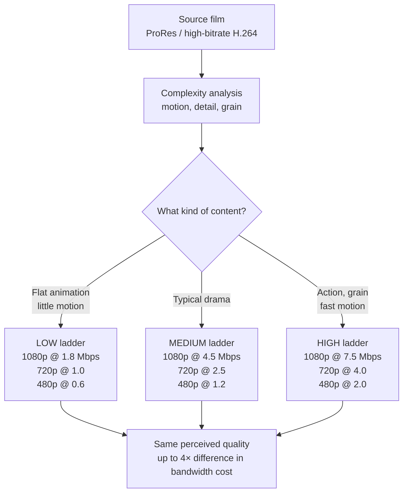
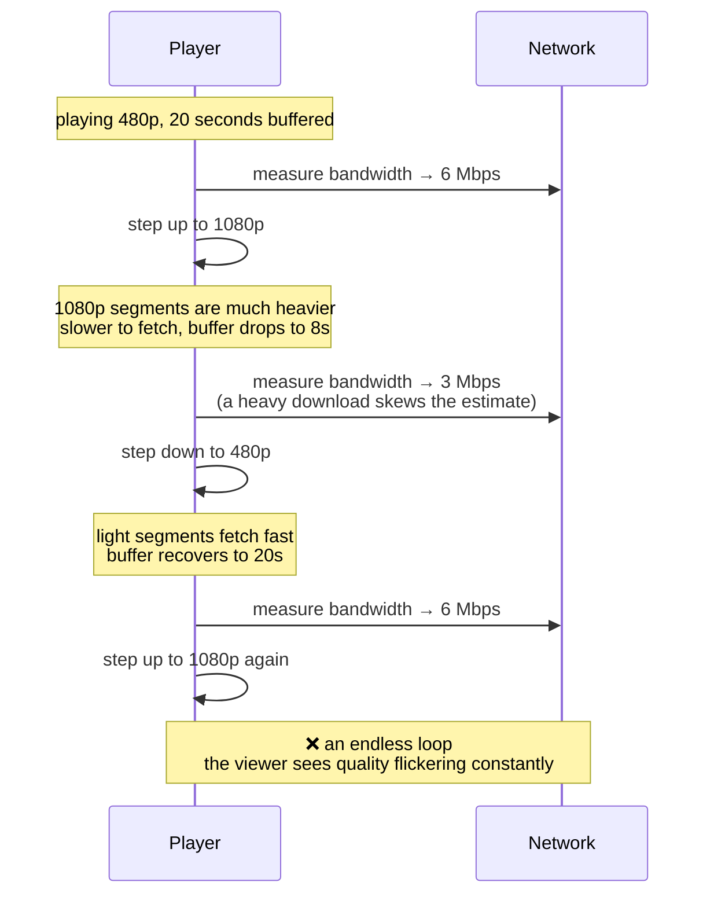
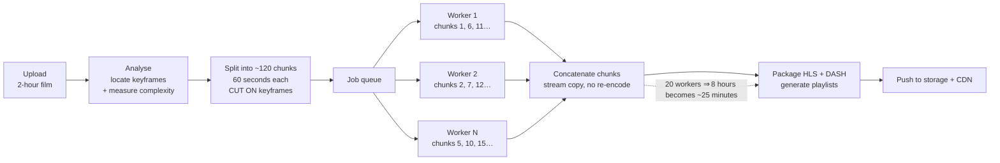
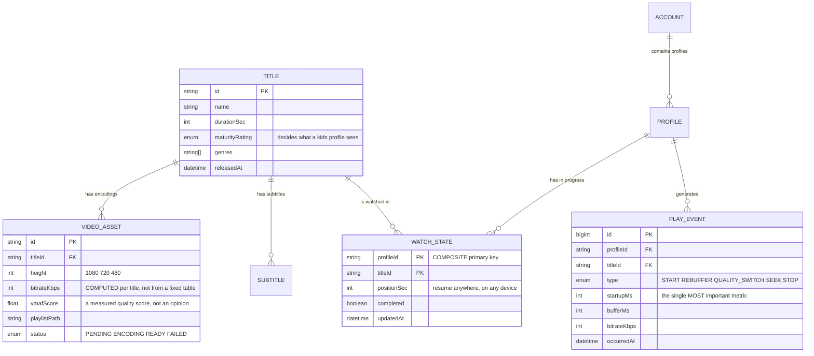
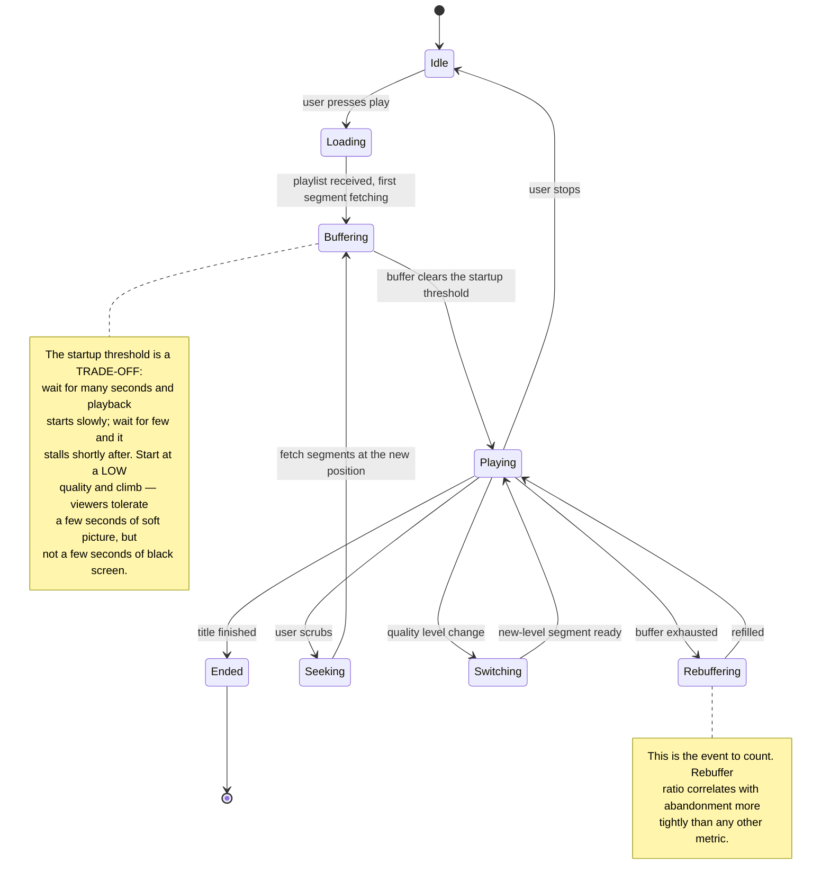

# Video Streaming Platform (Netflix-like)

In [Learning Management System](/projects/learning-management-system) you segmented video into HLS and signed URLs to resist piracy. That was content *protection*. This case study is about three entirely different things, each of which is a field in its own right:

1. **Quality must adapt to the viewer's network** — and the algorithm deciding when to switch is easier to get wrong than it looks
2. **Transcoding a two-hour film** must not take eight hours
3. **The bandwidth bill** is the largest line item, and your architecture sets it — not your provider

One number to hold onto before starting: viewers leave when a video takes more than **two seconds** to start. Every technical decision below eventually reduces to that number.

---

## What you will build

- Upload films, transcode to multiple quality levels automatically, stream adaptively
- A player that switches resolution with the network — no stalls, no flapping
- Multiple viewer profiles per account, including a kids profile
- Resume from the same position on any device
- Content recommendations, including a real answer for brand-new users
- Multi-language subtitles and alternate audio tracks
- A dashboard of genuine playback quality: startup time, rebuffer ratio, abandonment

---

## The quality ladder: why three fixed levels is wrong

The first approach everyone reaches for: transcode everything to 1080p, 720p and 480p. Done.

It is wrong in two opposite directions **simultaneously**:

- A flat-shaded animation with little motion: 1080p at 5 Mbps is **waste**. It reaches near-perfect quality at 1.5 Mbps. You are paying triple the bandwidth for quality nobody can see.
- A grainy night-time action scene: 1080p at 5 Mbps **still falls apart**. Viewers see a poor picture and conclude the service is cheap.

One configuration, over-provisioned in one case and under-provisioned in the other. The answer is a **per-title encoding ladder**: measure the complexity of that specific film, then choose a bitrate for each resolution.



"Perceived quality" is not measured by your own eyes. There are computable metrics — VMAF is the most widely used, producing a 0–100 score that correlates reasonably with human ratings. The correct process: encode test clips at several bitrates, measure VMAF, and take the lowest bitrate that still clears your target score (typically around 93).

This step alone can cut **30–50% off the bandwidth bill** with no difference viewers can detect. Few optimisations in this profession offer that ratio.

---

## The switching algorithm: the easiest thing here to get wrong

The player must decide: at what quality do I fetch the next segment? The obvious approach is to measure network speed and pick the highest level it supports.

That produces **flapping** — quality changing every few seconds, an experience worse than simply staying at a lower level:



The cause: **estimating bandwidth from your own downloads is a feedback loop**. Fetching heavy files depresses the estimate; a depressed estimate selects light files; light files inflate the estimate again.

The fix used in practice is to move the decision signal from bandwidth to **current buffer level**:

```ts
// The buffer is the REAL signal: it measures the consequence, not the cause.
// Having many seconds already downloaded means the network is comfortable,
// whatever an instantaneous bandwidth estimate happens to say.
function chooseQuality(bufferSeconds: number, current: number): number {
  if (bufferSeconds < 5)  return Math.max(0, current - 1);   // draining, drop now
  if (bufferSeconds < 10) return current;                    // hold, let it settle
  if (bufferSeconds > 25) return Math.min(MAX, current + 1); // comfortable, up ONE
  return current;
}
```

Three details in that snippet matter, each preventing a specific failure:

- **The dead zone between 10 and 25 seconds.** Without it, a buffer oscillating around a single threshold flips quality constantly. This is the same principle as hysteresis in a home thermostat.
- **Step up one level, but allow dropping several.** Stepping up wrongly costs temporary quality; dropping too slowly freezes the picture. The two directions are not symmetric, so the rules are not either.
- **Thresholds in seconds, not bytes.** A 5MB buffer is six seconds at 1080p and thirty at 480p. Viewers perceive time, not payload.

---

## Transcoding: split it to run in parallel

A two-hour film transcoded serially into five quality levels takes roughly eight hours on one machine. That is not acceptable.

The key is a property of video: it contains **keyframes** — frames that are self-contained and do not reference earlier ones. Cut at a keyframe and each chunk transcodes independently, then stitches back seamlessly.



Three traps in this design, all of which surface late:

**Cutting in the wrong place.** Cut between keyframes and the following chunk lacks its reference frames, so the joins flicker. Always cut on keyframes — ask FFmpeg where they are before splitting.

**Each worker choosing its own parameters.** Adjacent chunks encoded with different settings show a visible sharpness change at the seam. Parameters must be fixed **once during analysis** and passed down to every worker.

**No cleanup on partial failure.** A worker dying on chunk 47 leaves 46 orphaned files in storage. Give every transcode run an id and clean up by that id on failure, or storage grows with every failed attempt.

---

## Bandwidth: architecture writes the bill

This is the largest gap between a learning project and a real service. Bandwidth is the biggest cost line, and it depends almost entirely on **CDN cache hit ratio**.

If the CDN serves 95% of requests from cache, your origin handles 5%. If the hit ratio falls to 60%, origin cost rises **eightfold** — and people usually discover this through the invoice rather than a dashboard.

Four things destroy hit ratio, in rough order of frequency:

| Mistake | Consequence | The right way |
|---|---|---|
| Signing tokens in the query string of segment URLs | Every viewer gets a distinct URL ⇒ the CDN treats them as distinct files ⇒ hit ratio near zero | Sign the **playlist**; segments keep stable, shared URLs |
| Cache lifetime too short | The CDN keeps revalidating against origin | Segments **never change content** — set a one-year lifetime |
| No mid-tier cache | 200 edge locations all hit origin when a title launches | Enable an origin shield the edges fetch through |
| Segments too short | Two-second segments triple the request count versus six | 4–6 seconds balances request volume against switching latency |

The first deserves elaboration, because it is the subtle one: signing every segment sounds more secure, but it destroys caching entirely and reduces your CDN to an empty pipe. The correct split is to sign the **playlist** — small, personalisable, short-lived — while segments stay shared content that everyone fetches identically. That single detail sets the bill.

---

## The data model



`PLAY_EVENT` is the table people overlook and the one that matters most over time. Without it you have no idea whether your service is good or bad — viewers who leave do so silently, and nobody files a bug report.

A note on volume: this table generates data faster than all the others combined. Do not write events individually into the primary database — batch them client-side, send in bulk, and land them in separate analytical storage. This is exactly the problem [Real-Time Analytics Platform](/projects/realtime-analytics-platform) addresses at level 5.

---

## Player lifecycle: where the real metrics come from



Three metrics to track, and only three:

1. **Startup time** — from pressing play to the first frame. Two seconds is the threshold.
2. **Rebuffer ratio** — stalled time divided by watched time. Below 0.5% is good.
3. **Average delivered bitrate** — what quality viewers actually received, not what you had available.

---

## Recommendations: start from the simplest thing that works

The temptation is to build a machine-learning model immediately. There is a more sensible progression, and each step delivers real value:

**Step 1 — popularity within a segment.** "Most watched in this genre, this week." No model, works today, and it is the mandatory fallback for every step below when they fail.

**Step 2 — item-based collaborative filtering.** "People who watched A also watched B." Computed from item similarity over shared audiences. This is a SQL query, not yet a model:

```sql
-- Titles frequently watched alongside $1, with a floor to suppress noise.
SELECT w2.title_id, COUNT(*) AS co_watch
  FROM watch_states w1
  JOIN watch_states w2 ON w1.profile_id = w2.profile_id
 WHERE w1.title_id = $1
   AND w2.title_id <> $1
   AND w1.completed AND w2.completed
 GROUP BY w2.title_id
HAVING COUNT(*) >= 20          -- below this it is just coincidence
 ORDER BY co_watch DESC
 LIMIT 20;
```

**Step 3 — content vectors.** For a new title nobody has watched, step 2 says nothing (the cold-start problem). Embed the synopsis, genres and cast, then find nearest neighbours — the same technique used in [Job Board Platform](/projects/job-board-platform-linkedin-like), applied to a different kind of data.

Two things recommender tutorials tend to omit:

- **Popularity bias.** A trending title appears in every list, gets watched more, and trends harder. A self-reinforcing loop. Mitigations: divide the score by a function of popularity, or reserve slots in each row for lower-exposure content.
- **You cannot measure it without a parallel test.** You cannot tell whether a new recommendation list is better or worse by looking at it. Split users into two groups and compare click-through — without that step, every change is guesswork.

---

## Traps worth recording

| Symptom | Actual cause | Fix |
|---|---|---|
| Unexpectedly large bandwidth bill | Per-segment signing defeats CDN caching | Sign playlists; segments keep shared URLs |
| Hit ratio collapses when a title launches | No origin shield, every edge hits origin | Enable a mid-tier cache |
| Quality flickers constantly | Deciding on instantaneous bandwidth estimates | Decide on buffer level, with a dead zone |
| Animation costs as much bandwidth as action | One fixed bitrate ladder for all content | Per-title ladder, validated with VMAF |
| Flicker at chunk boundaries | Cuts not aligned to keyframes | Query keyframe positions before splitting |
| Sharpness changes mid-film | Each worker choosing its own encode settings | Fix parameters during analysis and pass them down |
| Storage full of orphaned files | Failed transcodes never cleaned up | An id per run, cleaned up on failure |
| Six seconds before playback starts | Waiting for a full buffer at high quality | Start low and climb |
| No idea whether the service is good | No playback telemetry | An event table measuring startup and rebuffering |
| Database slowly degrading for no clear reason | Writing each play event to the primary database | Batch and land them in separate analytical storage |
| Recommendations are all already-famous titles | A self-reinforcing popularity loop | Damp by popularity, reserve slots for new content |
| New titles are never recommended | Cold start, no watch history yet | Content vectors for titles with no history |

---

## When it is genuinely done

- [ ] A two-hour film transcodes in under 30 minutes across 20 parallel workers
- [ ] Concatenated output shows no flicker or sharpness change at any chunk boundary
- [ ] Startup time under 2 seconds at p95, measured from real player events
- [ ] Throttle to 1 Mbps mid-playback: quality drops **once** and settles — no flapping
- [ ] Restore bandwidth: quality climbs one level at a time, never jumping
- [ ] Measure CDN hit ratio: above 90% within 24 hours of a title's release
- [ ] Copy a segment URL and open it elsewhere: **it still loads** (correct — it is shared content), but the playlist has expired
- [ ] Watch 20 minutes on desktop, open on phone: resumes within 5 seconds of the same position
- [ ] Kids profile: call the catalogue API with `curl` — nothing above the rating appears in the JSON
- [ ] Disable the recommendation service entirely: the home page still renders (popularity fallback)

---

## Where to go next

1. **Live streaming.** The same pipeline without the luxury of preprocessing — transcoding must beat real time, and latency becomes the governing constraint.
2. **Real DRM.** Widevine and FairPlay for licensed content. This is the line between "deters ordinary users" and "deters organisations", and it is expensive.
3. **Measure quality with parallel experiments.** Split users across two ladder configurations and compare rebuffer ratio and watch time. It is the only way to know whether a change helped.
4. **Split into services.** Transcoding, catalogue, recommendations and analytics run at wildly different cadences and scales — [Event-Driven Microservices](/projects/event-driven-microservices-uber-like) is the natural next step.
5. **Process the playback event stream.** Millions of events per minute need something other than a relational database — [Real-Time Analytics Platform](/projects/realtime-analytics-platform) tackles exactly that.
