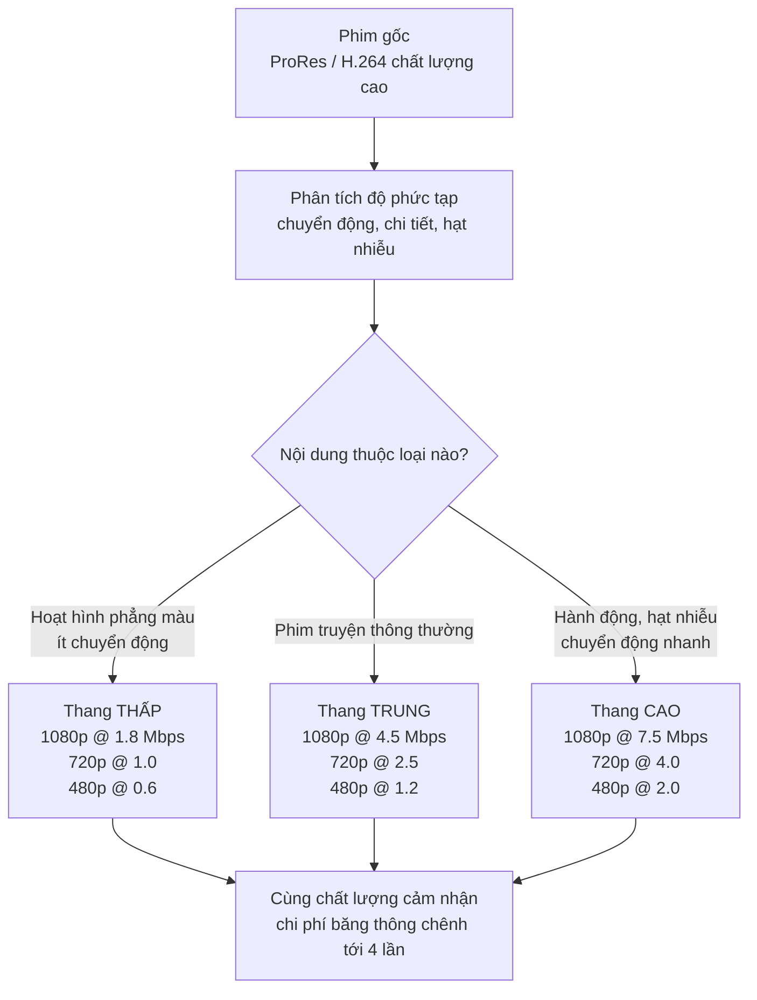
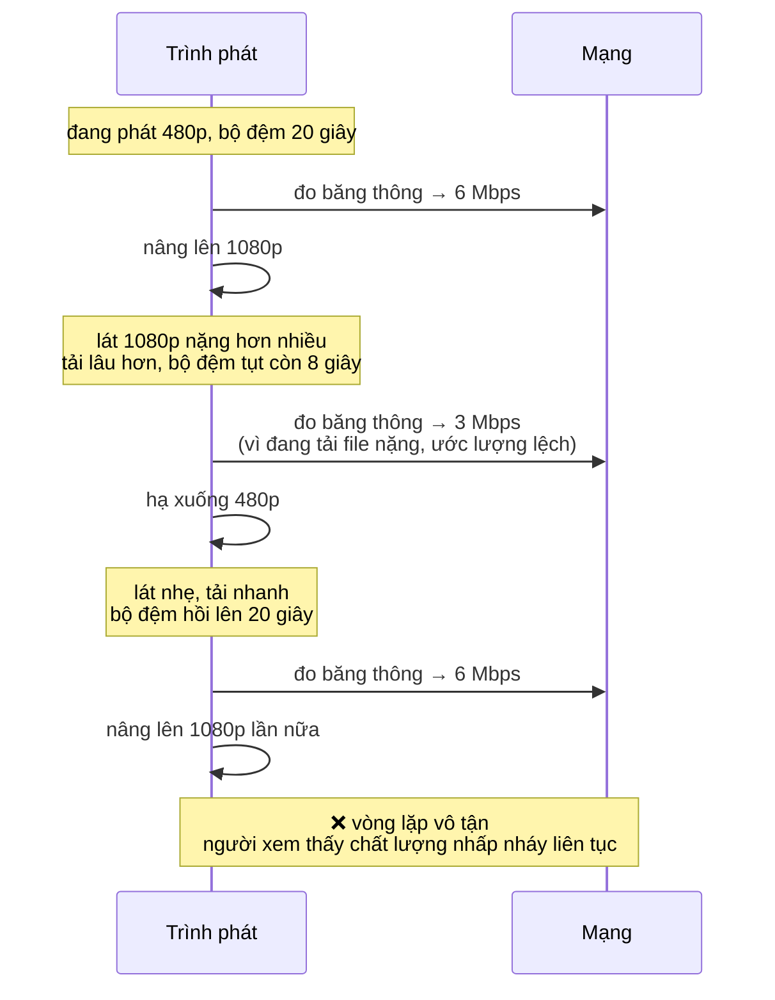
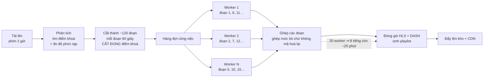
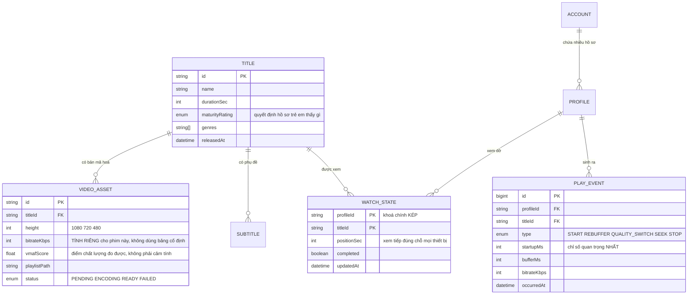
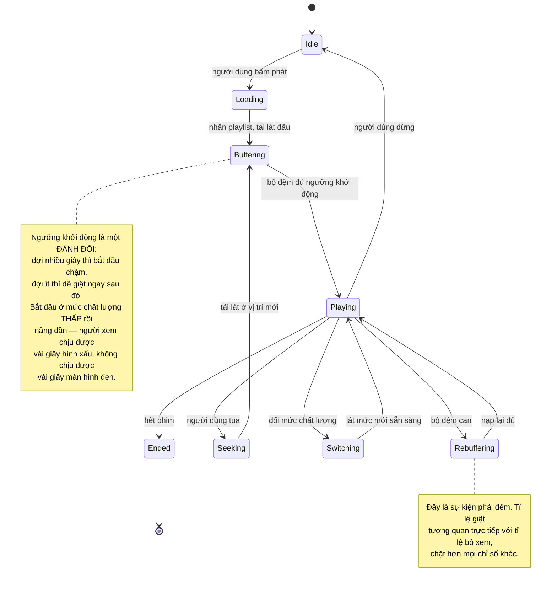

# Video Streaming Platform (Netflix-like)

Ở [Learning Management System](/projects/learning-management-system) bạn đã cắt video thành lát HLS và ký URL để chống tải lậu. Đó là phần *bảo vệ* nội dung. Bài này nói về ba thứ hoàn toàn khác, và mỗi thứ đều là một ngành riêng:

1. **Chất lượng phải tự đổi theo mạng người xem** — và thuật toán quyết định đổi lúc nào dễ viết sai hơn tưởng
2. **Chuyển mã một phim 2 giờ** không được mất 8 tiếng
3. **Hoá đơn băng thông** là khoản chi lớn nhất, và kiến trúc quyết định nó chứ không phải nhà cung cấp

Có một con số đáng nhớ trước khi bắt đầu: người xem bỏ đi khi video mất quá **2 giây** để bắt đầu phát. Mọi quyết định kỹ thuật dưới đây cuối cùng đều quy về con số đó.

---

## Bạn sẽ dựng ra cái gì

- Tải phim lên, tự chuyển mã ra nhiều mức chất lượng, phát thích ứng
- Trình phát tự đổi độ phân giải theo mạng, không giật, không nhảy qua nhảy lại
- Nhiều hồ sơ người xem trong một tài khoản, có hồ sơ trẻ em
- Xem tiếp đúng chỗ trên mọi thiết bị
- Gợi ý nội dung, có xử lý trường hợp người mới hoàn toàn
- Phụ đề nhiều ngôn ngữ, nhiều bản âm thanh
- Bảng đo chất lượng phát thật: thời gian khởi động, tỉ lệ giật, tỉ lệ bỏ xem

---

## Thang chất lượng: vì sao ba mức cố định là sai

Cách làm đầu tiên ai cũng nghĩ ra: chuyển mọi phim ra 1080p, 720p, 480p. Xong.

Nó sai theo hai chiều ngược nhau **cùng lúc**:

- Một bộ phim hoạt hình phẳng màu, ít chi tiết chuyển động: 1080p ở 5 Mbps là **lãng phí**. Nó đạt chất lượng gần như hoàn hảo ở 1,5 Mbps. Bạn đang trả gấp ba lần tiền băng thông cho phần chất lượng không ai nhìn thấy.
- Một cảnh hành động ban đêm nhiều hạt nhiễu: 1080p ở 5 Mbps **vẫn vỡ**. Người xem thấy hình xấu và nghĩ dịch vụ kém.

Cùng một cấu hình, một bên thừa, một bên thiếu. Lời giải là **thang mã hoá riêng theo từng nội dung**: đo độ phức tạp của chính phim đó rồi chọn mức bitrate cho từng độ phân giải.



Cách đo "chất lượng cảm nhận" không phải bằng mắt mình. Có các chỉ số tính được — VMAF là cái được dùng rộng rãi nhất, cho ra điểm 0–100 tương quan khá tốt với đánh giá của người thật. Quy trình đúng là: mã hoá thử ở nhiều bitrate, đo VMAF, chọn bitrate thấp nhất vẫn đạt ngưỡng điểm bạn đặt ra (thường quanh 93).

Riêng bước này có thể **cắt 30–50% hoá đơn băng thông** mà người xem không nhận ra khác biệt. Không có nhiều tối ưu nào trong nghề cho tỉ lệ đó.

---

## Thuật toán đổi chất lượng: chỗ dễ viết sai nhất

Trình phát phải tự quyết định: lát tiếp theo tải ở mức nào? Cách hiển nhiên là đo tốc độ mạng rồi chọn mức cao nhất mà mạng chịu được.

Nó tạo ra hiện tượng **nhảy qua nhảy lại** — chất lượng đổi liên tục vài giây một lần, và trải nghiệm đó còn khó chịu hơn là xem ở mức thấp cố định:



Nguyên nhân: **ước lượng băng thông từ chính việc tải của mình là một vòng phản hồi**. Tải file nặng làm ước lượng tụt, ước lượng tụt làm chọn file nhẹ, file nhẹ làm ước lượng tăng lại.

Cách chữa được dùng trong thực tế là chuyển tín hiệu quyết định từ băng thông sang **mức bộ đệm hiện có**:

```ts
// Bộ đệm là tín hiệu THẬT: nó đo hệ quả, không đo nguyên nhân.
// Còn nhiều giây đã tải sẵn nghĩa là mạng đang thoải mái, bất kể
// con số ước lượng băng thông tức thời nói gì.
function chooseQuality(bufferSeconds: number, current: number): number {
  if (bufferSeconds < 5)  return Math.max(0, current - 1);  // tụt gấp, hạ ngay
  if (bufferSeconds < 10) return current;                   // giữ nguyên, chờ ổn định
  if (bufferSeconds > 25) return Math.min(MAX, current + 1);// dư dả, nâng MỘT bậc
  return current;
}
```

Ba chi tiết trong đoạn trên đáng để ý, vì mỗi cái chống một lỗi cụ thể:

- **Khoảng chết giữa 10 và 25 giây.** Không có nó, bộ đệm dao động quanh một ngưỡng duy nhất sẽ khiến chất lượng đổi liên tục. Đây là cùng nguyên lý với bộ điều nhiệt trong nhà.
- **Nâng từng bậc một, hạ có thể nhiều bậc.** Nâng sai chỉ mất chất lượng tạm thời; hạ chậm thì video đứng hình. Hai hướng không đối xứng nên luật cũng không đối xứng.
- **Ngưỡng tính bằng giây, không tính bằng byte.** Bộ đệm 5MB ở 1080p chỉ đủ 6 giây, còn ở 480p là 30 giây. Người xem cảm nhận thời gian, không cảm nhận dung lượng.

---

## Chuyển mã: chia nhỏ để chạy song song

Một phim 2 giờ chuyển mã tuần tự ra 5 mức chất lượng mất khoảng 8 tiếng trên một máy. Không chấp nhận được.

Mấu chốt nằm ở một tính chất của video: nó có các **điểm khoá** — khung hình tự chứa đủ thông tin, không phụ thuộc khung trước. Cắt tại điểm khoá thì mỗi đoạn chuyển mã được độc lập, rồi ghép lại liền mạch.



Ba cái bẫy của cách này, tất cả đều lộ ra muộn:

**Cắt sai chỗ.** Cắt giữa hai điểm khoá thì đoạn sau thiếu khung tham chiếu, ghép lại sẽ thấy nháy hình ở mối nối. Luôn cắt tại điểm khoá — hỏi FFmpeg vị trí của chúng trước khi chia.

**Mỗi worker tự chọn tham số.** Hai đoạn cạnh nhau mã hoá với tham số khác nhau thì chỗ nối đổi độ nét thấy rõ. Tham số phải được chốt **một lần ở bước phân tích** rồi truyền xuống cho mọi worker.

**Không có bước dọn khi hỏng giữa chừng.** Worker chết ở đoạn 47 để lại 46 file rác trong kho. Phải có mã định danh cho từng lượt chuyển mã và dọn theo mã đó khi thất bại, nếu không kho phình lên vì những lần thử hỏng.

---

## Băng thông: kiến trúc quyết định hoá đơn

Đây là chỗ khác biệt lớn nhất giữa một dự án học tập và một dịch vụ thật. Băng thông là khoản chi lớn nhất, và nó phụ thuộc gần như hoàn toàn vào **tỉ lệ trúng bộ nhớ đệm ở CDN**.

Nếu 95% yêu cầu được CDN phục vụ từ bộ nhớ đệm, kho gốc chỉ chịu 5%. Nếu tỉ lệ trúng tụt xuống 60%, chi phí kho gốc tăng **tám lần** — và người ta thường phát hiện qua hoá đơn chứ không qua bảng theo dõi.

Bốn thứ làm hỏng tỉ lệ trúng, xếp theo mức độ phổ biến:

| Sai lầm | Hậu quả | Cách đúng |
|---|---|---|
| Đưa tham số ký vào query string của URL lát video | Mỗi người xem một URL khác nhau ⇒ CDN coi là file khác nhau ⇒ tỉ lệ trúng gần bằng 0 | Ký ở **playlist**, còn lát video giữ URL cố định dùng chung |
| Thời hạn lưu đệm quá ngắn | CDN phải hỏi lại kho gốc liên tục | Lát video **không bao giờ đổi nội dung** — đặt hạn lưu một năm |
| Không có tầng đệm trung gian | 200 điểm biên cùng hỏi kho gốc khi có phim mới | Bật tầng đệm gốc: các điểm biên hỏi qua nó |
| Đặt lát video quá ngắn | Lát 2 giây tạo gấp ba số yêu cầu so với lát 6 giây | 4–6 giây là cân bằng hợp lý giữa số yêu cầu và độ trễ đổi chất lượng |

Cái đầu tiên đáng nói thêm, vì nó là bẫy tinh vi: ký từng lát video nghe có vẻ an toàn hơn, nhưng nó phá sạch bộ nhớ đệm và biến CDN thành một đường ống rỗng. Cách đúng là ký **playlist** — file nhỏ, cá nhân hoá được, hết hạn nhanh — còn các lát video là nội dung dùng chung, ai cũng tải cùng một file. Chi tiết này một mình nó quyết định hoá đơn.

---

## Cơ sở dữ liệu



`PLAY_EVENT` là bảng ít người nghĩ tới nhưng lại quan trọng nhất về lâu dài. Không có nó, bạn không biết dịch vụ của mình đang tốt hay tệ — người xem bỏ đi thì im lặng bỏ đi, không ai gửi báo cáo lỗi.

Lưu ý về khối lượng: bảng này sinh dữ liệu nhanh hơn mọi bảng khác cộng lại. Đừng ghi từng sự kiện một vào database chính — gom ở client, gửi theo lô, ghi vào một kho tách riêng dùng cho phân tích. Đây chính là loại bài toán mà [Real-Time Analytics Platform](/projects/realtime-analytics-platform) giải quyết ở cấp 5.

---

## Vòng đời trình phát: nơi các chỉ số thật sinh ra



Ba chỉ số cần theo dõi, và chỉ ba:

1. **Thời gian khởi động** — từ lúc bấm phát tới khung hình đầu tiên. Dưới 2 giây là ngưỡng.
2. **Tỉ lệ giật** — thời gian đứng hình chia cho thời gian xem. Dưới 0,5% là tốt.
3. **Bitrate trung bình khi xem** — đo xem người dùng thật sự nhận được chất lượng nào, không phải chất lượng bạn có sẵn.

---

## Gợi ý nội dung: bắt đầu từ chỗ đơn giản nhất

Cám dỗ là dựng ngay một mô hình học máy. Nhưng có một thứ tự tăng dần hợp lý hơn, và mỗi bước đều đem lại giá trị thật:

**Bước 1 — phổ biến theo nhóm.** "Được xem nhiều nhất trong thể loại này, tuần này". Không cần học máy, chạy được ngay, và nó là đường lui bắt buộc cho mọi trường hợp phía dưới hỏng.

**Bước 2 — lọc cộng tác theo mục.** "Người xem phim A cũng xem phim B". Tính bằng độ tương đồng giữa các phim dựa trên tập người xem chung. Đây là một truy vấn SQL, chưa cần mô hình:

```sql
-- Phim thường được xem cùng với phim $1, loại bỏ nhiễu bằng ngưỡng tối thiểu.
SELECT w2.title_id, COUNT(*) AS co_watch
  FROM watch_states w1
  JOIN watch_states w2 ON w1.profile_id = w2.profile_id
 WHERE w1.title_id = $1
   AND w2.title_id <> $1
   AND w1.completed AND w2.completed
 GROUP BY w2.title_id
HAVING COUNT(*) >= 20          -- dưới ngưỡng này chỉ là trùng hợp
 ORDER BY co_watch DESC
 LIMIT 20;
```

**Bước 3 — vector nội dung.** Với phim mới chưa ai xem, bước 2 không nói được gì (bài toán khởi đầu lạnh). Nhúng mô tả, thể loại, diễn viên thành vector rồi tìm phim gần nhất — đúng kỹ thuật đã dùng ở [Job Board Platform](/projects/job-board-platform-linkedin-like), áp cho một loại dữ liệu khác.

Hai điều cần biết mà tài liệu về hệ gợi ý hay bỏ qua:

- **Thiên lệch về phim phổ biến.** Phim đang hot xuất hiện ở mọi danh sách, được xem nhiều hơn, nên càng hot hơn. Vòng lặp tự củng cố. Cách giảm: chia điểm cho một hàm của độ phổ biến, hoặc dành sẵn vài ô trong danh sách cho nội dung ít người xem.
- **Không đo được nếu không thử song song.** Bạn không thể biết danh sách gợi ý mới tốt hơn hay tệ hơn nếu chỉ nhìn nó. Cần chia người dùng thành hai nhóm và so tỉ lệ bấm vào — không có bước đó thì mọi thay đổi chỉ là đoán.

---

## Những cái bẫy đã được ghi lại

| Triệu chứng | Nguyên nhân thật | Cách sửa |
|---|---|---|
| Hoá đơn băng thông cao bất thường | Ký từng lát video ⇒ CDN không đệm được | Ký playlist, lát video giữ URL dùng chung |
| Tỉ lệ trúng đệm tụt sau khi thêm phim mới | Không có tầng đệm gốc, mọi điểm biên hỏi thẳng kho | Bật tầng đệm trung gian |
| Chất lượng nhấp nháy liên tục | Quyết định theo ước lượng băng thông tức thời | Quyết định theo mức bộ đệm, có khoảng chết |
| Phim hoạt hình tốn băng thông như phim hành động | Một thang bitrate cố định cho mọi nội dung | Thang riêng theo độ phức tạp, đo bằng VMAF |
| Nháy hình ở mối nối giữa các đoạn | Cắt không đúng điểm khoá | Hỏi vị trí điểm khoá trước khi chia đoạn |
| Độ nét đổi giữa chừng trong một phim | Mỗi worker tự chọn tham số mã hoá | Chốt tham số ở bước phân tích, truyền xuống |
| Kho đầy file rác | Chuyển mã hỏng giữa chừng không dọn | Mã định danh cho từng lượt, dọn khi thất bại |
| Video mất 6 giây mới bắt đầu | Đợi bộ đệm đầy ở mức chất lượng cao | Bắt đầu ở mức thấp, nâng dần sau |
| Không biết dịch vụ đang tốt hay tệ | Không thu sự kiện phát | Bảng sự kiện, đo khởi động và tỉ lệ giật |
| Database chậm dần không rõ lý do | Ghi từng sự kiện phát vào database chính | Gom theo lô, ghi sang kho phân tích riêng |
| Gợi ý toàn phim đã nổi tiếng sẵn | Vòng lặp tự củng cố độ phổ biến | Chia điểm theo độ phổ biến, chừa ô cho phim mới |
| Phim mới không bao giờ được gợi ý | Khởi đầu lạnh, chưa có dữ liệu xem | Vector nội dung cho phim chưa có lịch sử |

---

## Khi nào coi như xong

- [ ] Phim 2 giờ chuyển mã xong dưới 30 phút với 20 worker song song
- [ ] Ghép các đoạn lại: không thấy nháy hình hay đổi độ nét ở bất kỳ mối nối nào
- [ ] Thời gian khởi động dưới 2 giây ở phân vị 95, đo bằng sự kiện thật của trình phát
- [ ] Bóp băng thông xuống 1 Mbps giữa lúc đang xem: chất lượng hạ **một lần** rồi ổn định, không nhấp nháy
- [ ] Trả băng thông về bình thường: chất lượng nâng dần từng bậc, không nhảy vọt
- [ ] Đo tỉ lệ trúng đệm CDN: trên 90% sau 24 giờ một phim được phát hành
- [ ] Chép URL một lát video, mở ở máy khác: **vẫn tải được** (đúng — nó là nội dung dùng chung), nhưng playlist thì hết hạn
- [ ] Xem 20 phút trên máy tính, mở điện thoại: tiếp đúng chỗ, sai lệch dưới 5 giây
- [ ] Hồ sơ trẻ em: gọi thẳng API danh sách phim bằng `curl` — không có phim vượt mức phân loại trong JSON
- [ ] Tắt dịch vụ gợi ý hoàn toàn: trang chủ vẫn hiện danh sách (đường lui theo độ phổ biến)

---

## Bước tiếp theo

1. **Phát trực tiếp.** Cùng đường ống nhưng không còn được xử lý trước — chuyển mã phải chạy nhanh hơn thời gian thực, và độ trễ trở thành ràng buộc chính.
2. **DRM thật.** Widevine và FairPlay cho nội dung bản quyền. Đây là ranh giới giữa "chống người dùng phổ thông" và "chống được tổ chức", và nó tốn kém.
3. **Đo chất lượng bằng thử nghiệm song song.** Chia người dùng thành hai nhóm với hai cấu hình thang bitrate, so tỉ lệ giật và thời gian xem. Đây là cách duy nhất biết thay đổi có tốt lên không.
4. **Tách thành nhiều dịch vụ.** Chuyển mã, danh mục, gợi ý, phân tích là bốn hệ thống có nhịp độ và quy mô khác hẳn nhau — [Event-Driven Microservices](/projects/event-driven-microservices-uber-like) là bước tiếp theo tự nhiên.
5. **Xử lý dòng sự kiện phát.** Hàng triệu sự kiện mỗi phút cần một hệ thống khác database quan hệ — [Real-Time Analytics Platform](/projects/realtime-analytics-platform) đi vào đúng bài toán đó.
