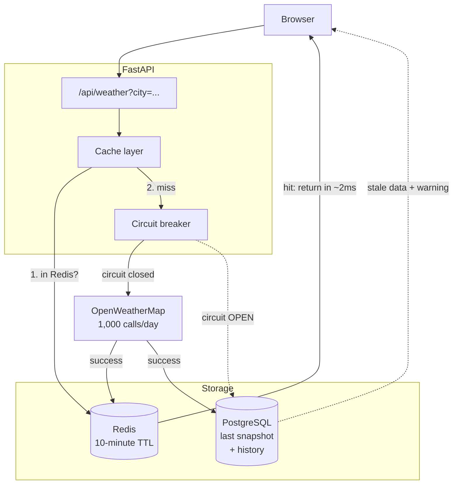
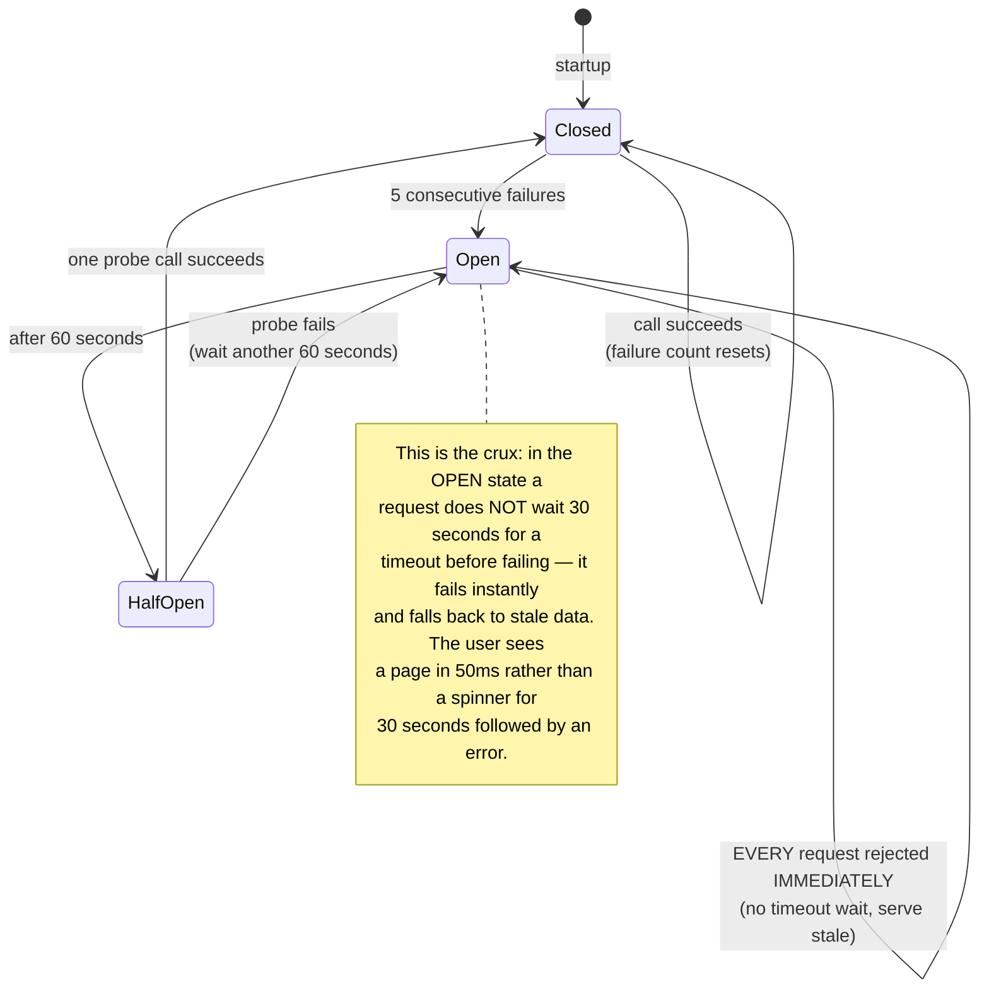
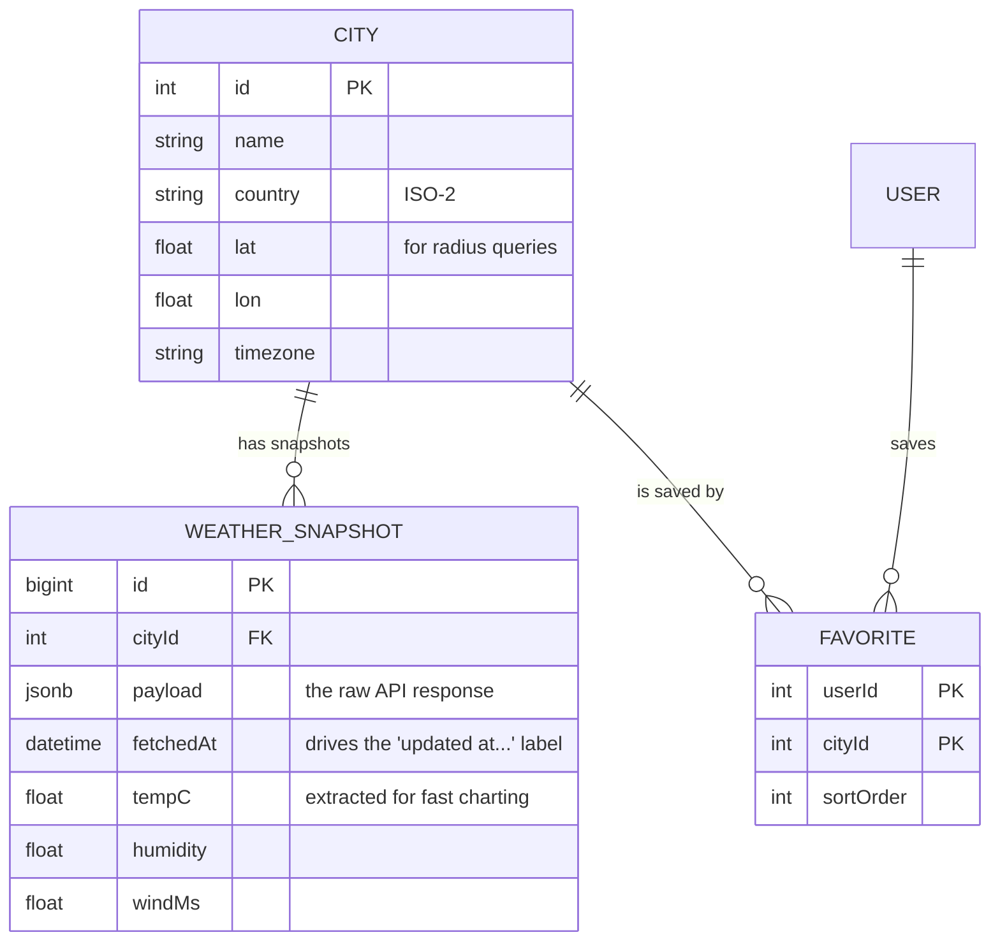

# Weather Dashboard (Public API)

In the previous three projects the data was yours: you created it, you controlled it. This one inverts that — **the most important data lives in a service you do not control**, with a call quota, that can be slow, can return garbage, and can go down at exactly the wrong moment.

That is the whole value of this article. "Call an API and display it" is ten minutes of work. "Call an API without going down when it goes down" is the professional skill.

It is also the first Python project — a deliberate choice, because FastAPI is the standard stack for everything data- and AI-related later on the roadmap.

---

## What you are going to build

- Current weather and a 7-day forecast for any city
- City search with suggestions, saved favourites
- Charts for temperature, rainfall, wind speed
- Geolocation, °C/°F toggle
- Still renders when the provider is down
- Never exceeds the free quota, however many users arrive

That last constraint is the interesting one. OpenWeatherMap's free tier allows 1,000 calls per day. A site with 5,000 daily visits calling straight through burns the quota before lunch.

---

## Architecture: every layer is a line of defence



Four layers, each answering a different question:

1. **Redis (10-minute TTL)** — "Has anyone asked about this city recently?" Weather does not change inside ten minutes; calling again wastes quota.
2. **Circuit breaker** — "Is the provider healthy?" If the last 5 calls all failed, stop calling for 60 seconds rather than making every request wait out a 30-second timeout.
3. **Snapshot in Postgres** — "If we cannot get fresh data, do we have old data?" Showing the weather from two hours ago labelled "updated at 14:20" beats an error page by a wide margin.
4. **History** — old data is never deleted; it powers trend charts the free API does not provide.

---

## The circuit breaker: why retrying is the wrong instinct

The natural reflex when a call fails is to retry. But when a provider is overloaded, every client retrying is precisely what keeps it down — the phenomenon known as a *retry storm*.



```python
# app/services/circuit_breaker.py
import time
from enum import Enum
from typing import Callable, Awaitable, TypeVar

T = TypeVar("T")


class State(str, Enum):
    CLOSED = "closed"      # normal, calls allowed
    OPEN = "open"          # broken, reject immediately
    HALF_OPEN = "half"     # probe once to see if it recovered


class CircuitBreaker:
    def __init__(self, failure_threshold: int = 5, recovery_seconds: int = 60):
        self.failure_threshold = failure_threshold
        self.recovery_seconds = recovery_seconds
        self._failures = 0
        self._state = State.CLOSED
        self._opened_at = 0.0

    async def call(self, fn: Callable[[], Awaitable[T]]) -> T:
        if self._state is State.OPEN:
            if time.monotonic() - self._opened_at >= self.recovery_seconds:
                self._state = State.HALF_OPEN
            else:
                # Raise IMMEDIATELY. This is the entire point of a circuit
                # breaker: do not spend a 30-second timeout on a call we
                # already know is almost certain to fail.
                raise CircuitOpenError("provider is failing")

        try:
            result = await fn()
        except Exception:
            self._failures += 1
            # In HALF_OPEN, a SINGLE failure reopens the circuit — no second
            # chances, because every probe costs a real user a wait.
            if self._state is State.HALF_OPEN or self._failures >= self.failure_threshold:
                self._state = State.OPEN
                self._opened_at = time.monotonic()
            raise

        self._failures = 0
        self._state = State.CLOSED
        return result
```

---

## Caching, and the cache stampede trap

A naive cache has a hole few people notice. The cache key for Hanoi expires at 14:00:00. Over the next 200 milliseconds, 50 requests arrive, all see a miss, and all call the API. You just spent 50 quota units on one piece of data.

```python
# app/services/weather.py
import json
from redis.asyncio import Redis

CACHE_TTL = 600          # 10 minutes — weather does not change faster
LOCK_TTL = 10            # stampede lock, long enough for one API call


async def get_weather(city: str, redis: Redis, db) -> dict:
    key = f"weather:{city.lower()}"

    cached = await redis.get(key)
    if cached:
        return json.loads(cached)

    # Stampede protection: only ONE request may call the API.
    # SET NX means "set only if absent", and it is atomic.
    lock_key = f"{key}:lock"
    got_lock = await redis.set(lock_key, "1", nx=True, ex=LOCK_TTL)

    if not got_lock:
        # Everyone else waits briefly and rereads the cache. If the first
        # request finished, the cache is warm and we return immediately.
        await asyncio.sleep(0.25)
        cached = await redis.get(key)
        if cached:
            return json.loads(cached)
        # Still nothing → fall back to stale data, do NOT call the API.
        return await get_stale_snapshot(city, db)

    try:
        data = await breaker.call(lambda: fetch_from_provider(city))
        await redis.setex(key, CACHE_TTL, json.dumps(data))
        await save_snapshot(city, data, db)   # for when the provider dies
        return data
    except (CircuitOpenError, ProviderError):
        # Provider is down. Serve stale data with a flag so the UI can say so.
        return await get_stale_snapshot(city, db)
    finally:
        await redis.delete(lock_key)
```

Returning stale data **with a marker** is the important detail. Users accept old information if they know it is old. What they do not forgive is a wrong number presented as if it were right.

```python
async def get_stale_snapshot(city: str, db) -> dict:
    row = await db.fetch_one(
        "SELECT payload, fetched_at FROM weather_snapshots "
        "WHERE city = :city ORDER BY fetched_at DESC LIMIT 1",
        {"city": city},
    )
    if not row:
        raise HTTPException(503, "No data yet for this city")

    data = json.loads(row["payload"])
    data["_stale"] = True
    data["_fetched_at"] = row["fetched_at"].isoformat()
    return data
```

---

## Never let an API key reach the browser

This is the most common mistake in projects of this kind, and it has a particularly dangerous form in Next.js.

```tsx
// WRONG — and more dangerous than it looks.
const res = await fetch(
  `https://api.openweathermap.org/data/2.5/weather?q=${city}&appid=${process.env.NEXT_PUBLIC_OWM_KEY}`
);
```

The `NEXT_PUBLIC_` prefix means the variable is **baked into the JavaScript bundle sent to browsers** at build time. Anyone who opens DevTools can read it, and within hours your key shows up in someone's GitHub-scanning script. Your quota burns, and if it is a paid key, so does the bill.

The rule has no exceptions: **third-party keys exist only on the server.** The browser calls your backend; your backend calls the provider. That is why this project has FastAPI in the middle instead of calling directly.

---

## The data model



Storing the raw `payload` as `jsonb` **and** extracting a few fields into columns is deliberate. The raw payload means you lose nothing when the provider adds a field, or when you want to re-analyse later. The extracted columns make chart queries fast without opening JSON row by row.

---

## Traps, written down

| Symptom | Actual cause | Fix |
|---|---|---|
| Quota gone before lunch | No cache, one API call per request | Redis with a 10-minute TTL |
| Quota still gone despite caching | Cache stampede at key expiry | A SET NX lock around the call |
| Page hangs 30 seconds when the API is slow | No timeout, no breaker | 5-second timeout + circuit breaker |
| API key leaked | Used the `NEXT_PUBLIC_` prefix | Proxy through the backend, key stays server-side |
| Temperatures wrong in winter | Provider returns Kelvin, code assumed Celsius | Normalise units at the ingest layer |
| Empty chart for a new city | No history yet | Show an explicit empty state, not a chart of zeros |
| Stale data looks current | No `_stale` flag surfaced in the UI | Always display the fetch time |

---

## When it counts as finished

- [ ] Block the provider's domain and the page still renders stale data with a warning
- [ ] Fire 100 concurrent requests for an uncached city and count exactly **1** provider call
- [ ] `grep -r "OWM_KEY" .next/static/` returns nothing
- [ ] After five provider 500s, the sixth request fails in under 50ms rather than waiting out a timeout
- [ ] Switching °C to °F does not trigger another API call
- [ ] After a week of running, the trend chart shows real data from the history table

---

## Where to go next

1. **Multiple providers.** Add a fallback API and switch automatically when the primary fails. New problem: normalising two different response shapes into one model.
2. **Proactive alerts.** "Tell me when rain is coming in Hanoi" — needs a scheduled background job and a push notification system.
3. **Real geospatial data.** Use PostGIS to answer "the five nearest cities where it is raining" instead of computing distances in Python.
