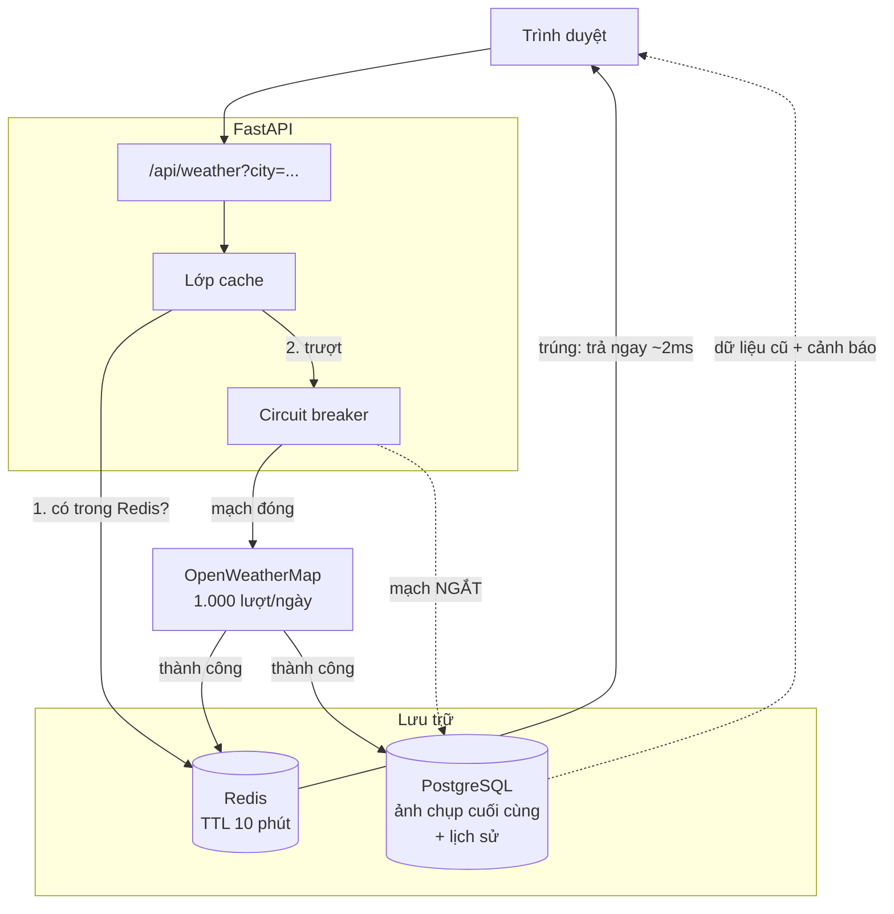
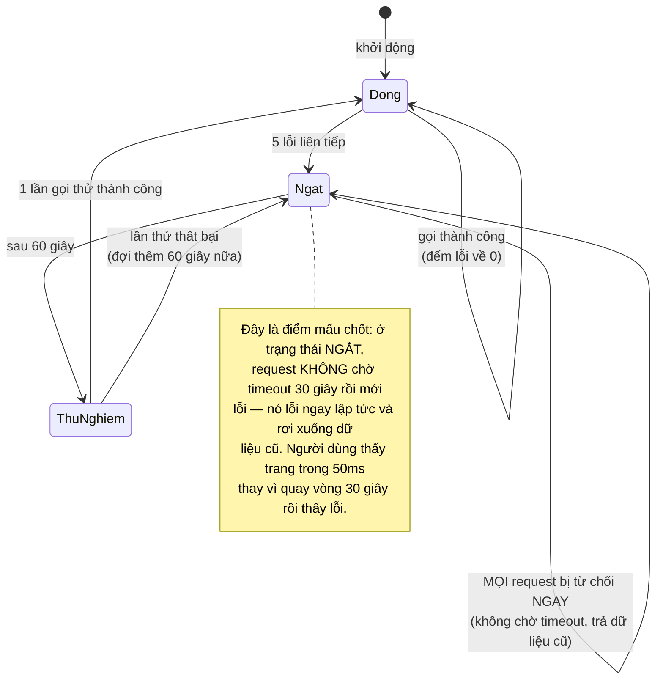
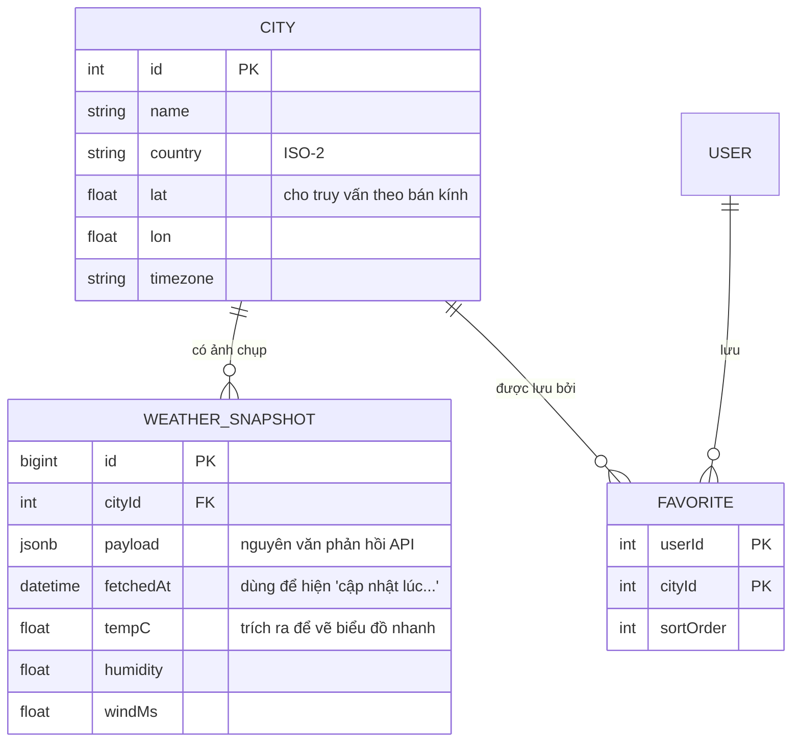

# Weather Dashboard (Public API)

Ba dự án trước, dữ liệu là của bạn: bạn tạo ra nó, bạn kiểm soát nó. Dự án này đảo ngược tình thế — **dữ liệu quan trọng nhất nằm ở một dịch vụ bạn không kiểm soát**, có hạn mức gọi, có thể chậm, có thể trả về rác, và có thể sập vào đúng lúc bạn cần nhất.

Đó là toàn bộ giá trị của bài này. "Gọi API rồi hiển thị" là chuyện của mười phút. "Gọi API mà không sập khi API đó sập" mới là kỹ năng đi làm.

Đây cũng là dự án đầu tiên dùng Python — chọn có chủ đích, vì FastAPI là stack chuẩn cho mọi thứ liên quan tới dữ liệu và AI về sau trong lộ trình.

---

## Bạn sẽ dựng ra cái gì

- Thời tiết hiện tại và dự báo 7 ngày cho bất kỳ thành phố nào
- Tìm thành phố có gợi ý, lưu danh sách yêu thích
- Biểu đồ nhiệt độ, lượng mưa, tốc độ gió
- Tự nhận vị trí, đổi °C/°F
- Vẫn hiển thị được khi nhà cung cấp API sập
- Không vượt hạn mức miễn phí dù có bao nhiêu người dùng

Điều cuối cùng là ràng buộc thú vị nhất. Gói miễn phí của OpenWeatherMap cho 1.000 lượt gọi mỗi ngày. Một trang có 5.000 lượt truy cập/ngày mà gọi thẳng thì cháy hạn mức trước giờ ăn trưa.

---

## Kiến trúc: mỗi lớp là một lớp phòng thủ



Bốn lớp, và mỗi lớp trả lời một câu hỏi khác nhau:

1. **Redis (TTL 10 phút)** — "Vừa có người hỏi thành phố này chưa?" Thời tiết không đổi trong 10 phút; gọi lại là lãng phí hạn mức.
2. **Circuit breaker** — "Nhà cung cấp có đang khoẻ không?" Nếu 5 lần gọi gần nhất đều lỗi, ngừng gọi trong 60 giây thay vì để mỗi request chờ timeout 30 giây.
3. **Ảnh chụp trong Postgres** — "Nếu không lấy được dữ liệu mới, có dữ liệu cũ không?" Hiển thị thời tiết của 2 giờ trước kèm dòng chữ "cập nhật lúc 14:20" tốt hơn nhiều so với một trang lỗi.
4. **Lịch sử** — dữ liệu cũ không xoá, dùng để vẽ biểu đồ xu hướng mà API miễn phí không cung cấp.

---

## Circuit breaker: vì sao thử lại là sai lầm

Phản xạ tự nhiên khi một lời gọi thất bại là thử lại. Nhưng khi nhà cung cấp đang quá tải, mọi client cùng thử lại chính là thứ giữ cho nó tiếp tục sập — hiện tượng gọi là *retry storm*.



```python
# app/services/circuit_breaker.py
import time
from enum import Enum
from typing import Callable, Awaitable, TypeVar

T = TypeVar("T")


class State(str, Enum):
    CLOSED = "closed"      # bình thường, cho gọi
    OPEN = "open"          # đang hỏng, từ chối ngay
    HALF_OPEN = "half"     # thử một lần xem đã hồi phục chưa


class CircuitBreaker:
    def __init__(self, failure_threshold: int = 5, recovery_seconds: int = 60):
        self.failure_threshold = failure_threshold
        self.recovery_seconds = recovery_seconds
        self._failures = 0
        self._state = State.CLOSED
        self._opened_at = 0.0

    async def call(self, fn: Callable[[], Awaitable[T]]) -> T:
        if self._state is State.OPEN:
            if time.monotonic() - self._opened_at >= self.recovery_seconds:
                self._state = State.HALF_OPEN
            else:
                # Ném lỗi NGAY. Đây chính là giá trị của circuit breaker:
                # không chờ timeout 30 giây cho một lời gọi ta đã biết
                # gần như chắc chắn sẽ thất bại.
                raise CircuitOpenError("nhà cung cấp đang lỗi")

        try:
            result = await fn()
        except Exception:
            self._failures += 1
            # Ở HALF_OPEN, chỉ cần MỘT lần thất bại là mở mạch lại —
            # không cho thêm cơ hội, vì mỗi lần thử là một người dùng
            # phải chờ.
            if self._state is State.HALF_OPEN or self._failures >= self.failure_threshold:
                self._state = State.OPEN
                self._opened_at = time.monotonic()
            raise

        self._failures = 0
        self._state = State.CLOSED
        return result
```

---

## Cache: và bẫy "cache stampede"

Cache đơn giản có một lỗ hổng ít người để ý. Khoá cache của thành phố Hà Nội hết hạn lúc 14:00:00. Trong 200 mili-giây tiếp theo, 50 request cùng tới, tất cả đều thấy cache trượt, và tất cả cùng gọi API. Bạn vừa tốn 50 lượt gọi cho một dữ liệu.

```python
# app/services/weather.py
import json
from redis.asyncio import Redis

CACHE_TTL = 600          # 10 phút — thời tiết không đổi nhanh hơn thế
LOCK_TTL = 10            # khoá chống dồn, đủ dài cho một lời gọi API


async def get_weather(city: str, redis: Redis, db) -> dict:
    key = f"weather:{city.lower()}"

    cached = await redis.get(key)
    if cached:
        return json.loads(cached)

    # Chống cache stampede: chỉ MỘT request được phép gọi API.
    # SET NX = "chỉ đặt nếu chưa tồn tại", và nó nguyên tử.
    lock_key = f"{key}:lock"
    got_lock = await redis.set(lock_key, "1", nx=True, ex=LOCK_TTL)

    if not got_lock:
        # Các request khác chờ ngắn rồi đọc lại cache. Nếu request
        # đầu tiên đã xong, cache đã ấm và ta trả về ngay.
        await asyncio.sleep(0.25)
        cached = await redis.get(key)
        if cached:
            return json.loads(cached)
        # Vẫn chưa có → rơi xuống dữ liệu cũ, KHÔNG gọi API.
        return await get_stale_snapshot(city, db)

    try:
        data = await breaker.call(lambda: fetch_from_provider(city))
        await redis.setex(key, CACHE_TTL, json.dumps(data))
        await save_snapshot(city, data, db)   # để dùng khi API sập
        return data
    except (CircuitOpenError, ProviderError):
        # Nhà cung cấp sập. Trả dữ liệu cũ kèm cờ để giao diện nói rõ.
        return await get_stale_snapshot(city, db)
    finally:
        await redis.delete(lock_key)
```

Trả về dữ liệu cũ **kèm dấu hiệu** là chi tiết quan trọng. Người dùng chấp nhận thông tin cũ nếu biết nó cũ. Điều họ không tha thứ là một con số sai được trình bày như thể nó đúng.

```python
async def get_stale_snapshot(city: str, db) -> dict:
    row = await db.fetch_one(
        "SELECT payload, fetched_at FROM weather_snapshots "
        "WHERE city = :city ORDER BY fetched_at DESC LIMIT 1",
        {"city": city},
    )
    if not row:
        raise HTTPException(503, "Chưa có dữ liệu cho thành phố này")

    data = json.loads(row["payload"])
    data["_stale"] = True
    data["_fetched_at"] = row["fetched_at"].isoformat()
    return data
```

---

## Đừng bao giờ để khoá API ra tới trình duyệt

Đây là lỗi phổ biến nhất ở dự án loại này, và nó có một dạng đặc biệt nguy hiểm trong Next.js.

```tsx
// SAI — và nguy hiểm hơn vẻ ngoài của nó.
const res = await fetch(
  `https://api.openweathermap.org/data/2.5/weather?q=${city}&appid=${process.env.NEXT_PUBLIC_OWM_KEY}`
);
```

Tiền tố `NEXT_PUBLIC_` nghĩa là biến được **nhúng vào gói JavaScript gửi cho trình duyệt** lúc build. Bất kỳ ai mở DevTools cũng đọc được, và trong vòng vài giờ khoá của bạn sẽ xuất hiện trong một script quét GitHub nào đó. Hạn mức của bạn cháy, và nếu là khoá trả tiền thì hoá đơn cũng vậy.

Quy tắc không có ngoại lệ: **khoá của bên thứ ba chỉ tồn tại ở server.** Trình duyệt gọi backend của bạn; backend gọi nhà cung cấp. Đó là lý do dự án này có FastAPI ở giữa thay vì gọi thẳng.

---

## Lược đồ dữ liệu



Quyết định lưu `payload` nguyên văn dưới dạng `jsonb` **và** trích vài trường ra cột riêng là có chủ đích. Payload nguyên văn giúp bạn không mất dữ liệu khi nhà cung cấp thêm trường mới, hoặc khi bạn muốn phân tích lại sau này. Các cột trích ra giúp truy vấn biểu đồ nhanh mà không phải mở JSON từng dòng.

---

## Những cái bẫy đã được ghi lại

| Triệu chứng | Nguyên nhân thật | Cách sửa |
|---|---|---|
| Hạn mức cháy trước trưa | Không cache, gọi API mỗi request | Redis TTL 10 phút |
| Hạn mức vẫn cháy dù đã cache | Cache stampede lúc khoá hết hạn | Khoá SET NX quanh lời gọi |
| Trang treo 30 giây khi API chậm | Không có timeout, không có breaker | Timeout 5 giây + circuit breaker |
| Khoá API bị lộ | Dùng tiền tố `NEXT_PUBLIC_` | Gọi qua backend, khoá ở server |
| Nhiệt độ sai vào mùa đông | Nhà cung cấp trả Kelvin, code giả định Celsius | Chuẩn hoá đơn vị ngay tại tầng nhận |
| Biểu đồ trống với thành phố mới | Chưa có lịch sử | Hiện trạng thái rỗng rõ ràng, không hiện biểu đồ 0 |
| Dữ liệu cũ hiện như dữ liệu mới | Thiếu cờ `_stale` ở giao diện | Luôn hiện thời điểm cập nhật |

---

## Khi nào coi như xong

- [ ] Tắt mạng ra ngoài (chặn domain nhà cung cấp), trang vẫn hiển thị dữ liệu cũ kèm cảnh báo
- [ ] Bắn 100 request đồng thời cho một thành phố chưa cache, đếm được đúng **1** lượt gọi nhà cung cấp
- [ ] `grep -r "OWM_KEY" .next/static/` không ra kết quả nào
- [ ] Nhà cung cấp trả 500 năm lần, request thứ sáu lỗi trong dưới 50ms chứ không chờ timeout
- [ ] Đổi °C sang °F không gọi lại API
- [ ] Sau một tuần chạy, biểu đồ xu hướng có dữ liệu thật từ bảng lịch sử

---

## Bước tiếp theo

1. **Nhiều nhà cung cấp.** Thêm một API dự phòng, tự chuyển khi nhà chính sập. Bài toán mới: chuẩn hoá hai định dạng phản hồi khác nhau về một mô hình chung.
2. **Cảnh báo chủ động.** "Báo tôi khi trời sắp mưa ở Hà Nội" — cần công việc chạy nền định kỳ và hệ thống thông báo đẩy.
3. **Dữ liệu địa lý thật.** Dùng PostGIS để trả lời "năm thành phố gần nhất đang mưa", thay vì tính khoảng cách trong Python.
